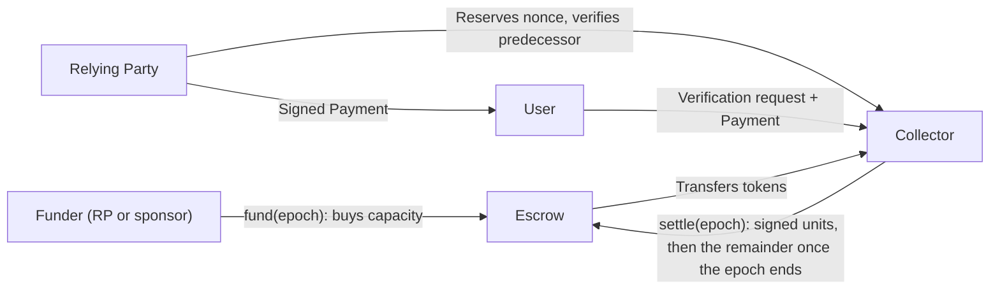

**Status:** draft. Supersedes [YABS (previous draft)](https://app.notion.com/p/worldcoin/YABS-3d88614bdf8c80558e35e70f23e9c10f) for the fixed-rate design. Source of truth: [Notion](https://app.notion.com/p/worldcoin/YABS-Fixed-Rate-Channels-3d98614bdf8c803389b4d60e2f680b1b).

## Invariants

Every later section must satisfy these. A change that breaks one is a new protocol, not a revision.

**Economic**

- **Fixed price.** Every unit in a channel costs exactly `pricePerUnit`, set at open and never changed.
- **Full price.** Every token funded into an epoch reaches the collector, by settlement during the epoch or by the closing settlement after it. Once an epoch is closed, `paid = funded`. No path returns tokens to a funder.
- **Capacity bound.** Units admitted in an epoch never exceed `funded / pricePerUnit`. Capacity is exceeded only by funding more, and funding raises capacity in the same block.
- **Nothing early.** Before an epoch ends, the escrow releases at most `pricePerUnit × settledUnits`. The remainder moves only after the epoch ends.

**Cryptographic**

- **Signed usage.** No unit is counted, settled, or used to justify a refusal unless the RP's `spendKey` signed it. The collector may propose a counter only one above a counter the RP has already signed on that lane, and must prove it with that signature.
- **One signature per lane.** An authorization with counter `n` proves `n` units on its lane. Proof and settlement cost are proportional to lanes, never to capacity.
- **Bound once.** Each authorization names one channel, one epoch, and one lane counter, and is admitted at most once.

**Compatibility**

- **Protocol unchanged.** `ProofRequest`, its signature, and every party that verifies it are untouched. A `Payment` is a separate object presented to the collector; binding it to a specific request is a later extension.
- **Stateless RP.** The RP holds no nonce state. Every proposal it receives carries the proof it needs to check it, its own previous signature, so it remembers nothing between requests.
- **Fail closed.** A collector that cannot read current chain state, or cannot persist an admission, refuses rather than serves.

## Overview

This specification defines a fixed-rate, epoch-based payment channel between a Relying Party (RP) and a collector such as the Deep Face Verifier host. Funding an epoch buys capacity at a fixed `pricePerUnit`. Capacity can be raised at any time by funding more, and it cannot be exceeded without funding more. Unused capacity is never refunded: whatever remains in an epoch's escrow is paid to the collector when the epoch ends.

Every verification the RP wants performed is authorized by one `Payment`: a standalone object the RP signs over a cumulative counter and hands to the user, who presents it to the collector with the verification request. Those counters are the only evidence of usage the protocol relies on. The collector cannot bill a unit the RP did not sign, and the RP cannot use a unit it did not fund.

A billing unit is one authorization for the service agreed by the RP and collector. It is not a count of proofs inside a request.

## Roles

- **RP**: the relying party whose requests are paid for, identified by `rpId` in the RpRegistry.
- **spendKey**: the RP's registry signer at open. Signs every payment authorization. Fixed for the channel's life.
- **Collector**: the service being paid. Issues nonces, admits requests, settles, and receives every token that enters the channel.
- **Funder**: whoever calls `fund`. The RP, a sponsor, or anyone. Funding is a purchase, so the funder holds no claim afterwards.
- **Escrow**: the contract holding per-epoch balances.

## Channel

A channel is a record in the escrow that fixes who pays whom, at what price, on what schedule. Each epoch has its own capacity and balance.



```solidity
struct ChannelSettings {
    /// RP whose requests this channel pays for.
    uint64 rpId;
    /// RP registry signer at open. Signs every PaymentAuthorization.
    address spendKey;
    /// Receives every token funded into the channel.
    address collector;
    /// Exact-transfer ERC-20 the channel is denominated in.
    address token;
    /// Price of one unit, in `token`'s smallest unit.
    uint256 pricePerUnit;
    /// Epoch length in seconds.
    uint64 epochLength;
    /// Unix timestamp at which epoch 0 begins.
    uint64 epochZero;
    /// Disambiguates otherwise-identical channels.
    bytes32 salt;
}
```

`channelId` is the EIP-712 digest of `ChannelSettings` (see Signatures). It commits to the chain, the escrow, and every setting. Settings are immutable.

The epoch of a timestamp `t` is `(t − epochZero) / epochLength` with integer division. Timestamps before `epochZero` have no epoch.

Per `(channelId, epoch)` the escrow stores `funded`, `settledUnits`, and `closed`, and derives:

- `capacity = funded / pricePerUnit`
- `balance = funded − pricePerUnit × settledUnits` until closed, then zero
- `settledUnits ≤ capacity`

## Escrow interface

```solidity
struct PaymentAuthorization {
    /// lane << 64 | counter, counter >= 1.
    uint96 channelNonce;
    /// spendKey signature over EIP-712 PaymentAuthorization(channelId, epoch, channelNonce).
    /// epoch is the settle call's epoch; it is not repeated per entry.
    bytes signature;
}

struct EpochState {
    /// Tokens funded into this epoch.
    uint256 funded;
    /// Sum of lane high-water marks.
    uint64 settledUnits;
    /// True once the closing settlement has paid the remainder.
    bool closed;
}

interface IWorldIDFeeEscrow {
    /// Registers a channel. spendKey must equal the RpRegistry signer for rpId.
    function openChannel(ChannelSettings calldata settings) external returns (bytes32 channelId);
    /// Buys capacity for the current or a future epoch. amount must be a multiple of pricePerUnit.
    function fund(bytes32 channelId, uint64 epoch, uint256 amount) external;
    /// Raises lane marks for epoch and pays pricePerUnit * new units to the collector.
    /// After the epoch ends, also pays the remaining balance and closes the epoch. Anyone may call.
    function settle(bytes32 channelId, uint64 epoch, PaymentAuthorization[] calldata auths) external;

    function computeChannelId(ChannelSettings calldata settings) external view returns (bytes32);
    function epochState(bytes32 channelId, uint64 epoch) external view returns (EpochState memory);
    function laneHighWater(bytes32 channelId, uint64 epoch, uint32 lane) external view returns (uint64);

    event ChannelOpened(bytes32 indexed channelId, ChannelSettings settings);
    event EpochFunded(bytes32 indexed channelId, uint64 indexed epoch, address funder, uint256 amount);
    event EpochSettled(bytes32 indexed channelId, uint64 indexed epoch, uint64 settledUnits, uint256 paid, bool closed);
}
```

Capacity and balance are derived from `EpochState` by the formulas above; the epoch of a timestamp is derived from the settings. Lanes touched by a settlement are visible in its calldata, so no per-lane event is emitted.

## Lifecycle

- **Open.** Anyone may call. Require nonzero `spendKey`, `collector`, `token`, `pricePerUnit`, and `epochLength`, and require `spendKey` to equal `RpRegistry.getRp(rpId).signer`, which also requires an active RP. Reject an existing `channelId`. No RP signature is required: the RP consents to the terms by signing its first `PaymentAuthorization` naming this `channelId`, and it can only do so after reading the settings the id commits to.
- **Fund.** Anyone may fund the current epoch or any future epoch. Reject ended epochs and amounts that are not a multiple of `pricePerUnit`. Tokens move from the caller to the escrow. Capacity rises immediately, so a mid-epoch top-up lifts the cap in the same block.
- **Settle.** Anyone may call on an epoch that is not closed. The batch names one `epoch`, and every signature is verified against it. For each authorization: require `counter ≥ 1`; if `counter ≤ laneHighWater`, skip it; otherwise require the signature to recover to `spendKey` and raise the mark. Revert the whole batch if the new `settledUnits` would exceed `capacity`; the collector must never have admitted those units. Pay `pricePerUnit × Δunits` to `collector`.
- **Close.** If `block.timestamp ≥ epochZero + (epoch + 1) × epochLength`, the same `settle` call then transfers the remaining `balance` to `collector` and marks the epoch closed. An empty batch after the epoch ends is the plain close. Closing requires no signatures because it claims nothing about usage; it is the non-refundable part of the price. A closed epoch rejects `fund` and `settle`.
- **Token safety.** Support only exact-transfer, non-rebasing ERC-20 tokens. Use checked arithmetic and safe token calls, guard every mutation against reentrancy, and revert accounting on transfer failure. Unsolicited transfers do not fund anything.

There is no refund, no channel close, no deadline, and no payer role. A channel is abandoned by not funding its next epoch. Rotating the RP's registry signer does not affect an open channel; open a new channel under the new key.

## Signatures

One EIP-712 domain, two typed structs.

```solidity
EIP712Domain(string name,string version,uint256 chainId,address verifyingContract)
name = "WorldIDFeeEscrow", version = "1", chainId = <settlement chain>, verifyingContract = <escrow>

// Never signed. Its EIP-712 digest keccak256(0x1901 || domainSeparator || hashStruct(settings)) is the channelId.
ChannelSettings(uint64 rpId,address spendKey,address collector,address token,uint256 pricePerUnit,uint64 epochLength,uint64 epochZero,bytes32 salt)

// Signed by spendKey once per paid verification.
PaymentAuthorization(bytes32 channelId,uint64 epoch,uint96 channelNonce)
```

Field names and order are normative. Hash with EIP-712 struct encoding, not packed encoding. Accept canonical 65-byte ECDSA signatures with low `s` and `v` of 27 or 28; reject malformed signatures and zero-address recovery. `spendKey` is an ECDSA key; contract signers are out of scope for this version.

**Request binding, deferred.** This version does not bind a `Payment` to a `ProofRequest`. A later version may add `bytes32 rpRequestDigest`, the existing [`ProofRequest::digest_hash`](crates/primitives/src/request/mod.rs), as a fourth field of the signed struct so that one `Payment` can pay for exactly one request. Nothing else would change.

**Nonce packing.**

```solidity
uint96 channelNonce = (uint96(lane) << 64) | uint96(counter);
uint32 lane    = uint32(channelNonce >> 64);
uint64 counter = uint64(channelNonce);
```

A counter is the cumulative number of units authorized on that lane in that epoch. An authorization with counter `n` proves `n` units on its lane by itself, whether or not lower counters were ever seen.

## Payment object

A `Payment` is a standalone bearer authorization for one unit of work. `ProofRequest` is not modified.

```rust
/// RP-signed authorization for one unit of work on a channel.
#[derive(Debug, Clone, PartialEq, Eq, Serialize, Deserialize)]
pub struct Payment {
    /// EIP-712 digest of the channel's settings.
    pub channel_id: FixedBytes<32>,
    /// Epoch the reservation was issued for.
    pub epoch: u64,
    /// `lane << 64 | counter`, issued by the collector and verified by the RP.
    pub channel_nonce: U96,
    /// `spendKey` signature over EIP-712 `PaymentAuthorization`.
    #[serde(with = "crate::serde_utils::hex_signature")]
    pub signature: alloy::signers::Signature,
}
```

JSON encoding: `channel_id` as 32 bytes of hex, `epoch` as a JSON number, `channel_nonce` as a hex string and never a JSON number, rejecting values outside `uint96`, `signature` as 65 bytes of hex, all `0x`-prefixed. `epoch` travels on the wire because there is no request timestamp to derive it from.

The RP hands the `Payment` to the user, who forwards it unchanged alongside the verification request. Whoever presents it first consumes it; the collector admits each `(channel, epoch, lane, counter)` once.

## Nonce issuance

The RP holds no nonce state. The collector issues counters and proves each proposal with the RP's own previous signature.

**Reserve.** Before signing, the RP calls `POST /channels/{channelId}/nonces` with the request's `epoch` and a fresh random `requestId` as an idempotency key. Authenticate the endpoint with an API key or mTLS; a reservation carries no funds, so a protocol-level signature is unnecessary. The collector allocates the lowest lane with no pending reservation for that epoch, records the reservation with `expires_by = now + T` where `T` is its maximum request lifetime, and returns `{lane, counter, expires_by, previous}`. `previous` is the RP-signed `Payment` for `counter − 1` on that lane and epoch, or `null` when `counter` is 1. Retries with the same `requestId` return the same reservation.

**Verify.** The RP requires either `previous` to be `null` and `counter` to be 1, or `previous.signature` to recover to its `spendKey` over `(channelId, epoch, lane, counter − 1)`. Nothing else is checked and nothing is remembered. The collector can therefore propose `n` only by holding the RP's signature on `n − 1`, so the sum of counters never exceeds the number of signatures the RP produced.

**Sign.** The RP signs the `Payment` for `counter` and hands it to the user. The reservation lapses at `expires_by`, so the user must present it before then.

**Lane lifecycle.** One reservation is pending per lane at a time, because the collector cannot propose `n + 1` before it holds the signature on `n`. A lane frees when the signed authorization for its pending counter is admitted, or when `expires_by` passes, in which case the same counter is reissued: every request signed with it has already expired, so no duplicate can be admitted and no capacity is lost. Never skip a counter. Lanes therefore number about the peak in-flight requests, and settlement costs one signature per lane per epoch.

**Optional: return the signature early.** After signing, the RP may `PUT` the signed authorization to `/channels/{channelId}/nonces/{lane}/{counter}`. The lane frees at once, so lanes fall to the RP's instantaneous signing concurrency rather than user completion time. A signed-but-abandoned request then consumes one unit of capacity, since the collector holds a valid authorization for it.

**Durability.** The collector persists every reservation before returning it and every admitted authorization before doing the work. Counters never wrap; after `uint64::MAX`, use a new lane. Bound pending reservations per RP and per epoch to prevent resource exhaustion.

## Collector admission and settlement

On a verification request carrying a `Payment`, in order:

1. `channel_id` names a channel whose `collector` is this service.
2. `epoch`, `lane`, and `counter` match a pending reservation that has not passed its `expires_by`.
3. The counter has not been admitted before. A repeat is refused as `already_admitted`; a `Payment` is consumed by its first admission.
4. The signature recovers to `spendKey` over `(channelId, epoch, channelNonce)`.
5. `admittedUnits(epoch)` is below `capacity(epoch)`, where `admittedUnits` counts every admitted counter in the epoch, settled or not, and `capacity` is read from a chain snapshot within a declared staleness bound. Otherwise refuse with `capacity_exhausted`.

Persist `(epoch, lane, counter, signature)` before doing the work. Keep the highest authorization per lane for settlement and a bitmap per lane for dedupe; drop both once the epoch is closed.

Settle whenever cash or an up-to-date on-chain record is wanted; only the highest authorization per lane is needed. Close the epoch with a final `settle` after it ends, once the collector's own late-admission grace has passed. Requests for a closed epoch may still be admitted within capacity; they are simply no longer recorded on-chain.

Fail closed when the chain read is stale or unavailable or durable storage fails. Readiness fails on critical dependency breakage; liveness only checks the process. Bound remote calls and retries with exponential backoff and jitter, and rate-limit admission.

Telemetry: admitted units against capacity per channel and epoch, refusals by class, settlement failures, time to epoch end with unsettled units, chain-read staleness. Alert on capacity headroom and on unsettled units approaching the close. Failure logs carry channel, epoch, dependency, upstream status, retry count, and trace ID, never signatures or proof payloads.

## Channel accounting

Let $p$ be `pricePerUnit`, $F_e$ the amount funded in epoch $e$, and $s_{e,\ell}$ the highest settled counter in lane $\ell$ of epoch $e$.

$$
K_e=\frac{F_e}{p},\qquad U_e=\sum_\ell s_{e,\ell},\qquad B_e=F_e-p\,U_e,\qquad U_e\le K_e.
$$

A settlement batch raises each $s_{e,\ell}$ to the batch maximum for that lane and pays $p\,\Delta U_e$. The closing settlement pays $B_e$ after epoch $e$ ends. Over the epoch's life the collector receives exactly $F_e$.

Example: `p = 2` and `F = 200`, so `K = 100`. Settled counters `(3, 1)` and a batch with lane maxima `(5, 4)` pay `2 × ((5 − 3) + (4 − 1)) = 10`. Replaying the batch pays zero. A batch that would push `U` past 100 reverts. After the epoch ends, the next `settle` pays the remaining `200 − 2 × U` and closes the epoch.

## Trust and guarantees

- **Provable usage.** Every unit is an RP signature over a cumulative counter. To prove `n` units on a lane the collector shows one authorization, not `n`. To justify a refusal it shows the highest authorization per lane; the RP verifies its own signatures and sums the counters. Cost is proportional to lanes, not to capacity.
- **Provable price.** The price is in the settings the `channelId` commits to. Funding and settlement, including the close, are on-chain events.
- **No inflation.** The collector cannot settle a counter the RP did not sign, and it can propose a counter only by presenting the RP's signature on the previous one. A stale or fabricated proposal fails the RP's check before anything is signed.
- **Full price, always.** The closing settlement pays the collector whatever signed usage did not. This is the design intent, not a leak.
- **Delivery is trusted.** The escrow proves spending authority, not completed work. The collector is trusted to serve what it admits. Maximum loss for a funder is the sum of its funding.
- **Key compromise.** A leaked `spendKey` can consume funded capacity through real work at the collector. It cannot move funds anywhere but to the collector. Stop funding and open a new channel under a rotated key.
- **Privacy.** Settlement publishes per-lane counters for the channel and epoch, and closing amounts reveal unused capacity per epoch. Nothing about individual verifications reaches the chain.
- **Upgradeability.** The escrow follows the repository's upgradeable proxy pattern. The upgrade authority is therefore a trust assumption on top of the collector: it can change settlement rules for open channels. Channel settings are immutable under any implementation, and the EIP-712 domain binds to the proxy address, so `channelId` and every signed authorization survive an upgrade.

## Design decisions

Recorded so they are not relitigated.

- Fixed epoch length in seconds, so calendar months are not expressible. Use 30 days or accept drift.
- No refunds, no payer, no channel close, no deadline. Epochs close; channels are abandoned by not funding the next epoch.
- Open is permissionless. Explicit RP consent at open is unnecessary for safety; add an `OpenChannel` signature only if a product requirement calls for it.
- Capacity beyond the initial bundle is bought at the same `pricePerUnit`. There is no separate overage price.
- A closed epoch rejects further settlement. The collector closes an epoch when it no longer needs on-chain records for it.
- One state-changing path per concern: `openChannel`, `fund`, `settle`. There is no separate sweep function, capacity and balance are derived rather than stored, and lanes are read from settlement calldata rather than events.
- `Payment` is detached from `ProofRequest` in this version. It carries `epoch` explicitly, since there is no request timestamp to derive it from, and no request digest. Binding to a request is deferred; when added, `bytes32 rpRequestDigest` joins the signed struct and nothing else changes. On-chain, `epoch` remains the `settle` call's parameter rather than a per-entry field.
- Counters are issued by the collector and verified by the RP against its own previous signature, as in the previous draft. Dropped from that draft: the requirement that the RP durably record its last counter, which the predecessor proof makes unnecessary, and the ban on reissuing abandoned counters, which froze a lane whenever a user never forwarded a request. Reservations are authenticated by API key or mTLS rather than a protocol signature, because they carry no funds.
- Per-unit metering with refunds and non-linear fee schedules are out of scope. They would be a different fee function over the same signatures.

## Required validation

- Cross-language vectors for `channelId`, `PaymentAuthorization`, and JSON nonces above 2⁵³.
- Settle: stale skip, out-of-order and multi-lane batches, duplicate lanes in one batch, invalid signature revert, capacity overflow revert, cross-channel and cross-epoch replay, settle after close rejected.
- Fund: non-multiple amount, ended epoch, future epoch, mid-epoch top-up raising capacity in the same block.
- Close: settle on an ended epoch just before and at the boundary, with and without a batch, repeated settle after close rejected, zero remainder, and `paid = funded` once closed.
- Nonce issuance: `null` predecessor only at counter 1, predecessor signature verification, rejection of a proposal whose predecessor is missing or not the RP's, one pending reservation per lane, reissue after `expires_by`, idempotent retry on the same `requestId`, early signature return freeing the lane, concurrent reservations across lanes.
- Collector: repeat of an admitted `Payment` refused, presentation after `expires_by` rejected, refusal at capacity with a verifiable proof, wrong-epoch rejection, stale RPC fail-closed, restart with and without persisted state.
- Compatibility: `ProofRequest` and every existing verifier are byte-for-byte unchanged; the user client forwards a `Payment` unchanged alongside the verification request.

## Sources

- [World ID request digest](crates/primitives/src/request/mod.rs) and [byte encoding](crates/primitives/src/rp.rs).
- [RP registry](contracts/src/core/RpRegistry.sol) and [EIP-712](https://eips.ethereum.org/EIPS/eip-712).
- Previous draft: [YABS](https://app.notion.com/p/worldcoin/YABS-3d88614bdf8c80558e35e70f23e9c10f). Enrollment-based alternative: [YABS (enrollment)](https://app.notion.com/p/worldcoin/YABS-3ab8614bdf8c80d9801ae9692f5ab7aa).
