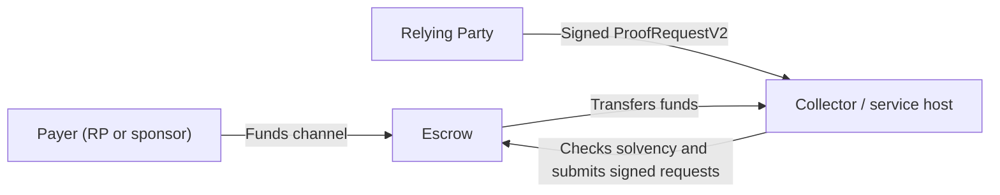

# YABS

This specification outlines a simple protocol that allows a service (e.g. the Deep Face Verifier) to create a unidirectional payment channel that charges a fee per unit of work at a negotiated `feeSchedule`. We extend the World ID `ProofRequest` with two optional fields so it can authorize a payment from an RP and allow a `collector` to check the payment’s solvency against the channel.

## Channel

A `channel` is a contract which prices future computational work on World ID proofs, entered into by the `payer` and the `collector`. The `payer` (either the RP or a provider) pre-funds the escrow. At channel opening, `spendKey` must equal the signer associated with `rpId` in the `RpRegistry`. The RP uses this key to sign payment authorizations funded by the `payer`. The `collector` batches these authorizations for atomic settlement and collects payment. It also negotiates the channel’s terms with the RP and verifies solvency before performing computational work for the RP.



A channel has the following settings:

```solidity
struct ChannelSettings {
    /// The RP being sponsored by `payer`.
    uint64 rpId;
    /// Unix timestamp when the channel was created.
    uint64 periodStart;
    /// The payer funding the channel with WLD for the RP.
    address payer;
    /// Address of the RP's request-signing key.
    address spendKey;
    /// Address of the `IFeeSchedule` contract.
    address feeSchedule;
    /// Number of independent nonce lanes.
    uint32 laneCount;
    /// Address of the collector receiving settled funds.
    address collector;
}
```

The `escrow` contract opens, closes, and settles channels under agreed fee schedules. Opening a channel between an RP and a `collector` *requires* consent from the RP associated with the channel’s `rpId` in the `RpRegistry`. Opening is trustless when the RP provides a signature over the channel settings.

**Note:** the contract’s role is to manage the funds held in channels opened with an RP’s signature. The `collector` decides whether it will accept payment under a given `feeSchedule`. For example, the Deep Face TEE host gates access to the TEE based on RP solvency. It also defines the `feeSchedule` parameters under which it will accept payment.

This allows fee schedules to vary by the application performing the verifications. Providers can also fine-tune the schedules they offer RPs over time. In [TODO](https://app.notion.com/p/TODO-3b18614bdf8c8066920bdc13924637ea?pvs=21), we outline a `feeSchedule` that mirrors a fixed-price, seat-based subscription model that charges a fixed amount for a set number of World IDs each month.

```solidity
/// @title A contract that manages World ID fees
interface IWorldIDFeeEscrow {
  /// @notice Opens a unidirectional channel with the given settings.
  function openChannel(ChannelSettings calldata channelSettings, bytes calldata rpSignature) external returns (bytes32 channelId);

  /// @notice Settles the signed requests associated with this channel.
  function closeChannel(bytes32 channelId, bytes[] calldata encodedProofRequests) external;
}
```

We define `channelId = keccak256(abi.encode(chainId, address(escrow), ChannelSettings[..]))`.

**A note on the protocol’s trust assumptions**

A service may offer different fee schedules to different RPs. A TEE host already controls access to computation. For example, an AWS host can refuse to forward requests to a Deep Face enclave. Under the [seat-based design](https://app.notion.com/p/YABS-3ab8614bdf8c80d9801ae9692f5ab7aa?pvs=21), the host also controls pricing and seat allocation.

This design makes the agreed pricing enforceable. Opening a channel binds the payer and collector to an immutable fee schedule. The host checks solvency against that channel and retains control over admission, but **cannot** change its pricing terms.

A channel sets the terms for paying for future computational work. The service proposes a price, and the RP chooses whether to accept it. When providers can enter the market and RPs can switch between them, competitors have an incentive to offer better prices and serve customers others reject. This can support price discovery and discourage censorship; it does not guarantee equal prices or universal access.

## ProofRequest Extension

```rust
/// A proof request from a Relying Party (RP) for an Authenticator.
///
/// Unknown JSON fields are ignored during deserialization so that older
/// Authenticators keep accepting requests from RPs speaking a newer minor
/// revision of the protocol. The RP signature only covers the enumerated
/// fields (see [`ProofRequest::digest_hash`]), so tolerated fields are
/// never part of any signed or hashed message.
#[derive(Debug, Clone, PartialEq, Eq, Serialize, Deserialize)]
pub struct ProofRequest {
    /// Unique identifier for this request.
    pub id: String,
    /// Version of the request.
    pub version: RequestVersion,
    /// Requested high-level proof flow.
    ///
    /// If omitted, the request is strictly treated as a [`ProofType::Uniqueness`] request.
    /// Session creation and session proving must opt in explicitly.
    #[serde(default)]
    pub proof_type: ProofType,
    /// Unix timestamp (seconds) when the request was created.
    pub created_at: u64,
    /// Unix timestamp (seconds) when the request expires.
    pub expires_at: u64,
    /// Registered RP identifier from the `RpRegistry`.
    pub rp_id: RpId,
    /// `OprfKeyId` of the RP.
    pub oprf_key_id: OprfKeyId,
    /// Session identifier that links proofs for the same user/RP pair across requests.
    ///
    /// Three states: absent/`null` (no session), `"create"` (mint a fresh session),
    /// or an existing `"session_"`-prefixed id. [`ProofType::Uniqueness`] accepts
    /// absent or `"create"` (see [`Self::binds_session`]); [`ProofType::Session`]
    /// requires `"create"` or an existing id.
    /// The proof will only be valid if the session ID is meant for this context and
    /// this particular World ID holder.
    #[serde(default)]
    pub session_id: SessionRef,
    /// An RP-defined context that scopes what the user is proving uniqueness on.
    ///
    /// This parameter expects a field element. When dealing with strings or bytes,
    /// hash with a byte-friendly hash function like keccak256 or SHA256 and reduce to the field.
    pub action: Option<FieldElement>,
    /// The RP's ECDSA signature over the request.
    #[serde(with = "crate::serde_utils::hex_signature")]
    pub signature: alloy::signers::Signature,
    /// Unique nonce for this request provided by the RP.
    pub nonce: FieldElement,
    /// Credentials requested by the RP.
    #[serde(rename = "proof_requests")]
    pub requests: Vec<RequestItem>,
    /// Optional constraint expression (all, any, or enumerate).
    #[serde(skip_serializing_if = "Option::is_none")]
    pub constraints: Option<ConstraintExpr<'static>>,
}
```

We extend the standard World ID `ProofRequest` with optional parameters that attach a payment authorization to an existing escrow channel identified by `channelId`.

```rust
#[derive(Debug, Clone, PartialEq, Eq, Serialize, Deserialize)]
pub struct ProofRequestV2 {
  pub inner: ProofRequest,
  /// An optional channel identifier for this payment authorization.
  #[serde(skip_serializing_if = "Option::is_none")]
  pub channelId: Option<FixedBytes<32>>,
  /// An optional 96-bit nonce with the lane ID in the high 32 bits and the counter in the low 64 bits.
  #[serde(skip_serializing_if = "Option::is_none")]
  pub channelNonce: Option<u128>,
}
```

A `ProofRequestV2` requires `inner.version = V2`. If both `channelId` and `channelNonce` are absent, the request has no associated payment. Both fields must be present to authorize a payment. Reject requests with only one payment field.

The signature is stored in `inner.signature`. `ProofRequestV2` extends request signing with an EIP-712 domain.

The `ProofRequestV2` signature is computed as follows:

1. **Domain:** `name = "WorldIDFeeEscrow"`, `version = "2"`, `chainId` is the fee escrow’s chain ID, and `verifyingContract` is the fee escrow’s address.
2. **Inner digest:** `rpRequestDigest = SHA256(0x01 || nonce[32] || created_at[8] || expires_at[8] || action[32, if present])`.
3. **Typed message:** `typeHash = keccak256("ProofRequest(bytes32 channelId,uint64 rpId,uint96 channelNonce,bytes32 rpRequestDigest)")`. Compute `structHash = keccak256(abi.encode(typeHash, channelId, inner.rp_id, channelNonce, rpRequestDigest))`.
4. **Signature:** sign `messageHash = keccak256(0x1901 || domainSeparator || structHash)`.

A `ProofRequest` carries the relying party’s authorization to request an OPRF evaluation for nullifier derivation. When channel fields are present, the same RP signature also authorizes payment from that channel under its agreed fee schedule.

**Verification**

Require the request’s RP ID to match the channel, `channelNonce < 2^96`, a valid lane, and a positive counter. Recover the fixed, nonzero `spendKey` recorded when the channel opened. At opening, this key must match the registered signer for `rpId` in the associated `RpRegistry`. Identity verification checks current RP authorization. Settlement checks the channel’s fixed key and remains valid after request expiry or registry rotation, subject to the channel’s collection deadline. Reject malformed signatures and never fall back to V1 after V2 verification fails.

## Nonce Management

The additional `channelNonce` field requires the RP to track a monotonically increasing nonce for each of the channel’s `laneCount` lanes.

We propose two ways to track this state:

1. The RP may track its own nonces, for example in a local database.
2. The RP may fetch its nonces from a public nonce management service.

> The service publicly stores the latest signed nonce for each channel and lane of each participating RP. RPs rely on its availability to sign payment authorizations in `ProofRequestV2`. For each lane, the service stores the latest nonce `n` and its signed `ProofRequestV2`. When an RP requests nonce `n + 1`, the service returns the signed request for nonce `n`. Verifying that signature prevents the service from inventing an arbitrarily high nonce, but does not prove that the returned nonce is the latest. Entropy in `inner.nonce` distinguishes requests; it does not prevent reuse of a `channelNonce`. Preventing stale responses and concurrent allocation of the same nonce remains an open requirement for this option.
> 

## Host Solvency Verification

The TEE host checks channel solvency before admitting requests to the TEE. Different World ID computations may use different channels, and an RP is not locked to one `channelId` for a month. Multiple channels may be active in parallel.

The details of host solvency verification are outside the scope of this specification.

## Fee Schedule

An `IFeeSchedule` maps a lane's signed counter to its cumulative fee. Payment is authorized by the signature; settlement does not require proof that work completed.

```solidity
interface IFeeSchedule {
	/// Returns the cumulative fee for the given number of verifications.
	function cumulativeFee(uint64 nonce) external pure returns (uint256 fee);
}
```

### Channel accounting

For each lane $\ell\in\{0,\ldots,L-1\}$, let $n_\ell$ be its highest valid signed counter and $s_\ell$ its highest settled counter, initially zero. The schedule takes the low 64-bit counter, not the packed nonce $(\ell\ll64)\mathbin{|}n_\ell$. Require $C(0)=0$ and a nondecreasing $C$.

$$
A(\mathbf n)=\sum_{\ell=0}^{L-1}C(n_\ell),\qquad
S(\mathbf s)=\sum_{\ell=0}^{L-1}C(s_\ell).
$$

$A$ is the maximum cumulative amount authorized; $S$ is the amount already settled. A batch containing valid signed counters $q$ updates each lane to $s'_\ell=\max(s_\ell,\{q\text{ submitted for lane }\ell\})$, leaving lanes without submissions unchanged, and pays:

$$
\Delta=S(\mathbf s')-S(\mathbf s)
=\sum_{\ell=0}^{L-1}\bigl[C(s'_\ell)-C(s_\ell)\bigr].
$$

Only the highest authorization per lane is needed; intermediate signatures are unnecessary. Replayed or lower counters add zero liability. Signing counter $N$ authorizes $C(N)$, even if earlier counters were skipped. Atomic settlement requires remaining escrow balance $E\ge\Delta$; covering all outstanding authorizations requires $E\ge A-S$.

### Rational decay

For fee cap $B>0$, half-decay point $T>0$, and counter $N\ge0$:

$$
C(N)=\frac{BN}{T+N},\qquad
C(N)-C(N-1)=\frac{BT}{(T+N)(T+N-1)}\quad(N\ge1).
$$

Here $C(T)=B/2$ and $\lim_{N\to\infty}C(N)=B$. The marginal price stays positive at every finite counter and tends to zero; there is no hard free-usage threshold in this real-valued schedule.

For one lane and monthly bundle price $P$, protocol revenue is $C(N)$ and the provider's retained amount before costs is:

$$
M(N)=P-C(N)=P-B+\frac{BT}{T+N}.
$$

When $B=P$, $M(N)=PT/(T+N)\to0$. For example, with $P=B=100$ WLD and $T=1{,}000$, counters $1{,}000$, $9{,}000$, and $99{,}000$ authorize $50$, $90$, and $99$ WLD. The provider retains $50$, $10$, and $1$ WLD respectively. An RP buying directly can treat this remainder as unused budget; neither amount accounts for operating costs.

Caps apply per lane: a channel with $L$ lanes has total cap $LB$ and retained amount $P-\sum_\ell C(n_\ell)$. Setting $B=P$ caps a bundle at $P$ only for one lane; a shared bundle cap requires $LB\le P$. Fees depend on how usage is distributed across lanes. A monthly interpretation also requires a fresh accounting period; this function does not reset counters with time.

### Hard-capped fixed unit price

For unit price $p>0$ and per-lane cap $B>0$:

$$
C(N)=\min(pN,B),\qquad
C(N)-C(N-1)=\min\bigl(p,\max(0,B-p(N-1))\bigr).
$$

For $p=0.1$ WLD and $B=100$ WLD, the first $1{,}000$ increments cost $0.1$ WLD each; subsequent increments cost zero. Both schedules bound revenue while usage can keep growing. The party bearing computation costs bears burst-usage risk; rational decay approaches free marginal usage, while this schedule reaches it at a finite threshold.

### Integer settlement

Contracts return fees in token base units. For rational decay use $\widehat C(N)=\lfloor BN/(T+N)\rfloor$, with overflow-safe multiplication and division; settle differences of rounded cumulative fees, not rounded marginal fees. This preserves settlement totals across batches, although individual counter increments can cost zero after rounding. The formulas above describe the real-valued economics.

## Design Tradeoffs

TL;DR Major design tradeoffs is complexity of nonce management, and `feeSchedule` assumptions. Major benefits are simplicity, end to end cryptographic verifiability, and modularity (very simple for different external protocols beyond Deep Face to build on top)
