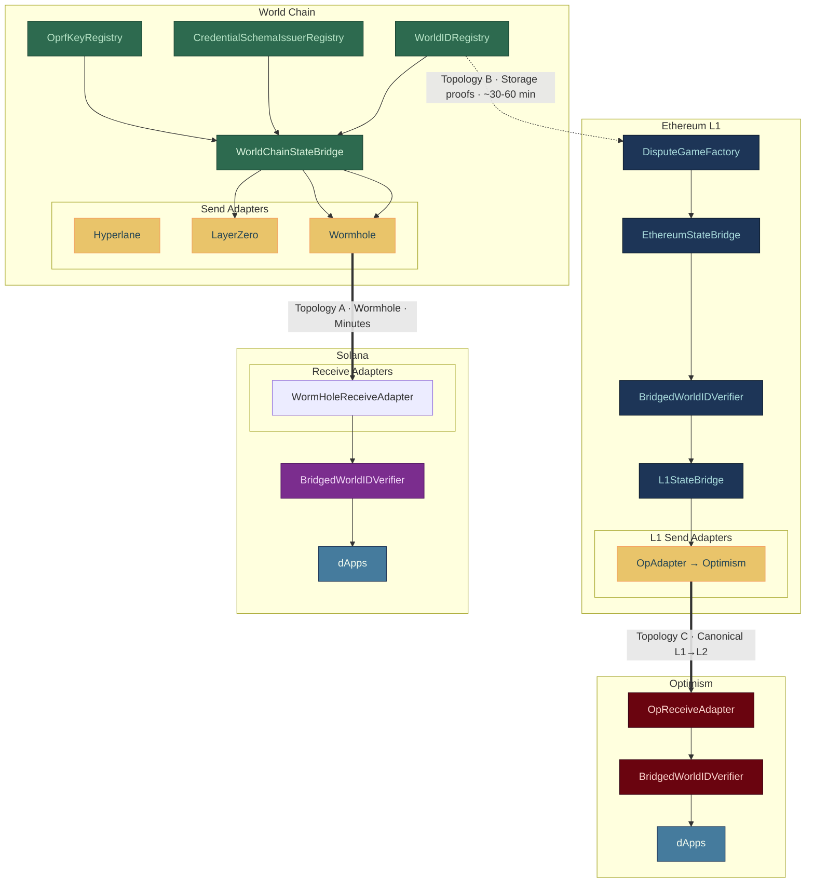

# RFC: World Id 4.0 State Bridge

**Status**

- **Status:** Draft
- **Authors: @Leyton Taylor**
- **Reviewers:**
    - @Alessandro Mazza
    - @Paolo D'Amico
    - @Eric Woolsey
    - @Kilian Glas
    - @Karan Kurbur
    - @Aurélien Brézun
    - @Andy Wang
    - @DC Builder
    - @Jakub Trąd
    - @Murph Finnicum
    - @Philipp Sippl

---

## Abstract

*This RFC proposes a new state-bridging protocol for World ID 4.0. It is designed to address the main limitations of the previous iteration of the state bridge by introducing a transport-agnostic framework that reduces integration friction and improves flexibility around composability and bridge ownership.*

*The protocol decomposes bridging into three layers — source, dispatch, and digest — connected by a single cross domain registry state. Each source chain hosts a singleton bridge contract that manages a registry of transport adapters, allowing relayers to dispatch state to all owned bridges in a single transaction.*

Additionally we propose a solution to cross chain synchronization of the dependent registry state needed in the new World ID Verifier.

---

Design Goals

- efficient, intuitive, and low friction for integrations
- non prescriptive - generic over bridge transport
- minimize operational complexity of maintaining bridges
- secure and correct

Non Goals

- End to End Trustless
- Non EVM Dest Chain References
- Defining Relayer Specifications

### Primer

**World ID 4.0 Overview**

- Source Chain is now World Chain
- Verification depends on more than a Merkle root.
- The `WorldIdVerifier` depends on:
    1. Synchronized Merkle Tree Root
    1. Synchronized Credential issuer Pub Keys from the `CredentialIssuerSchemaRegistry`
    2. Synchronized Oprf Pub Keys from the `OprfKeyRegistry`

**Legacy Architecture**

The legacy bridge deployed an `OpStateBridge` on L1 per destination chain,  `latestRoot` from the `WorldIdIdentityManager` and then sent a message to the `L2CrossDomainMessenger` which relayed the root to a receiver on any OP Stack destination chain.

Limitations:

- L1 transaction per chain integration
- Prescriptive design
- No clear opinionated design for non OP Stack integrations

The goal of this specification is to design a unified singleton architecture where business logic is an abstraction over generic transport level semantics.

**World Chain State Roots**

World Chain’s `stateRoot` becomes available on Ethereum through the `DisputeGameFactory`. The `stateRoot` is the MPT root of the global account state — storage proofs can be verified against it. Output roots are typically proposed ~30–60 minutes after the corresponding L2 block.

> NOTE: We control the root proposal interval on World Chain. So, estimations on bridge delay can be reduced significantly in some cases
> 

**Proposal**

| Layer | What it does | Key interface |
| --- | --- | --- |
| **Source** | Holds unified state registry | `ICrossDomainRegistryState` |
| **Dispatch** | The source chain contract in charge of dispatching all registered bridge adapters. | `ICrossDomainStateBridge`, `IBridgeAdapter` |
| **Digest** | Destination chain state consumer | `IBridgedStateAdapter`, `ICrossDomainWorldIdVerifier` |

Design thesis is to have `ICrossDomainRegistryState` as the polymorphic seam between all three layers. On World Chain, it proxies directly to the live registries. On Ethereum L1, it reads from an MPT-proven cache. On any destination chain, the `BridgedWorldIDVerifier` exposes the same five getters over its bridged state cache.

Any chain with a `ICrossDomainVerifier` can also host a`ICrossDomainStateBridge` that dispatches to further destinations. The layers compose — a digest becomes a source.

```
ICrossDomainRegistryState                 IBridgeAdapter
        │                                       │
        ├── ICrossDomainStateBridge ────────────┘
        │       reads state, aggregated dispatches via adapters
        │
        └── IMptStorageProofAdapter
                proves state via MPT storage proofs

IWorldIDVerifier ───┐
                    ├── ICrossDomainWorldIdVerifier
IBridgedStateAdapter┘
        receives state, caches, verifies proofs
```

---

**World Chain - Batched Dispatch**

World Chain dispatches directly to the destination via a third-party bridge.

```
World Chain                        Destination
┌───────────────────┐              ┌────────────────────────┐
│ Registries        │              │ ReceiveAdapter         │
│       ↓           │  Hyperlane   │       ↓                │
│ WorldChainState   │─────────────→│ BridgedWorldID         │
│ Bridge            │  / LZ / WH  │ Verifier               │
└───────────────────┘              └────────────────────────┘
```

**Latency:** Minutes. **Trust:** Bridge provider. **L1 cost:** Zero.

**Ethereum Optimistic Storage Proofs**

Anyone submits MPT storage proofs on L1 against output roots from `DisputeGameFactory`.

```
World Chain              Ethereum L1
┌──────────────┐         ┌─────────────────────────────┐
│ Registries   │         │ DisputeGameFactory          │
│              │ output  │       ↓                      │
│              │ roots   │ EthereumStateBridge          │
│              │────────→│   (verify MPT proofs)        │
└──────────────┘         │       ↓                      │
                         │ BridgedWorldIDVerifier       │
                         └─────────────────────────────┘
```

**Latency:** ~30–60 min. **Trust:** Output root validity. 

**Ethereum Hub - Batched Dispatch**

Once state is on L1, distribute it to L2s through their canonical L1→L2 bridges. MPT proofs are amortized across every L2 destination. Bridge adapters are dispatched in batches by relying parties.

```markdown
Ethereum L1                          OP Stack L2
┌────────────────────────┐            ┌───────────────────┐
│ BridgedWorldIDVerifier  │ canonical │ OpReceiveAdapter  │
↓            │       ↓                │  L1→L2   │        |
│ L1StateBridge           │──────────→│ BridgedWorldID    │
│   adapters[0] → OP      │           │ Verifier          │
│   adapters[1] → Arbitrum│           └───────────────────┘
└────────────────────────-┘
```

**Latency:** ~35–60+ min (proof + deposit). **Trust:** Canonical L1→L2 bridge.

**L2 Native Storage Proofs**

OP Stack L2s have access to L1 state via the `L1Block` contract (`0x4200...0015`). This means an L2 can verify MPT proofs against L1 storage ***locally***, without any relayed state.

The proof chain is two layers deep:

```
L1 block hash  (from L1Block contract on L2)
  → L1 state root  (RLP-decode L1 block header)
    → DisputeGameFactory storage  (L1 account + storage proof)
      → output root / rootClaim
        → World Chain state root  (output root preimage)
          → Registry storage  (L2 account + storage proofs)
            → root, timestamp, treeDepth, pubkeys
```

**Latency:** ~30–60 min (output root availability only). **Trust:** Output root validity — same as Topology B. **L1 cost:** Zero. **L2 cost:** ~300–500K gas (double-layer proof verification + RLP decoding).

> I think this is potentially the most efficient strategy for chains with direct access to L1, but comes at the cost of a bit more complexity.
> 

### Supported Bridge Strategies

| Topology | Source | Mechanism | Latency | Trust | L1 Cost |
| --- | --- | --- | --- | --- | --- |
| Direct push | World Chain | Third-party bridge | Minutes | Bridge provider | None |
| Storage proofs | World Chain (implicit) | MPT proofs on L1 | ~30–60 min | Output root validity | ~200–280K gas |
| Hub-and-spoke | Ethereum L1 | Canonical L1→L2 | ~35–60+ min | Canonical bridge | ~30–50K gas/L2 |
| L2 as source | Any chain w/ verifier | Any adapter | Variable | Inherited + bridge | None |
| L2 native proofs | L2 (via L1Block) | Double-layer MPT | ~30–60 min | Output root validity | None |
| Multi Path | Multiple | Multiple | Fastest available | Strongest available | Variable |

---

## Specification

### `ICrossDomainRegistryState`

The read interface over registry state. Every source exposes these five getters — whether it reads from live registries, a proven cache, or bridged state.

```solidity
interface ICrossDomainRegistryState {
    function getRootTimestamp(uint256 root) external view returns (uint256);
    function getLatestRoot() external view returns (uint256);
    function issuerPubkey(uint64 issuerSchemaId) external view returns (uint256 x, uint256 y);
    function oprfKey(uint160 oprfKeyId) external view returns (uint256 x, uint256 y);
    function rootValidityWindow() external view returns (uint256);
}
```

---

### `IBridgeAdapter`

An immutable wrapper around a single cross-chain transport targeting a single destination. The bridge calls `sendMessage(bytes)` and the adapter handles encoding, fee payment, and domain routing internally.

```solidity
interface IBridgeAdapter {
    function TARGET() external view returns (address);
    function GAS_LIMIT() external view returns (uint64);
    function sendMessage(bytes calldata message) external payable;
}
```

`TARGET` and `GAS_LIMIT` are set at construction and never change. `sendMessage` is a passthrough — it MUST NOT modify the payload. Adapters MAY require `msg.value` for transport fees.

---

### `ICrossDomainStateBridge`

The singleton dispatch contract on a source chain. Reads state from its `ICrossDomainRegistryState` implementation and batches dispatch to registered adapters. A relayer selects which adapter indices to service per transaction. 

```solidity
interface ICrossDomainStateBridge is ICrossDomainRegistryState {
    function adapters(uint256 index) external view returns (IBridgeAdapter);
    function adapterCount() external view returns (uint256);

    function propagateRoot(uint256[] calldata adapterIndices) external payable;
    function propagateIssuerPubkey(uint256[] calldata adapterIndices, uint64 issuerSchemaId) external payable;
    function propagateOprfKey(uint256[] calldata adapterIndices, uint160 oprfKeyId) external payable;

    function registerAdapter(IBridgeAdapter adapter) external;    // onlyOwner
    function removeAdapter(uint256 index) external;               // onlyOwner, swap-and-pop
}
```

---

### `IMptStorageProofAdapter`

Extends `ICrossDomainRegistryState` for chains with direct access to `DisputeGameFactory` (Ethereum L1). Proves World Chain storage slots via MPT proofs and delivers the extracted values to a `BridgedWorldIDVerifier`.

Verification:

1. Look up the dispute game by index from `DisputeGameFactory`.
2. Validate that the output root meets acceptance criteria (implementor-defined) 
3. Verify the output root preimage against the game’s `rootClaim()`.
4. Verify the MPT account proof: L2 state root → target contract’s storage root.
5. Verify storage proofs against the storage root to extract slot values.
6. Deliver proven values to the verifier atomically.

```solidity
interface IMptStorageProofAdapter is ICrossDomainRegistryState {
    function proveRoot(
        uint256 disputeGameIndex,
        bytes[] calldata outputRootProof,
        bytes[] calldata accountProof,
        bytes[] calldata rootTimestampProof,
        bytes[] calldata latestRootProof,
        bytes[] calldata treeDepthProof
    ) external;

    function proveIssuerPubkey(
        uint64 issuerSchemaId,
        uint256 disputeGameIndex,
        bytes[] calldata outputRootProof,
        bytes[] calldata accountProof,
        bytes[] calldata storageProofX,
        bytes[] calldata storageProofY
    ) external;

    function proveOprfKey(
        uint160 oprfKeyId,
        uint256 disputeGameIndex,
        bytes[] calldata outputRootProof,
        bytes[] calldata accountProof,
        bytes[] calldata storageProofX,
        bytes[] calldata storageProofY
    ) external;
}
```

---

### `IL2StorageProofAdapter`

Extends `IMptStorageProofAdapter` for OP Stack L2s that verify proofs locally using the `L1Block` contract (Topology E). Adds L1 state verification as a prefix to the standard MPT flow.

```solidity
interface IL2StorageProofAdapter is ICrossDomainRegistryState {
    function proveRoot(
        bytes calldata l1BlockHeader,
        bytes[] calldata l1AccountProof,
        bytes[] calldata l1GameStorageProof,
        bytes calldata outputRootPreimage,
        bytes[] calldata l2AccountProof,
        bytes[] calldata rootTimestampProof,
        bytes[] calldata latestRootProof,
        bytes[] calldata treeDepthProof
    ) external;

    function proveIssuerPubkey(
        uint64 issuerSchemaId,
        bytes calldata l1BlockHeader,
        bytes[] calldata l1AccountProof,
        bytes[] calldata l1GameStorageProof,
        bytes calldata outputRootPreimage,
        bytes[] calldata l2AccountProof,
        bytes[] calldata storageProofX,
        bytes[] calldata storageProofY
    ) external;

    function proveOprfKey(
        uint160 oprfKeyId,
        bytes calldata l1BlockHeader,
        bytes[] calldata l1AccountProof,
        bytes[] calldata l1GameStorageProof,
        bytes calldata outputRootPreimage,
        bytes[] calldata l2AccountProof,
        bytes[] calldata storageProofX,
        bytes[] calldata storageProofY
    ) external;
}
```

The verification anchors to the L1 block hash from the `L1Block` contract, RLP-decodes the block header to extract the L1 state root, proves `DisputeGameFactory` storage on L1, then continues with the standard World Chain MPT flow. See the [Topologies](about:blank#e--l2-native-storage-proofs) section for the full proof chain.

---

### `IBridgedStateAdapter`

The destination-side receiver. A thin authenticated passthrough 

```solidity
interface IBridgedStateAdapter {
    function MESSENGER() external view returns (address);
    function SOURCE_BRIDGE_ADAPTER() external view returns (address);

    function receiveRoot(uint256 root, uint256 worldChainTimestamp, uint256 treeDepth, bytes32 proofId) external;
    function receiveIssuerPubkey(uint64 issuerSchemaId, uint256 x, uint256 y, bytes32 proofId) external;
    function receiveOprfKey(uint160 oprfKeyId, uint256 x, uint256 y, bytes32 proofId) external;
}
```

Both `MESSENGER` and `SOURCE_BRIDGE_ADAPTER` are immutable. All `receive*()` functions MUST authenticate both the transport caller *and* the cross-domain source before forwarding:

---

### `ICrossDomainWorldIdVerifier`

The destination-chain verifier. Caches bridged state, exposes `ICrossDomainRegistryState` getters over the cache, implements the full `IWorldIDVerifier` interface, and supports state invalidation via `proofId`.

```solidity
interface ICrossDomainWorldIdVerifier is IWorldIDVerifier, IBridgedStateAdapter {
    function invalidateProofId(bytes32 proofId) external;          // adapter-only
    function invalidateProofIds(bytes32[] calldata proofIds) external;  // adapter-only
    function updateAdapter(address adapter) external;              // onlyOwner
}
```

### The `proofId`

Every piece of state delivered to the verifier carries an opaque `bytes32 proofId`. The verifier stores it alongside the cached value and checks `_invalidatedProofIds[proofId]` at verification time.

- **MPT storage proofs:** `proofId` is derived from the dispute game address.
- **Relay paths** (canonical L1→L2, third-party bridges): `proofId` is `bytes32(0)`. This state cannot be individually invalidated — it expires naturally via `rootValidityWindow`.

The verifier never interprets `proofId`. It’s an opaque handle that lets the adapter retroactively invalidate storage without leaking transport semantics into the verifier.

> 💡 Future Work - Out of scope
If the game resolves `CHALLENGER_WINS`, the adapter calls `invalidateProofId()`, and all state proven against that output root becomes invalid in one operation.
> 

---

## Transport Adapters

Each transport needs a **send adapter** (source-side, `IBridgeAdapter`) and a **receive adapter** (destination-side, `IBridgedStateAdapter`). The send adapter wraps the transport’s dispatch API. The receive adapter wraps the delivery callback with authentication. 

### Examples: Bridge Dispatchers

```solidity
// OP Stack — L1CrossDomainMessenger
contract OpBridgeAdapter is IBridgeAdapter {
    function sendMessage(bytes calldata message) external payable {
        _messenger.sendMessage(TARGET, message, uint32(GAS_LIMIT));
    }
}

// Hyperlane — Mailbox.dispatch()
contract HyperlaneSendAdapter is IBridgeAdapter {
    function sendMessage(bytes calldata message) external payable {
        _mailbox.dispatch{value: msg.value}(_dstDomain, bytes32(uint256(uint160(TARGET))), message);
    }
}

// LayerZero V2 — Endpoint.send()
contract LayerZeroSendAdapter is IBridgeAdapter {
    function sendMessage(bytes calldata message) external payable {
        _endpoint.send{value: msg.value}(
            MessagingParams(_dstEid, bytes32(uint256(uint160(TARGET))), message, _options, false),
            msg.sender
        );
    }
}

// Wormhole — automatic relayer
contract WormholeSendAdapter is IBridgeAdapter {
    function sendMessage(bytes calldata message) external payable {
        _relayer.sendPayloadToEvm{value: msg.value}(_dstChainId, TARGET, message, 0, uint256(GAS_LIMIT));
    }
}
```

### Examples: Bridged State Adapter

```solidity
// OP Stack — L2CrossDomainMessenger
contract OpReceiveAdapter is IBridgedStateAdapter {
    function receiveRoot(uint256 root, uint256 ts, uint256 depth, bytes32 pid) external {
        require(msg.sender == MESSENGER);
        require(IL2CrossDomainMessenger(MESSENGER).xDomainMessageSender() == SOURCE_BRIDGE_ADAPTER);
        _verifier.receiveRoot(root, ts, depth, pid);
    }
}

// Hyperlane — Mailbox.handle()
contract HyperlaneReceiveAdapter is IBridgedStateAdapter {
    function handle(uint32 origin, bytes32 sender, bytes calldata message) external {
        require(msg.sender == MESSENGER && origin == _srcDomain);
        require(address(uint160(uint256(sender))) == SOURCE_BRIDGE_ADAPTER);
        (bool ok,) = address(_verifier).call(message);
        require(ok);
    }
}

// LayerZero V2 — lzReceive()
contract LayerZeroReceiveAdapter is IBridgedStateAdapter {
    function lzReceive(Origin calldata _origin, bytes32, bytes calldata _msg, address, bytes calldata) external {
        require(msg.sender == MESSENGER && _origin.srcEid == _srcEid);
        require(address(uint160(uint256(_origin.sender))) == SOURCE_BRIDGE_ADAPTER);
        (bool ok,) = address(_verifier).call(_msg);
        require(ok);
    }
}

// Wormhole — receiveWormholeMessages()
contract WormholeReceiveAdapter is IBridgedStateAdapter {
    function receiveWormholeMessages(
        bytes memory payload, bytes[] memory, bytes32 src, uint16 chain, bytes32 hash
    ) external {
        require(msg.sender == MESSENGER && chain == _srcChainId);
        require(address(uint160(uint256(src))) == SOURCE_BRIDGE_ADAPTER);
        require(!_processed[hash]); _processed[hash] = true;
        (bool ok,) = address(_verifier).call(payload);
        require(ok);
    }
}
```

---

**Cached key staleness**

Keys don’t expire — once cached, they remain valid until overwritten or their `proofId` is invalidated. If a key is rotated on World Chain, the destination cache is stale until someone delivers the new value. For the storage proof paths, anyone can submit a fresh proof. For relay paths, the relay operator must propagate the update.

---

**Open Questions**

1. **Output root acceptance criteria.** The `IMptStorageProofAdapter._validateOutputRoot()` function is left as an implementation detail. 
2. **Batch proving.** Should `proveRoot`, `proveIssuerPubkey`, and `proveOprfKey` share a single account proof when proved against the same output root?
3. **Proving freshness.** Should adapters enforce that new proofs reference newer output roots than existing cached values?

---

---

## Architecture Diagram



---

## References

- [**World ID 4.0 Specs**](https://www.notion.so/World-ID-Protocol-Hub-2568614bdf8c80c7bef1dcbb90a33a04?pvs=21) — Protocol specification, registry interfaces, verification logic
- [**Legacy State Bridge**](https://github.com/worldcoin/world-id-state-bridge) — `OpStateBridge`, `WorldIDBridge`, `OpWorldID` (World ID 3.0)
- [**OP Stack: Proposals**](https://specs.optimism.io/protocol/proposals.html) — `DisputeGameFactory`, output root lifecycle
- [**OP Stack: Messengers**](https://specs.optimism.io/protocol/messengers.html) — `L1CrossDomainMessenger`, `xDomainMessageSender()`
- [**OP Stack: L1Block**](https://specs.optimism.io/protocol/l1-block.html) — `L1Block` contract, L1 state access on L2
- [**EIP-1186**](https://eips.ethereum.org/EIPS/eip-1186) — `eth_getProof`, MPT account and storage proof structure
- [**Solidity Storage Layout**](https://docs.soliditylang.org/en/latest/internals/layout_in_storage.html) — Mapping slot computation
- [**Hyperlane Docs**](https://docs.hyperlane.xyz/) — ISM, Mailbox, `IMessageRecipient`
- [**LayerZero V2 Docs**](https://docs.layerzero.network/v2) — OApp, Endpoint, DVN
- [**Wormhole Docs**](https://docs.wormhole.com/) — Automatic Relayer, `IWormholeReceiver`, Guardian network