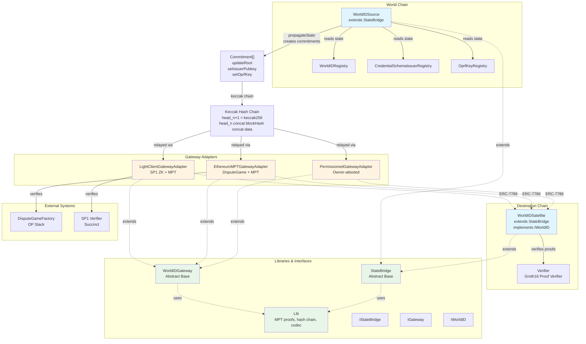

# World ID Crosschain Architecture

## System Overview

This diagram illustrates the crosschain state bridge architecture for World ID 4.0, which propagates identity state (Merkle roots, issuer public keys, OPRF keys) from World Chain to destination EVM chains.



## Component Details

### Core Contracts

#### WorldIDSource (World Chain)
- **Location**: `WorldIDSource.sol`
- **Purpose**: Source of truth on World Chain that reads from registries and creates state commitments
- **Key Functions**:
  - `propagateState()` - Reads registries, diffs state, creates commitments
  - Extends `StateBridge` for keccak chain management
- **Reads From**:
  - `WorldIDRegistry` - Merkle roots
  - `CredentialSchemaIssuerRegistry` - Issuer public keys
  - `OprfKeyRegistry` - OPRF public keys

#### WorldIDSatellite (Destination Chains)
- **Location**: `WorldIDSatellite.sol`
- **Purpose**: Receives bridged state and verifies World ID proofs
- **Key Functions**:
  - `verify()` - Verifies Groth16 proofs against bridged Merkle root
  - `verifySession()` - Verifies session-based proofs
  - `receiveMessage()` - ERC-7786 handler for gateway messages
- **Implements**: `IWorldID`, `ERC7786Recipient`

### Gateway Adapters

All gateway adapters extend `WorldIDGateway` and implement ERC-7786 messaging:

#### PermissionedGatewayAdapter
- **Location**: `adapters/PermissionedGatewayAdapter.sol`
- **Trust Model**: Owner-attested (centralized)
- **Verification**: Simple owner check
- **Use Case**: Development, testing, trusted environments

#### EthereumMPTGatewayAdapter
- **Location**: `adapters/EthereumMPTGatewayAdapter.sol`
- **Trust Model**: Trustless via OP Stack DisputeGame
- **Verification**: 
  - Verifies DisputeGame status (DEFENDER_WINS)
  - MPT proof of World Chain state root
  - Extracts chain head from StateBridge storage slot
- **Use Case**: L1 chains with OP Stack integration

#### LightClientGatewayAdapter
- **Location**: `adapters/LightClientGatewayAdapter.sol`
- **Trust Model**: Trustless via ZK proofs
- **Verification**:
  - SP1 Helios ZK proof of Ethereum consensus
  - Light client state tracking (beacon chain slots)
  - MPT proof of L1 StateBridge storage
- **Use Case**: L2 chains needing trustless L1 verification

### Base Classes

#### StateBridge
- **Location**: `lib/StateBridge.sol`
- **Purpose**: Abstract base managing keccak hash chain and state storage
- **Features**:
  - Keccak chain accumulator
  - State mappings (roots, issuer keys, OPRF keys)
  - Gateway authorization
  - UUPS upgradeable pattern

#### WorldIDGateway
- **Location**: `lib/Gateway.sol`
- **Purpose**: Abstract ERC-7786 gateway base
- **Features**:
  - Message sending via ERC-7786
  - Attribute validation
  - Proof verification hook (implemented by adapters)

#### Lib
- **Location**: `lib/Lib.sol`
- **Purpose**: Utility library for MPT proofs, hash chain operations, codec
- **Key Functions**:
  - `proveStorageSlot()` - MPT proof verification
  - `hashChained()` - Keccak chain computation
  - Commitment encoding/decoding

## Data Flow

### 1. State Propagation (World Chain → Destination)

```
1. WorldIDSource.propagateState()
   ├─ Reads WorldIDRegistry.getLatestRoot()
   ├─ Reads CredentialSchemaIssuerRegistry for issuer keys
   ├─ Reads OprfKeyRegistry for OPRF keys
   ├─ Diffs against stored state
   └─ Creates Commitment[] array

2. Commitments applied to StateBridge
   ├─ Updates state mappings
   └─ Extends keccak chain: head_{n+1} = keccak256(head_n || blockHash || data)

3. ChainCommitted event emitted
   └─ Contains new chain head + commitment data
```

### 2. Cross-Chain Relay

```
1. Relayer calls Gateway.sendMessage()
   ├─ Validates recipient (must be Satellite)
   ├─ Validates attributes (gateway-specific)
   └─ Verifies proof (adapter-specific logic)

2. Gateway extracts proven chain head
   ├─ Permissioned: from attribute data
   ├─ EthereumMPT: from DisputeGame + MPT proof
   └─ LightClient: from ZK proof + MPT proof

3. Gateway calls Satellite.receiveMessage()
   ├─ Encodes: (provenChainHead, commitmentPayload)
   └─ ERC-7786 delivery
```

### 3. State Application (Destination Chain)

```
1. Satellite._processMessage()
   ├─ Decodes: (provenChainHead, commitments)
   ├─ Verifies: commitments hash to provenChainHead
   └─ Applies commitments via _applyAndCommit()

2. Commitments applied
   ├─ updateRoot → updates latestRoot + timestamp
   ├─ setIssuerPubkey → updates issuer key mapping
   └─ setOprfKey → updates OPRF key mapping
```

### 4. Proof Verification

```
1. User calls Satellite.verify()
   ├─ Validates Merkle root (isValidRoot)
   ├─ Validates expiration threshold
   ├─ Looks up issuer pubkey (from bridged state)
   ├─ Looks up OPRF pubkey (from bridged state)
   └─ Verifies Groth16 proof via Verifier
```

## Keccak Hash Chain

The keccak chain is a rolling hash accumulator that commits to all historical state changes:

```
head_{n+1} = keccak256(head_n || blockHash || commitmentData)
```

**Properties**:
- Single `bytes32` head represents entire history
- Immutable: cannot modify past commitments
- Verifiable: can prove any commitment set hashes to head
- Efficient: O(1) storage, O(n) verification for n commitments

## State Types

Three types of state are bridged, each with a commitment selector:

1. **`updateRoot(uint256,uint256,bytes32)`**
   - Merkle tree root + timestamp + proof ID

2. **`setIssuerPubkey(uint64,uint256,uint256,bytes32)`**
   - Issuer schema ID + BabyJubJub pubkey (x, y) + proof ID

3. **`setOprfKey(uint160,uint256,uint256,bytes32)`**
   - OPRF key ID + BabyJubJub pubkey (x, y) + proof ID

## Security Model

### Trust Assumptions

| Gateway Type | Trust Model | Security Level |
|-------------|-------------|----------------|
| PermissionedGatewayAdapter | Owner signature | Centralized |
| EthereumMPTGatewayAdapter | OP Stack DisputeGame | Trustless (L1) |
| LightClientGatewayAdapter | SP1 ZK proof | Trustless (ZK) |

### Verification Layers

1. **Gateway Level**: Verifies proof of World Chain state (varies by adapter)
2. **Satellite Level**: Verifies commitments hash to proven chain head
3. **Application Level**: Verifies Groth16 proofs against bridged Merkle root

## Interfaces

- **IStateBridge**: Public interface for state bridge contracts
- **IGateway**: Public interface for gateway adapters
- **IWorldID**: Verification interface implemented by Satellite

## Error Handling

All custom errors defined in `Error.sol`:
- `InvalidChainHead` - Commitments don't hash to proven head
- `EmptyChainedCommits` - No commitments provided
- `InvalidMerkleRoot` - Root not in validity window
- `UnregisteredIssuerSchemaId` - Issuer not bridged
- `UnregisteredOprfKeyId` - OPRF key not bridged
- And many more...

