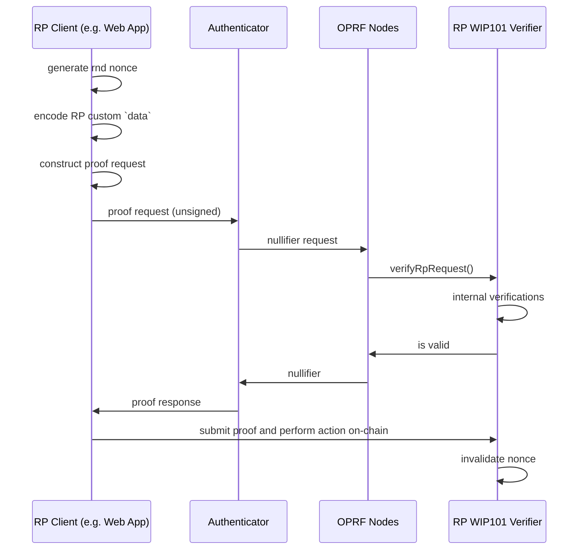

## Abstract

This spec introduces a method to verify Relying Party (RP) proof requests in the World ID Protocol through on-chain smart contracts. As some RPs may not have a backend and be simply a contract, this allows OPRF Nodes to answer **"Does the RP authorize this request?"** in order to process relevant OPRF requests such as for nullifier generation.

## Motivation

**Context**: Proof requests from Relying Parties in the World ID Protocol MUST be signed in order to be recognized. This serves to ensure proofs are authorized for the intended recipient and reduce the surface area of post-compromise in Authenticators.

A Relying Party MAY be a Smart Contract without a backend. When this is the case, having a private key to sign the request is impractical or even impossible in a secure way. Hence, we need a way for Relying Parties to authorize the request in a way compatible with Smart Contracts.

## Specification

The key words "MUST", "MUST NOT", "REQUIRED", "SHALL", "SHALL NOT", "SHOULD", "SHOULD NOT", "RECOMMENDED", "MAY", and "OPTIONAL" in this document are to be interpreted as described in [RFC 2119](https://www.ietf.org/rfc/rfc2119.txt).

The term "contract" is used to refer to "Smart Contracts", both may be used interchangeably.

This specification introduces both concerns of "Authorization" and "Validation" of Relying Party (RP) Proof requests. When an RP requests a proof without a smart contract, they construct the proof request and sign on the data they constructed. If the RP does not have a backend or other trusted environment, they cannot control the inputs to the Proof request. Hence, the contract SHOULD implement validation rules for the request. For example, an RP should determine what is the maximum expiration period they should allow for Proof requests and enforce it during verification.

1. In order for a contract, acting as an RP, to be compatible with signature verification, it MUST conform to the following interface.
  ```solidity
  /**
   * @dev Interface of the WIP-101 standard for World ID,
   *   RP Request Authorization Method for Smart Contracts.
   */
  interface IWIP101 is IERC165 {
      /**
       * @dev The RP request is not valid. The code may be used to provide additional debugging information.
       */
      error RpInvalidRequest(uint256 code);

      /**
       * @notice Verifies a World ID Proof Request is authorized by the RP.
       * @dev Should return whether the RP request is valid and should be honored. The `rpId` is implicit in this request,
       *  any contract implementing this interface will be pointed to in the `RpRegistry`.
       * @param version The version determines the format of the request.
       * @param nonce Unique nonce for this request
       * @param createdAt Creation timestamp of the request
       * @param expiresAt Expiration timestamp specified for the request
       * @param action Provided action for the request. Importantly, this is already a hashed
       *  action as a field element.
       * @param data Arbitrary data useful for the verification.
       * @return magicValue The expected magic value when the request is valid. Reverts otherwise.
       * 
       * MUST return the bytes4 magic value 0x35dbc8de when function passes (function selector for verifyRpRequest).
       * MUST NOT modify state (view modifier for solc > 0.5)
       * MUST allow external calls
       */
      function verifyRpRequest(
          uint8 version,
          uint256 nonce,
          uint64 createdAt,
          uint64 expiresAt,
          uint256 action,
          bytes calldata data
      ) external view returns (bytes4 magicValue);
  }
  ```
2. If the request is not authorized, the `verifyRpRequest` MUST revert. When requests are invalid, implementers SHOULD revert with the explicit `RpInvalidRequest` error. OPRF Nodes MUST handle this explicit revert and return the inner `code` to the requester (for debugging purposes).
3. Callers MUST treat any return value other than the magic value of `0x35dbc8de` as an invalid request.
4. The contract (implementer) MUST also adhere to [ERC-165](https://eips.ethereum.org/EIPS/eip-165) and return `true` from `supportsInterface` for `type(IWIP101).interfaceId`.
5. When a contract is deployed compliant with this spec, the contract address can be set as a `signer` in the `RpRegistry` contract (e.g. through the `updateRp` function).
6. The `verifyRpRequest` method will be used by OPRF Nodes to verify an incoming proof request before generating the required output to construct a `nullifier`. OPRF Nodes MAY enforce a timeout on the resolution of this request so it is RECOMMENDED implementers don't rely on computationally expensive logic. Following the main threat model of this spec, OPRF Nodes MUST pass the `action` to the `verifyRpRequest` function as the exact query which will be used for OPRF computations.
7. OPRF Nodes MUST use this spec (WIP-101) verification if the `signer` in the `RpRegistry` implements [ERC-165](https://eips.ethereum.org/EIPS/eip-165) for `type(IWIP101).interfaceId`. Otherwise the `signer` will be verified using regular ECDSA verification.
8. OPRF Nodes MAY cache an RP's `signer` for performance. This cache may include the consideration on whether the `signer` is WIP-101 compliant or not. The cache MUST NOT exceed 30 days. OPRF Nodes MUST invalidate the `signer` cache on any `RpUpdated` event emission from the `RpRegistry`.
9. It is RECOMMENDED implementers ensure that any upgrades to validation logic are backwards-compatible for the duration of the maximum `expiresAt` window.
10. RPs MAY define any number of `code`s in the `RpInvalidRequest`. These codes are intended only for RP debugging, hence the RP can establish any format/definition for this attribute.
11. The maximum length of `data` is 4096 bits. OPRF Nodes may enforce this maximum length and reject requests which exceed it.
12. Implementations of **WIP-101** MUST be deployed on World Chain Mainnet (Chain ID: `480`). OPRF Nodes MUST only verify contract execution on this chain. _**Note**: For RPs using other chains, proof verification MAY occur elsewhere, it's only the request authorization that MUST happen on World Chain._

### Additional Context

**Version**
The version of the [`ProofRequest`](https://docs.rs/world-id-primitives/latest/world_id_primitives/request/struct.ProofRequest.html) which is passed as `version` attribute to the `verifyRpRequest` function is currently defined in the [`RequestVersion`](https://docs.rs/world-id-primitives/latest/world_id_primitives/request/enum.RequestVersion.html) enum.

**Invalidating signer cache**
Note that RPs can trigger a cache invalidation of the `signer` by doing a no-op (or an actual) update with the `updateRp` method in the `RpRegistry` (see point #7). This is useful if for example the `signer` is an [ERC-1967](https://eips.ethereum.org/EIPS/eip-1967) proxy and the implementation was updated in a way material to determine compliance or non-compliance with this spec (e.g. a bug in the implementation of the [ERC-165](https://eips.ethereum.org/EIPS/eip-165) interface).

**Authorizing Sessions**
Implementers may also authorize requests for Session Proofs or starting a session. For these scenarios, the `action` value will have the relevant prefix. For example, requests for a Session Proof will have a prefix of `0x02` in the most significant byte of the action, i.e. `uint8(action >> 248) == uint8(2)`. More details on the different prefixes can be found in the [`SessionId`](https://docs.rs/world-id-primitives/latest/world_id_primitives/struct.SessionId.html) definition.

Implementers MAY encode different handling depending on the type of request. For example:
- If the RP does not support sessions, reject proofs if the prefix does not equal `0x00`.
- If the RP supports sessions, the actions are randomly generated, so as long as the prefix matches one of the expected values (e.g. `0x01`, `0x02`), the action check can be considered fulfilled.

## Rationale

The `verifyRpRequest` allows an RP to verify all the inputs that would otherwise be signed, so any rules that an RP would normally use when constructing an off-chain request can be encoded in the RP's contract for pure on-chain interactions.

The rationale behind the arbitrary `data` is that the `action` is passed to this function already hashed into the field so nothing on the pre-image can be validated. Validating the content of the pre-image is something particularly important because it scopes the _uniqueness space_, i.e. it's an input to the `nullifier` of a proof.

This spec is inspired in [ERC-1271](https://github.com/ethereum/ercs/blob/master/ERCS/erc-1271.md).

## Reference Implementation

```solidity
contract WIP101Example is IWIP101, ERC165 {
    // bytes4(keccak256("verifyRpRequest(uint8,uint256,uint64,uint64,uint256,bytes)"))
    bytes4 internal constant MAGICVALUE = 0x35dbc8de;
    
    /**
    * @dev The RP request is not valid. The code may be used to provide additional debugging information.
    */
    error InvalidRequest(uint256 code);

    /// @inheritdoc IWIP101
    function verifyRpRequest(
        uint8 version,
        uint256 nonce,
        uint64 createdAt,
        uint64 expiresAt,
        uint256 action,
        bytes calldata data
    ) external view returns (bytes4 magicValue) {
        if (version > 1) {
            revert InvalidRequest(0);
        }
        
        if (createdAt > block.timestamp || createdAt < block.timestamp - 15 minutes) {
            revert InvalidRequest(1);
        }

        if (expiresAt < block.timestamp || expiresAt > block.timestamp + 15 minutes) {
            revert InvalidRequest(2);
        }
        
        if (uint8(action >> 248) != uint8(0)) {
            // This RP does not support Session Proofs
            revert InvalidRequest(3);
        }
        
        // production implementations are RECOMMENDED to validate nonce uniqueness
        
        // note the bitshift by 8 for the action to fit into the field; this is the same
        // method as in `FieldElement::from_arbitrary_raw_bytes` which is used in common SDKs
        uint256 expected_action = uint256(keccak256(abi.encodePacked("vote"))) >> 8;

        if (action != expected_action) {
            revert InvalidRequest(4);
        }

        return MAGICVALUE;
    }

    /// @inheritdoc ERC165
    function supportsInterface(bytes4 interfaceId) public view virtual override(ERC165, IERC165) returns (bool) {
        return interfaceId == type(IWIP101).interfaceId || super.supportsInterface(interfaceId);
    }
}
```

It is expected that under normal circumstances, the RP would still construct a Proof request. The key distinction with authorization through this specification versus authorization through an ECDSA signature is that the proof request would be **constructed in an untrusted environment (for example the user's web browser)**. Hence, why this specification also covers validation of the request. The following diagram shows a non-normative example of how such request flow can occur. Note particularly how the proof request is constructed by the RP but does not need to be assumed correct because it is verified by the WIP-101 compliant contract.




## Recommended Validations

It is RECOMMENDED to implement the following validations for a Proof request:
1. It is RECOMMENDED implements reject a request which `version` is larger than the maximum known as future version changes MAY be incompatible with previous versions.
2. `createdAt` is not in the future and close to the current time.
3. `expiresAt` is not in the past and is not too far in the future. While "too far" is relative to each RP's use case, it's unlikely that a Proof request should be valid for more than 15 minutes. Note that sub-minute precision SHOULD generally NOT be relied upon on-chain.
4. `nonce` has not been used before. This is RECOMMENDED, however OPRF Nodes will still enforce a nonce is only used once. Nonce tracking within `verifyRpRequest` is not possible due to the `view` constraint. Implementers relying on nonce uniqueness SHOULD track used nonces in a separate transaction (e.g., when the proof is consumed on-chain). _The rationale for this is that a nonce isn't considered "consumed" until the proof is verified. Furthermore, each OPRF Node will call the `verifyRpRequest` function indepdendently, so it's not a good place to enforce non re-use_.
5. `action` hash is the expected value for Uniqueness Proofs.
6. If the RP does not support Session Proofs, the first 8 bits of the action must all equal to `0`.

## Security

1. The main threat model protected with this spec is authorization of RP Requests such that an authenticator (malicious or not) cannot generate `nullifier`s (or other OPRF outputs) for use with an RP without that RP's authorization. This for example helps protect users in post-compromise scenarios. If an RP implements proper authorization logic, even with a compromised authenticator, an attacker would be unable to compute a user's nullifier.
2. Implementers are solely responsible for the security of their validation logic. A `verifyRpRequest` that unconditionally returns the magic value is equivalent to having no authorization and exposes the RP to unbounded nullifier generation for any action as well as users in a post-compromise scenario.

## Backwards Compatibility

This World Improvement Proposal (WIP) introduces a new interface; no existing contracts or other previously existing functionality is affected.
