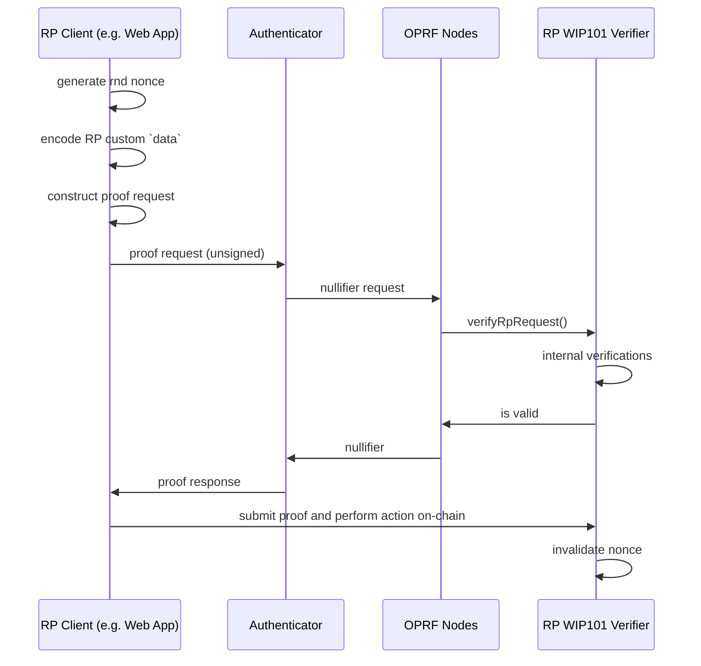

## Abstract

This spec introduces a method to verify Relying Party (RP) proof requests in the World ID Protocol through on-chain smart contracts. As some RPs may not have a backend and be simply a contract, this allows OPRF Nodes to answer **"Does the RP authorize this request?"** in order to process relevant OPRF requests such as for nullifier generation.

## Motivation

**Context**: Proof requests from Relying Parties in the World ID Protocol MUST be signed in order to be recognized. This serves to ensure proofs are authorized for the intended recipient and reduce the attack surface in post-compromise scenarios for Authenticators.

A Relying Party MAY be a Smart Contract without a backend. When this is the case, having a private key to sign the request is impractical or even impossible in a secure way. Hence, we need a way for Relying Parties to authorize the request in a way compatible with Smart Contracts.

## Specification

The key words "MUST", "MUST NOT", "REQUIRED", "SHALL", "SHALL NOT", "SHOULD", "SHOULD NOT", "RECOMMENDED", "MAY", and "OPTIONAL" in this document are to be interpreted as described in [RFC 2119](https://www.ietf.org/rfc/rfc2119.txt).

In this document, "contract" and "smart contract" are used interchangeably.

This specification introduces both concerns of "Authorization" and "Validation" of Relying Party (RP) Proof requests. When an RP requests a proof without a smart contract, they construct the proof request and sign the data they constructed. If the RP does not have a backend or other trusted environment, they cannot control the inputs to the Proof request. Hence, the contract SHOULD implement validation rules for the request. For example, an RP should determine what is the maximum expiration period they should allow for Proof requests and enforce it during verification.

1. In order for a contract, acting as an RP, to authorize requests, it MUST conform to the following interface.
  ```solidity
  struct RpRequest {
      uint8 requestVersion;
      uint64 rpId;
      uint160 oprfKeyId;
      uint256 nonce;
      uint64 createdAt;
      uint64 expiresAt;
      uint8 proofType;
      uint8 sessionMode;
      uint8 actionKind;
      uint256 action;
      bytes32 existingSessionSeedAuthorization;
      bytes32 detailsHash;
  }

  /**
   * @dev Interface of the WIP-101 standard for World ID,
   *   RP Request Authorization Method for Smart Contracts.
   */
  interface IWIP101 is IERC165 {
      /**
       * @dev The RP request is not valid. The code may be used to provide additional debugging information.
       */
      error RpInvalidRequest(uint256 code);

      /**
       * @notice Verifies a World ID Proof Request is authorized by the RP.
       * @dev Should return whether the RP request is valid and should be honored.
       * @param intent The public request semantics authorized by an EOA signature or this contract.
       * @param oprfAction The exact action the OPRF node will evaluate.
       * @param data Arbitrary data useful for the verification.
       * @return magicValue The expected magic value when the request is valid. Reverts otherwise.
       * 
       * MUST return IWIP101.verifyRpRequest.selector when the function passes.
       * MUST NOT modify state (view modifier for solc > 0.5)
       * MUST allow external calls
       */
      function verifyRpRequest(
          RpRequest calldata intent,
          uint256 oprfAction,
          bytes calldata data
      ) external view returns (bytes4 magicValue);
  }
  ```
   `intent` is the same public authorization used by EOA-backed requests: `RpRequest` is exactly the struct an EOA-backed RP signs as EIP-712 typed data, so its field order and types MUST match [RP request authorization](../world-id-4-specs/rp-request-authorization.md). `oprfAction` is the exact action the node will evaluate and MAY differ from `intent.action` for session operations. The contract MUST validate that `oprfAction` is permitted by `proofType`, `sessionMode`, `actionKind`, and `action`.
2. If the request is not authorized, `verifyRpRequest` MUST revert. When requests are invalid, implementers SHOULD revert with the explicit `IWIP101.RpInvalidRequest` error. OPRF Nodes MUST handle this explicit revert and return the inner `code` to the requester (for debugging purposes).
3. Callers MUST treat any return value other than `IWIP101.verifyRpRequest.selector` as an invalid request.
4. The contract (implementer) MUST also adhere to [ERC-165](https://eips.ethereum.org/EIPS/eip-165) and return `true` from `supportsInterface` for `type(IWIP101).interfaceId`.
5. When a contract is deployed compliant with this spec, the contract address can be set as a `signer` in the `RpRegistry` contract (e.g. through the `updateRp` function).
6. `verifyRpRequest` will be used by OPRF Nodes to verify an incoming proof request before generating an OPRF output. OPRF Nodes MAY enforce a timeout on the resolution of this request so it is RECOMMENDED implementers don't rely on computationally expensive logic. Nodes MUST pass the exact OPRF action being evaluated as `oprfAction`.
7. OPRF Nodes MUST use WIP-101 verification if the `signer` in the `RpRegistry` is a contract that advertises `IWIP101`. OPRF Nodes MAY check whether a contract is deployed at the registered `signer` address. If there is and it does not support the interface, nodes MAY return a specific error code. OPRF Nodes are NOT REQUIRED to verify a signature via ECDSA if there is a contract deployed at the `signer` address.
8. OPRF Nodes MAY cache an RP's `signer` for performance. This cache may include the consideration on whether the `signer` is WIP-101 compliant or not. The cache MUST NOT exceed 30 days. OPRF Nodes MUST invalidate the `signer` cache on any `RpUpdated` event emission from the `RpRegistry`.
9. It is RECOMMENDED implementers ensure that any upgrades to validation logic are backwards-compatible for the duration of the maximum `expiresAt` window.
10. RPs MAY define any number of `code`s in the `RpInvalidRequest`. These codes are intended only for RP debugging, hence the RP can establish any format/definition for this attribute.
11. The maximum length of `data` is 8192 bits (1024 bytes). OPRF Nodes may enforce this maximum length and reject requests which exceed it.
12. Implementations of **WIP-101** MUST be deployed on World Chain Mainnet (Chain ID: `480`). OPRF Nodes MUST only verify contract execution on this chain. _**Note**: For RPs using other chains, proof verification MAY occur elsewhere, it's only the request authorization that MUST happen on World Chain._

### Additional Context

**Version.**

The version of the [`ProofRequest`](https://docs.rs/world-id-primitives/latest/world_id_primitives/request/struct.ProofRequest.html) is defined in the [`RequestVersion`](https://docs.rs/world-id-primitives/latest/world_id_primitives/request/enum.RequestVersion.html) enum and is included in `RpRequest`.

The complete EIP-712 authorization and private-details commitment are specified in [RP request authorization](../world-id-4-specs/rp-request-authorization.md). A contract receives only the public intent and `detailsHash` by default, so it MUST treat the hash as an opaque commitment rather than evidence of any particular private fields. Passing private details is optional, but if the contract's authorization decision depends on them, `data` MUST carry those details and the salt in an RP-defined encoding and the contract MUST recompute and compare `detailsHash` before relying on them. This comparison validates the commitment supplied to the contract; it does not make `detailsHash` a public input to the query proof or final World ID proof.

**Invalidating Signer Cache.**

Note that RPs can trigger a cache invalidation of the `signer` by doing a no-op (or an actual) update with the `updateRp` method in the `RpRegistry` (see point #8). This is useful if for example the `signer` is an [ERC-1967](https://eips.ethereum.org/EIPS/eip-1967) proxy and the implementation was updated in a way material to determine compliance or non-compliance with this spec (e.g. a bug in the implementation of the [ERC-165](https://eips.ethereum.org/EIPS/eip-165) interface).

**Authorizing Sessions.**

Implementers may also authorize requests for Session Proofs or starting a session. The typed intent explicitly separates the RP's proof/session intent from the current `oprfAction`. The contract SHOULD enforce the operation matrix in [RP request authorization](../world-id-4-specs/rp-request-authorization.md). For example, `Uniqueness + None` authorizes only the exact uniqueness action, while `Uniqueness + Create` additionally authorizes a fresh session-seed derivation.

Implementers MAY encode different handling depending on the type of request. For example:
- If the RP does not support sessions, reject any request whose `sessionMode` is not `0` (none).
- If the RP supports sessions, the `oprfAction` for a session operation is randomly generated, so once `proofType` and `sessionMode` are accepted, checking that `oprfAction` carries a session prefix (`0x01` for a seed, `0x02` for a session action) is sufficient.

## Rationale

The verification method allows an RP to encode authorization rules in its contract for pure on-chain interactions. It exposes the same public intent that an EOA signs and commits to the private request body through `detailsHash`.

The rationale behind the arbitrary `data` is that the `action` is passed to this function already hashed into the field so nothing on the pre-image can be validated. Validating the content of the pre-image is something particularly important because it scopes the _uniqueness space_, i.e. it's an input to the `nullifier` of a proof. An example of this is `data` could include the pre-image of the `action` in order to perform validations over the raw action data.

This spec is inspired by [ERC-1271](https://github.com/ethereum/ercs/blob/master/ERCS/erc-1271.md).

## Reference Implementation

```solidity
contract WIP101Example is IWIP101, ERC165 {
    /// @inheritdoc IWIP101
    function verifyRpRequest(
        RpRequest calldata intent,
        uint256 oprfAction,
        bytes calldata data
    ) external view returns (bytes4 magicValue) {
        if (intent.requestVersion != 1) {
            revert RpInvalidRequest(0);
        }
        
        if (intent.createdAt > block.timestamp || intent.createdAt < block.timestamp - 15 minutes) {
            revert RpInvalidRequest(1);
        }

        if (intent.expiresAt < block.timestamp || intent.expiresAt > block.timestamp + 15 minutes) {
            revert RpInvalidRequest(2);
        }
        
        if (intent.proofType != 0 || intent.sessionMode != 0 || intent.actionKind != 1) {
            // This RP does not support Session Proofs
            revert RpInvalidRequest(3);
        }
        
        // note the bitshift by 8 for the action to fit into the field; this is the same
        // method as in `FieldElement::from_arbitrary_raw_bytes` which is used in common SDKs
        uint256 expected_action = uint256(keccak256(abi.encodePacked("vote"))) >> 8;

        if (intent.action != expected_action || oprfAction != expected_action) {
            revert RpInvalidRequest(4);
        }

        return IWIP101.verifyRpRequest.selector;
    }

    /// @inheritdoc ERC165
    function supportsInterface(bytes4 interfaceId) public view virtual override(ERC165, IERC165) returns (bool) {
        return interfaceId == type(IWIP101).interfaceId || super.supportsInterface(interfaceId);
    }
}
```

It is expected that under normal circumstances, the RP would still construct a Proof request. The key distinction with authorization through this specification versus authorization through an ECDSA signature is that the proof request would be **constructed in an untrusted environment (for example the user's web browser)**. Hence, why this specification also covers validation of the request. The following diagram shows a non-normative example of how such request flow can occur. Note particularly how the proof request is constructed by the RP but does not need to be assumed correct because it is verified by the WIP-101 compliant contract.


```mermaid
sequenceDiagram
participant c as RP Client (e.g. Web App)
participant a as Authenticator
participant o as OPRF Nodes
participant v as RP WIP101 Verifier

c->>c: generate rnd nonce
c->>c: encode RP custom `data`
c->>c: construct proof request
c->>a: proof request (unsigned)
a->>o: nullifier request
o->>v: verifyRpRequest()
v->>v: internal verifications
v->>o: is valid
o->>a: nullifier
a->>c: proof response
c->>v: submit proof and perform action on-chain
v->>v: invalidate nonce
```


## Recommended Validations

It is RECOMMENDED to implement the following validations for a Proof request:
1. Reject a request which `version` is larger than the maximum known, as future version changes MAY be incompatible with previous versions.
2. `createdAt` is not in the future and close to the current time.
3. `expiresAt` is not in the past and is not too far in the future. While "too far" is relative to each RP's use case, it's unlikely that a Proof request should be valid for more than 15 minutes. Note that sub-minute precision SHOULD generally NOT be relied upon on-chain.
4. `nonce` has not been used before. This is RECOMMENDED, however OPRF Nodes will still enforce a nonce is only used once. Nonce tracking within `verifyRpRequest` is not possible due to the `view` constraint. Implementers relying on nonce uniqueness SHOULD track used nonces in a separate transaction (e.g., when the proof is consumed on-chain). _The rationale for this is that a nonce isn't considered "consumed" until the proof is verified. Furthermore, each OPRF Node will call the `verifyRpRequest` function independently, so it's not a good place to enforce non re-use_.
5. `intent.action` and `oprfAction` are the expected value for Uniqueness Proofs.
6. If the RP does not support Session Proofs, reject non-uniqueness proof types and non-`None` session modes.

## Security

1. The main threat model protected with this spec is authorization of RP Requests such that an authenticator (malicious or not) cannot generate `nullifier`s (or other OPRF outputs) for use with an RP without that RP's authorization. This for example helps protect users in post-compromise scenarios. If an RP implements proper authorization logic, even with a compromised authenticator, an attacker would be unable to compute a user's nullifier.
2. Implementers are solely responsible for the security of their validation logic. A `verifyRpRequest` that unconditionally returns the magic value is equivalent to having no authorization and exposes the RP to unbounded nullifier generation for any action as well as users in a post-compromise scenario.

## Backwards Compatibility

This revision replaces the previous `IWIP101.verifyRpRequest` calldata shape in place. Existing contracts implementing the earlier draft are incompatible and must be upgraded together with clients and OPRF nodes.
