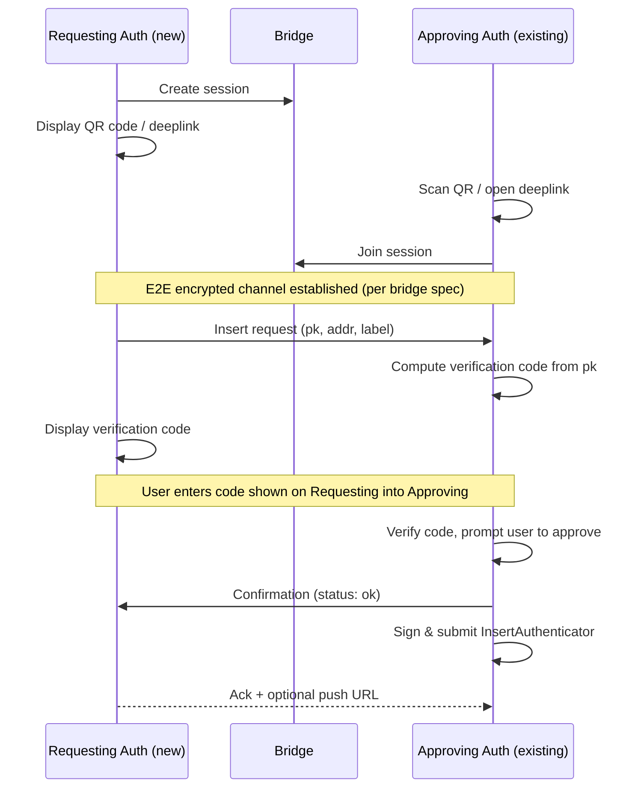

## Abstract

This spec defines a standard protocol for World ID authenticators to communicate with each other through a generic relay bridge. The primary use case is enabling a new authenticator to request insertion into an existing World ID account by pairing with an already registered authenticator. Communication is established through a deeplink or QR code, relayed through an untrusted bridge service (end-to-end encrypted) and a verified with a user-provided pairing code.

## Motivation

World ID 4.0 introduces the ability to register multiple authenticators for a single World ID. Adding a new authenticator requires an existing authenticator to sign an [`InsertAuthenticator`](https://docs.rs/world-id-primitives/latest/world_id_primitives/api_types/struct.InsertAuthenticatorRequest.html) transaction.

This creates a bootstrapping problem: the new authenticator needs to securely transmit its public keys to an existing authenticator, which may be on a different device or platform entirely. Without a standard protocol:

1. **Interoperability breaks.** Each authenticator provider would need to define its own pairing mechanism. A user with Authenticator A could not add Authenticator B from a different provider without both providers agreeing on a proprietary protocol.
2. **Cross-device pairing has no path.** The most common scenario, adding a web authenticator on a laptop from a mobile authenticator, requires communication between two devices that may not share a local network.
3. **Security is inconsistent.** Without a defined verification mechanism, implementations may skip user confirmation, exposing users to man-in-the-middle attacks during pairing.

This spec defines a protocol that any conforming authenticator can use to pair with any other, regardless of provider, platform, or device.

## Specification

The key words "MUST", "MUST NOT", "REQUIRED", "SHALL", "SHALL NOT", "SHOULD", "SHOULD NOT", "RECOMMENDED", "MAY", and "OPTIONAL" in this document are to be interpreted as described in [RFC 2119](https://www.ietf.org/rfc/rfc2119.txt).

The terms [Authenticator](https://docs.rs/world-id-core/latest/world_id_core/struct.Authenticator.html) and [AuthenticatorPublicKeySet](https://docs.rs/world-id-primitives/latest/world_id_primitives/authenticator/struct.AuthenticatorPublicKeySet.html) are as defined in the World ID Protocol.

### Definitions

- **Requesting Authenticator**: A new authenticator that wants to be added to an existing World ID account.
- **Approving Authenticator**: An existing, registered authenticator that authorizes the addition.
- **Bridge**: An untrusted relay service that forwards encrypted messages between two authenticators without being able to read them. The reference implementation is the [wallet-bridge](https://github.com/worldcoin/wallet-bridge).

### Protocol Overview



The protocol has three phases:

1. **Connection.** The Requesting Authenticator creates a bridge session and displays a connection URI as a QR code or deeplink. The Approving Authenticator opens this URI and joins the session. The bridge handles key exchange and establishes an E2E encrypted channel per its own specification.
2. **Request & Verification.** The Requesting Authenticator sends its public keys through the encrypted channel. The user verifies the pairing by entering a code displayed on the Requesting Authenticator into the Approving Authenticator.
3. **Confirmation.** The Approving Authenticator acknowledges the request and may proceed with the on-chain `InsertAuthenticator` transaction.

### Connection URI

The Requesting Authenticator initiates a session by generating and displaying a connection URI:

```
worldid://bridge/v1/e?i={session_id}&pk={bridge_pk}&b={bridge_url}
```

| Parameter | Required | Description |
|-----------|----------|-------------|
| `i` | REQUIRED | Unique session identifier, generated from a CSPRNG. Minimum 16 bytes, hex-encoded. |
| `pk` | REQUIRED | The Requesting Authenticator's ephemeral public key for the bridge session, hex-encoded. Used by the bridge to establish an encrypted channel. See [wallet-bridge](https://github.com/worldcoin/wallet-bridge) specification for key exchange details. |
| `b` | OPTIONAL | The bridge service base URL. If omitted, implementations MUST use a default bridge URL defined in their configuration. |

This URI MUST be presentable as a QR code for cross-device pairing or as a clickable deeplink for same-device scenarios. The `worldid://` URI scheme MUST be registered by authenticator implementations that support acting as an Approving Authenticator.

### Bridge Session

Authenticators establish an E2E encrypted session through the bridge using the connection URI parameters. The bridge specification defines key exchange, encryption, and message framing. This spec only defines the application-level messages exchanged over that encrypted channel.

The bridge MUST NOT be assumed to be trusted. All security properties relevant to this spec (confidentiality of public keys, integrity of messages) come from the E2E encryption provided by the bridge protocol.

### Message Types

Messages sent through the encrypted bridge channel are encoded as URIs. Future specs MAY define additional message types under the `worldid://auth/v1/` namespace.

#### Insert Request

After the encrypted channel is established, the Requesting Authenticator sends:

```
worldid://auth/v1/insert?pk={offchain_pk}&addr={onchain_addr}&label={label}
```

| Parameter | Required | Description |
|-----------|----------|-------------|
| `pk` | REQUIRED | The Requesting Authenticator's EdDSA public key on the BabyJubJub curve, compressed and hex-encoded (32 bytes). This key will be added to the account's [`AuthenticatorPublicKeySet`](https://docs.rs/world-id-primitives/latest/world_id_primitives/authenticator/struct.AuthenticatorPublicKeySet.html). |
| `addr` | OPTIONAL | The Requesting Authenticator's on-chain Ethereum address, checksummed per [ERC-55](https://eips.ethereum.org/EIPS/eip-55). Required for the on-chain `InsertAuthenticator` transaction. If omitted, it MUST be provided in a subsequent message before insertion can proceed. |
| `label` | OPTIONAL | A human-readable label for the new authenticator (e.g., `"Chrome on MacBook"`, `"Codex Agent"`). MUST NOT exceed 64 UTF-8 bytes. |

The Approving Authenticator MUST reject the insert request if the account's `AuthenticatorPublicKeySet` already contains `MAX_AUTHENTICATOR_KEYS` as defined in the `WorldIDRegistry`.

### Verification Code

To prevent man-in-the-middle attacks on the bridge relay and confirm user intent, a verification code MUST be presented before the Approving Authenticator proceeds.

The verification code is derived deterministically from the Requesting Authenticator's EdDSA public key:

1. Let `pk_bytes` be the compressed EdDSA public key (32 bytes, as transmitted in the `pk` parameter of the insert request).
2. Compute `h = SHA-256(0x105 || pk_bytes)`, where `0x105` is a domain separator representing this spec.
3. Interpret the first 4 bytes of `h` as a big-endian `uint32`.
4. Compute `code = uint32 mod 1_000_000`.
5. Format as a zero-padded 6-digit string (e.g., `"042817"`).

**Requesting Authenticator.** MUST compute the verification code from its own EdDSA public key and display it prominently to the user with instructions to enter it on the Approving Authenticator.

**Approving Authenticator.** MUST:
1. Display the new authenticator's details (including `label` if provided, and a truncated fingerprint of the `pk`).
2. Prompt the user to enter the 6-digit verification code shown on the Requesting Authenticator.
3. Verify the entered code matches the code computed from the received `pk`.
4. Only proceed if the code is correct **and** the user explicitly approves the insertion.

A failed verification code entry SHOULD allow the user to retry. After 3 consecutive failures, the Approving Authenticator SHOULD terminate the session.

### Confirmation

After successful verification, the Approving Authenticator sends through the bridge:

```
worldid://auth/v1/status?result={result}
```

| Value | Description |
|-------|-------------|
| `ok` | The Approving Authenticator will proceed with the on-chain insertion. |
| `rejected` | The user denied the request. |
| `error` | A technical error prevented processing (e.g., account already has 7 authenticators). |

On receiving `result=ok`, the Requesting Authenticator MAY respond with an acknowledgment:

```
worldid://auth/v1/ack?push={push_url}
```

| Parameter | Required | Description |
|-----------|----------|-------------|
| `push` | OPTIONAL | An HTTPS URL that accepts POST requests for future notifications, e.g. when the on-chain transaction is confirmed. |

The push URL, if provided, MUST use HTTPS. The Approving Authenticator MAY use it to notify the Requesting Authenticator of the transaction status.

### Session Lifecycle

1. Either party MAY close the bridge connection at any time. Closing before confirmation is sent MUST be treated as an implicit rejection by the receiving party.
2. Bridge sessions SHOULD expire after a maximum of 5 minutes. Implementations MUST NOT keep idle sessions open indefinitely.

## Rationale

**Relay bridge over direct peer-to-peer.** The primary use case for this spec is cross-device pairing, where authenticators are often on different networks (e.g. mobile data vs. corporate WiFi). A relay avoids NAT traversal complexity and works regardless of network topology. The bridge is untrusted so privacy is maintained even if the bridge is compromised.

**QR codes and deeplinks.** The `worldid://` URI scheme integrates with OS-level app registration on mobile (Universal Links, App Links) and desktop. QR codes naturally encode URIs and are the established mechanism for cross-device pairing in protocols like WalletConnect and passkey registration. Deeplinks cover same-device scenarios.

**User-entered verification code.** A 6-digit numeric code provides ~20 bits of entropy, which is sufficient for interactive verification where an attacker only gets a single real-time attempt. Code entry rather than visual comparison requires deliberate action on the Approving Authenticator, reducing the chance of accidental approvals. The domain separator in the hash prevents cross-protocol collisions if the same key is used elsewhere.

**URI-encoded bridge messages.** Messages use the `worldid://` URI scheme for consistency with the connection deeplink. URIs are human-readable, which helps with debugging, and extensible through new query parameters without breaking existing parsers. The `worldid://auth/v1/` namespace allows future message types (e.g. authenticator removal or credential exchange) to be added.

## Security

> [!WARNING]  
> This section is in active development.

## Backwards Compatibility

> [!WARNING]  
> This section is in active development.
