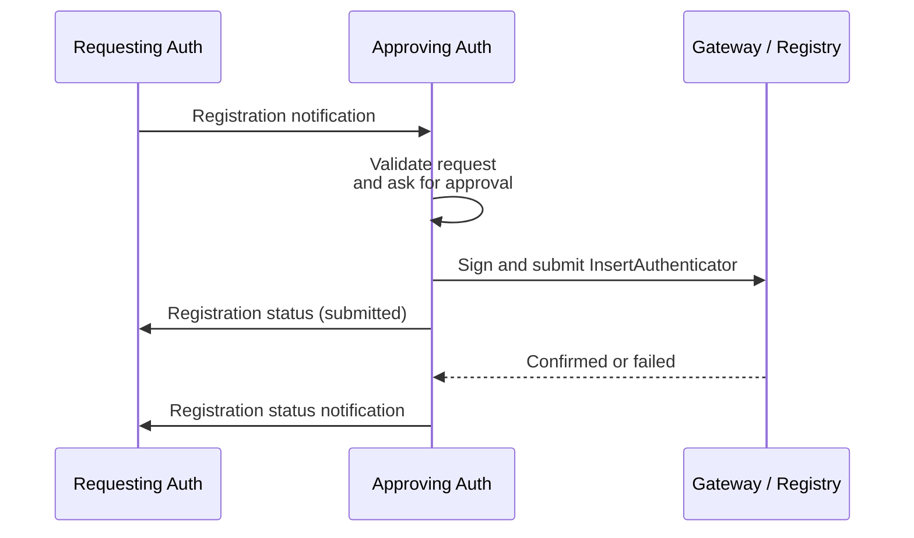

## Abstract

This spec defines how an existing Admin Authenticator approves and registers a new World ID authenticator using [WIP-105](wip-105.md) JSON-RPC messages.

## Motivation

World ID 4.0 supports multiple authenticators for a single World ID. Adding an authenticator requires an existing Admin Authenticator to authorize an [`InsertAuthenticator`](https://docs.rs/world-id-primitives/latest/world_id_primitives/api_types/struct.InsertAuthenticatorRequest.html) operation.

The authenticators need a secure exchange for the new keys and explicit user approval before the Admin Authenticator authorizes the account change.

## Specification

The key words "MUST", "MUST NOT", "REQUIRED", "SHALL", "SHALL NOT", "SHOULD", "SHOULD NOT", "RECOMMENDED", "MAY", and "OPTIONAL" in this document are to be interpreted as described in [RFC 2119](https://www.ietf.org/rfc/rfc2119.txt).

Authenticator roles and keys follow [WIP-104](wip-104.md). The **Requesting Authenticator** is the new authenticator; the **Approving Authenticator** is an existing Admin Authenticator.

Messages MUST conform to [WIP-105](wip-105.md). The transport MUST provide confidential, integrity-protected delivery, and its pairing mechanism MUST establish communication between the intended authenticators. [WIP-110](wip-110.md) defines one such transport over wallet-bridge.

### Overview



### Messages

Both message types are JSON-RPC notifications: they MUST omit `id` and MUST NOT receive JSON-RPC responses. Status updates are separate notifications correlated by `registration_id`.

#### Registration

The Requesting Authenticator sends a `worldid.auth.v1.register` notification with these `params`:

| Member | Required | Description |
| -------- | ---------- | ------------- |
| `registration_id` | REQUIRED | Identifier for the registration, encoded as 32 lowercase hexadecimal characters containing 16 bytes generated by a CSPRNG. |
| `new_authenticator_pubkey` | REQUIRED | The EdDSA public key on BabyJubJub in its 32-byte compressed representation, encoded as 64 lowercase hexadecimal characters. |
| `new_authenticator_address` | OPTIONAL | An Ethereum address checksummed per [ERC-55](https://eips.ethereum.org/EIPS/eip-55). When present, the authenticator is registered as an Admin Authenticator. When omitted, it is registered as a Proving Authenticator. It MUST NOT be the zero address. |

For example, a Proving Authenticator can request registration with:

```json
{
  "jsonrpc": "2.0",
  "method": "worldid.auth.v1.register",
  "params": {
    "registration_id": "7ecb8475e581443ca67a0868ce3638d1",
    "new_authenticator_pubkey": "119ab03fe2d9c74efba936a46c3afda3470f0a9366d330226af515e329203a91"
  }
}
```

#### Registration Status

The Approving Authenticator sends `worldid.auth.v1.register.status` notifications with these `params`:

| Member | Required | Description |
| -------- | ---------- | ------------- |
| `registration_id` | REQUIRED | The `registration_id` from the registration notification. |
| `status` | REQUIRED | One of `submitted`, `rejected`, `failed`, `unknown` or `confirmed`. |
| `operation_id` | CONDITIONAL | String identifier returned by the gateway or submission service. REQUIRED for `submitted`; included in other statuses when known. May be omitted for `confirmed` when the authenticator is already registered. |
| `error_code` | CONDITIONAL | String from the error table below. REQUIRED for `rejected` and `failed`; MUST be omitted otherwise. |

After explicit approval, the Approving Authenticator signs and submits `InsertAuthenticator`. It MUST send `submitted` when submission succeeds, `rejected` when the user declines, `failed` on a definite validation or operation failure, or `unknown` when submission acceptance cannot be determined. After submission, it SHOULD send `confirmed` or `failed` when the operation reaches a terminal state.

`rejected`, `failed` and `confirmed` are terminal statuses.

For example:

```json
{
  "jsonrpc": "2.0",
  "method": "worldid.auth.v1.register.status",
  "params": {
    "registration_id": "7ecb8475e581443ca67a0868ce3638d1",
    "operation_id": "01JY9M6QZ1P3C4V5B6N7K8H9TR",
    "status": "submitted"
  }
}
```

The following application-level error codes are carried in notification `params`, not JSON-RPC error responses:

| `error_code` | `status` | Meaning |
| -------- | ---------- | ------------- |
| `invalid_params` | `failed` | A required parameter is missing or a field has an invalid encoding or value, including an invalid signing public key or management address. |
| `user_rejected` | `rejected` | The user declined registration. |
| `not_authorized` | `failed` | The Approving Authenticator is not authorized to manage the selected account. |
| `authenticator_conflict` | `failed` | The signing public key or management address is already registered, but not as the requested authenticator with the requested management capability. |
| `account_full` | `failed` | The account has no available authenticator slot. |
| `operation_failed` | `failed` | Submission was definitively rejected or the submitted operation failed. An uncertain outcome MUST use `unknown` instead. |

If a registration notification has no valid `registration_id`, the Approving Authenticator MUST discard it without sending a status notification. Invalid status notifications MUST be ignored, not answered with another status notification.

For example, user rejection is reported as:

```json
{
  "jsonrpc": "2.0",
  "method": "worldid.auth.v1.register.status",
  "params": {
    "registration_id": "7ecb8475e581443ca67a0868ce3638d1",
    "status": "rejected",
    "error_code": "user_rejected"
  }
}
```

The Requesting Authenticator MUST match `registration_id` to a registration it initiated over the same secure exchange and ignore unmatched notifications. It MUST record the first reported `operation_id` and ignore updates containing a different operation identifier. It MUST treat itself as registered only after receiving `confirmed` or independently verifying the new key in current account state.

### Registration Flow

#### Validation

Before asking for approval, the Approving Authenticator MUST:

1. Validate the WIP-105 JSON-RPC notification and its `params`.
2. Check for an existing `registration_id`. For an identical retry, resend the latest recorded status if available without restarting approval or submission. Ignore reuse with different registration parameters.
3. Decode and validate the compressed signing public key.
4. When `new_authenticator_address` is present, verify that it is a valid non-zero ERC-55 address.
5. Verify that it is an Admin Authenticator authorized to manage the selected account.
6. Check current account state. If the signing public key is already registered with the requested management address, or as a Proving Authenticator when no address is supplied, send `confirmed` without submitting another operation. No new approval is required because account state does not change. If either key is already registered but the requested configuration does not match, send `failed` with `authenticator_conflict`.
7. Otherwise, verify that the account has an available authenticator slot before proceeding to user approval.

The Approving Authenticator MUST derive `leaf_index`, `pubkey_id`, account commitments and registry nonce from current account and registry state immediately before signing, not from requester-supplied values.

#### User Approval

Before signing a new registration, the Approving Authenticator MUST:

1. Display which World ID account will be modified and whether the new authenticator will receive proving-only or management access.
2. When `new_authenticator_address` is present, explain that the new authenticator will be able to manage the user's World ID.
3. Ask the user to explicitly approve the registration.

#### Disconnection and Retries

1. Either authenticator MAY terminate the exchange at any time. A missing terminal status or an explicit `unknown` status means an unknown outcome, not failure. The Requesting Authenticator MUST query authoritative account state before retrying an unknown outcome.
2. The Approving Authenticator MUST persist enough state to avoid signing the same `registration_id` more than once while the submitted operation may still be pending.
3. Retrying transport delivery MUST preserve the notification unchanged. Retrying the application protocol after a terminal rejection or failure MUST use a new `registration_id`.
4. The Approving Authenticator MUST NOT send conflicting terminal statuses for a registration. The Requesting Authenticator MUST accept identical duplicate notifications and ignore non-terminal updates received after a terminal status.

## Security

This protocol relies on the transport and its pairing mechanism to prevent peer and message substitution. Pairing information, such as a QR code or deeplink, MUST be exchanged through a trusted path between the intended authenticators. Encryption alone does not protect against substituted pairing information. User approval authorizes the account change; it does not independently authenticate the peer.
