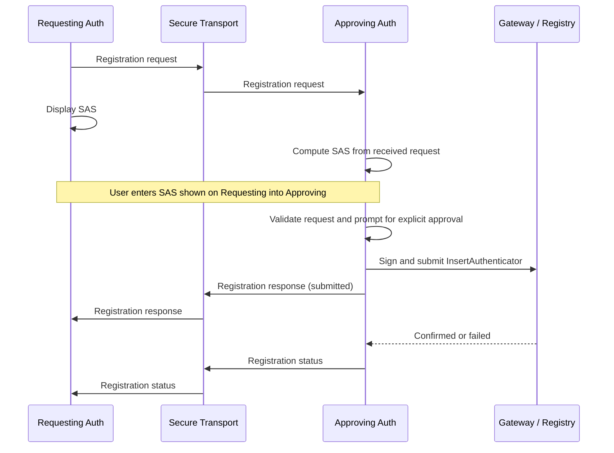

## Abstract

This spec defines a [WIP-105](wip-105.md) protocol for authenticators to securely confirm and authorize the registration of a new authenticator from an existing  [WIP-104](wip-104.md) Admin Authenticator.

## Motivation

World ID 4.0 supports multiple authenticators for a single World ID. Adding an authenticator requires an existing Admin Authenticator to authorize an [`InsertAuthenticator`](https://docs.rs/world-id-primitives/latest/world_id_primitives/api_types/struct.InsertAuthenticatorRequest.html) operation.

This creates a bootstrapping problem. The new authenticator must securely provide `new_authenticator_pubkey` and may include `new_authenticator_address` when it needs management capabilities. The existing authenticator must confirm that the request belongs to the device the user intends to add before signing an account management operation.

## Specification

The key words "MUST", "MUST NOT", "REQUIRED", "SHALL", "SHALL NOT", "SHOULD", "SHOULD NOT", "RECOMMENDED", "MAY", and "OPTIONAL" in this document are to be interpreted as described in [RFC 2119](https://www.ietf.org/rfc/rfc2119.txt).

The terms **Signing Key**, **Management Key**, **Proving Authenticator**, **Admin Authenticator** and **Management Operation** are defined in [WIP-104](wip-104.md).

### Definitions

- **Requesting Authenticator**: The new authenticator that wants to be added to a World ID account.
- **Approving Authenticator**: An existing Admin Authenticator that can authorize the registration.
- **Registration Statement**: The fixed-width byte string derived from the security-critical fields of an `auth.v1.register` message.
- **Short Authentication String (SAS)**: A six-digit code derived from the Registration Statement and compared across the two authenticators.

### Protocol Overview



The protocol has four phases:

1. **Request.** The Requesting Authenticator sends `new_authenticator_pubkey` and an optional `new_authenticator_address`.
2. **Confirmation.** The user transfers a SAS from the Requesting Authenticator to the Approving Authenticator. The Approving Authenticator verifies the SAS and asks the user to approve the displayed registration details.
3. **Submission.** The Approving Authenticator constructs, signs and submits the `InsertAuthenticator` operation, then reports that submission.
4. **Completion.** The Approving Authenticator reports whether the registration was confirmed or failed.

The secure transport MUST provide confidential and integrity-protected delivery with reply correlation. [WISP-101](../WISPs/wisp-101.md) defines one conforming transport over wallet-bridge.

### Registration Request

The Requesting Authenticator sends a WIP-105 message with `type` set to `auth.v1.register`.

The payload has the following members:

| Member | Required | Description |
|--------|----------|-------------|
| `registration_id` | REQUIRED | Identifier for the registration, encoded as 32 lowercase hexadecimal characters containing 16 bytes generated by a CSPRNG. |
| `new_authenticator_pubkey` | REQUIRED | The EdDSA public key on BabyJubJub in its 32-byte compressed representation, encoded as 64 lowercase hexadecimal characters. |
| `new_authenticator_address` | OPTIONAL | An Ethereum address checksummed per [ERC-55](https://eips.ethereum.org/EIPS/eip-55). When present, the authenticator is registered as an Admin Authenticator. When omitted, it is registered as a Proving Authenticator. It MUST NOT be the zero address. |

For example, a Proving Authenticator can request registration with:

```json
{
  "version": 1,
  "id": "7a1c2e77-46d8-4d14-b852-ca3f4bb28eb2",
  "type": "auth.v1.register",
  "payload": {
    "registration_id": "7ecb8475e581443ca67a0868ce3638d1",
    "new_authenticator_pubkey": "119ab03fe2d9c74efba936a46c3afda3470f0a9366d330226af515e329203a91"
  }
}
```

### Short Authentication String

Both authenticators construct the Registration Statement as:

```text
registration_statement =
    UTF8("WIP-109/auth.v1.register/SAS/v1")
    || 0x00
    || HEX_DECODE(registration_id)
    || HEX_DECODE(new_authenticator_pubkey)
    || new_authenticator_address_bytes
```

The fields are encoded as follows:

1. `registration_id` MUST decode to exactly 16 bytes.
2. `new_authenticator_pubkey` MUST decode to exactly 32 bytes.
3. `new_authenticator_address_bytes` is the 20-byte address when `new_authenticator_address` is present. When `new_authenticator_address` is omitted, `new_authenticator_address_bytes` is 20 zero bytes.

Both authenticators derive the SAS from the Registration Statement:

1. Compute `h = SHA-256(registration_statement)`.
2. Interpret the first eight bytes of `h` as a big-endian `uint64` named `n`.
3. Compute `code = n mod 1_000_000`.
4. Format `code` as a zero-padded six-digit string.

The Requesting Authenticator MUST display the SAS prominently with instructions to enter it on the Approving Authenticator. It MUST NOT send the SAS to the Approving Authenticator.

The Approving Authenticator MUST:

1. Compute the SAS from the received Registration Statement.
2. Display a fingerprint of `new_authenticator_pubkey`. When `new_authenticator_address` is present, it MUST also display the address and state that the new authenticator will receive management capabilities.
3. Prompt the user to enter the SAS shown by the Requesting Authenticator.
4. Compare the entered value with the computed SAS using an exact six-digit comparison.
5. Ask the user to explicitly approve the registration after the SAS matches.

The Approving Authenticator MUST NOT reveal its computed SAS before the user enters a value. A failed entry MAY be retried. After three consecutive failures, the Approving Authenticator MUST reject the registration and terminate the exchange.

### Request Validation

Before asking for approval, the Approving Authenticator MUST:

1. Validate the WIP-105 envelope and the registration payload.
2. Verify that `registration_id` has not already been processed.
3. Decode and validate the compressed signing public key.
4. When `new_authenticator_address` is present, verify that it is a valid non-zero ERC-55 address.
5. Verify that `new_authenticator_pubkey` and `new_authenticator_address`, when present, are not already registered to the account.
6. Verify that the account has an available authenticator slot.
7. Verify that it is an Admin Authenticator authorized to perform the management operation.

The Requesting Authenticator does not choose `leaf_index`, `pubkey_id`, account commitments or registry nonce. The Approving Authenticator MUST derive these values from current account and registry state immediately before signing. This prevents stale or requester-controlled registry state from being authorized.

### Registration Response

After the user rejects the request or the Approving Authenticator attempts submission, it sends a WIP-105 message with `type` set to `auth.v1.register.response`. It MUST set `in_reply_to` to the registration request message `id`.

The payload has the following members:

| Member | Required | Description |
|--------|----------|-------------|
| `registration_id` | REQUIRED | The `registration_id` from the request. |
| `result` | REQUIRED | One of `submitted`, `rejected` or `failed`. |
| `operation_id` | CONDITIONAL | Identifier returned by the gateway or submission service. REQUIRED for `submitted` and MUST be omitted otherwise. |
| `error_code` | CONDITIONAL | Stable, non-sensitive error code. REQUIRED for `failed` and MUST be omitted otherwise. |

`submitted` means the Approving Authenticator signed and submitted the operation. It MUST NOT be interpreted as confirmed registration. `rejected` means the user denied the request or the SAS failed three times. `failed` means validation or submission failed.

Error codes MUST NOT contain private account data, raw transport errors or other implementation details. A human-readable error MAY be shown locally but MUST NOT be required for protocol behavior.

### Registration Status

After a submitted operation reaches a terminal state, the Approving Authenticator SHOULD send a WIP-105 message with `type` set to `auth.v1.register.status`. It MUST set `in_reply_to` to the registration response message `id`.

The payload has the following members:

| Member | Required | Description |
|--------|----------|-------------|
| `registration_id` | REQUIRED | The `registration_id` from the request. |
| `result` | REQUIRED | Either `confirmed` or `failed`. |
| `operation_id` | REQUIRED | The operation identifier reported in the registration response. |
| `error_code` | CONDITIONAL | Stable, non-sensitive error code. REQUIRED for `failed` and MUST be omitted for `confirmed`. |

The Requesting Authenticator MUST treat itself as registered only after receiving `confirmed` or independently verifying the new key in current account state. A missing status is an unknown outcome, not a failure. The Requesting Authenticator SHOULD query authoritative account state before retrying a registration with the same key.

### Session Lifecycle

1. Either authenticator MAY terminate the exchange at any time. If the Requesting Authenticator does not receive a response, it MUST treat the registration outcome as unknown and query authoritative account state before retrying.
2. The Approving Authenticator MUST persist enough state to avoid signing the same `registration_id` more than once while the submitted operation may still be pending.
3. Retrying transport delivery MUST reuse the same WIP-105 message `id`. Retrying the application protocol after a terminal failure MUST use a new message `id` and a new `registration_id`.
4. Private key material, the SAS and account recovery material MUST NOT be included in any protocol message.

## Rationale

**An Admin Authenticator approves registration.** A Proving Authenticator has no management key and cannot authorize changes to the World ID Registry. Requiring an existing Admin Authenticator follows WIP-104 and the registry authorization model.

**The address determines management capability.** Omitting `new_authenticator_address` registers a Proving Authenticator. Including a non-zero `new_authenticator_address` registers an Admin Authenticator. This avoids a separate class field that could contradict the address.

**The SAS covers the registration data.** The fixed-width Registration Statement binds the registration identifier, `new_authenticator_pubkey` and optional `new_authenticator_address` without depending on JSON serialization. Using the zero address for an omitted `new_authenticator_address` keeps the encoding fixed-width and unambiguous because an explicit zero address is invalid.

**The requester does not supply registry state.** Slot selection, commitments and nonces can change while the user is pairing devices. The approving side has the account authority and obtains current state immediately before signing.

**Submission and confirmation are separate.** A gateway accepting an operation does not prove that the registry state changed. Separate response and status messages prevent the new authenticator from treating an in-flight operation as final.

## Security

The six-digit SAS provides approximately 20 bits of interactive authentication. It is suitable only when attempts are rate-limited and the user transfers the value directly between the intended authenticators. It is not a substitute for a confidential and integrity-protected transport.

When `new_authenticator_address` is present, the Approving Authenticator MUST clearly explain that the new authenticator will receive management authority over the user's World ID.

A compromised Requesting Authenticator can request registration of keys controlled by an attacker. The user confirmation establishes that the request displayed on the Requesting Authenticator is the request received by the Approving Authenticator. It does not establish that the Requesting Authenticator itself is trustworthy.

## Backwards Compatibility

This proposal defines a new application protocol. It replaces the registration procedure contained in the previous WIP-105 draft. Any prototype using that procedure must migrate to the WIP-109 message types.
