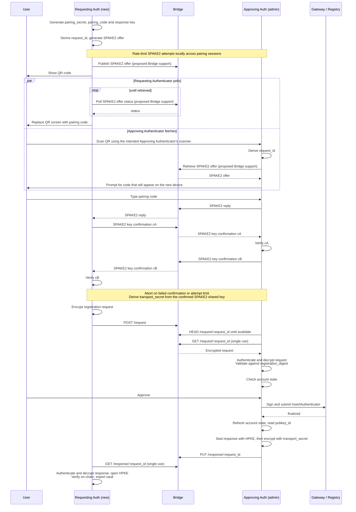

## 1. Abstract

This spec builds upon [WIP-105][wip-105] and describes a process by which a new authenticator can be added to a World ID using an existing Admin Authenticator communicating over the message-bridge (WIP-110).

It defines the pairing URI, a separately entered pairing code, a SPAKE2 handshake, the message-bridge semantics and the specific [WIP-105][wip-105] JSON-RPC messages. On success the **Approving Authenticator** returns the registration info and the credential vault in a single response, leaving the new authenticator ready to generate proofs.

The pairing endpoints in §3.5.1 are proposed bridge support, not existing functionality. Implementing this profile requires that support before authenticators can deploy it; the registration request and response continue to use the existing bridge endpoints.

## 2. Motivation

World ID 4.0 supports multiple authenticators per World ID. Users increasingly hold more than one (e.g. a personal and an enterprise device, or a web authenticator next to a mobile one). Adding an authenticator requires an existing Admin Authenticator (as defined in [WIP-104][wip-104]) to authorize an `InsertAuthenticator` operation on the `WorldIDRegistry`, and the new authenticator needs the account's `leaf_index` and its credentials to be useful.

This requires:

1. An interoperable, end-to-end encrypted way for two authenticators (possibly on different devices, networks and providers) to exchange data.
2. Explicit, informed user approval on the **Approving Authenticator**.
3. Out-of-band authentication through a code the user types into the intended **Approving Authenticator**, so possession of the Pairing URI alone does not authorize a response.

## 3. Specification

The key words "MUST", "MUST NOT", "REQUIRED", "SHALL", "SHALL NOT", "SHOULD", "SHOULD NOT", "RECOMMENDED", "MAY", and "OPTIONAL" in this document are to be interpreted as described in [RFC 2119](https://www.ietf.org/rfc/rfc2119.txt).

Authenticator roles and keys follow [WIP-104][wip-104]. Registration messages MUST conform to [WIP-105][wip-105]; the preceding pairing handshake uses the records in §3.5.1.

### 3.1 Terminology

The following terms apply only to this spec.

- **Requesting Authenticator**: The new authenticator to be registered.
- **Approving Authenticator**: An existing Admin Authenticator of the user's World ID, registered in the `WorldIDRegistry`.
- **Bridge**: A [message-bridge](https://github.com/worldcoin/message-bridge) deployment (as defined in WIP-110). Untrusted: it sees the public handshake, identifiers, sizes, timing and IP addresses, and may replace, replay, drop or delay messages. Clients authenticate the handshake and encrypted registration messages themselves.
- **Pairing Secret**: 32 random bytes generated by the **Requesting Authenticator** per registration attempt, transferred to the **Approving Authenticator** in the Pairing URI.
- **Pairing Code**: An independent random code generated by the **Requesting Authenticator** per attempt and revealed after the bridge reports `retrieved`. The user manually enters it into the intended **Approving Authenticator**.

### 3.2 Overview

This section shows a non-normative diagram flow of the registration process.


```mermaid
sequenceDiagram
    participant u as User
    participant r as Requesting Auth (new)
    participant b as Bridge
    participant a as Approving Auth (admin)
    participant g as Gateway / Registry

    r->>r: Generate pairing_secret, pairing_code and response key
    r->>r: Derive request_id, generate SPAKE2 offer
    Note over r,a: Rate-limit SPAKE2 attempts locally across pairing sessions
    r->>b: Publish SPAKE2 offer (proposed Bridge support)
    r->>u: Show QR code
    par Requesting Authenticator polls
        loop until retrieved
            r->>b: Poll SPAKE2 offer status (proposed Bridge support)
            b-->>r: status
        end
        r->>u: Replace QR screen with pairing code
    and Approving Authenticator fetches
        u->>a: Scan QR using the intended Approving Authenticator's scanner
        a->>a: Derive request_id
        a->>b: Retrieve SPAKE2 offer (proposed Bridge support)
        b-->>a: SPAKE2 offer
        a->>u: Prompt for code that will appear on the new device
    end
    u->>a: Type pairing code
    a->>b: SPAKE2 reply
    b-->>r: SPAKE2 reply
    r->>b: SPAKE2 key confirmation cA
    b-->>a: SPAKE2 key confirmation cA
    a->>a: Verify cA
    a->>b: SPAKE2 key confirmation cB
    b-->>r: SPAKE2 key confirmation cB
    r->>r: Verify cB
    Note over r,a: Abort on failed confirmation or attempt limit<br/>Derive transport_secret from the confirmed SPAKE2 shared key
    r->>r: Encrypt registration request
    r->>b: POST /request
    a->>b: HEAD /request/:request_id until available
    a->>b: GET /request/:request_id (single use)
    b-->>a: Encrypted request
    a->>a: Authenticate and decrypt request<br/>Validate against registration_digest
    a->>a: Check account state
    u->>a: Approve
    a->>g: Sign and submit InsertAuthenticator
    g-->>a: finalized
    a->>a: Refresh account state, read pubkey_id
    a->>a: Seal response with HPKE, then encrypt with transport_secret
    a->>b: PUT /response/:request_id
    r->>b: GET /response/:request_id (single use)
    r->>r: Authenticate and decrypt response, open HPKE<br/>Verify on-chain, import vault
```

### 3.3 Pairing Secret, Pairing Code and SPAKE2

For each registration attempt the **Requesting Authenticator** MUST independently generate a fresh 32-byte `pairing_secret` and a fresh `pairing_code` using a CSPRNG. The code MUST be sampled uniformly from the six-letter strings over the ASCII alphabet `A` through `Z`; it MUST NOT be user-chosen or derived from the Pairing URI or any value sent over the bridge.

The code's canonical encoding is exactly six uppercase ASCII letters, for example `QJTWPK`. Input MUST be normalized by removing ASCII spaces and hyphens and mapping ASCII `a` through `z` to `A` through `Z`. Implementations MUST reject any remaining characters outside `A` through `Z` or a length other than six before deriving keys; Unicode case folding MUST NOT be used.

`HKDF-SHA256` below is extract-and-expand ([RFC 5869](https://www.rfc-editor.org/rfc/rfc5869)); labels are ASCII, `||` denotes byte concatenation, and output lengths are in bytes. Derive the session identifier without the code:

```text
request_id_bytes = HKDF-SHA256(ikm = pairing_secret, salt = empty,
    info = "WORLD-ID/WIP-109/SPAKE2-V1/REQUESTID", L = 32)
request_id = lowercase_hex(request_id_bytes)
```

`request_id` is a 64-character lowercase hex string. It addresses both the proposed pairing records and the later registration exchange; the two sets of records MUST be separate. No registration ciphertext exists before the handshake succeeds.

The **Requesting Authenticator** MUST reveal the code only after the bridge reports the pairing offer as `retrieved`, replacing the QR screen with the pairing code and instructions to type it only into the intended **Approving Authenticator**. The `retrieved` status is a display trigger, not evidence that the intended authenticator fetched the offer or that pairing is authenticated. The code, password scalar, ephemeral private scalars and derived keys MUST NOT appear in the Pairing URI, bridge messages, logs or analytics. Code entry MUST NOT replace explicit consent (§3.7.3). A new pairing MUST use a fresh secret, code, SPAKE2 ephemeral and response keypair, even when retrying registration of the same authenticator keys.

#### 3.3.1 Registration Digest

The **Requesting Authenticator** commits to the registration parameters in the Pairing URI, so the **Approving Authenticator** can detect any substituted request. The digest is computed over the parsed values in a fixed binary layout:

```text
registration_digest = SHA-256(
    "WORLD-ID/WIP-109/REGISTER"     // ASCII
 || request_id                      // 32 bytes (the raw HKDF output)
 || new_authenticator_pubkey        // 32 bytes, WIP-100 §4 wire encoding
 || new_authenticator_address       // 20 bytes; all zeros for a Proving Authenticator
 || response_pubkey                 // 1216 bytes, X-Wing encapsulation key
)
```

All fields MUST be fixed-width, so the encoding is unambiguous. Every member of `params` except `name` and `registration_sig` is covered. `name` is an advisory label and is not authenticated. A future version that adds a parameter MUST add it to the digest under a new label. SHA-256 is used instead of the [WIP-100][wip-100] default (Poseidon2) because this is a byte-oriented commitment that is never used in a circuit.

#### 3.3.2 Registration Signature

The **Requesting Authenticator** proves it holds the signing key it asks to register by signing the digest with it. EdDSA ([WIP-100][wip-100] §3.5) signs field elements, so the digest is first lowered to one:

```text
d_hi, d_lo       = registration_digest[0..16], registration_digest[16..32]    // big-endian integers
m                = H_3(ds("WORLD-ID/WIP-109/REGSIG"); d_hi, d_lo)             // WIP-100 §3.3.2
registration_sig = EdDSA-Sign(signing_key, m)                                 // 64 bytes, WIP-100 §3.5.2
```

This also stops a malicious requester from claiming an already-registered key to obtain the vault through the already-registered case (§3.7.2 step 3).

#### 3.3.3 SPAKE2 profile and key confirmation

The profile identifier is `spake2-v1`. Implementations MUST use [RFC 9382](https://www.rfc-editor.org/rfc/rfc9382.html), with the `SPAKE2-P256-SHA512-HKDF-HMAC` suite: P-256, SHA-512, HKDF-SHA512 and HMAC-SHA512. Use the distinct P-256 `M` and `N` constants in RFC 9382 §6, without substituting SPAKE2+, a symmetric `M = N` variant, or library-specific defaults. All profile parameters are fixed; there is no algorithm negotiation or fallback.

The **Requesting Authenticator** is party A, with identity `ASCII("WORLD-ID/WIP-109/REQUESTING")`; the **Approving Authenticator** is party B, with identity `ASCII("WORLD-ID/WIP-109/APPROVING")`. These are protocol roles, not assertions about an account's identity. Encode curve points as 65-byte uncompressed SEC1 values, including the `0x04` prefix, and scalars as 32-byte big-endian integers. Let `q` be the P-256 subgroup order:

```text
w = OS2IP(SHA-512("WORLD-ID/WIP-109/SPAKE2-V1/PASSWORD"
    || pairing_secret || ASCII(pairing_code))) mod q
context = ASCII("WORLD-ID/WIP-109/SPAKE2-V1") || request_id_bytes
    || registration_digest || I2OSP(expires_at, 8)
```

`OS2IP` interprets bytes as an unsigned big-endian integer; `I2OSP(expires_at, 8)` is its eight-byte big-endian encoding. `expires_at` is the offer's absolute expiry in Unix seconds (§3.5.1). The 64-byte hash supplies more than the subgroup order's bit length plus 64 bits before reduction. This profile uses SHA-512 rather than a memory-hard password mapping because codes are uniformly random, used for one handshake, never stored as password verifiers, and subject to the endpoint-enforced limits in §3.3.4; it MUST NOT be reused for user-chosen or persistent passwords.

Generate independent, uniformly random nonzero private scalars `x` (A) and `y` (B) for the RFC exchange. Validate received points before scalar multiplication: reject noncanonical encodings, coordinates outside the field, points off the curve, and the identity. Also reject an identity after removing the password mask or computing the shared point. Implementations MUST use constant-time secret-scalar operations and confirmation comparisons. Ephemerals MUST NOT be reused in another exchange or with a second peer share.

Build the RFC 9382 §3.3 transcript `TT` with the identities above, `pA`, `pB`, the shared point and `w`, using its eight-byte little-endian length prefixes. Its §4 key schedule uses `AAD = context` in this profile:

```text
Ke || Ka = SHA-512(TT)
KcA || KcB = HKDF-SHA512(ikm = Ka, salt = empty,
    info = ASCII("ConfirmationKeys") || context, L = 64)
cA = HMAC-SHA512(KcA, TT)
cB = HMAC-SHA512(KcB, TT)
```

Split each 64-byte key output into two 32-byte halves in the stated order. Send the full 64-byte `cA` and `cB` tags; do not truncate them. The public shares and confirmation tags are the only cryptographic outputs sent during the handshake; `TT`, the shared point, `w`, `Ke` and `Ka` MUST remain local.

A sends `pA`, B replies with `pB`, A sends `cA`, and B verifies `cA` before sending `cB`. A then verifies `cB`. An authenticator MUST NOT send or process registration messages until it has verified its peer's confirmation and sent its own. Only then derive:

```text
transport_secret = HKDF-SHA256(ikm = Ke, salt = pairing_secret,
    info = ASCII("WORLD-ID/WIP-109/SPAKE2-V1/TRANSPORT") || context, L = 32)
```

Do not use the raw shared curve point or the confirmation keys as the transport key. No ciphertext, MAC, hash commitment or other verifier derived solely from the code and Pairing URI may be sent alongside this exchange: that would restore offline code guessing. In particular, the registration request MUST NOT be encrypted or published before confirmation, and the former direct Argon2/HKDF transport derivation MUST NOT be offered as a fallback.

#### 3.3.4 Attempt limits and session lifetime

Each authenticator MUST admit at most three SPAKE2 attempts in any rolling ten-minute window across all its local pairing sessions and both roles. Reserve and persist an attempt before publishing `pA` or sending `pB`; successful, failed, cancelled and timed-out attempts all count. Counters MUST survive app restarts and MUST NOT be keyed only by a peer-controlled session identifier, bridge address or network address. A stricter local limit is permitted; bridge throttling is additional protection and MUST NOT replace this limit. When the budget is exhausted, show when pairing can be tried again without sending a new share.

Each `request_id` permits one peer share and one confirmation check per role. An exact network retransmission reuses the cached bytes and existing handshake state; it is not another guess. An authenticator MUST NOT answer a different share, retry a different code, or restart its ephemeral state under the same `request_id`. Persist the used identifier until its local deadline, so loss of ephemeral state or an app restart cannot reopen it. Malformed code input can be corrected before B sends `pB`, but any failed confirmation ends the attempt. A typo after that point requires an explicitly initiated new pairing, including a new code and QR, subject to the same local budget.

Age persisted attempt and used-identifier records only with trustworthy elapsed time. If clock continuity cannot be established after a restart or device reboot, retain those records for another 600 seconds measured by a monotonic clock. A wall-clock change alone MUST NOT replenish the budget or release a used identifier. When using this fallback, show the remaining wait and tell the user to keep the authenticator open until it finishes; another restart without clock continuity restarts that wait.

On malformed handshake data, conflicting messages, failed confirmation, expiry, cancellation or loss of handshake state, stop the session, erase its private material and offer a new pairing. No unauthenticated bridge message may reset the budget, extend the expiry or trigger an automatic new pairing. Local expiry and attempt checks apply even if the bridge lies about its state. Both authenticators MUST provide a way to cancel while waiting for the code or any handshake message.

### 3.4 Pairing URI

The **Requesting Authenticator** encodes the pairing in a [WIP-105][wip-105] deeplink with namespace `auth`, version `v1` and action `register`:

```text
worldid://auth/v1/register?p=spake2-v1&s={pairing_secret}&d={registration_digest}&b={bridge_domain}
```

| Parameter | Required | Description |
| --------- | -------- | ----------- |
| `p` | REQUIRED | The exact profile identifier `spake2-v1`. Reject missing or unsupported profiles; do not retry a legacy flow. |
| `s` | REQUIRED | The 32-byte pairing secret, unpadded base64url ([RFC 4648 §5](https://www.rfc-editor.org/rfc/rfc4648#section-5)), 43 characters. |
| `d` | REQUIRED | The 32-byte registration digest (§3.3.1), unpadded base64url (43 characters). |
| `b` | OPTIONAL | Domain of the bridge used by the **Requesting Authenticator**, e.g. `bridge.example.org`, without scheme, port, path, userinfo, query or fragment. The bridge is always reached over `https`. When omitted, the **Approving Authenticator** MUST use its configured default bridge. |

- The **Requesting Authenticator** MUST display the URI as a QR code and tell the user to scan it from within the intended **Approving Authenticator**. **Approving Authenticators** MUST provide that scanner. An implementation MAY also offer copying or opening the URI, but MUST instruct the user to verify the receiving app before entering the code; operating-system deeplink dispatch is not authentication. Opening or scanning the URI MUST NOT imply approval.
- The **Approving Authenticator** MUST parse strictly: reject unknown, missing or duplicated parameters, invalid encodings, and any other authority or path. Query values are percent-encoded as defined in [RFC 3986 §2.1](https://www.rfc-editor.org/rfc/rfc3986#section-2.1) and decoded exactly once.
- The **Approving Authenticator** SHOULD restrict the bridge (`b`) to an allowlist of known bridge deployments and MUST NOT contact a non-allowlisted host without user confirmation.
- The URI exposes the session identifier, but the separately entered code is also required to derive the transport key. The URI MUST NOT be logged, sent to analytics, or passed to link-preview or URL-shortening services.
- Expiry is carried in the pairing offer and authenticated by SPAKE2 confirmation (§3.3.3). Bridge retention may be shorter, but MUST NOT be treated as permission to extend the local deadline.

### 3.5 Transport

The public pairing handshake precedes the encrypted registration exchange. Both use `request_id` (§3.3), in separate bridge namespaces. The following pairing API is a proposed extension for WIP-110; existing `/request` and `/response` records MUST NOT be reused for handshake messages or overwritten to advance a handshake. The later availability check uses the existing, non-consuming `HEAD /request/:request_id` from the [bridge API](https://github.com/worldcoin/message-bridge#endpoints).

Client-selected retry delays MUST be capped at 30 seconds in both phases, without overriding a longer `Retry-After` or extending the local deadline.

#### 3.5.1 Proposed bridge pairing support

All endpoints use HTTPS on the selected bridge. Bodies are UTF-8 JSON objects; reject duplicate or unknown members, incorrect types, noncanonical base64 and decoded values of the wrong length. `request_id` is lowercase hex as defined in §3.3, `profile` is exactly `spake2-v1`, `expires_at` is an unsigned 64-bit integer Unix timestamp, and `share` and `confirmation` use standard padded base64 for the 65-byte point and 64-byte tag respectively. Handshake records contain public protocol values, not registration JSON-RPC messages, and do not use the registration `iv`/`payload` envelope.

| Operation | Body or result | Semantics |
| --------- | -------------- | --------- |
| `POST /pairing` | `{request_id, profile, expires_at, share}` with `share = pA` | Create the offer. `201` on creation, `200` for an identical retry, `409` for different content under an existing id. Reject an already-expired offer with `400` and `{error: "expired_offer"}`. |
| `GET /pairing/:request_id/offer` | The complete offer object | Return the immutable offer and latch its status to `retrieved`. Repeated reads return the same offer. |
| `GET /pairing/:request_id/status` | `{status}` | `status` is `offered` or `retrieved`; this is an unauthenticated display signal only. |
| `PUT /pairing/:request_id/reply` | `{share}` with `share = pB` | Fill the reply slot. |
| `PUT /pairing/:request_id/confirm-requesting` | `{confirmation}` with `confirmation = cA` | Fill A's confirmation slot. |
| `PUT /pairing/:request_id/confirm-approving` | `{confirmation}` with `confirmation = cB` | Fill B's confirmation slot. |
| `GET /pairing/:request_id/{reply,confirm-requesting,confirm-approving}` | The corresponding stored object | `200` when present, `204` while the slot is empty. Reading does not consume it. |

Each slot is write-once: its first `PUT` returns `201`, an exact retry returns `200`, and conflicting content returns `409`. Slots need not be written by authenticated bridge clients; the authenticators enforce message order and cryptographic checks. Except for initial creation, reads and writes to missing or expired pairings return `404`. The bridge MUST reject already-expired offers and cap retention at 600 seconds from creation, even if the caller supplies a later `expires_at`; the effective bridge expiry is the earlier of those deadlines. This cap changes only retention: the bridge MUST store and serve the submitted `expires_at` unchanged. Expiry removes the offer, status and all slots together. Repeated reads or writes MUST NOT reset status, replace data or extend lifetime. The bridge MUST retain an occupied slot until that effective expiry, allowing safe recovery from a lost HTTP response. An authenticator caches each accepted message and MUST reject any later conflicting version even if the bridge serves it with `200`.

The requester sets `expires_at = floor(current Unix time) + 600` when creating the offer and keeps a 600-second monotonic deadline locally. The approver MUST reject an offer whose id or profile differs from the URI or whose expiry has passed. Allow up to 60 seconds of positive clock skew: reject an expiry more than 660 seconds in the approver's future. For an expiry rejection, including the bridge's `expired_offer`, tell the user to start a new pairing and check the devices' clocks if a fresh pairing expires immediately. Otherwise the approver's monotonic deadline is `min(600, expires_at - current Unix time)` seconds from receipt. Both enforce their local deadlines through registration; wall-clock changes and HTTP retries MUST NOT extend them. A changed expiry or registration digest makes confirmation fail because both are bound into `context`.

Poll pending slots no faster than once per second. All pairing HTTP calls and retries MUST be bounded by the remaining session lifetime. On `429`, `5xx` or timeout, back off, honoring `Retry-After` when present without extending the deadline; retransmit the exact stored body, never a newly generated share or confirmation. A `409`, other `4xx`, invalid response, or exhausted retry budget ends the attempt with a visible local failure. A `404` for pairing state ends the attempt; the later registration-availability check has the separate semantics in §3.7.1. A missing endpoint or unsupported profile MUST NOT trigger fallback to direct code-derived encryption.

#### 3.5.2 Registration encryption

- Both directions use AES-256-GCM under `transport_secret`, with a fresh CSPRNG-generated 12-byte nonce per encryption and a full 16-byte authentication tag. The bridge's `iv` carries the nonce and `payload` carries `ciphertext || tag`, both standard padded base64 ([RFC 4648 §4](https://www.rfc-editor.org/rfc/rfc4648#section-4)). A nonce MUST NOT be reused for another encryption under the same key; delivery retries MUST resend the exact same `iv` and `payload`.
- Request: encrypt the UTF-8 JSON-RPC request. The AES-GCM AAD is `ASCII("WORLD-ID/WIP-109/REQUEST") || request_id_bytes`, where `request_id_bytes` is the raw 32-byte HKDF output, not the hex string.
- Response (including errors): first produce a post-quantum [HPKE](https://www.rfc-editor.org/rfc/rfc9180) base-mode single-shot seal of the UTF-8 JSON-RPC response to the **Requesting Authenticator**'s `response_pubkey`, using the suite and wire format of the [`quantum-box`](https://crates.io/crates/quantum-box) crate:
    - KEM [X-Wing](https://datatracker.ietf.org/doc/draft-connolly-cfrg-xwing-kem/) (`0x647A`), KDF `HKDF-SHA256` (`0x0001`), AEAD `ChaCha20-Poly1305` (`0x0003`).
    - `info = "WORLD-ID/WIP-109/RESPONSE"` (ASCII).
    - Sealed bytes: `header || enc || ciphertext`, where `header` is the 7 bytes `0x02 || 0x647A || 0x0001 || 0x0003` (version, KEM, KDF, AEAD; big-endian) and is used as the HPKE AAD, and `enc` is the 1120-byte X-Wing encapsulated key.
    - The **Requesting Authenticator** MUST reject a header with any other value.
  Then encrypt the complete sealed bytes with AES-256-GCM as above, using AAD `ASCII("WORLD-ID/WIP-109/RESPONSE") || request_id_bytes`. The response `iv` is the outer AES-GCM nonce; it MUST NOT be empty.

Receivers MUST reject malformed base64, a decoded `iv` other than 12 bytes, or a decoded `payload` shorter than 16 bytes, ending the attempt with a local pairing-failed message. They MUST authenticate the AES-GCM envelope before parsing a request or opening an HPKE response. An unauthenticated request MUST NOT produce a JSON-RPC response. Any authentication or HPKE decryption failure ends the attempt; do not retry code guesses against a ciphertext. Implementations MUST NOT fall back to a key derived without SPAKE2 confirmation or accept an unwrapped HPKE response.

> [!NOTE]
> The SPAKE2-derived transport key authenticates both directions. HPKE base mode alone does not authenticate the sender: anyone with `response_pubkey` can seal a response. SPAKE2 over P-256 is not post-quantum; the inner X-Wing HPKE layer protects recorded vault contents even if the outer classical exchange is later broken, provided the response private key remains secret. This inner layer is **temporary** until WIP-110 provides equivalent post-quantum confidentiality; code-based authentication remains required.
>
> The vault is base64-encoded inside the JSON and again in the bridge payload. This is **temporary** until the bridge supports binary payloads.

### 3.6 Messages

#### 3.6.1 `worldid_auth_v1_register` (Requesting → Approving)

A JSON-RPC 2.0 request. `id` MUST be the `request_id` string. The **Approving Authenticator** MUST reject a message whose `id` differs from the value it derived. Numeric fields use the canonical protocol JSON encoding as defined in [WIP-100][wip-100].

| Member | Required | Description |
| ------ | -------- | ----------- |
| `new_authenticator_pubkey` | REQUIRED | The **Requesting Authenticator**'s signing public key in the compressed representation of [WIP-100 §4](wip-100.md#4-public-key-representation), as a `0x`-prefixed hex `U256`. |
| `new_authenticator_address` | OPTIONAL | The **Requesting Authenticator**'s management key address, `0x`-prefixed 20-byte hex. [ERC-55](https://eips.ethereum.org/EIPS/eip-55) checksum SHOULD be emitted and MUST be validated when mixed-case. Present: Admin Authenticator. Omitted: Proving Authenticator. MUST NOT be the zero address. |
| `response_pubkey` | REQUIRED | Ephemeral X-Wing encapsulation key (1216 bytes) used to seal the response, `0x`-prefixed fixed-length hex. Generated per attempt. |
| `name` | OPTIONAL | Human-readable, self-reported label, e.g. `"MyApp on iPhone 14"`. UTF-8, at most 64 bytes. Which characters are accepted is up to the **Approving Authenticator**. It rejects a name it does not accept with `invalid_name`. |
| `registration_sig` | REQUIRED | Registration Signature (§3.3.2): the 64-byte EdDSA signature as `0x`-prefixed fixed-length hex. |

Example: registration request for a Proving Authenticator (`response_pubkey` truncated).

```json
{
  "jsonrpc": "2.0",
  "id": "90f29fad9f9354009a277ce306f1867ff351d7d1844be4e41715ed58c0e676e3",
  "method": "worldid_auth_v1_register",
  "params": {
    "new_authenticator_pubkey": "0x119ab03fe2d9c74efba936a46c3afda3470f0a9366d330226af515e329203a91",
    "response_pubkey": "0x420044e7e5e76579b4917918c2c52769c2b7e01a73e81208450501a417a86283…",
    "name": "Chrome on MacBook",
    "registration_sig": "0x8e41c0…"
  }
}
```

#### 3.6.2 Success response (Approving → Requesting)

A JSON-RPC 2.0 response with the same `id`. Sent exactly once, and only after the registration is final on-chain or was already present (§3.7.2).

| Member | Required | Description |
| ------ | -------- | ----------- |
| `leaf_index` | REQUIRED | Account index, `0x`-prefixed hex `u64`. |
| `pubkey_id` | REQUIRED | Slot the **Requesting Authenticator** was inserted at, `0x`-prefixed hex `u32`. |
| `authenticators` | OPTIONAL | Names of the account's other authenticators known to the **Approving Authenticator**: an array of objects with `pubkey_id` and `name`. |
| `vault` | OPTIONAL | Object with `format` = `"walletkit_plaintext_v1"` and `data` = standard base64 of the WalletKit `export_vault_for_backup` output. The **Approving Authenticator** SHOULD include it; the user or **Approving Authenticator** policy MAY exclude it.<br><br>Note the vault contains the set of credentials and associated data from the issuer. |

Example: successful registration response (values truncated).

```json
{
  "jsonrpc": "2.0",
  "id": "90f29fad9f9354009a277ce306f1867ff351d7d1844be4e41715ed58c0e676e3",
  "result": {
    "leaf_index": "0x2a",
    "pubkey_id": "0x1",
    "authenticators": [{ "pubkey_id": "0x0", "name": "iPhone" }],
    "vault": { "format": "walletkit_plaintext_v1", "data": "U1FMaXRlIGZvcm1hdCAz…" }
  }
}
```

#### 3.6.3 Error response (Approving → Requesting)

A JSON-RPC 2.0 error response with the same `id`. `error.data.reason` is the machine-readable value; `error.message` is informational only.

| `code` | `data.reason` | Meaning |
| ------ | ------------- | ------- |
| -32602 | `invalid_params` | Missing or malformed field, or an invalid key or address. |
| -32602 | `invalid_name` | The **Approving Authenticator** does not accept the `name`. The **Requesting Authenticator** can start over with a different name. |
| -32603 | `internal_error` | The **Approving Authenticator** could not complete the request for any other reason. |
| 1000 | `user_rejected` | The user declined. |
| 1001 | `not_authorized` | The **Approving Authenticator** is not an Admin Authenticator of the account. |
| 1002 | `authenticator_conflict` | The signing key or address is already registered, but not as requested (other account or other class). |
| 1003 | `max_authenticators_reached` | No free authenticator slot. |
| 1004 | `operation_failed` | The `InsertAuthenticator` operation definitively failed. `data.detail` MAY carry an implementation-specific error, e.g. the gateway `error_code`. |
| 1005 | `outcome_unknown` | The **Approving Authenticator** submitted the operation but could not determine its outcome before its deadline. |

The **Approving Authenticator** MUST NOT report `operation_failed` unless the failure is definitive. If the outcome is still unknown when its local session deadline (§3.5.1) is approaching (RECOMMENDED: 60 s before that deadline), the **Approving Authenticator** MUST respond `outcome_unknown` rather than stay silent. The **Requesting Authenticator** then tells the user that the outcome is unknown and offers a new pairing. If the insertion succeeded, the new pairing hits the already-registered case (§3.7.2 step 3) and delivers the result without a second insertion.

### 3.7 Approving Authenticator Procedure

#### 3.7.1 Receive

1. Parse the Pairing URI (§3.4), require `p=spake2-v1`, derive `request_id` and check the local attempt budget (§3.3.4).
2. Retrieve `GET /pairing/:request_id/offer` before prompting for the code. Validate and retain the offer (§3.5.1), including `pA` and its deadline. This read produces the `retrieved` screen trigger. The offer is public handshake data; it contains no encrypted registration request.
3. Prompt the user to enter the code that will appear on the intended **Requesting Authenticator**. Normalize and validate the code, reserve an attempt, generate fresh `y`, and derive `w`, `pB`, `TT` and the confirmation keys (§3.3.3). Publish `pB` in the reply slot, then poll for `cA`. Verify `cA`; on success publish `cB` and derive `transport_secret`. Failure ends the pairing rather than offering another guess with the same state. Do not check account state, request consent, submit an operation or send a registration response before confirmation and request authentication succeed.
4. Wait for the registration request using `HEAD /request/:request_id`: `404` means not yet published at this stage, so retry no faster than once per second within the session deadline; `200` permits the single-use `GET /request/:request_id`. A `404` from that `GET`, including after a timed-out read, means expired or consumed; fail visibly and offer a new pairing. Apply bounded retry to `429`, `5xx` and timeouts, honoring `Retry-After`; other `4xx` fail visibly. After a successful `GET`, do not fetch again. Authenticate and decrypt with `transport_secret` (§3.5.2); failure ends the session.
5. Validate the JSON-RPC shape, `method`, `id == request_id`, and the encodings and bounds of all `params`. Recompute `registration_digest` from the params and reject the request (without responding) if it differs from the URI value used in the SPAKE2 context. Verify `registration_sig` against `new_authenticator_pubkey`; on failure respond `invalid_params`. Reject a `name` it does not accept (`invalid_name`), and display an accepted one as untrusted text.

#### 3.7.2 Check account state

1. Verify that the **Approving Authenticator** is an Admin Authenticator of the account (`getPackedAccountData` for its own address). Otherwise: `not_authorized`.
2. Read one snapshot of account state: the pubkey set and `offchain_signer_commitment`, taken together from the same source and point in time, and `getSignatureNonce(leaf_index)` from the registry. The pubkey set MAY come from an indexer (e.g. `/authenticator-pubkeys`) or from the registry's events directly.
3. **Already registered.** If `new_authenticator_pubkey` is already in the pubkey set, an earlier attempt registered it:
    - The **Approving Authenticator** MUST verify that the existing slot matches the request: its class is the requested class and, for an Admin Authenticator, its management key is `new_authenticator_address`. Otherwise respond `authenticator_conflict`. How the slot's class and management key are read is out of scope for this spec.
    - Approval (§3.7.3) is still required, because the vault is shared. The **Approving Authenticator** then skips §3.7.4 and responds (§3.7.5) with the existing `leaf_index` and `pubkey_id`.
4. If `new_authenticator_address` is registered to another account or slot: `authenticator_conflict`. A pubkey registered on another account cannot be detected and is not checked.
5. Otherwise choose the lowest free `pubkey_id` below `NUM_KEYS` ([WIP-100][wip-100] §3.8), the number of slots committed to the account's leaf. If none is free: `max_authenticators_reached`. If the registry rejects the slot because its configured limit is lower, the **Approving Authenticator** also responds `max_authenticators_reached`.

#### 3.7.3 Approve

1. The **Approving Authenticator** MUST show an explicit consent screen that at least conveys the following information:
    1. Make it clear to the user they are authorizing another authenticator to make World ID proofs on their behalf.
    2. If the vault is being shared, the user MUST be aware that the authenticator will receive their credentials. If the vault contains biometric data, the user MUST be aware of such.
    3. It MUST be clear if the user is approving a Proving Authenticator or an Admin Authenticator. It is RECOMMENDED to convey to the user the risks of an Admin Authenticator being approved.
    4. It MUST tell the user not to share with third-parties or with authenticators they don't trust.
2. It is highly RECOMMENDED that the **Approving Authenticator** perform additional identity verification if available. For example, if keys are held in a biometric-protected storage, or if the user has a credential that allows identity verification.
3. If the user rejects the request, the `user_rejected` error code MUST be sent back.

#### 3.7.4 Submit

1. Sign `InsertAuthenticator` from the §3.7.2 snapshot: its nonce, the chosen `pubkey_id`, and the snapshot's `offchain_signer_commitment` as the old commitment, together with the new commitment computed from the same pubkey set. For a Proving Authenticator, `new_authenticator_address` in the operation is `0x0000000000000000000000000000000000000000` as per [WIP-104][wip-104].
2. Submit the operation, through a gateway or any other submission path (e.g. its own relayer).
3. Track the operation with bounded backoff until it is final on-chain or has definitively failed.
4. The **Approving Authenticator** tracks only the finality of its own operation. If the operation fails, the registration fails: respond `operation_failed`. It MUST NOT re-sign or submit another insertion while it is tracking a submitted operation. A failure reported after the transaction was broadcast is not final, because the transaction may still land. In that case respond `outcome_unknown` (§3.6.3) unless the operation is known not to have landed.
5. On success, refresh the account state and read `pubkey_id` from it as in §3.7.2 step 3, waiting until its source of account state shows the key.

No double insertion is possible. The registry checks both the signature nonce and the old commitment, so an insertion signed from stale state reverts instead of landing, and two insertions signed with the same nonce cannot both succeed.

#### 3.7.5 Respond

1. Build the response (§3.6.2 or §3.6.3), seal it to `response_pubkey`, and encrypt the sealed bytes under `transport_secret` (§3.5).
2. Call `PUT /response/:request_id`:
    - `201`: accepted by the bridge.
    - `400` or `409`: stop delivery retries and ask the user to check the new device and retry from it if needed. After an earlier `5xx` or timeout, explain that the response may already have arrived.
    - Other `4xx` except `429`: fail visibly and offer a new pairing.
    - `429`, `5xx` or timeout: bounded retry of the identical encrypted response, honoring `Retry-After` within the local deadline.

A delivery error or exhausted delivery deadline MUST NOT be reported as a definitive registration failure: the on-chain operation may have succeeded independently of response delivery.

### 3.8 Requesting Authenticator Procedure

1. The **Requesting Authenticator** MUST use the same authenticator keys and class across retries of the same registration, so that a retry after a lost response hits the already-registered case (§3.7.2 step 3) instead of inserting a second authenticator.
2. Check and reserve the local attempt budget (§3.3.4). Generate `pairing_secret`, `pairing_code`, the X-Wing `response_pubkey` keypair, and fresh SPAKE2 `x`. Derive `request_id`, build the registration digest and signature, set `expires_at`, and compute `w` and `pA`. Keep the registration request local and unencrypted until key confirmation succeeds.
3. Publish the offer with `POST /pairing` (§3.5.1). After publication, display the QR and keep the code hidden. Poll the pairing status until `retrieved`, then replace the QR with the code and instructions to enter it into the intended **Approving Authenticator**. Keep the code visible until confirmation succeeds or the attempt ends, then hide it. Allow cancellation throughout the flow. Neither offer publication nor a `retrieved` status authenticates the peer.
4. Receive and validate the single `pB`, compute the RFC transcript and keys, and publish `cA`. Poll for and verify `cB`. Only after verification derive `transport_secret` and encrypt the registration request. The display status is not a substitute for this check; failed confirmation, timeout or expiry ends the pairing.
5. Publish the encrypted request with `POST /request` under `request_id`:
    - `200`: published; continue to response polling.
    - `429`: bounded backoff and retry of the identical body, honoring `Retry-After` within the local deadline.
    - Other `4xx`, including an initial `409`: fail visibly and offer a new pairing.
    - `5xx` or timeout: publication is uncertain. Retain the session keys and continue to response polling, without repeating the POST. The bridge may already have delivered the request, so retransmission could recreate a consumed record and reset its status. Automatic HTTP retries for this POST MUST be disabled.

    Poll `GET /response/:request_id`: `initialized` or `retrieved` means keep waiting; `completed` with a response proceeds to step 6. While publication remains uncertain, a `404` is inconclusive; continue bounded polling without re-posting, using exponential backoff with jitter for repeated inconclusive `404`s, capped at 30 seconds between polls. After observing publication, a `404` means expiry or a lost response. Bound all calls and polling by the local deadline, with at least one second between polls and backoff for `429`, `5xx` and timeouts; other `4xx` or malformed responses end polling visibly. Once published or possibly published, the **Requesting Authenticator** MUST NOT post again. If polling ends without an authenticated result, explain that registration may have completed and offer a new pairing with fresh session material and the same authenticator keys; do not report a definitive registration failure.
6. Authenticate and decrypt the outer response, then open the HPKE seal (§3.5.2). Validate the JSON-RPC response, including `id == request_id`, before acting on either `result` or `error`. On `result`: verify against the registry state (e.g. via an indexer) that `new_authenticator_pubkey` is at `pubkey_id` on `leaf_index`. The **Requesting Authenticator** MUST NOT consider itself registered until this check succeeds. Then store `leaf_index`, import the vault (WalletKit `merge_vault_from_backup`) and delete the session. On `error`: show the reason and delete the session.

Erase the code, `w`, `x` or `y`, the shared point, `TT`, `Ke`, `Ka` and confirmation keys after deriving `transport_secret` and caching the exact outbound handshake records needed for delivery retries. At completion, failure, expiry or cancellation, both authenticators MUST also discard transport keys, any response private key and handshake state. Retain only the used identifiers and attempt-budget records for the periods required by §3.3.4; deleting a session MUST NOT replenish that budget.

## 4. Rationale

- **Using the message-bridge.** The existing registration transport works across browsers and mobile authenticators. SPAKE2 requires the additional pairing records in §3.5.1; no contract change is required.
- **Separate handshake and registration records.** Public SPAKE2 messages and their confirmations need multiple exchanges before a transport key exists. Dedicated immutable slots preserve the single-use registration request and prevent handshake messages from being mistaken for JSON-RPC data.
- **Derived `request_id`.** The Pairing URI carries a single secret instead of an id plus a key, which keeps the QR code slightly smaller (about 36 fewer characters than a bridge-assigned id). The derived id also meets the bridge's high-entropy requirement for client-supplied ids.
- **Typed code and SPAKE2.** A captured handshake does not provide an efficient offline code verifier under SPAKE2's classical security assumptions. Active guesses require a live exchange, bounded by local admission limits rather than trust in the bridge. The six-letter code and fresh-session rule avoid password reuse; key confirmation binds the roles, profile, session, expiry and registration commitment before any registration payload is sent.
- **Authenticated response envelope.** Wrapping the existing HPKE seal with the SPAKE2-derived key authenticates success and error responses while retaining the vault's asymmetric confidentiality. Distinct AAD labels bind messages to their direction and session.

## 5. Security

- **Bridge.** It sees the SPAKE2 shares, confirmation tags and metadata, but not the code or derived keys. It can forge a `retrieved` status, overwrite records despite the API rules, suppress messages, or race reads. Authenticators therefore enforce confirmation, message immutability, expiry and attempt limits locally. The bridge can deny service; it cannot make a mismatched code pass confirmation without breaking the cryptography.
- **Intercepted Pairing URI.** Anyone who captures the URI can address the session and try an active code guess, but cannot derive its transport key from the URI and recorded messages alone under SPAKE2's assumptions. A front-runner can occupy a handshake slot or consume registration data and force a fresh pairing; a successful handshake still requires the separately entered code.
- **Code guessing and throttling.** The six-letter code has `26^6 = 308,915,776` possibilities (about 28 bits). Each active guess consumes a locally admitted handshake; there is one peer share per pairing and at most three attempts per ten minutes on each honest authenticator. These are local limits, not a global bound across independent installations, and they cannot stop denial of service. An attacker who sabotages three user-initiated pairings can exhaust that device's budget; failures are deliberately not refunded because a lost acknowledgement does not prove a share was never delivered. A fresh code after each failed attempt prevents continued guessing against the same session. No unauthenticated status or retry may create an additional confirmation oracle.
- **Later compromise and quantum attackers.** With erased ephemerals, later disclosure of the code and URI alone does not recover past transport keys under the classical Diffie-Hellman assumption. P-256 SPAKE2 does not provide post-quantum authentication or confidentiality. The independent X-Wing seal preserves the vault's post-quantum confidentiality against recorded-traffic attacks; it does not turn SPAKE2 authentication into a post-quantum protocol.
- **Malicious QR code or code disclosure.** A user who scans an attacker's URI and enters the attacker's code can still register the attacker's device. The code authenticates possession, not an account identity. Users must obtain the code directly from their intended new authenticator and enter it only into their intended admin authenticator. Observing both the URI and code defeats this protection; the consent screen remains required.
- **Malicious deeplink handler.** An app that intercepts the `worldid` URI can imitate the code-entry screen and solicit the code. This protocol does not authenticate the app selected by the operating system: the user must verify which authenticator they are using before entering the code. Entering the code into a malicious app defeats the out-of-band protection, including on the same device.
- **Response authenticity.** Both success and error responses require the outer SPAKE2-derived authentication tag. On-chain verification (§3.8 step 6) is still required to check registration, and the **Requesting Authenticator** MUST validate imported credentials against its account before using them.
- **Vault sensitivity.** The vault is sent only after approval, sealed to the **Requesting Authenticator**'s `response_pubkey`. The already-registered case requires approval too.
- **Least privilege.** **Approving Authenticators** SHOULD make the Admin vs Proving distinction prominent. **Requesting Authenticators** that do not need management SHOULD request Proving.

## 6. Backwards Compatibility

There are no contract changes. This profile requires new bridge pairing endpoints (§3.5.1), while leaving the existing registration endpoints and `InsertAuthenticator` operation intact. The required `p=spake2-v1` URI parameter and distinct session-id derivation separate it from the former direct code-derived transport; implementations MUST reject unsupported profiles instead of downgrading. Proving registration depends on the [WIP-104][wip-104] registry (`WorldIDRegistryV2`). Authenticators that do not implement this WIP are unaffected.

## 7. Test Vector

The [SPAKE2 profile vector](wip-109-spake2-vector.json) supplies deterministic inputs and expected intermediate values for §3.3.3, including both public shares, the transcript, confirmation tags and `transport_secret`. Byte strings are lowercase hex in this fixture; encode public shares and confirmations as base64 when building bridge records. The registration digest is a fixed test input, not a commitment to a real registration request. For the accepting lifetime check, set the test clock to `expires_at - 600`; the fixed secret and ephemerals MUST NOT be used outside tests.

Both roles must reproduce the same outputs. Negative checks must reject a mismatched code, a changed session id, registration digest or expiry, swapped role identities, reflected confirmation tags, invalid or noncanonical points, and a second peer share under the same session. State-machine checks must cover duplicate delivery without an extra attempt, failed confirmation without registration publication, the clock-skew tolerance and 600-second lifetime cap, registration not yet published after `cB`, a lost publication acknowledgement without re-posting, uncertain delivery of a response, and attempt-budget exhaustion across sessions, app restarts and loss of clock continuity.

[wip-100]: wip-100.md
[wip-104]: wip-104.md
[wip-105]: wip-105.md
