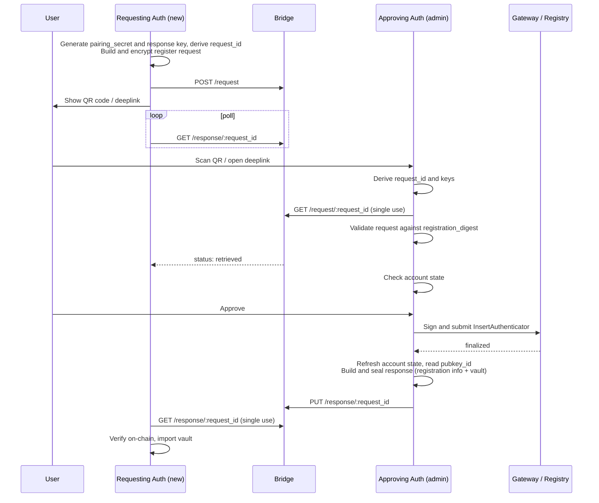

## 1. Abstract

This spec builds upon [WIP-105][wip-105] and describes a process by which a new authenticator can be added to a World ID using an existing Admin Authenticator communicating over the message-bridge (WIP-110).

It defines the pairing URI (QR code / deeplink), key derivation, the message-bridge semantics and the specific [WIP-105][wip-105] JSON-RPC messages. On success the **Approving Authenticator** returns the registration info and the credential vault in a single response, leaving the new authenticator ready to generate proofs.

## 2. Motivation

World ID 4.0 supports multiple authenticators per World ID. Users increasingly hold more than one (e.g. a personal and an enterprise device, or a web authenticator next to a mobile one). Adding an authenticator requires an existing Admin Authenticator (as defined in [WIP-104][wip-104]) to authorize an `InsertAuthenticator` operation on the `WorldIDRegistry`, and the new authenticator needs the account's `leaf_index` and its credentials to be useful.

This requires:

1. An interoperable, end-to-end encrypted way for two authenticators (possibly on different devices, networks and providers) to exchange data.
2. Explicit, informed user approval on the **Approving Authenticator**.

## 3. Specification

The key words "MUST", "MUST NOT", "REQUIRED", "SHALL", "SHALL NOT", "SHOULD", "SHOULD NOT", "RECOMMENDED", "MAY", and "OPTIONAL" in this document are to be interpreted as described in [RFC 2119](https://www.ietf.org/rfc/rfc2119.txt).

Authenticator roles and keys follow [WIP-104][wip-104]. Messages MUST conform to [WIP-105][wip-105].

### 3.1 Terminology

The following terms apply only to this spec.

- **Requesting Authenticator**: The new authenticator to be registered.
- **Approving Authenticator**: An existing Admin Authenticator of the user's World ID, registered in the `WorldIDRegistry`.
- **Bridge**: A [message-bridge](https://github.com/worldcoin/wallet-bridge) deployment (as defined in WIP-110). Untrusted: it may observe identifiers, sizes, timing and IP addresses, and can drop or delay messages, but cannot read or modify them.
- **Pairing Secret**: 32 random bytes generated by the **Requesting Authenticator** per registration attempt, transferred to the **Approving Authenticator** in the Pairing URI.

### 3.2 Overview

This section shows a non-normative diagram flow of the registration process.


```mermaid
sequenceDiagram
    participant u as User
    participant r as Requesting Auth (new)
    participant b as Bridge
    participant a as Approving Auth (admin)
    participant g as Gateway / Registry

    r->>r: Generate pairing_secret and response key, derive request_id<br/>Build and encrypt register request
    r->>b: POST /request
    r->>u: Show QR code / deeplink
    loop poll
        r->>b: GET /response/:request_id
    end
    u->>a: Scan QR / open deeplink
    a->>a: Derive request_id and keys
    a->>b: GET /request/:request_id (single use)
    a->>a: Validate request against registration_digest
    b-->>r: status: retrieved
    a->>a: Check account state
    u->>a: Approve
    a->>g: Sign and submit InsertAuthenticator
    g-->>a: finalized
    a->>a: Refresh account state, read pubkey_id<br/>Build and seal response (registration info + vault)
    a->>b: PUT /response/:request_id
    r->>b: GET /response/:request_id (single use)
    r->>r: Verify on-chain, import vault
```

### 3.3 Pairing Secret and Derived Values

For each registration attempt the **Requesting Authenticator** MUST generate a fresh 32-byte `pairing_secret` using a CSPRNG. All other session values are derived deterministically from it with HKDF-SHA256 ([RFC 5869](https://www.rfc-editor.org/rfc/rfc5869)), empty salt, 32-byte output:

```text
request_id       = lowercase_hex(HKDF(pairing_secret, info = "WORLD-ID/WIP-109/REQUESTID"))   // 64 chars
transport_secret = HKDF(pairing_secret, info = "WORLD-ID/WIP-109/TRANSPORTSECRET")
```

#### 3.3.1 Registration Digest

The **Requesting Authenticator** commits to the registration parameters in the Pairing URI, so the **Approving Authenticator** can detect any substituted request. The digest is computed over the parsed values in a fixed binary layout:

```text
registration_digest = SHA-256(
    "WORLD-ID/WIP-109/REGISTER"     // ASCII
 || request_id                      // 32 bytes (the raw HKDF output)
 || new_authenticator_pubkey        // 32 bytes, WIP-100 §4 wire encoding
 || new_authenticator_address       // 20 bytes; all zeros for a Proving Authenticator
 || response_pubkey                 // 1216 bytes, X-Wing encapsulation key
)
```

All fields MUST be fixed-width, so the encoding is unambiguous. Every member of `params` except `name` and `registration_sig` is covered. `name` is an advisory label and is not authenticated. A future version that adds a parameter MUST add it to the digest under a new label. SHA-256 is used instead of the [WIP-100][wip-100] default (Poseidon2) because this is a byte-oriented commitment that is never used in a circuit.

#### 3.3.2 Registration Signature

The **Requesting Authenticator** proves it holds the signing key it asks to register by signing the digest with it. EdDSA ([WIP-100][wip-100] §3.5) signs field elements, so the digest is first lowered to one:

```text
d_hi, d_lo       = registration_digest[0..16], registration_digest[16..32]    // big-endian integers
m                = H_3(ds("WORLD-ID/WIP-109/REGSIG"); d_hi, d_lo)             // WIP-100 §3.3.2
registration_sig = EdDSA-Sign(signing_key, m)                                 // 64 bytes, WIP-100 §3.5.2
```

This also stops a malicious requester from claiming an already-registered key to obtain the vault through the already-registered case (§3.7.2 step 3).

### 3.4 Pairing URI

The **Requesting Authenticator** encodes the pairing in a [WIP-105][wip-105] deeplink with namespace `auth`, version `v1` and action `register`:

```text
worldid://auth/v1/register?s={pairing_secret}&d={registration_digest}&b={bridge_domain}
```

| Parameter | Required | Description |
| --------- | -------- | ----------- |
| `s` | REQUIRED | The 32-byte pairing secret, unpadded base64url ([RFC 4648 §5](https://www.rfc-editor.org/rfc/rfc4648#section-5)), 43 characters. |
| `d` | REQUIRED | The 32-byte registration digest (§3.3.1), unpadded base64url (43 characters). |
| `b` | OPTIONAL | Domain of the bridge used by the **Requesting Authenticator**, e.g. `bridge.example.org`, without scheme, port, path, userinfo, query or fragment. The bridge is always reached over `https`. When omitted, the **Approving Authenticator** MUST use its configured default bridge. |

- The **Requesting Authenticator** MUST make the URI available as a deeplink, e.g. a link the user can open or copy, and SHOULD display it as a QR code.
- **Approving Authenticators** SHOULD support scanning the QR code and SHOULD register the `worldid` URI scheme where the platform allows. Opening the URI starts pairing; it MUST NOT imply approval.
- The **Approving Authenticator** MUST parse strictly: reject unknown, missing or duplicated parameters, invalid encodings, and any other authority or path. Query values are percent-encoded as defined in [RFC 3986 §2.1](https://www.rfc-editor.org/rfc/rfc3986#section-2.1) and decoded exactly once.
- The **Approving Authenticator** SHOULD restrict the bridge (`b`) to an allowlist of known bridge deployments and MUST NOT contact a non-allowlisted host without user confirmation.
- The URI is a bearer secret. It MUST NOT be logged, sent to analytics, or passed to link-preview or URL-shortening services.
- No explicit expiry is carried; the bridge's own expiry is authoritative and the **Approving Authenticator** treats `404` from `GET /request` as expired-or-used.

### 3.5 Transport

Messages are exchanged over the message-bridge, whose interface is not in the scope for this spec. The request and its response are addressed by the same `request_id` (§3.3).

**Encryption.**

- Request: AES-256-GCM of the UTF-8 JSON-RPC request under `transport_secret`, with a fresh random 12-byte nonce. The nonce is carried in the bridge's `iv` field and the ciphertext in `payload`, both standard padded base64 ([RFC 4648 §4](https://www.rfc-editor.org/rfc/rfc4648#section-4)).
- Response: post-quantum [HPKE](https://www.rfc-editor.org/rfc/rfc9180) base-mode single-shot seal of the UTF-8 JSON-RPC response to the **Requesting Authenticator**'s `response_pubkey`, using the suite and wire format of the [`quantum-box`](https://crates.io/crates/quantum-box) crate:
    - KEM [X-Wing](https://datatracker.ietf.org/doc/draft-connolly-cfrg-xwing-kem/) (`0x647A`), KDF `HKDF-SHA256` (`0x0001`), AEAD `ChaCha20-Poly1305` (`0x0003`).
    - `info = "WORLD-ID/WIP-109/RESPONSE"` (ASCII).
    - Sealed bytes: `header || enc || ciphertext`, where `header` is the 7 bytes `0x02 || 0x647A || 0x0001 || 0x0003` (version, KEM, KDF, AEAD; big-endian) and is used as the HPKE AAD, and `enc` is the 1120-byte X-Wing encapsulated key.
    - `payload` carries the sealed bytes. `iv` MUST be the empty string and MUST be ignored by the **Requesting Authenticator**. The **Requesting Authenticator** MUST reject a header with any other value.

> [!NOTE]
> The request is protected by `pairing_secret`, so anyone who saw the QR code can read it. It only contains public keys and a label. The response contains the vault, so it is sealed to a key whose private half never leaves the **Requesting Authenticator**: seeing the QR code is not enough to read it. This response layer is **temporary**: it will be removed once WIP-110 adds post-quantum asymmetric key exchange to the bridge.
>
> The vault is base64-encoded inside the JSON and again in the bridge payload. This is **temporary** until the bridge supports binary payloads.

### 3.6 Messages

#### 3.6.1 `worldid_auth_v1_register` (Requesting → Approving)

A JSON-RPC 2.0 request. `id` MUST be the `request_id` string. The **Approving Authenticator** MUST reject a message whose `id` differs from the value it derived. Numeric fields use the canonical protocol JSON encoding as defined in [WIP-100][wip-100].

| Member | Required | Description |
| ------ | -------- | ----------- |
| `new_authenticator_pubkey` | REQUIRED | The **Requesting Authenticator**'s signing public key in the compressed representation of [WIP-100 §4](wip-100.md#4-public-key-representation), as a `0x`-prefixed hex `U256`. |
| `new_authenticator_address` | OPTIONAL | The **Requesting Authenticator**'s management key address, `0x`-prefixed 20-byte hex. [ERC-55](https://eips.ethereum.org/EIPS/eip-55) checksum SHOULD be emitted and MUST be validated when mixed-case. Present: Admin Authenticator. Omitted: Proving Authenticator. MUST NOT be the zero address. |
| `response_pubkey` | REQUIRED | Ephemeral X-Wing encapsulation key (1216 bytes) used to seal the response, `0x`-prefixed fixed-length hex. Generated per attempt. |
| `name` | OPTIONAL | Human-readable, self-reported label, e.g. `"MyApp on iPhone 14"`. UTF-8, at most 64 bytes. Which characters are accepted is up to the **Approving Authenticator**. It rejects a name it does not accept with `invalid_name`. |
| `registration_sig` | REQUIRED | Registration Signature (§3.3.2): the 64-byte EdDSA signature as `0x`-prefixed fixed-length hex. |

Example: registration request for a Proving Authenticator (`response_pubkey` truncated).

```json
{
  "jsonrpc": "2.0",
  "id": "90f29fad9f9354009a277ce306f1867ff351d7d1844be4e41715ed58c0e676e3",
  "method": "worldid_auth_v1_register",
  "params": {
    "new_authenticator_pubkey": "0x119ab03fe2d9c74efba936a46c3afda3470f0a9366d330226af515e329203a91",
    "response_pubkey": "0x420044e7e5e76579b4917918c2c52769c2b7e01a73e81208450501a417a86283…",
    "name": "Chrome on MacBook",
    "registration_sig": "0x8e41c0…"
  }
}
```

#### 3.6.2 Success response (Approving → Requesting)

A JSON-RPC 2.0 response with the same `id`. Sent exactly once, and only after the registration is final on-chain or was already present (§3.7.2).

| Member | Required | Description |
| ------ | -------- | ----------- |
| `leaf_index` | REQUIRED | Account index, `0x`-prefixed hex `u64`. |
| `pubkey_id` | REQUIRED | Slot the **Requesting Authenticator** was inserted at, `0x`-prefixed hex `u32`. |
| `authenticators` | OPTIONAL | Names of the account's other authenticators known to the **Approving Authenticator**: an array of objects with `pubkey_id` and `name`. |
| `vault` | OPTIONAL | Object with `format` = `"walletkit_plaintext_v1"` and `data` = standard base64 of the WalletKit `export_vault_for_backup` output. The **Approving Authenticator** SHOULD include it; the user or **Approving Authenticator** policy MAY exclude it.<br><br>Note the vault contains the set of credentials and associated data from the issuer. |

Example: successful registration response (values truncated).

```json
{
  "jsonrpc": "2.0",
  "id": "90f29fad9f9354009a277ce306f1867ff351d7d1844be4e41715ed58c0e676e3",
  "result": {
    "leaf_index": "0x2a",
    "pubkey_id": "0x1",
    "authenticators": [{ "pubkey_id": "0x0", "name": "iPhone" }],
    "vault": { "format": "walletkit_plaintext_v1", "data": "U1FMaXRlIGZvcm1hdCAz…" }
  }
}
```

#### 3.6.3 Error response (Approving → Requesting)

A JSON-RPC 2.0 error response with the same `id`. `error.data.reason` is the machine-readable value; `error.message` is informational only.

| `code` | `data.reason` | Meaning |
| ------ | ------------- | ------- |
| -32602 | `invalid_params` | Missing or malformed field, or an invalid key or address. |
| -32602 | `invalid_name` | The **Approving Authenticator** does not accept the `name`. The **Requesting Authenticator** can start over with a different name. |
| -32603 | `internal_error` | The **Approving Authenticator** could not complete the request for any other reason. |
| 1000 | `user_rejected` | The user declined. |
| 1001 | `not_authorized` | The **Approving Authenticator** is not an Admin Authenticator of the account. |
| 1002 | `authenticator_conflict` | The signing key or address is already registered, but not as requested (other account or other class). |
| 1003 | `max_authenticators_reached` | No free authenticator slot. |
| 1004 | `operation_failed` | The `InsertAuthenticator` operation definitively failed. `data.detail` MAY carry an implementation-specific error, e.g. the gateway `error_code`. |
| 1005 | `outcome_unknown` | The **Approving Authenticator** submitted the operation but could not determine its outcome before its deadline. |

The **Approving Authenticator** MUST NOT report `operation_failed` unless the failure is definitive. If the outcome is still unknown when the bridge session is about to expire (RECOMMENDED: 60 s before expiry), the **Approving Authenticator** MUST respond `outcome_unknown` rather than stay silent. The **Requesting Authenticator** then tells the user that the outcome is unknown and offers a new pairing. If the insertion succeeded, the new pairing hits the already-registered case (§3.7.2 step 3) and delivers the result without a second insertion.

### 3.7 Approving Authenticator Procedure

#### 3.7.1 Receive

1. Parse the Pairing URI (§3.4) and derive the session values.
2. Call `GET /request/:request_id`. On `404`, tell the user the QR code or link was already used or has expired, and to generate a new one on the new device. A `404` after a timed-out attempt means the request was consumed and lost; handle it the same way.
3. Validate the JSON-RPC shape, `method`, `id == request_id`, and the encodings and bounds of all `params`. Recompute `registration_digest` from the params and reject the request (without responding) if it differs from the URI value. Verify `registration_sig` against `new_authenticator_pubkey`; on failure respond `invalid_params`. Reject a `name` it does not accept (`invalid_name`), and display an accepted one as untrusted text.

#### 3.7.2 Check account state

1. Verify that the **Approving Authenticator** is an Admin Authenticator of the account (`getPackedAccountData` for its own address). Otherwise: `not_authorized`.
2. Read one snapshot of account state: the pubkey set and `offchain_signer_commitment`, taken together from the same source and point in time, and `getSignatureNonce(leaf_index)` from the registry. The pubkey set MAY come from an indexer (e.g. `/authenticator-pubkeys`) or from the registry's events directly.
3. **Already registered.** If `new_authenticator_pubkey` is already in the pubkey set, an earlier attempt registered it:
    - The **Approving Authenticator** MUST verify that the existing slot matches the request: its class is the requested class and, for an Admin Authenticator, its management key is `new_authenticator_address`. Otherwise respond `authenticator_conflict`. How the slot's class and management key are read is out of scope for this spec.
    - Approval (§3.7.3) is still required, because the vault is shared. The **Approving Authenticator** then skips §3.7.4 and responds (§3.7.5) with the existing `leaf_index` and `pubkey_id`.
4. If `new_authenticator_address` is registered to another account or slot: `authenticator_conflict`. A pubkey registered on another account cannot be detected and is not checked.
5. Otherwise choose the lowest free `pubkey_id` below `NUM_KEYS` ([WIP-100][wip-100] §3.8), the number of slots committed to the account's leaf. If none is free: `max_authenticators_reached`. If the registry rejects the slot because its configured limit is lower, the **Approving Authenticator** also responds `max_authenticators_reached`.

#### 3.7.3 Approve

1. The **Approving Authenticator** MUST show an explicit consent screen that at least conveys the following information:
    1. Make it clear to the user they are authorizing another authenticator to make World ID proofs on their behalf.
    2. If the vault is being shared, the user MUST be aware that the authenticator will receive their credentials. If the vault contains biometric data, the user MUST be aware of such.
    3. It MUST be clear if the user is approving a Proving Authenticator or an Admin Authenticator. It is RECOMMENDED to convey to the user the risks of an Admin Authenticator being approved.
    4. It MUST tell the user not to share with third-parties or with authenticators they don't trust.
2. It is highly RECOMMENDED that the **Approving Authenticator** perform additional identity verification if available. For example, if keys are held in a biometric-protected storage, or if the user has a credential that allows identity verification.
3. If the user rejects the request, the `user_rejected` error code MUST be sent back.

#### 3.7.4 Submit

1. Sign `InsertAuthenticator` from the §3.7.2 snapshot: its nonce, the chosen `pubkey_id`, and the snapshot's `offchain_signer_commitment` as the old commitment, together with the new commitment computed from the same pubkey set. For a Proving Authenticator, `new_authenticator_address` in the operation is `0x0000000000000000000000000000000000000000` as per [WIP-104][wip-104].
2. Submit the operation, through a gateway or any other submission path (e.g. its own relayer).
3. Track the operation with bounded backoff until it is final on-chain or has definitively failed.
4. The **Approving Authenticator** tracks only the finality of its own operation. If the operation fails, the registration fails: respond `operation_failed`. It MUST NOT re-sign or submit another insertion while it is tracking a submitted operation. A failure reported after the transaction was broadcast is not final, because the transaction may still land. In that case respond `outcome_unknown` (§3.6.3) unless the operation is known not to have landed.
5. On success, refresh the account state and read `pubkey_id` from it as in §3.7.2 step 3, waiting until its source of account state shows the key.

No double insertion is possible. The registry checks both the signature nonce and the old commitment, so an insertion signed from stale state reverts instead of landing, and two insertions signed with the same nonce cannot both succeed.

#### 3.7.5 Respond

1. Build the response (§3.6.2 or §3.6.3) and seal it (§3.5) to `response_pubkey`.
2. Call `PUT /response/:request_id`:
    - `201`: delivered.
    - `400` or `409`: tell the user that something went wrong, and to check the new device and retry from it if needed.
    - `5xx` or timeout: bounded retry.

### 3.8 Requesting Authenticator Procedure

1. The **Requesting Authenticator** MUST use the same authenticator keys and class across retries of the same registration, so that a retry after a lost response hits the already-registered case (§3.7.2 step 3) instead of inserting a second authenticator.
2. Generate `pairing_secret` and the X-Wing `response_pubkey` keypair. Build and encrypt the request.
3. Call `POST /request`:
    - `200`: published.
    - `409`: already published by an earlier attempt; continue.
    - Other `4xx`: fail visibly.
    - `5xx` or timeout: bounded retry.

    Once the request is published, the **Requesting Authenticator** MUST NOT post it again. A post after the **Approving Authenticator** has read the request resets the bridge status.
4. Display the Pairing URI and poll `GET /response/:request_id`:
    - `retrieved`: show "continue on your other device".
    - `completed`: go to step 5.
    - `404` without a response: the session expired or the response was lost. Offer a new QR code with a new `pairing_secret` and the same authenticator keys.
5. On `result`: verify against the registry state (e.g. via an indexer) that `new_authenticator_pubkey` is at `pubkey_id` on `leaf_index`. The **Requesting Authenticator** MUST NOT consider itself registered until this check succeeds. Then store `leaf_index`, import the vault (WalletKit `merge_vault_from_backup`) and delete the session. On `error`: show the reason and delete the session.

## 4. Rationale

- **Using the message-bridge instead of other protocols.** The message-bridge is already the canonical way of exchanging off-chain messages between Protocol parties, works from browsers, and needs no service or contract changes.
- **One request id for both directions.** The bridge keys request and response by the same id, so a single derived value is enough to resume either side.
- **Derived `request_id`.** The Pairing URI carries a single secret instead of an id plus a key, which keeps the QR code slightly smaller (about 36 fewer characters than a bridge-assigned id). The derived id also meets the bridge's high-entropy requirement for client-supplied ids.

## 5. Security

- **Bridge.** It sees `request_id`, sizes, timing and IPs, and cannot read or modify payloads. It can drop messages or race the single-use reads (so could anyone who guessed the id, which is infeasible). Either way the result is a visible failure and a retry.
- **Intercepted Pairing URI.** Any application that registered the `worldid` scheme can receive the URI, as can anyone who sees the QR code. They can read the request, which holds only public keys and a label, and consume it, which the user sees as a failure. It cannot read the response, which is sealed to `response_pubkey`.
- **Malicious QR code.** The digest does not help when the user is tricked into scanning an **attacker's** QR code, because the attacker controls both screens. Only the warning on the approval screen addresses that.
- **Response authenticity.** Anyone who read the request can encrypt to `response_pubkey`. The check in §3.8 step 5 authenticates the registration fields. The **Requesting Authenticator** MUST validate imported credentials against its account before using them.
- **Vault sensitivity.** The vault is sent only after approval, sealed to the **Requesting Authenticator**'s `response_pubkey`. The already-registered case requires approval too.
- **Least privilege.** **Approving Authenticators** SHOULD make the Admin vs Proving distinction prominent. **Requesting Authenticators** that do not need management SHOULD request Proving.

## 6. Backwards Compatibility

There are no changes to existing Protocol components. Registration uses the existing `InsertAuthenticator` operation. Proving registration depends on the [WIP-104][wip-104] registry (`WorldIDRegistryV2`). Authenticators that do not implement this WIP are unaffected.

[wip-100]: wip-100.md
[wip-104]: wip-104.md
[wip-105]: wip-105.md
