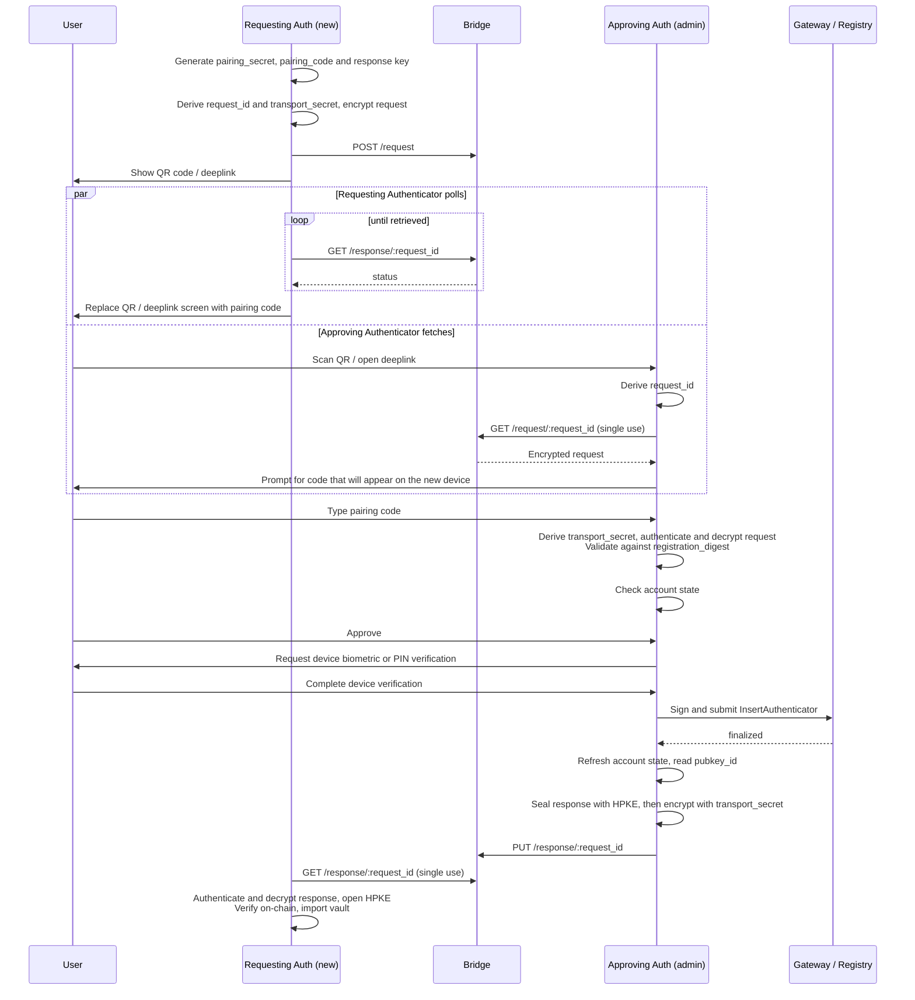

## 1. Abstract

This spec builds upon [WIP-105][wip-105] and describes a process by which a new authenticator can be added to a World ID using an existing Admin Authenticator communicating over the message-bridge (WIP-110).

It defines the pairing URI (QR code / deeplink), a separately entered pairing code, key derivation, the message-bridge semantics and the specific [WIP-105][wip-105] CBOR messages. On success the **Approving Authenticator** returns the registration info and the credential vault in a single response, leaving the new authenticator ready to generate proofs.

## 2. Motivation

World ID 4.0 supports multiple authenticators per World ID. Users increasingly hold more than one (e.g. a personal and an enterprise device, or a web authenticator next to a mobile one). Adding an authenticator requires an existing Admin Authenticator (as defined in [WIP-104][wip-104]) to authorize an `InsertAuthenticator` operation on the `WorldIDRegistry`, and the new authenticator needs the account's `leaf_index` and its credentials to be useful.

This requires:

1. An interoperable, end-to-end encrypted way for two authenticators (possibly on different devices, networks and providers) to exchange data.
2. Explicit, informed user approval on the **Approving Authenticator**.
3. Out-of-band authentication through a code the user types into the intended **Approving Authenticator**, so possession of the Pairing URI alone does not authorize a response.

## 3. Specification

The key words "MUST", "MUST NOT", "REQUIRED", "SHALL", "SHALL NOT", "SHOULD", "SHOULD NOT", "RECOMMENDED", "MAY", and "OPTIONAL" in this document are to be interpreted as described in [RFC 2119](https://www.ietf.org/rfc/rfc2119.txt).

Authenticator roles and keys follow [WIP-104][wip-104]. Messages MUST conform to [WIP-105][wip-105].

### 3.1 Terminology

The following terms apply only to this spec.

- **Requesting Authenticator**: The new authenticator to be registered.
- **Approving Authenticator**: An existing Admin Authenticator of the user's World ID, registered in the `WorldIDRegistry`.
- **Bridge**: A [message-bridge](https://github.com/worldcoin/wallet-bridge) deployment (as defined in WIP-110). Untrusted: it may observe identifiers, sizes, timing and IP addresses, and can drop or delay messages, but cannot read or modify them.
- **Pairing Secret**: 32 random bytes generated by the **Requesting Authenticator** per registration attempt, transferred to the **Approving Authenticator** in the Pairing URI.
- **Pairing Code**: An independent random code generated by the **Requesting Authenticator** per attempt and revealed after the bridge reports `retrieved`. The user manually enters it into the intended **Approving Authenticator**.

### 3.2 Overview

This section shows a non-normative diagram flow of the registration process.


```mermaid
sequenceDiagram
    participant u as User
    participant r as Requesting Auth (new)
    participant b as Bridge
    participant a as Approving Auth (admin)
    participant g as Gateway / Registry

    r->>r: Generate pairing_secret, pairing_code and response key
    r->>r: Derive request_id and transport_secret, encrypt request
    r->>b: POST /request
    r->>u: Show QR code / deeplink
    par Requesting Authenticator polls
        loop until retrieved
            r->>b: GET /response/:request_id
            b-->>r: status
        end
        r->>u: Replace QR / deeplink screen with pairing code
    and Approving Authenticator fetches
        u->>a: Scan QR / open deeplink
        a->>a: Derive request_id
        a->>b: GET /request/:request_id (single use)
        b-->>a: Encrypted request
        a->>u: Prompt for code that will appear on the new device
    end
    u->>a: Type pairing code
    a->>a: Derive transport_secret, authenticate and decrypt request<br/>Validate against registration_digest
    a->>a: Check account state
    u->>a: Approve
    a->>u: Request device biometric or PIN verification
    u->>a: Complete device verification
    a->>g: Sign and submit InsertAuthenticator
    g-->>a: finalized
    a->>a: Refresh account state, read pubkey_id
    a->>a: Seal response with HPKE, then encrypt with transport_secret
    a->>b: PUT /response/:request_id
    r->>b: GET /response/:request_id (single use)
    r->>r: Authenticate and decrypt response, open HPKE<br/>Verify on-chain, import vault
```

### 3.3 Pairing Secret, Pairing Code and Derived Values

For each registration attempt the **Requesting Authenticator** MUST independently generate a fresh 32-byte `pairing_secret` and a fresh `pairing_code` using a CSPRNG. The code MUST be sampled uniformly from the six-letter strings over the ASCII alphabet `A` through `Z`; it MUST NOT be user-chosen or derived from the Pairing URI or any value sent over the bridge.

The code's canonical encoding is exactly six uppercase ASCII letters, for example `QJTWPK`. Input MUST be normalized by removing ASCII spaces and hyphens and mapping ASCII `a` through `z` to `A` through `Z`. Implementations MUST reject any remaining characters outside `A` through `Z` or a length other than six before deriving keys; Unicode case folding MUST NOT be used.

Expand the code with Argon2id ([RFC 9106](https://www.rfc-editor.org/rfc/rfc9106.html)), version `0x13`, memory `m = 65536` KiB (64 MiB total), iterations `t = 3`, parallelism `p = 4`, and a 32-byte output. The password is the raw 32-byte `pairing_secret` followed by the six-byte canonical ASCII code (38 bytes total). The salt is the public `request_id` decoded from hex to its raw 32 bytes, not the 64-character hex string. The optional secret and associated data are empty.

`HKDF` below means HKDF-SHA256 extract-and-expand ([RFC 5869](https://www.rfc-editor.org/rfc/rfc5869)) with empty salt and 32-byte output; labels are ASCII and `||` denotes byte concatenation:

```text
request_id = lowercase_hex(HKDF(pairing_secret, info = "WORLD-ID/WIP-109/REQUESTID"))
code_key = Argon2id(password = pairing_secret || ASCII(pairing_code), salt = hex_decode(request_id),
                   m = 65536, t = 3, p = 4, version = 0x13, output_length = 32)
transport_secret = HKDF(pairing_secret || code_key, info = "WORLD-ID/WIP-109/TRANSPORTSECRET")
```

The **Requesting Authenticator** MUST reveal the code only after the bridge reports a status of `retrieved`, replacing the QR code / deeplink screen with the pairing code and instructions to type it only into the intended **Approving Authenticator**. The code and `code_key` MUST NOT appear in bridge messages, logs, analytics, or link-sharing metadata. Code entry MUST NOT replace explicit consent (§3.7.3). A new pairing MUST use a fresh secret, code and response keypair, even when retrying registration of the same authenticator keys.

#### 3.3.1 Registration Digest

The **Requesting Authenticator** commits to the registration parameters in the Pairing URI, so the **Approving Authenticator** can detect any substituted request. The digest is computed over the parsed values in a fixed binary layout:

```text
registration_digest = SHA-256(
    "WORLD-ID/WIP-109/REGISTER"     // ASCII
 || request_id                      // 32 bytes (the raw HKDF output)
 || new_authenticator_pubkey        // 32 bytes, WIP-100 §4 wire encoding
 || new_authenticator_address       // 20 bytes; all zeros for a Proving Authenticator
 || response_pubkey                 // 1216 bytes, X-Wing encapsulation key
)
```

All fields MUST be fixed-width, so the encoding is unambiguous. Every member of `params` except `name` and `registration_sig` is covered. `name` is an advisory label and is not authenticated. A future version that adds a parameter MUST add it to the digest under a new label. SHA-256 is used instead of the [WIP-100][wip-100] default (Poseidon2) because this is a byte-oriented commitment that is never used in a circuit.

#### 3.3.2 Registration Signature

The **Requesting Authenticator** proves it holds the signing key it asks to register by signing the digest with it. EdDSA ([WIP-100][wip-100] §3.5) signs field elements, so the digest is first lowered to one:

```text
d_hi, d_lo       = registration_digest[0..16], registration_digest[16..32]    // big-endian integers
m                = H_3(ds("WORLD-ID/WIP-109/REGSIG"); d_hi, d_lo)             // WIP-100 §3.3.2
registration_sig = EdDSA-Sign(signing_key, m)                                 // 64 bytes, WIP-100 §3.5.2
```

This also stops a malicious requester from claiming an already-registered key to obtain the vault through the already-registered case (§3.7.2 step 3).

### 3.4 Pairing URI

The **Requesting Authenticator** encodes the pairing in a [WIP-105][wip-105] deeplink with namespace `auth`, version `v1` and action `register`:

```text
worldid://auth/v1/register?s={pairing_secret}&d={registration_digest}&b={bridge_domain}
```

| Parameter | Required | Description |
| --------- | -------- | ----------- |
| `s` | REQUIRED | The 32-byte pairing secret, unpadded base64url ([RFC 4648 §5](https://www.rfc-editor.org/rfc/rfc4648#section-5)), 43 characters. |
| `d` | REQUIRED | The 32-byte registration digest (§3.3.1), unpadded base64url (43 characters). |
| `b` | REQUIRED | Domain of the bridge used by the **Requesting Authenticator**, e.g. `bridge.example.org`, without scheme, port, path, userinfo, query or fragment. The bridge is always reached over `https`. The **Approving Authenticator** MUST use this bridge and no other. |

- The **Requesting Authenticator** MUST make the URI available as a deeplink, e.g. a link the user can open or copy, and SHOULD display it as a QR code.
- **Approving Authenticators** SHOULD support scanning the QR code and SHOULD register the `worldid` URI scheme where the platform allows. Opening the URI starts pairing; it MUST NOT imply approval.
- The **Approving Authenticator** MUST parse strictly: reject unknown, missing or duplicated parameters, invalid encodings, and any other authority or path. Query values are percent-encoded as defined in [RFC 3986 §2.1](https://www.rfc-editor.org/rfc/rfc3986#section-2.1) and decoded exactly once.
- The **Approving Authenticator** MUST restrict the bridge (`b`) to an allowlist of known bridge deployments and MUST NOT contact a non-allowlisted host without user confirmation.
- The URI exposes the session identifier, but the separately entered code is also required to derive the transport key. The URI MUST NOT be logged, sent to analytics, or passed to link-preview or URL-shortening services.
- No explicit expiry is carried; the bridge's own expiry is authoritative and the **Approving Authenticator** treats `404` from `GET /request` as expired-or-used.

### 3.5 Transport

Messages are exchanged over the message-bridge, whose interface is not in the scope for this spec. WIP-110 owns the bridge contract, including its endpoints and the `initialized`, `retrieved` and `completed` statuses; until WIP-110 is published, the [message-bridge](https://github.com/worldcoin/message-bridge) implementation is the reference. This spec only defines how each party reacts to them. The request and its response are addressed by the same `request_id` (§3.3).

**Encryption.**

- Both directions use AES-256-GCM under `transport_secret`, with a fresh CSPRNG-generated 12-byte nonce per encryption and a full 16-byte authentication tag. The bridge's `iv` carries the nonce and `payload` carries `ciphertext || tag`, both standard padded base64 ([RFC 4648 §4](https://www.rfc-editor.org/rfc/rfc4648#section-4)). A nonce MUST NOT be reused for another encryption under the same key; delivery retries MUST resend the exact same `iv` and `payload`.
- Request: encrypt the CBOR-encoded request. The AES-GCM AAD is `ASCII("WORLD-ID/WIP-109/REQUEST") || request_id_bytes`, where `request_id_bytes` is the raw 32-byte HKDF output, not the hex string.
- Response (including errors): first seal the CBOR-encoded response to the **Requesting Authenticator**'s `response_pubkey` with the public-key encryption defined in [WIP-100][wip-100] §3.9, using `info = "WORLD-ID/WIP-109/RESPONSE"` (ASCII). The **Requesting Authenticator** MUST reject a sealed message whose header or ciphersuite is not the one WIP-100 §3.9 defines.
  Then encrypt the complete sealed bytes with AES-256-GCM as above, using AAD `ASCII("WORLD-ID/WIP-109/RESPONSE") || request_id_bytes`. The response `iv` is the outer AES-GCM nonce; it MUST NOT be empty.

The encoded CBOR message before encryption MUST NOT exceed 4 KiB for a request and 1 MiB plus 4 KiB for a response (the `vault.data` limit of §3.6.2 and the other fields). Receivers MUST reject a decoded `payload` longer than that limit plus the encryption overhead (16 bytes for a request; 1159 bytes for a response: 16 outer tag plus the 1143 bytes of sealed-message overhead defined in [WIP-100][wip-100] §3.9) before decrypting it.

Receivers MUST reject malformed base64, a decoded `iv` other than 12 bytes, or a decoded `payload` shorter than 16 bytes, ending the attempt with a local pairing-failed message. They MUST authenticate the AES-GCM envelope before parsing a request or opening an HPKE response. An unauthenticated request MUST NOT produce a response; limited local code retries are allowed by §3.7.1. Response authentication or HPKE decryption failure MUST end the attempt with a local pairing-failed message and an offer to start a new pairing. Implementations MUST NOT fall back to a key derived without the code or accept an unwrapped HPKE response.

> [!NOTE]
> The code-derived transport key authenticates both directions. HPKE base mode alone does not authenticate the sender: anyone with `response_pubkey` can seal a response. The inner HPKE layer additionally protects the vault even if the pairing secret and code are later disclosed. This inner layer is **temporary** until WIP-110 provides equivalent post-quantum confidentiality; code-based authentication remains required.

### 3.6 Messages

Requests and responses use the CBOR encoding and `version: "1.0"` envelope defined in [WIP-105][wip-105]. `params` and `result` are maps. The tables below define their fields. Byte strings contain the specified bytes directly; integer fields use CBOR unsigned integers within the stated ranges. Optional fields are omitted when absent.

Examples use CBOR diagnostic notation: `h'…'` denotes a byte string. Byte strings containing `…` are abbreviated illustrations, not test vectors.

#### 3.6.1 `worldid_auth_v1_register` (Requesting → Approving)

The request MUST include `id` set to the `request_id` text string; it MUST NOT be null. The **Approving Authenticator** MUST reject a message whose `id` differs from the value it derived.

| Member | Required | Description |
| ------ | -------- | ----------- |
| `new_authenticator_pubkey` | REQUIRED | The **Requesting Authenticator**'s signing public key in the compressed wire representation of [WIP-100 §4](wip-100.md#4-public-key-representation), as a 32-byte CBOR byte string. |
| `new_authenticator_address` | OPTIONAL | The **Requesting Authenticator**'s management key address, as a 20-byte CBOR byte string. Present: Admin Authenticator. Omitted: Proving Authenticator. MUST NOT be the zero address. |
| `response_pubkey` | REQUIRED | Ephemeral X-Wing encapsulation key used to seal the response, as a 1216-byte CBOR byte string. Generated per attempt. |
| `name` | OPTIONAL | Human-readable, self-reported label, e.g. `"MyApp on iPhone 14"`. CBOR text string, at most 64 UTF-8 bytes. Which characters are accepted is up to the **Approving Authenticator**. It rejects a name it does not accept with `invalid_name`. |
| `registration_sig` | REQUIRED | Registration Signature (§3.3.2): the 64-byte EdDSA signature as a CBOR byte string. |

Example: registration request for a Proving Authenticator (byte strings abbreviated).

```text
{
  "version": "1.0",
  "id": "90f29fad9f9354009a277ce306f1867ff351d7d1844be4e41715ed58c0e676e3",
  "method": "worldid_auth_v1_register",
  "params": {
    "new_authenticator_pubkey": h'119ab03f…',
    "response_pubkey": h'420044e7…',
    "name": "Chrome on MacBook",
    "registration_sig": h'8e41c0…'
  }
}
```

#### 3.6.2 Success response (Approving → Requesting)

A response with the same `id`. Sent exactly once, and only after the registration is final on-chain or was already present (§3.7.2).

| Member | Required | Description |
| ------ | -------- | ----------- |
| `leaf_index` | REQUIRED | Account index, an unsigned integer from 1 to 2^30 − 1 (`MAX_DEPTH` = 30); index 0 is reserved ([WIP-100][wip-100] §3.8, §5.1). |
| `pubkey_id` | REQUIRED | Slot the **Requesting Authenticator** was inserted at, an unsigned integer below `NUM_KEYS` ([WIP-100][wip-100] §3.8). |
| `authenticators` | OPTIONAL | Names of the account's other authenticators known to the **Approving Authenticator**: an array of maps with `pubkey_id` (unsigned integer below `NUM_KEYS`) and `name` (text string). |
| `vault` | OPTIONAL | Map with `format` = `"walletkit_plaintext_v1"` (text string) and `data` = the WalletKit `export_vault_for_backup` output as a CBOR byte string of at most 1 MiB (1,048,576 bytes). If the vault would exceed this limit, the **Approving Authenticator** responds `internal_error` and does not drop the vault silently. The **Requesting Authenticator** MUST reject a response whose `vault.data` exceeds it, without importing it. Present only if the user chose to share the vault (§3.7.3); **Approving Authenticator** policy MAY still exclude it.<br><br>Note the vault contains the set of credentials and associated data from the issuer. |

Example: successful registration response (vault bytes abbreviated).

```text
{
  "version": "1.0",
  "id": "90f29fad9f9354009a277ce306f1867ff351d7d1844be4e41715ed58c0e676e3",
  "result": {
    "leaf_index": 42,
    "pubkey_id": 1,
    "authenticators": [{ "pubkey_id": 0, "name": "iPhone" }],
    "vault": { "format": "walletkit_plaintext_v1", "data": h'53514c69746520666f726d61742033…' }
  }
}
```

#### 3.6.3 Error response (Approving → Requesting)

Method error responses use the request's `id`. Envelope errors and the shared `invalid_params` and `internal_error` codes follow [WIP-105][wip-105]. The table lists those shared codes and the additional codes defined by this method.

| `code` | Meaning |
| ------ | ------- |
| `invalid_params` | Missing or malformed field, or an invalid key or address. |
| `invalid_name` | The **Approving Authenticator** does not accept the `name`. The **Requesting Authenticator** can start over with a different name. |
| `internal_error` | The **Approving Authenticator** could not complete the request for any other reason. |
| `user_rejected` | The user declined. |
| `not_authorized` | The **Approving Authenticator** is not an Admin Authenticator of the account. |
| `authenticator_conflict` | The signing key or address is already registered, but not as requested (other account or other class). |
| `max_authenticators_reached` | No free authenticator slot. |
| `operation_failed` | The `InsertAuthenticator` operation definitively failed. `error.data` MAY be a map with a `detail` text string containing an implementation-specific error, e.g. the RPC's or the `WorldIDRegistry`'s `error_code`. |
| `outcome_unknown` | The **Approving Authenticator** submitted the operation but could not determine its outcome before its deadline. |

Example: the user declined registration.

```text
{
  "version": "1.0",
  "id": "90f29fad9f9354009a277ce306f1867ff351d7d1844be4e41715ed58c0e676e3",
  "error": {"code": "user_rejected", "message": "Registration declined"}
}
```

The **Approving Authenticator** MUST NOT report `operation_failed` unless the failure is definitive. If the outcome is still unknown when the bridge session is about to expire (RECOMMENDED: 60 s before expiry), the **Approving Authenticator** MUST respond `outcome_unknown` rather than stay silent. The **Requesting Authenticator** then tells the user that the outcome is unknown and offers a new pairing. If the insertion succeeded, the new pairing hits the already-registered case (§3.7.2 step 3) and delivers the result without a second insertion.

### 3.7 Approving Authenticator Procedure

#### 3.7.1 Receive

1. Parse the Pairing URI (§3.4) and derive `request_id` from `pairing_secret` (§3.3).
2. Call `GET /request/:request_id` before prompting for the code. On success, retain the encrypted request locally for code entry and retries; the single-use read triggers the bridge's `retrieved` status. On `429`, `5xx` or timeout, retry with bounded backoff, honoring `Retry-After` when present and stopping no later than session expiry; if retries are exhausted, show a local failure and offer a new pairing. On `404`, tell the user the QR code or link was already used or has expired, and to generate a new one on the new device. A `404` after a timed-out attempt means the request was consumed and lost; handle it the same way. On other `4xx`, fail visibly and offer a new pairing.
3. Prompt the user to manually enter the code that will appear on the **Requesting Authenticator** once it observes `retrieved`, validate its format, derive `code_key` and `transport_secret` (§3.3), then authenticate and decrypt the retained request (§3.5). On authentication failure, the authenticator MAY let the user re-enter the code and derive a new key against the same locally held ciphertext, up to three decryption attempts in total and only before session expiry. It MUST NOT re-fetch the request. It MUST NOT send a response, check account state, request consent, or submit an operation until authentication succeeds. After the final failed attempt, cancellation or expiry, discard the session and offer a new pairing.
4. Validate the CBOR encoding and [WIP-105][wip-105] envelope, `method`, `id == request_id`, and the encodings and bounds of all `params`. Recompute `registration_digest` from the params and, if it differs from the URI value, respond `invalid_params`. Verify `registration_sig` against `new_authenticator_pubkey`; on failure respond `invalid_params`. Reject a `name` it does not accept (`invalid_name`), and display an accepted one as untrusted text.

#### 3.7.2 Check account state

1. Verify that the **Approving Authenticator** is an Admin Authenticator of the account (`getPackedAccountData` for its own address). Otherwise: `not_authorized`.
2. Read one snapshot of account state: the pubkey set and `offchain_signer_commitment`, taken together from the same source and point in time, and `getSignatureNonce(leaf_index)` from the registry. The pubkey set MAY come from an indexer (e.g. `/authenticator-pubkeys`) or from the registry's events directly.
3. **Already registered.** If `new_authenticator_pubkey` is already in the pubkey set, an earlier attempt registered it:
    - The **Approving Authenticator** MUST verify that the existing slot matches the request: its class is the requested class and, for an Admin Authenticator, its management key is `new_authenticator_address`. Otherwise respond `authenticator_conflict`. How the slot's class and management key are read is out of scope for this spec.
    - Approval (§3.7.3) is still required, because the vault is shared. The **Approving Authenticator** then skips §3.7.4 and responds (§3.7.5) with the existing `leaf_index` and `pubkey_id`.
4. If `new_authenticator_address` is registered to another account or slot: `authenticator_conflict`. A pubkey registered on another account cannot be detected and is not checked.
5. Otherwise choose the lowest free `pubkey_id` below `NUM_KEYS` ([WIP-100][wip-100] §3.8), the number of slots committed to the account's leaf. If none is free: `max_authenticators_reached`. If the registry rejects the slot because its configured limit is lower, the **Approving Authenticator** also responds `max_authenticators_reached`.

#### 3.7.3 Approve

1. The **Approving Authenticator** MUST show an explicit consent screen that at least conveys the following information:
    1. Make it clear to the user they are authorizing another authenticator to make World ID proofs on their behalf.
    2. If the vault is being shared, the user MUST be aware that the authenticator will receive their credentials. If the vault contains biometric data, the user MUST be aware of such. The **Approving Authenticator** MUST ask for sharing the vault as a separate, explicit approval (e.g. a checkbox) that is not pre-selected, and the user MUST be able to approve the registration without sharing the vault. If the user does not share the vault, the consent screen MUST state that the new authenticator cannot generate proofs for those credentials until it obtains them.
    3. It MUST be clear if the user is approving a Proving Authenticator or an Admin Authenticator. It is RECOMMENDED to convey to the user the risks of an Admin Authenticator being approved.
    4. It MUST tell the user not to share with third-parties or with authenticators they don't trust.
2. The **Approving Authenticator** MUST require a fresh device biometric or device PIN check for this approval, using the platform's local user-verification mechanism. Verification MUST succeed before signing an `InsertAuthenticator` operation or exporting or sharing the vault, including in the already-registered case (§3.7.2 step 3). Entering the pairing code or having an unlocked device does not satisfy this requirement. If verification fails, is cancelled or is unavailable, the authenticator MUST end the attempt without registering the authenticator or sharing the vault.
3. If the user rejects the request or cancels device verification, respond `user_rejected`. If device verification fails or is unavailable, respond `internal_error`.

#### 3.7.4 Submit

1. Sign the registry's EIP-712 `InsertAuthenticator` message from the §3.7.2 snapshot: its nonce, the chosen `pubkey_id`, and the new commitment computed from the same pubkey set. Pass the snapshot's `offchain_signer_commitment` as the operation's old commitment; it is not part of the signed message, and the registry checks it against the account's current leaf. For a Proving Authenticator, `new_authenticator_address` in the operation is `0x0000000000000000000000000000000000000000` as per [WIP-104][wip-104].
2. Submit the operation, through a gateway or any other submission path (e.g. its own relayer).
3. Track the operation with bounded backoff until it is final on-chain or has definitively failed.
4. The **Approving Authenticator** tracks only the finality of its own operation. If the operation fails, the registration fails: respond `operation_failed`. It MUST NOT re-sign or submit another insertion while it is tracking a submitted operation. A failure reported after the transaction was broadcast is not final, because the transaction may still land. In that case respond `outcome_unknown` (§3.6.3) unless the operation is known not to have landed.
5. On success, refresh the account state and read `pubkey_id` from it as in §3.7.2 step 3, retrying with bounded backoff until its source of account state shows the key. If the source still does not show it by the response deadline (§3.6.3), respond `outcome_unknown`.

No double insertion is possible. The registry checks both the signature nonce and the old commitment, so an insertion signed from stale state reverts instead of landing, and two insertions signed with the same nonce cannot both succeed.

#### 3.7.5 Respond

1. Build the response (§3.6.2 or §3.6.3), encode it as CBOR, seal it to `response_pubkey`, and encrypt the sealed bytes under `transport_secret` (§3.5).
2. Call `PUT /response/:request_id`:
    - `201`: delivered.
    - `400` or `409`: tell the user that something went wrong, and to check the new device and retry from it if needed.
    - `5xx` or timeout: bounded retry.

### 3.8 Requesting Authenticator Procedure

1. The **Requesting Authenticator** MUST use the same authenticator keys and class across retries of the same registration, so that a retry after a lost response hits the already-registered case (§3.7.2 step 3) instead of inserting a second authenticator.
2. Generate `pairing_secret`, `pairing_code` and the X-Wing `response_pubkey` keypair. Derive `request_id` and `transport_secret` (§3.3), then build the request, encode it as CBOR and encrypt it (§3.5).
3. Call `POST /request`:
    - `200`: published.
    - `409`: already published by an earlier attempt; continue.
    - Other `4xx`: fail visibly.
    - `5xx` or timeout: bounded retry.

    Once the request is published, the **Requesting Authenticator** MUST NOT post it again. A post after the **Approving Authenticator** has read the request resets the bridge status. Retrying an unconfirmed post is safe only because the Pairing URI is not yet displayed, so no **Approving Authenticator** can have read the request. The **Requesting Authenticator** MUST NOT display the URI until a post returns `200` or `409`.
4. Display the Pairing URI and keep the pairing code hidden, then poll `GET /response/:request_id` until session expiry. The **Requesting Authenticator** MUST let the user cancel and start a new pairing during this step. On expiry, offer a new pairing; otherwise handle each poll as follows:
    - `initialized`: the request has not been fetched yet. Keep the Pairing URI visible and keep polling.
    - `retrieved`: replace the QR code / deeplink screen with the pairing code and instructions to enter it on the intended **Approving Authenticator**. Keep the code visible for typo correction until the session completes, fails, expires or is cancelled, then hide it.
    - `completed`: go to step 5.
    - `404` without a response: the session expired or the response was lost. Offer a new pairing with a fresh secret, code and response keypair, keeping the same authenticator keys.
    - `429`, `5xx` or timeout: retry with bounded backoff, honoring `Retry-After` when present and stopping no later than session expiry. If retries are exhausted, show a local failure and offer a new pairing.
    - Other `4xx`: fail visibly and offer a new pairing.
5. Authenticate and decrypt the outer response, then open the HPKE seal (§3.5). Validate its CBOR encoding, [WIP-105][wip-105] envelope, `id == request_id`, and the field types and bounds in §3.6 before acting on either `result` or `error`. Reject any response that fails these checks. On `result`: verify against the registry state (e.g. via an indexer) that `new_authenticator_pubkey` is at `pubkey_id` on `leaf_index`, with the requested class and, for an Admin Authenticator, management key `new_authenticator_address`. The **Requesting Authenticator** MUST NOT consider itself registered until this check succeeds. Then store `leaf_index`, import the vault if present (WalletKit `merge_vault_from_backup`) and delete the session. A response without `vault` still completes registration. On `error`: show the reason and delete the session. The **Requesting Authenticator** SHOULD display `error.message` to the user.

Both authenticators MUST discard the pairing code, derived keys and any response private key when an attempt completes, fails, expires or is cancelled.

## 4. Rationale

- **Using the message-bridge instead of other protocols.** The message-bridge is already the canonical way of exchanging off-chain messages between Protocol parties, works from browsers, and needs no service or contract changes.
- **One request id for both directions.** The bridge keys request and response by the same id, so a single derived value is enough to resume either side.
- **Derived `request_id`.** The Pairing URI carries a single secret instead of an id plus a key, which keeps the QR code slightly smaller (about 36 fewer characters than a bridge-assigned id). The derived id also meets the bridge's high-entropy requirement for client-supplied ids.
- **Typed code and Argon2id.** The independently transferred code binds the exchange to the device into which the user enters it. Argon2id increases the cost of guessing a human-typeable code; HKDF combines its output with the pairing secret. The decoded request id provides a public salt for each session; including the pairing secret in the password prevents precomputing code expansions from the request id alone. Fixed parameters ensure independent implementations derive the same key.
- **Authenticated response envelope.** Wrapping the existing HPKE seal with the code-derived key authenticates success and error responses while retaining the vault's asymmetric confidentiality. Distinct AAD labels bind messages to their direction and session.

## 5. Security

- **Bridge.** It sees `request_id`, sizes, timing and IPs; `pairing_secret` is carried only in the Pairing URI. It can forge `retrieved`, drop messages or race the single-use reads. `retrieved` only triggers the code display; payload authentication is still required.
- **Intercepted Pairing URI.** Any application that registered the `worldid` scheme can receive the URI, as can anyone who sees the QR code. Without also obtaining or guessing the code, they cannot decrypt the request or forge an authenticated response, even if they know `response_pubkey`. They can still consume the request or occupy the response slot first, causing a visible failure and a new pairing.
- **Code guessing.** The six-letter code has `26^6` possibilities (about 28 bits of entropy). An attacker with the URI and a captured AES-GCM envelope can test guesses offline; Argon2id raises the cost but does not eliminate this attack, and bridge rate limits do not bound it. Expiry does not prevent offline guessing against retained ciphertext. The inner HPKE seal protects recorded vault contents even after the code is recovered, provided the response private key remains secret.
- **Malicious QR code or code disclosure.** A user who scans an attacker's URI and enters the attacker's code can still register the attacker's device. The code authenticates possession, not an account identity. Users must obtain the code directly from their intended new authenticator and enter it only into their intended admin authenticator. Observing both the URI and code defeats this protection; the consent screen remains required.
- **Malicious deeplink handler.** An app that intercepts the `worldid` URI can imitate the code-entry screen and solicit the code. This protocol does not authenticate the app selected by the operating system: the user must verify which authenticator they are using before entering the code. Entering the code into a malicious app defeats the out-of-band protection, including on the same device.
- **Response authenticity.** Both success and error responses require the outer code-derived authentication tag. On-chain verification (§3.8 step 5) is still required to check registration, and the **Requesting Authenticator** MUST validate imported credentials against its account before using them.
- **Vault sensitivity.** The vault is sent only after approval, sealed to the **Requesting Authenticator**'s `response_pubkey`. The already-registered case requires approval too.
- **Least privilege.** **Approving Authenticators** SHOULD make the Admin vs Proving distinction prominent. **Requesting Authenticators** that do not need management SHOULD request Proving.

## 6. Backwards Compatibility

There are no changes to existing contracts or bridge endpoints. Registration uses the existing `InsertAuthenticator` operation. Proving registration depends on the [WIP-104][wip-104] registry (`WorldIDRegistryV2`). Authenticators that do not implement this WIP are unaffected.

[wip-100]: wip-100.md
[wip-104]: wip-104.md
[wip-105]: wip-105.md
