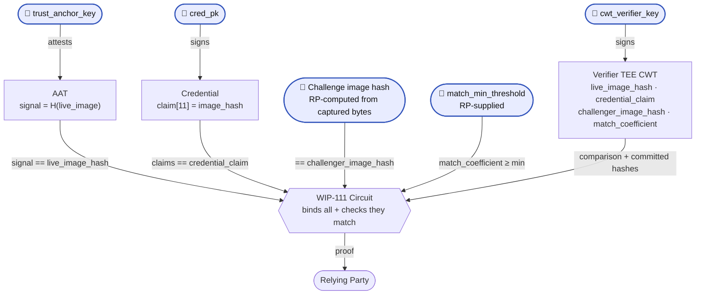

## Abstract

## Motivation

Being able to prove you are a particular person online is becoming increasingly important, such as combating deepfakes. Through the World ID Protocol, issuers can emit credentials to users committing to a particular vector embedding (e.g. representing a user's face). This spec introduces a mechanism by which an RP can challenge a user to prove they have a [Credential](https://docs.rs/world-id-primitives/latest/world_id_primitives/credential/struct.Credential.html) with an embedding which matches a challenged or expected embedding. One particular use case is proving you are the expected person behind a digital call using for example a Credential where an Issuer attests to how your face looks. 

## Specification

The key words "MUST", "MUST NOT", "REQUIRED", "SHALL", "SHALL NOT", "SHOULD", "SHOULD NOT", "RECOMMENDED", "MAY", and "OPTIONAL" in this document are to be interpreted as described in [RFC 2119](https://www.ietf.org/rfc/rfc2119.txt).

### Circuit constants

The Field ($F$), the Curve, and the Hashing ($H_t$) definitions MUST follow the requirements of [WIP-100][wip-100].

This circuit does not introduce new constants.

### Circuit Inputs

`Pub` defines a public input to the circuit. Any inputs not defined as **Pub** MUST remain private. The purpose listed below is for reference, but is non-normative. Please see the [Circuit Constraints](#circuit-constraints) for details.

| **Group** | Input | Purpose (Non-normative) |
| --- | --- | --- |
| Authenticator Assertion (WIP-106) | `aat` (Authenticator Assertion Token) | Provides (basic) integrity to the live image used for comparison based on Authenticator trust. Ensures the image that was asserted in the AAT matches the image that was compared by the verifier TEE |
| Authenticator Assertion (WIP-106) | **Pub.** `trust_anchor_key` (x, y) | Allows the RP to determine which Authenticator Providers they trust and that the AAT comes from a valid provider. |
| Authenticator Assertion (WIP-106) | **Pub.** `sec_flags` | Allows the RP to review security metadata to make decisions on whether to accept the request or not. |
| RP Inputs | **Pub.** `nonce` | Prevents replays. |
| RP Inputs | **Pub.** `session_id` (**may be _nil_**) | Allows the RP to verify the same World ID is performing this proof. |
| RP Inputs | **Pub.** `genesis_issued_at_min` | Allows the RP to specify a minimum timestamp when the type of credential was first issued. |
| RP Inputs | **Pub**. `expires_at_min` | Allows the RP to verify that a non-expired credential was used. |
| Embedding Verifier Inputs (WIP-110) | `cwt` | Provides verification that the embedding extraction and comparison process occurred in a trusted environment. |
| Embedding Verifier Inputs (WIP-110) | **Pub.** `cwt_verifier_key` | Allows the RP to verify the environment which performed the embedding extraction and comparison. |
| Embedding Verifier Inputs (WIP-110) | **Pub.** `challenge_image_hash` | Allows the RP to verify that the challenge image is the image to which the comparison is expected. |
| Embedding Verifier Inputs (WIP-110) | **Pub.** `match_min_threshold` | Allows the RP to verify that the comparison result matched their minimum match threshold. |
| Credential Validity | Merkle tree inclusion proof (`leaf_index`, `siblings`, `depth`) | Used to prove the World ID is validly registered in the `WorldIDRegistry`. |
| Credential Validity | **Pub.** `merkle_root` | RP can verify the correct `WorldIDRegistry` was used. |
| Credential Validity | Authenticator authorization (`sig_s`, `sig_r`, `pk_index`, `pk_set[]`) | To prove an authorized authenticator is executing the operation. |
| Credential Validity | Credential inputs (`cred_associated_data_hash`, `cred_genesis_issued_at`, `cred_expires_at`, `cred_s`, `cred_r`, `cred_sub_blinding_factor`, `cred_id`) | Ensures a valid credential is used for the verification process |
| Credential Validity | `claims[]` set from the credential as an array of 16 `FieldElement` | Ensures the image used in the verification environment is committed in the credential being used. |
| Credential Validity | **Pub**. `cred_pk` (signer of the user’s credential) | To verify the correct issuer of the Credential. |

### Circuit Constraints

The Embedding Similarity Proof circuit MUST implement the following constraints (order is not relevant):

## Trust Assumptions

It is imperative for RPs to understand the trust assumptions behind this proof. Similar to how using any Credential requires taking certain assumptions from the Issuer. This section is **non-normative**, but it clearly outlines all the trust assumptions.

## Use Cases

## Rationale

## Alternatives Considered

## Security

## Backwards Compatibility

This World Improvement Proposal (WIP) introduces a new interface; no existing contracts or other previously existing functionality is affected.

## Appendix: Test Vectors

[wip-100]: https://github.com/worldcoin/world-id-protocol/pull/888
