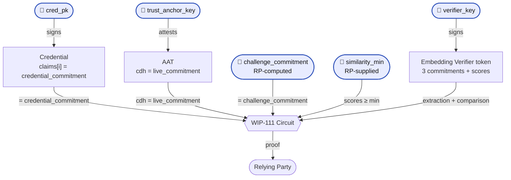

> [!NOTE]  
> This spec outlines a draft functionality for beta testing. Changes are expected.

## Abstract

This spec introduces a new ZK circuit ("Embedding Similarity Proof") which proves that an embedding committed in a user's [Credential](https://docs.rs/world-id-primitives/latest/world_id_primitives/credential/struct.Credential.html) is similar to one or two other embeddings, without revealing any of them to the verifying party (an RP).

The circuit neither extracts embeddings nor computes similarity. An Embedding Verifier ([WIP-110][wip-110]) does both, and signs a token committing to each input it consumed and each score it produced. This circuit verifies that token and checks three things: each commitment matches the party that vouches for it, the scores clear the RP's threshold, and the credential is valid.

## Motivation

Being able to prove you are a particular person online is becoming increasingly important, such as combating deepfakes. Through the World ID Protocol, issuers can emit credentials to users committing to a particular vector embedding (e.g. representing a user's face). This spec introduces a mechanism by which an RP can challenge a user to prove they have a [Credential](https://docs.rs/world-id-primitives/latest/world_id_primitives/credential/struct.Credential.html) with an embedding which matches a challenged or expected embedding. One particular use case is proving you are the expected person behind a digital call using for example a Credential where an Issuer attests to how your face looks.

## Specification

The key words "MUST", "MUST NOT", "REQUIRED", "SHALL", "SHALL NOT", "SHOULD", "SHOULD NOT", "RECOMMENDED", "MAY", and "OPTIONAL" in this document are to be interpreted as described in [RFC 2119](https://www.ietf.org/rfc/rfc2119.txt).

The terms [Authenticator](https://docs.rs/world-id-core/latest/world_id_core/struct.Authenticator.html), Issuer and [Credential](https://docs.rs/world-id-primitives/latest/world_id_primitives/credential/struct.Credential.html) are as defined in the World ID Protocol. **Embedding Verifier** is as defined in [WIP-110][wip-110].

This circuit compares three items: the **credential** item, the **live** capture, and the RP's **challenge**. It never sees any of them. It sees a commitment to each (asa a `FieldElement`), and a similarity score per compared pair. Whether an item was an image or a vector is decided in [WIP-110][wip-110] and is invisible here.

### Circuit constants

The Field ($F$), the Curve (`BabyJubJub`), and the Hashing ($H_t$) definitions MUST follow the requirements of [WIP-100][wip-100]. `H_t` refers to the hash built from a Poseidon2 permutation of `t` elements.

This circuit introduces the following constants:

| Constant | Value | Description |
|----------|-------|-------------|
| `CLAIM_INDEX` | `11` | Index in `claims` holding the credential commitment. Determined by the Issuer's claim schema. |
| `MAX_COMPARISON_AGE_SECS` | `86400` | Ceiling on the RP-supplied `comparison_age_max`, in seconds (24h). |
| `DS_WIP_111` | `127603488023523044162070750169730678246161835968334` (`b"WORLD-ID/WIP-111/SIGN"`) | Domain separator for the authenticator authorization message. MUST NOT be reused outside it. |

`NUM_KEYS`, `MERKLE_LEAF_DS`, `DS_CREDENTIAL_V1`, `DS_CREDENTIAL_SUB` and `DS_SESSION_COMMITMENT` are defined in the Query and Uniqueness Proofs, `MAX_CLAIMS` from the Credential, `AAT_MAX_LIFETIME` and `DS_TAKT` from [WIP-106][wip-106], and `DS_EDDSA` from [WIP-100][wip-100].

### Circuit Inputs

`Pub` defines a public input to the circuit. Any inputs not defined as **Pub** MUST remain private. The purpose listed below is for reference, but is non-normative. See [Circuit Constraints](#circuit-constraints) for what is enforced.

| **Group** | Input | Type | Purpose (Non-normative) |
| --- | --- | --- | --- |
| Authenticator Assertion (WIP-106) | `aat` | claims + `ES256` signature | Vouches for the live capture. Its `cdh` claim commits to the live item. |
| Authenticator Assertion (WIP-106) | `takt` | claims + EdDSA signature | Attests the `assertion_key` that signed the `aat`. |
| Authenticator Assertion (WIP-106) | **Pub.** `trust_anchor_key` | `PublicKey` | Lets the RP decide which Authenticator Providers it trusts. |
| Authenticator Assertion (WIP-106) | **Pub.** `sec_flags` | Field element | TAKT security metadata about the `assertion_key`. |
| Authenticator Assertion (WIP-106) | **Pub.** `authenticator_meta` | Field element | AAT metadata, e.g. user presence. |
| RP Inputs | **Pub.** `nonce` | Field element | Prevents replays. Also the `aat` `nonce`. |
| RP Inputs | **Pub.** `rp_id` | Field element | The `aat` audience. |
| RP Inputs | **Pub.** `now` | Field element | Current Unix timestamp, to check expiries. |
| RP Inputs | **Pub.** `session_id` (**may be _nil_**) | Field element | Lets the RP verify the same World ID is performing this proof. |
| RP Inputs | **Pub.** `genesis_issued_at_min` | Field element | Minimum timestamp for when the credential type was first issued. |
| RP Inputs | `session_id_r` | Field element | Blinding factor for the session commitment. |
| Embedding Verifier (WIP-110) | `cwt` | claims + EdDSA signature | Carries every commitment and score. See [Token Claims](#token-claims). |
| Embedding Verifier (WIP-110) | **Pub.** `verifier_key` | `PublicKey` | Lets the RP identify which Embedding Verifier ran. Signed the `cwt`. |
| Embedding Verifier (WIP-110) | **Pub.** `challenge_commitment` (**may be _nil_**) | Field element | Lets the RP verify its own challenge item was the one compared. Nil (`0`) in the 2-way flow. |
| Embedding Verifier (WIP-110) | **Pub.** `comparison_age_max` | Field element | Oldest comparison, in seconds, the RP will accept. |
| Embedding Verifier (WIP-110) | **Pub.** `similarity_min` | Field element | Lets the RP verify every score cleared its threshold. |
| Credential Validity | **Pub.** `merkle_root` | Field element | Lets the RP verify the correct `WorldIDRegistry` was used. |
| Credential Validity | **Pub.** `issuer_schema_id` | Field element | Lets the RP verify which credential type was used. |
| Credential Validity | **Pub.** `cred_pk` | `PublicKey` | Lets the RP verify the Issuer of the Credential. |
| Credential Validity | `user_pk` | [`PublicKey`; `NUM_KEYS`] | Authenticator public keys registered in the `WorldIDRegistry`. |
| Credential Validity | `pk_index` | Field element | Index in `user_pk` of the key used to sign. |
| Credential Validity | `sig_s`, `sig_r` | Field element, [Field element; 2] | EdDSA signature by the selected authenticator key. |
| Credential Validity | `leaf_index` | Field element | Index of the user's World ID in the `WorldIDRegistry`. |
| Credential Validity | `siblings` | [Field element; 30] | Sibling nodes from `leaf_index` upwards. |
| Credential Validity | `claims` | [Field element; `MAX_CLAIMS`] | Credential claims. `claims[CLAIM_INDEX]` holds the credential commitment. |
| Credential Validity | `cred_s`, `cred_r` | Field element, [Field element; 2] | EdDSA signature by the Issuer over the Credential. |
| Credential Validity | `cred_associated_data_hash`, `cred_genesis_issued_at`, `cred_expires_at`, `cred_sub_blinding_factor`, `cred_id` | Field element | Remaining Credential fields covered by the Issuer signature. |

A `PublicKey` is as defined in [WIP-100][wip-100]: an EdDSA public key as its coordinates $(x,y)$, each a Field element.

### Token Claims

Defined in [WIP-110 Token claims](wip-110.md#token-claims). The circuit reads `iat`, `credential_commitment`, `live_commitment`, `challenge_commitment`, `similarity_live` and `similarity_challenge`. All are private.

### Commitments

The equality between commitments is what anchors the proof to ecah input.

| Commitment | Equals | Vouched for by |
| --- | --- | --- |
| `credential_commitment` | `claims[i]` of the Credential | the Issuer |
| `live_commitment` | the `cdh` claim of the `aat` | the Authenticator Provider |
| `challenge_commitment` | the `challenge_commitment` public input | the RP |

The Embedding Verifier does not see the `aat`, the Credential, or the RP's public input. It only hashes the bytes it was given. Each commitment MUST be computed in the following manner:

- `credential_commitment` must be the Poseidon2 sponge defined in [WIP-100][wip-100] with the variable domain separator `CLAIMS_HASH_V1`.
- `live_commitment` must be the Poseidon2 sponge defined in [WIP-100][wip-100] with the variable domain separator `WORLD-ID/WIP-111/LIVE`.
- `challenge_commitment` must be the Poseidon2 sponge defined in [WIP-100][wip-100] with the variable domain separator `WORLD-ID/WIP-111/CHALLENGE`.

Commitments MUST be over the bytes the Embedding Verifier received. The circuit hashes nothing. Every binding above is an equality in $F$.

### Circuit Constraints

The Embedding Similarity Proof circuit MUST implement the following constraints (order is not relevant). The circuit MUST NOT introduce public inputs beyond those in [Circuit Inputs](#circuit-inputs). Groups match those in [Circuit Inputs](#circuit-inputs).

Hashing ($H_t$), EdDSA and Merkle inclusion are as defined in [WIP-100][wip-100]. The Uniqueness Proof and the Query Proof do not yet have their own WIPs; where referenced they mean those circuits as currently implemented.

#### Credential Validity

1. **Key selection.** Select `pk = user_pk[pk_index]`, constraining `pk_index < NUM_KEYS` as a comparison over the full field $F$ and not a truncating cast, for the same `pk_index` witness used to index.
2. **Empty key slots.** `user_pk` MUST hold `NUM_KEYS` entries in `WorldIDRegistry` slot order, with inactive slots encoded as the identity $(0,1)$. No separate validity check on the selected `pk` is needed: [WIP-100][wip-100] signature verification already requires it to satisfy the curve equation, lie in the prime-order subgroup and not be the identity, which is what rejects an inactive slot in constraint 5.
3. **Registry leaf.** Compute the `WorldIDRegistry` leaf as the authenticator key set commitment defined in the Query Proof: `key_set_commitment = H_16(MERKLE_LEAF_DS; user_pk[0].x, user_pk[0].y, …, user_pk[6].x, user_pk[6].y)`, the `NUM_KEYS` keys as $(x, y)$ pairs at state indices `1..14` with index `15` zero. All slots MUST be included in order, including inactive ones.
4. **Merkle inclusion proof.** Recompute the root from `key_set_commitment` at position `leaf_index` using `siblings`, per [WIP-100][wip-100], and constrain it equals `merkle_root`. [WIP-100][wip-100] fixes the depth at 30 and requires $0 < \texttt{leaf\_index} < 2^{30}$, so the circuit takes no depth input.
5. **Authenticator authorization.** Compute `message = H_4(DS_WIP_111; live_commitment, nonce, rp_id)` and verify `(sig_r, sig_s)` as a `BabyJubJub-EdDSA-Poseidon2` signature by the `pk` of constraint 1 over `message`, following all the verification requirements of [WIP-100][wip-100]. The message differs from the Query Proof, which signs the OPRF `query`.
6. **Credential subject commitment.** Compute `sub = H_3(DS_CREDENTIAL_SUB; leaf_index, cred_sub_blinding_factor)`.
7. **Claims hash.** Compute `claims_hash` as the Poseidon2 $t=16$ permutation over `[claims[0], …, claims[14], 0]`. This construction carries no domain separator; `claims[0]` occupies the capacity element. The Uniqueness Proof takes `claims_hash` as a direct input; this circuit MUST take the `claims` array and MUST use the same `claims` witness in constraint 16. FIXME: UPDATE TO CREDENTIAL V2.
8. **Credential signature.** Compute `message = H_8(DS_CREDENTIAL_V1; issuer_schema_id, sub, cred_genesis_issued_at, cred_expires_at, claims_hash, cred_associated_data_hash, cred_id)` using the `sub` of constraint 6 and the `claims_hash` of constraint 7, and verify `(cred_r, cred_s)` as a `BabyJubJub-EdDSA-Poseidon2` signature by `cred_pk` over `message`, following all the verification requirements of [WIP-100][wip-100].
9. **Credential validity window.** Range-check `cred_genesis_issued_at` and `cred_expires_at` as 64-bit values. Constrain `now < cred_expires_at` and `genesis_issued_at_min <= cred_genesis_issued_at`.
10. **Leaf-index binding.** The `leaf_index` blinded into `sub` in constraint 6, the position proven in constraint 4, and the one hashed in constraint 20 MUST be the same witness. The circuit MUST NOT accept independent values. This binding is **essential**, otherwise the circuit only proves the prover controls the `sk` of **some** registered leaf, not the one the Credential was issued to.

#### Authenticator Assertion

11. **Attestation verification.** Verify the `takt` and the `aat` together, as defined in [WIP-106][wip-106]: the `takt` signature by `trust_anchor_key` over the TAKT digest, the `aat` `ES256` signature over its COSE `Sig_structure`, both unexpired at `now`, and `aat.exp` no more than `AAT_MAX_LIFETIME` beyond `now`. The `ES256` key verifying the `aat` MUST be the `assertion_key` the `takt` attests; this is the sole binding between the two tokens. `trust_anchor_key` and `now` MUST be public inputs, otherwise a prover signs its own `takt` or picks a time at which any token is fresh.
12. **Assertion metadata exposure.** The `sec_flags` public input MUST equal the `takt` claim, unpacked with a range check on every sub-field including reserved bits. The `authenticator_meta` public input MUST equal the `aat` claim.
13. **AAT request binding.** Constrain `aat.nonce == nonce` and `aat.aud == rp_id`.

#### Embedding Verifier

14. **Token verification.** The `cwt` claims are private inputs, one field element each. Compute the digest as defined in [WIP-110 Signed digest](wip-110.md#signed-digest) and verify it as a `BabyJubJub-EdDSA-Poseidon2` signature by `verifier_key`, following all the verification requirements of [WIP-100][wip-100]. The circuit MUST NOT parse or reconstruct CBOR.
15. **Comparison age.** Constrain `iat <= now`, then `now - iat <= comparison_age_max`. The first check is required both because a future-dated token would otherwise satisfy any age bound, and because the second underflows in $F$ without it. Also constrain `comparison_age_max <= MAX_COMPARISON_AGE_SECS`, a backstop against an RP that sets no meaningful bound. `iat` stays private: the RP fixes the bound and the circuit applies it, so the exact time of the comparison need not be revealed.
16. **Credential commitment binding.** `credential_commitment` MUST equal `claims[CLAIM_INDEX]`, for the `claims` witness of constraint 7. This binding is **essential**, otherwise the circuit only proves the Embedding Verifier compared against **some** item, not the one this Credential commits to.
17. **Live commitment binding.** `live_commitment` MUST equal the `cdh` claim of the `aat`.
18. **Challenge commitment binding.** The `challenge_commitment` public input MUST equal the `challenge_commitment` claim. The equality is unconditional, so a nil public input requires the claim to be `0`, which is the 2-way flow.
19. **Similarity floor.** Constrain `similarity_live >= similarity_min`. Let `is_absent` be `1` when `challenge_commitment` is `0` and `0` otherwise, set `effective_min = similarity_min * (1 - is_absent)`, and constrain `similarity_challenge >= effective_min`.

#### RP Inputs

20. **Session commitment.** Compute `computed = H_3(DS_SESSION_COMMITMENT; leaf_index, session_id_r)` and constrain `session_id * (session_id - computed) === 0`, so `session_id` is either nil or the correct commitment.
21. **Verifier-supplied input validation.** `nonce`, `rp_id`, `now`, `similarity_min` and `comparison_age_max` MUST NOT equal `0`. These are usually intended as sentinel values and could surface an incorrect use of them.

### Verification

The circuit proves its constraints hold. It cannot decide whether the parties involved are ones the RP trusts, or whether the comparison is recent enough for the RP's purpose. Verifiers (i.e. RPs) MUST perform the following checks outside the proof:

1. **Comparison age.** `comparison_age_max` MUST be the value your policy requires; the circuit has already enforced it against the comparison time. It is RECOMMENDED to use a very short window, in the realm of a few minutes. The circuit's `MAX_COMPARISON_AGE_SECS` ceiling is only a backstop.
2. **Verifier trust.** `verifier_key` MUST be on the RP's allowlist, and its key attestation MUST be verified out of band. See [WIP-110][wip-110].
3. **Authenticator trust.** `trust_anchor_key` MUST be on the RP's allowlist, and `sec_flags` and `authenticator_meta` MUST satisfy the RP's policy. See [WIP-106][wip-106].
4. **Timestamp.** `now` MUST be a valid current timestamp. It is RECOMMENDED to accept values within 5 minutes of the verifier's local time, per [WIP-106][wip-106].
5. **Threshold and challenge.** `similarity_min` MUST be the value the RP requires, and `challenge_commitment` MUST be the commitment the RP computed over the item it supplied.

Faling to verify the public inputs from the circuit breaks security and trust assumptions. Such verifications MUST NOT be skipped.

## Trust Assumptions

RPs need to understand what they are trusting. This section is **non-normative**.

The RP trusts the Issuer to have committed an item that describes the subject, the Authenticator Provider to have captured the live item (including having performed relevant checks to prevent/mitigate tampering with the input sensor), and the Embedding Verifier to have extracted and compared honestly. The circuit adds no trust of its own. It only proves the three attestations concern the same items.

## Use Cases

> TODO

## Rationale

> TODO

## Alternatives Considered

> TODO

## Security

> TODO

## Backwards Compatibility

This World Improvement Proposal (WIP) introduces a new interface; no existing contracts or other previously existing functionality is affected.

[wip-100]: https://github.com/worldcoin/world-id-protocol/pull/888
[wip-106]: https://github.com/worldcoin/world-id-protocol/pull/676
[wip-110]: wip-110.md
