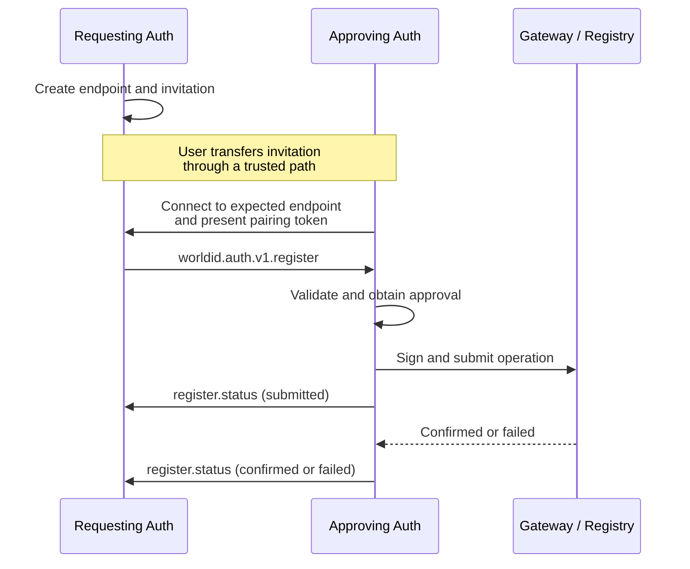

## Abstract

This proposal carries [WIP-109](wip-109.md) registration notifications over an [iroh](https://iroh.computer) connection. It defines pairing, message framing and reconnection without changing the application messages in [WIP-105](wip-105.md) or WIP-109.

## Motivation

Registration is an interactive exchange: a new authenticator supplies keys, an existing authenticator obtains user approval, and status updates follow asynchronously. A live bidirectional connection fits this flow without polling or allocating a mailbox for every message.

Iroh provides authenticated, end-to-end-encrypted QUIC connections, NAT traversal and relay fallback. Encryption applies to both direct and relayed traffic. Direct connections can reduce central infrastructure traffic; relay fallback remains necessary and is currently required for browsers.

This is a live transport, not an offline mailbox. Both authenticators must be online to exchange messages. Device-state synchronization is a possible future use of iroh, but its data model, authorization and key lifecycle are outside this proposal.

## Specification

The key words "MUST", "MUST NOT", "REQUIRED", "SHOULD", "SHOULD NOT", and "MAY" in this document are to be interpreted as described in [RFC 2119](https://www.ietf.org/rfc/rfc2119.txt).

The **Requesting Authenticator** creates the pairing invitation and accepts the connection. The **Approving Authenticator** consumes the invitation and connects. These are transport roles, not changes to their WIP-109 roles.

### Overview



### Pairing Invitation

For each registration, the Requesting Authenticator MUST generate a fresh iroh endpoint identity and a 32-byte pairing token using a CSPRNG. The endpoint key MUST be separate from World ID signing and management keys. The registration parameters MUST remain fixed for the invitation's lifetime.

The invitation is a UTF-8 JSON object with these fields:

| Member | Required | Description |
| --- | --- | --- |
| `version` | REQUIRED | Integer `1`, selecting this transport profile. |
| `endpoint_id` | REQUIRED | The requester's 32-byte Ed25519 iroh endpoint public key, encoded as 64 lowercase hexadecimal characters. |
| `relay_url` | REQUIRED | Absolute HTTPS URL of the requester's current home relay, without credentials or a fragment. |
| `registration_id` | REQUIRED | The identifier used in the WIP-109 registration notification. |
| `pairing_token` | REQUIRED | The 32-byte token encoded as unpadded base64url. |
| `expires_at` | REQUIRED | Integer Unix timestamp in seconds after which new pairing attempts are not accepted. |

The invitation MUST expire no more than ten minutes after creation. The requester MUST enforce this lifetime locally, including when its wall clock changes. The approver MUST reject an expired invitation. Expiry prevents new pairing; it does not cancel an already authenticated registration or submitted operation.

The invitation MUST be transferred through a trusted path, such as scanning directly from the intended authenticator's screen. This profile defines the invitation object, not a universal deeplink or OS application-routing format. A wrapper MUST preserve the object and MUST NOT place the token in server-visible URL components or logs.

The approver constructs an iroh endpoint address from `endpoint_id` and `relay_url`. This profile does not require public endpoint discovery or serialized iroh tickets. Implementations MUST support connecting using the supplied relay hint without requiring a public discovery record. Iroh MAY establish a direct path after connection setup.

### Connection and Pairing

Connections MUST negotiate the exact ALPN bytes `worldid/auth/register/1`. Implementations MUST authenticate iroh endpoint identities and wait for handshake completion before exchanging application data; registration MUST NOT use 0-RTT application data.

The approver MUST verify that the authenticated remote endpoint ID equals the invitation's `endpoint_id`. It opens exactly one bidirectional QUIC stream and writes the decoded 32-byte pairing token as the stream's first bytes. It sends no WIP-109 message before pairing succeeds.

The requester MUST read exactly 32 bytes, compare the token in constant time and reject invalid tokens without sending registration data. It MUST apply a bounded pairing timeout and rate-limit unsuccessful attempts. The token is a bearer credential, not proof of World ID management authority.

On the first valid token, the requester MUST atomically bind the invitation to the authenticated approver endpoint ID. Subsequent connections for that invitation MUST authenticate the same endpoint ID and token. Other endpoints MUST be rejected, even if they possess the token. Only one connection may be active for a registration; a successfully authenticated replacement connection supersedes the previous one.

The requester then sends the WIP-109 registration notification. Receipt of this notification indicates successful pairing; no additional pairing response or JSON-RPC request is needed. The approver MUST check that its `registration_id` matches the invitation before processing it.

### Message Framing

After the token prefix in the approver-to-requester direction, both stream directions use the same framing:

```text
uint32_be(payload_length) || UTF8(json_notification)
```

The length excludes the four-byte prefix and MUST be between 1 and 65,536 bytes. Receivers MUST validate it before allocating the payload buffer. Each payload MUST contain exactly one WIP-105 JSON object, not a batch or concatenated objects.

The requester sends `worldid.auth.v1.register`; the approver sends `worldid.auth.v1.register.status`. Both are WIP-109 notifications without `id`. No additional encryption envelope, message identifier or sequence number is added. Implementations MUST process complete frames in order within each direction and MUST NOT wait for stream closure to parse a notification.

Malformed framing, invalid UTF-8 or JSON, unexpected methods or message directions, and extra streams MUST terminate the connection without a JSON-RPC error response. Validly framed application validation failures follow WIP-109. QUIC datagrams and additional streams are not used by this profile.

### Completion and Reconnection

Either authenticator MAY end the connection. Connection failure, invitation expiry and transport timeouts MUST NOT be interpreted as registration failure or cancellation of a submitted operation. WIP-109's unknown-outcome and reconciliation rules apply.

While waiting for user approval or registry confirmation, implementations SHOULD keep the connection alive within their platform's lifecycle limits. They MUST NOT assume that a mobile application or browser tab can remain active in the background.

To reconnect, the approver repeats the handshake and token prefix using the same endpoint identity. The requester resends the unchanged registration notification, and the approver resumes processing or replays its latest recorded status according to WIP-109. Authenticated reconnections with the bound peer MAY continue after invitation expiry to resume processing or retrieve a retained terminal status. Implementations MUST define a bounded reconnection retention period independently of invitation expiry. No new peer may pair after expiry.

Both authenticators MUST retain the endpoint identity, token and pairing binding for as long as they offer reconnection. Registration deduplication and pending-operation records MUST outlive transport abandonment whenever required by WIP-109. If transport state is lost or the session is abandoned, an uncertain operation outcome MUST be reconciled before another operation is submitted. A key's absence from current account state does not prove that a pending submission cannot still execute. Reconnection is not durable message delivery or an exactly-once guarantee.

After sending a terminal status, the approver SHOULD finish its send stream and wait for the requester to close the connection rather than immediately closing and potentially discarding buffered data. The requester SHOULD close after processing that status. A bounded shutdown timeout MAY release resources; it does not prove application receipt. Terminal status and deduplication state MUST NOT be discarded merely because a transport write succeeded.

## Deployment and Tradeoffs

### Compared with wallet-bridge

The [wallet-bridge implementation](https://github.com/worldcoin/wallet-bridge/tree/64424b6) provides temporary Redis-backed request/response mailboxes, HTTP polling and destructive payload retrieval. Payload encryption and key exchange belong to clients. Its 15-minute per-write retention allows limited asynchronous exchange without both devices being connected simultaneously.

| Property | wallet-bridge | This iroh profile |
| --- | --- | --- |
| Interaction | Single-use HTTP request/response mailboxes | Live bidirectional stream |
| Delivery infrastructure | API, Redis payload/status storage and polling | Live endpoint/relay connections; no durable mailbox |
| Encryption | Application-managed ciphertext and off-band keys | Iroh endpoint-authenticated E2EE, including relay paths |
| Offline recipient | Temporary mailbox retention | No delivery until both peers reconnect |
| Central traffic | Every payload and poll | Relayed traffic; direct native paths can bypass payload relay |
| Client responsibility | Encryption, mailbox chaining and retries | Pairing, connection lifecycle and retries |

Iroh is not entirely stateless: relays maintain live routing/connection state, and clients retain pairing and registration state. Removing message storage does not remove infrastructure or availability requirements.

Neither architecture establishes a scalability winner without measurements. For `N` pending clients polling every `T` seconds, wallet-bridge incurs approximately `N/T` polling requests per second before payload traffic. Iroh instead incurs concurrent-connection, keepalive and relayed-bandwidth costs. Small registration payloads may make polling and connection duration more important than direct-path bandwidth savings.

### Platform and Infrastructure Constraints

- [Browsers](https://docs.iroh.computer/languages/wasm-browser) currently use WASM and require relays for every connection. Native Node.js bindings are not browser bindings. Browser-to-device registration MUST NOT depend on a direct path.
- [Swift](https://docs.iroh.computer/languages/swift) and [Kotlin](https://docs.iroh.computer/languages/kotlin) bindings exist, but packaging and mobile lifecycle behavior require validation. Current Kotlin guidance requires building native Android bindings from source.
- Public relays are rate-limited. Production deployment needs an explicit managed or self-hosted relay plan, capacity testing and failure handling; it MUST NOT assume unlimited public relay capacity. Browser relay availability is part of registration availability.
- Implementations MUST bound invitation size, connection attempts, frame-read time and simultaneous sessions. Relay destinations supplied by invitations MUST be validated against the client's network security policy. Implementations MUST NOT distribute a project-wide relay administration or API signing secret in clients.

Before adoption, prototype browser/iOS/Android interoperability, long approval delays, network handover, background suspension, relay outage and uncertain-submission recovery. Measure connection success and latency, native direct-path rate, browser relay demand, concurrent sessions, bandwidth, battery impact and infrastructure cost against the current bridge workload.

## Security

The invitation authenticates the requester to the approver through the pinned endpoint ID; possession of its token admits the approver to the requester. This depends on trusted invitation transfer. Replacing the complete invitation can redirect pairing to an attacker; stealing it can let an attacker race the intended approver. Neither TLS nor the token fixes a compromised pairing path. Tokens MUST NOT be logged, included in analytics or exposed to untrusted applications.

Iroh identity authentication is not World ID authorization. WIP-109's account validation and explicit user approval remain mandatory before a new registration is signed. Receiving a status from the paired endpoint does not make the endpoint trustworthy if that device is compromised.

Relays cannot decrypt application traffic, but can observe endpoint and network metadata, timing and traffic volume. Direct connections reveal peer IP addresses. Fresh per-registration endpoint identities reduce stable transport identifiers but do not guarantee unlinkability, particularly if public discovery is enabled.

This profile does not authorize later state synchronization or retain permanent device relationships. A future sync protocol needs separate peer authorization, revocation, data-access rules and transport identity lifecycle. Registration tokens and connections MUST NOT implicitly grant that access.

## Backwards Compatibility

This is an optional transport for WIP-109. Its notification methods and fields are unchanged. Wallet-bridge mailboxes and this live transport are not wire-compatible; there is no automatic fallback that replays an uncertain registration over another transport.

## References

- [Iroh endpoints and identity](https://docs.iroh.computer/concepts/endpoints)
- [Connecting endpoints and address tickets](https://docs.iroh.computer/connect-two-endpoints)
- [QUIC streams and connection shutdown](https://docs.iroh.computer/protocols/using-quic)
- [Relays](https://docs.iroh.computer/concepts/relays)
- [Security and privacy](https://docs.iroh.computer/concepts/security-privacy)
- [Iroh FAQ](https://docs.iroh.computer/about/faq)

This draft was researched against current documentation on 2026-09-08. SDK, FFI and relay versions must be pinned and interoperability-tested before adoption; the profile version is not an SDK version.
