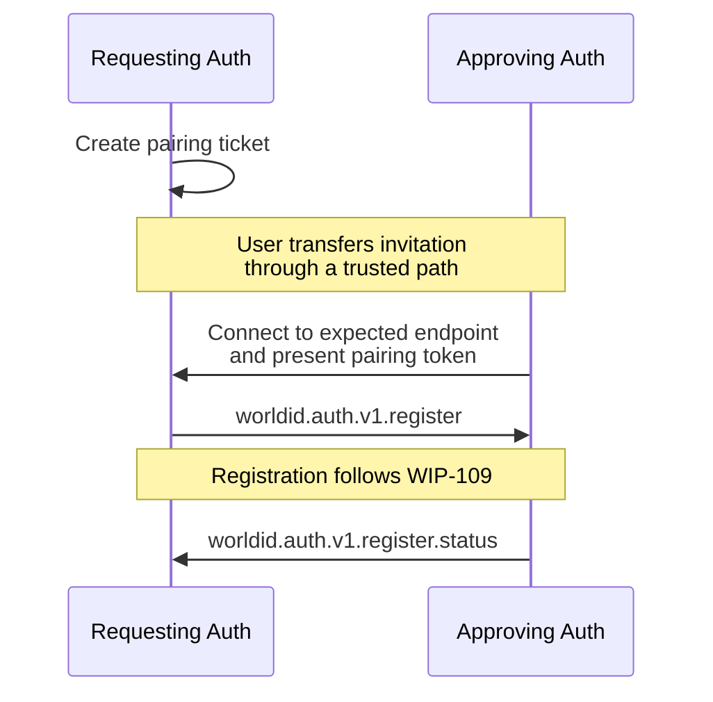

## Abstract

This proposal defines how [WIP-109](wip-109.md) notifications can be carried over an [iroh](https://iroh.computer) connection. It defines pairing and message framing.

## Motivation

Registration is an interactive exchange: a new authenticator supplies keys, an existing authenticator obtains user approval, and status updates follow asynchronously. A live bidirectional connection fits this flow without polling or allocating a mailbox for every message.

Iroh provides authenticated, end-to-end-encrypted QUIC connections, NAT traversal and relay fallback. Encryption applies to both direct and relayed traffic. Direct connections can reduce central infrastructure traffic; relay fallback remains necessary and is currently required for browsers.

This is a live transport, not an offline mailbox. Both authenticators must be online to exchange messages.

## Specification

The key words "MUST", "MUST NOT", "REQUIRED", "SHOULD", "SHOULD NOT", and "MAY" in this document are to be interpreted as described in [RFC 2119](https://www.ietf.org/rfc/rfc2119.txt).

The **Requesting Authenticator** creates the pairing invitation and accepts the connection. The **Approving Authenticator** consumes the invitation and connects.

### Overview



### Pairing Invitation

The Requesting Authenticator uses an iroh endpoint. Endpoint identity generation and persistence are implementation details outside this profile. For each registration, it MUST generate a fresh 32-byte pairing token using a CSPRNG. The registration parameters MUST remain fixed for the invitation's lifetime.

The pairing invitation is a URI:

```text
worldid://auth/v1/register/iroh?endpoint_ticket={endpoint_ticket}&registration_id={registration_id}&pairing_token={pairing_token}&expires_at={expires_at}
```

The authority is `auth` and the path is `/v1/register/iroh`. The path selects version 1 of this transport profile. The query parameters are:

| Parameter | Required | Description |
| --- | --- | --- |
| `endpoint_ticket` | REQUIRED | String containing the requester's iroh `EndpointTicket`, using iroh's text serialization. It includes the endpoint ID and MUST include a current relay address to support browser connections. |
| `registration_id` | REQUIRED | The identifier used in the WIP-109 registration notification. |
| `pairing_token` | REQUIRED | The 32-byte token encoded as unpadded base64url. |
| `expires_at` | REQUIRED | Unix timestamp in seconds, encoded as unsigned decimal digits, after which new pairing attempts are not accepted. |

Query values MUST be UTF-8 percent-encoded using RFC 3986 encoding; unreserved characters may remain literal. Receivers MUST decode values exactly once and MUST NOT interpret `+` as a space. Parameter order is insignificant. Missing, duplicate or unknown parameters, invalid encodings, unsupported paths, user information, ports and fragments MUST be rejected.

The invitation MUST expire no more than ten minutes after creation. The requester MUST enforce this lifetime locally, including when its wall clock changes. The approver MUST reject an expired invitation. Expiry prevents new pairing; it does not cancel an already authenticated registration or submitted operation.

The Requesting Authenticator MUST make the invitation URI available as copyable text or a QR code and MAY offer it as a clickable deeplink. All forms carry the same complete URI. Approving Authenticators MUST support importing it by text or QR scanning and SHOULD register a `worldid` URI handler where supported by the platform. Handlers MUST validate the authority, path and parameters before connecting. Opening a URI initiates pairing, not approval of registration.

The user MUST transfer the invitation directly from the intended authenticator through a trusted path. The URI contains a bearer credential and MUST NOT be included in logs, analytics or external link-preview requests.

The approver parses `endpoint_ticket` to obtain the expected endpoint ID and address information. Implementations MUST support connecting using the supplied relay hint without requiring a public discovery record and MUST reject unsupported or invalid ticket encodings. Iroh MAY establish a direct path after connection setup.

The endpoint ticket supplies identity and reachability information, not permission to receive registration data. The pairing token proves possession of the complete invitation and restricts admission to the registration session; iroh provides connection encryption.

### Connection and Pairing

Connections MUST negotiate the exact ALPN bytes `worldid/auth/register/1`. Implementations MUST authenticate iroh endpoint identities and wait for handshake completion before exchanging application data; registration MUST NOT use 0-RTT application data.

The approver MUST verify that the authenticated remote endpoint ID equals the endpoint ID in the invitation's `endpoint_ticket`. It opens exactly one bidirectional QUIC stream and writes the decoded 32-byte pairing token as the stream's first bytes. It sends no WIP-109 message before pairing succeeds.

The requester MUST read exactly 32 bytes, compare the token in constant time and reject invalid tokens without sending registration data. It MUST apply a bounded pairing timeout and rate-limit unsuccessful attempts. The token is a bearer credential, not proof of World ID management authority.

On the first valid token, the requester MUST atomically bind the invitation to the authenticated approver endpoint ID. Subsequent connections for that invitation MUST authenticate the same endpoint ID and token. Other endpoints MUST be rejected, even if they possess the token. Only one connection may be active for a registration; a successfully authenticated replacement connection supersedes the previous one.

The requester then sends the WIP-109 registration notification. Receipt of this notification indicates successful pairing; no additional pairing response or JSON-RPC request is needed. The approver MUST check that its `registration_id` matches the invitation before processing it.

### Message Framing

After the token prefix in the approver-to-requester direction, both stream directions use the same framing:

```text
uint32_be(payload_length) || UTF8(json_notification)
```

The length excludes the four-byte prefix and MUST be between 1 and 65,536 bytes. Receivers MUST validate it before allocating the payload buffer. Each payload MUST contain exactly one WIP-105 JSON object, not a batch or concatenated objects.

The requester sends `worldid.auth.v1.register`; the approver sends `worldid.auth.v1.register.status`. Both are WIP-109 notifications without `id`. No additional encryption envelope, message identifier or sequence number is added. Implementations MUST process complete frames in order within each direction and MUST NOT wait for stream closure to parse a notification.

Malformed framing, invalid UTF-8 or JSON, unexpected methods or message directions, and extra streams MUST terminate the connection without a JSON-RPC error response. Validly framed application validation failures follow WIP-109. QUIC datagrams and additional streams are not used by this profile.

### Completion and Reconnection

WIP-109 defines registration outcomes, retries and reconciliation. Connection loss, transport timeouts and invitation expiry are transport events, not application outcomes.

While waiting for user approval or registry confirmation, implementations SHOULD keep the connection alive within their platform's lifecycle limits. They MUST NOT assume that a mobile application or browser tab can remain active in the background.

To reconnect, the approver repeats the handshake and token prefix using the same endpoint identity. The requester resends the unchanged registration notification, and the approver resumes processing or replays its latest recorded status according to WIP-109. Authenticated reconnections with the bound peer MAY continue after invitation expiry to resume processing or retrieve a retained terminal status. Implementations MUST define a bounded reconnection retention period independently of invitation expiry. No new peer may pair after expiry.

Reconnection requires the same endpoint identities, token and pairing binding; how implementations maintain that state is outside this profile. WIP-109's deduplication requirements remain in force after transport abandonment.

After sending a terminal status, the approver SHOULD finish its send stream and wait for the requester to close the connection rather than immediately closing and potentially discarding buffered data. The requester SHOULD close after processing that status. A bounded shutdown timeout MAY release resources; it does not prove application receipt. Terminal status and deduplication state MUST NOT be discarded merely because a transport write succeeded.

## Security

Implementations MUST bound invitation size, connection attempts, frame-read time and simultaneous sessions. Relay destinations supplied by invitations MUST be validated against the client's network security policy.

The invitation authenticates the requester to the approver through the pinned endpoint ID; possession of its token admits the approver to the requester. This depends on trusted invitation transfer. Replacing the complete invitation can redirect pairing to an attacker; stealing it can let an attacker race the intended approver. Neither TLS nor the token fixes a compromised pairing path. Tokens MUST NOT be logged, included in analytics or exposed to untrusted applications.

Iroh authenticates transport peers; WIP-109 governs account authorization.

Relays cannot decrypt application traffic, but can observe endpoint and network metadata, timing and traffic volume. Direct connections reveal peer IP addresses. Reusing endpoint identities can link separate registrations and connections, particularly if public discovery is enabled.

## References

- [Iroh endpoints and identity](https://docs.iroh.computer/concepts/endpoints)
- [Connecting endpoints and address tickets](https://docs.iroh.computer/connect-two-endpoints)
- [QUIC streams and connection shutdown](https://docs.iroh.computer/protocols/using-quic)
- [Relays](https://docs.iroh.computer/concepts/relays)
- [Security and privacy](https://docs.iroh.computer/concepts/security-privacy)
- [Iroh FAQ](https://docs.iroh.computer/about/faq)
