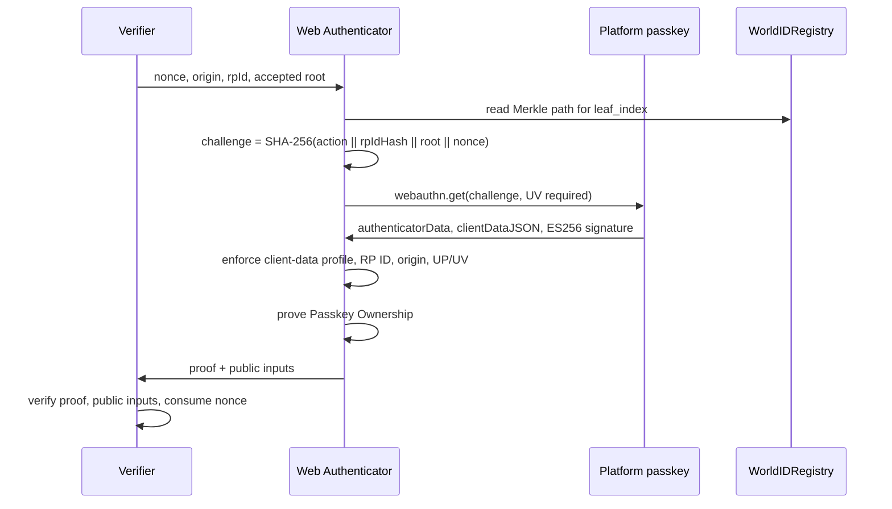

## 1. Abstract

This spec introduces a new ZK circuit ("Passkey Ownership Proof") to the World ID Protocol that allows a user to prove they control an ES256 / P-256 [WebAuthn][webauthn] passkey registered as a [WIP-104](wip-104.md) **Proving Authenticator** for a `WorldIDRegistry` leaf. The passkey signs the proof request directly. The circuit verifies the P-256 signature, a restricted `webauthn.get` client-data profile, RP-ID and origin binding, user-presence and user-verification flags, the passkey slot commitment, and Merkle inclusion of a mixed-authenticator account leaf.

This construction replaces deriving a BabyJubJub proving secret from the WebAuthn PRF extension for passkey-authenticated proving. The separate PRF output used to encrypt a credential vault is out of scope and is unaffected.

The Passkey Ownership Proof establishes **passkey control and registry inclusion only**. It does not attest personhood, uniqueness, credential validity, or Query / Nullifier semantics.

## 2. Motivation

World ID 4.0 abstracts a World ID into a registry record with multiple authenticators ([WIP-104](wip-104.md)). A web-based authenticator is a primary product goal of the 4.0 upgrade: a user authenticates with a platform passkey in the browser, generates a proof, and returns it to a Relying Party.

An earlier engineering default derived the World ID proving key from the WebAuthn **PRF** extension: the PRF output became (or seeded) a BabyJubJub EdDSA secret, after which existing Query / Ownership circuits could run unchanged. That approach works where PRF is available, but it has material downsides:

1. **PRF availability is uneven.** Safari, Firefox, and several platform authenticators do not expose PRF, or expose it only under additional flags. ES256 passkey signatures are the WebAuthn baseline.
2. **The derived key is an extractable World ID secret.** Once the PRF output is in software, the proving key can be copied, which weakens the hardware binding the passkey was meant to provide.
3. **Every proof still depends on a software EdDSA signature**, not on a user-verified assertion from the passkey itself.

Signing the proof request with the passkey directly keeps the P-256 private key in the authenticator, requires user verification on each proof, and works on browsers that implement ES256 WebAuthn even when PRF is absent. The cost is a new circuit: P-256 / WebAuthn verification is not expressible with the existing EdDSA Ownership Proof ([WIP-103](wip-103.md)).

This spec standardizes that circuit and the registry commitments it depends on, so a passkey can be a first-class proving authenticator rather than a wrapper around a derived BabyJubJub key.

## 3. Specification

The key words "MUST", "MUST NOT", "REQUIRED", "SHALL", "SHALL NOT", "SHOULD", "SHOULD NOT", "RECOMMENDED", "MAY", and "OPTIONAL" in this document are to be interpreted as described in [RFC 2119](https://www.ietf.org/rfc/rfc2119.txt).

The terms [Authenticator](https://docs.rs/world-id-core/latest/world_id_core/struct.Authenticator.html) and [Credential](https://docs.rs/world-id-primitives/latest/world_id_primitives/credential/struct.Credential.html) are as defined in the World ID Protocol. Authenticator classes follow [WIP-104](wip-104.md). Field, Poseidon2 hashing $H_t$, and Merkle inclusion follow [WIP-100][wip-100] unless this spec says otherwise.

This specification introduces a new circuit to the Protocol: **"Passkey Ownership Proof"**.

A **non-normative high-level description** of what the circuit proves:

> 1. The WebAuthn challenge is bound to a fixed action domain, the RP ID, the `WorldIDRegistry` root, and a verifier nonce.
> 2. An ES256 passkey produced a `webauthn.get` assertion over that challenge, for a specific origin, with user presence and user verification.
> 3. That passkey is committed in a registered authenticator slot of a `WorldIDRegistry` leaf, and the leaf is included under the public root.

The Passkey Ownership Proof circuit MUST introduce the following inputs. The circuit MUST NOT introduce any additional public inputs which are not specified in this or a future spec.

| Input | Visibility | Type | Description |
| ----- | ---------- | ---- | ----------- |
| `root` | **Public** | Field element | Latest (or otherwise accepted) `WorldIDRegistry` Merkle root. |
| `challenge` | **Public** | `[u8; 32]` | WebAuthn challenge. MUST equal the [proof-request challenge](#32-proof-request-challenge). |
| `rp_id_hash` | **Public** | `[u8; 32]` | `SHA-256(rpId)` as placed in `authenticatorData`. |
| `origin_hash` | **Public** | `[u8; 32]` | `SHA-256` of the exact expected WebAuthn origin, including scheme and port. |
| `nonce` | **Public** | `[u8; 32]` | Verifier-issued one-time value. See [Nonce](#37-nonce). |
| `public_key_x` | Private | `[u8; 32]` | Uncompressed P-256 public key $x$ coordinate, big-endian. |
| `public_key_y` | Private | `[u8; 32]` | Uncompressed P-256 public key $y$ coordinate, big-endian. |
| `signature` | Private | `[u8; 64]` | ECDSA signature encoded as `r \|\| s`, each 32-byte big-endian. |
| `client_data_json` | Private | `BoundedVec<u8, 256>` | Signed `clientDataJSON` bytes. Only bytes within `len` are covered by the signature. |
| `authenticator_data` | Private | `BoundedVec<u8, 64>` | Signed `authenticatorData` bytes. |
| `challenge_index` | Private | `u32` | Byte offset of the base64url challenge field in `clientDataJSON`. MUST equal `36`. |
| `slot_commitments` | Private | `[Field; NUM_KEYS]` | Per-slot commitments that hash to the account leaf. |
| `passkey_slot_index` | Private | `u32` | Index of the passkey slot in `slot_commitments`. |
| `leaf_index` | Private | `u32` | Index of the account in the `WorldIDRegistry` tree. |
| `siblings` | Private | `[Field; MAX_DEPTH]` | Merkle siblings from `leaf_index` to `root`. |

### 3.1 Circuit constants

Poseidon2 $H_t$ and Merkle hashing MUST follow [WIP-100][wip-100]. P-256 verification uses ECDSA with SHA-256 (COSE algorithm `-7` / ES256) on the NIST P-256 curve (`secp256r1`). Domain separators that are Poseidon2 capacity elements MUST follow the [WIP-100][wip-100] ASCII-label encoding (at most 31 bytes, big-endian octet-string-to-integer).

| Constant | Value | Description |
| -------- | ----- | ----------- |
| `NUM_KEYS` | `7` | Authenticator slots per account. Matches the Nullifier Proof circuit and the `WorldIDRegistry`. |
| `MAX_DEPTH` | `30` | Merkle path length. The circuit is fixed at this depth; `depth` is not a public input. |
| `CLIENT_DATA_JSON_MAX_LEN` | `256` | Maximum signed `clientDataJSON` length. |
| `AUTHENTICATOR_DATA_MAX_LEN` | `64` | Maximum signed `authenticatorData` length. |
| `P256_LIMBS` | `3` | 120-bit limbs used to commit a 32-byte P-256 coordinate. Order is `[low, mid, high]`. |
| `DS_PASSKEY_SLOT` | `1946547295039501641724099466078281182247605809` (`b"WID_PASSKEY_SLOT_V1"`) | Domain separator for a passkey slot commitment. MUST NOT be reused outside this construction. |
| `DS_MIXED_AUTH_SET` | `127568923526698591992218025179744430956107526002225` (`b"WID_MIXED_AUTH_SET_V1"`) | Domain separator for the mixed-authenticator account leaf. MUST NOT be reused outside this construction. |
| `PROOF_REQUEST_ACTION` | `b"world-id-proof-v1"` | Action domain mixed into every proof-request challenge. Padded with zeros to 32 bytes. |

`MERKLE_LEAF_DS` (`b"World ID PK"`) from [WIP-103](wip-103.md) MUST NOT be used as the account leaf domain separator for passkey-capable accounts. See [Account leaf](#34-account-leaf).

### 3.2 Proof-request challenge

The WebAuthn challenge is not an opaque random 32-byte string. Authenticators and the circuit MUST derive it as:

```
challenge = SHA-256( pad32(PROOF_REQUEST_ACTION) || rp_id_hash || root_be32 || nonce )
```

where:

1. `pad32(PROOF_REQUEST_ACTION)` is the 17-byte ASCII label `world-id-proof-v1` followed by 15 zero bytes.
2. `rp_id_hash` is the public 32-byte SHA-256 of the WebAuthn RP ID (a hostname, without scheme or port).
3. `root_be32` is the public registry `root` encoded as a 32-byte big-endian $F_q$ element.
4. `nonce` is the public 32-byte verifier nonce.

The circuit MUST recompute this digest and constrain it equal to the public `challenge`. A proof whose public `challenge` does not match this formula MUST be rejected by the circuit.

This binding is what stops a signature over an unrelated WebAuthn challenge from being replayed against a different RP, registry root, or nonce.

### 3.3 WebAuthn assertion

The circuit MUST verify a `webauthn.get` assertion as follows.

#### 3.3.1 Authenticator data

1. `authenticator_data.len` MUST be at least `37` and at most `AUTHENTICATOR_DATA_MAX_LEN`.
2. Bytes `[0..32)` MUST equal the public `rp_id_hash`.
3. Byte `32` is the flags byte. `(flags & 0x05) == 0x05` MUST hold, i.e. **User Present** (bit 0) and **User Verified** (bit 2) MUST both be set. Other flag bits are unconstrained by this version of the circuit.
4. The signature counter and any attested-credential or extension data within the bounded length are unconstrained by this version. Replay protection is provided by the [nonce](#37-nonce), not by `signCount`.

#### 3.3.2 Client data profile

This spec deliberately does **not** define a general-purpose in-circuit JSON parser. The circuit MUST accept only the compact `clientDataJSON` profile below. Implementations MUST treat this as a supported browser profile, not as WebAuthn Level 2/3 in full generality.

Let `clientDataJSON` be the bounded vector of length `n`. All inspected bytes MUST satisfy `index < n`. Unsigned storage padding MUST NOT supply a challenge, origin, or terminator.

1. `n` MUST be at least `94`.
2. Bytes `[0..36)` MUST equal the ASCII prefix `{"type":"webauthn.get","challenge":"`. Consequently `challenge_index` MUST equal `36`.
3. Bytes `[36..79)` MUST equal the base64url encoding of the 32-byte `challenge` **without padding** (43 characters). The encoding alphabet is `A-Z`, `a-z`, `0-9`, `-`, `_`.
4. Bytes `[79..91)` MUST equal `","origin":"`.
5. Starting at byte `91`, the origin MUST be a non-empty run of unescaped printable ASCII (bytes `0x21` through `0x7e`, excluding `0x5c` `\`). The origin MUST NOT contain `"` or `\`. The first `"` after byte `91` terminates the origin. `SHA-256(origin_bytes)` MUST equal the public `origin_hash`.
6. After the origin's closing quote, exactly one of the following suffixes is allowed:
   1. `}` — terminator, no further fields.
   2. `,"crossOrigin":false}` — explicit same-origin assertion.
   3. `,"crossOrigin":false,"other_keys_can_be_added_here":"<value>"}` — Chromium diagnostic extension. `<value>` MUST be unescaped printable ASCII (bytes `0x20` through `0x7e`, excluding `"` and `\`) and MUST NOT introduce another JSON field.

Any other ordering, unknown or duplicate field, escaped origin, `crossOrigin: true`, trailing bytes, or `type` other than `webauthn.get` MUST cause proving to fail.

> [!NOTE]
> Chromium intermittently appends `other_keys_can_be_added_here` as a diagnostic reminder not to template-match `clientDataJSON`. The field carries no protocol policy. Accepting it after `crossOrigin: false` is required for Chrome compatibility; its value MUST remain unable to smuggle an extra field.

#### 3.3.3 Signature

Let `client_data_hash = SHA-256(clientDataJSON[0..n])` over the signed length only. Let `signed_message = authenticatorData[0..m] || client_data_hash`. Let `hashed_message = SHA-256(signed_message)`.

The circuit MUST verify that `signature = r || s` is a valid ECDSA-SHA-256 signature by the P-256 point `(public_key_x, public_key_y)` over `hashed_message`. The public key MUST be a valid non-identity point on P-256. `r` and `s` MUST be in the P-256 scalar range.

Implementations MAY additionally reject high-$s$ signatures outside the circuit. This spec does not require low-$s$ normalization in-circuit.

### 3.4 Account leaf

Passkey-capable accounts MUST use a **mixed-authenticator-set** leaf, not the 14-coordinate EdDSA leaf of [WIP-103](wip-103.md).

#### 3.4.1 P-256 limb encoding

A 32-byte big-endian P-256 coordinate MUST be split into three field elements, each constrained to at most 120 bits:

```
low  = bytes[17..32]   // 15 bytes
mid  = bytes[2..17]    // 15 bytes
high = bytes[0..2]     // 2 bytes
```

Limb order in Poseidon2 state is `[low, mid, high]`.

#### 3.4.2 Passkey slot commitment

For a passkey public key `(x, y)`:

```
passkey_slot_commitment =
  H_16(DS_PASSKEY_SLOT; x_low, x_mid, x_high, y_low, y_mid, y_high)
```

with remaining Poseidon2-$t_{16}$ state elements equal to `0`, digest at state index `1`, per [WIP-100][wip-100] $H_t$.

When a passkey is registered, `insertAuthenticator` MUST write this field element as `newAuthenticatorPubkey` for that `pubkeyId`. The authenticator MUST be a [WIP-104](wip-104.md) **Proving Authenticator**: `newAuthenticatorAddress` MUST be `address(0)`, and the passkey MUST NOT authorize management operations.

#### 3.4.3 Mixed-authenticator-set commitment

Let `slot_commitments` be an array of `NUM_KEYS` field elements in registry slot order.

```
account_leaf = H_16(DS_MIXED_AUTH_SET; slot_commitments[0], …, slot_commitments[NUM_KEYS-1])
```

with remaining state elements equal to `0`, digest at state index `1`.

Empty slots MUST be the field `0`. A passkey slot MUST equal `passkey_slot_commitment` for the asserting public key. Other occupied slots MAY hold an EdDSA compressed public key or another future slot commitment; this circuit does not interpret them beyond including them in the leaf.

The circuit MUST:

1. Constrain `passkey_slot_index < NUM_KEYS` as a comparison over $F_q$, not as a truncating cast.
2. Recompute `passkey_slot_commitment` from `(public_key_x, public_key_y)` and constrain `slot_commitments[passkey_slot_index]` equal to it.
3. Recompute `account_leaf` from `slot_commitments`.
4. Recompute `root` from `account_leaf` at `leaf_index` with `siblings`, using the [WIP-100][wip-100] Merkle hasher (Poseidon2 $P_2$ with `hash_state[0] + left`).

The same `leaf_index` MUST be the Merkle position of `account_leaf`. The circuit MUST NOT accept two independent indices.

> [!IMPORTANT]
> The mixed-authenticator-set leaf is **not** interchangeable with the [WIP-103](wip-103.md) / Query / Nullifier leaf `H_16(MERKLE_LEAF_DS; pk0.x, pk0.y, …, pk6.x, pk6.y)`. An account whose `offchainSignerCommitment` uses `DS_MIXED_AUTH_SET` cannot currently produce those proofs. Uniqueness proving from a passkey-only account is [future work](#9-future-work). Existing EdDSA-only accounts are unaffected.

### 3.5 Passkey registration

1. The passkey MUST be ES256 (COSE `-7`). Other algorithms MUST be rejected.
2. Registration MUST request `userVerification: "required"` and a resident / discoverable credential (`residentKey: "required"`).
3. Attestation statement type is not consumed by the circuit. Authenticators MAY use `attestation: "none"`.
4. The RP ID MUST be a WebAuthn RP ID (hostname). It MUST NOT be a raw IP address.
5. Authenticators MUST persist the credential ID and MUST compare the assertion's credential ID with the registered ID before proving. The circuit does not see the credential ID; this check is an authenticator obligation.
6. Slot assignment MUST use a free `pubkeyId` in `[0, NUM_KEYS)`. The reference implementation uses slot `1` so that slot `0` remains available for an Admin Authenticator created at `createAccount`.
7. A passkey MUST NOT be registered as an Admin Authenticator in this version. Account management and recovery remain on a secp256k1 Management Key per [WIP-104](wip-104.md).

### 3.6 Authenticator proving obligations

When generating a Passkey Ownership Proof, an Authenticator MUST:

1. Obtain `root`, `rpId`, `origin`, and `nonce` from the verifier (or reconstruct `root` from a trusted registry view the verifier accepts).
2. Derive `challenge` per [§3.2](#32-proof-request-challenge).
3. Request a `webauthn.get` assertion with `userVerification: "required"` and `allowCredentials` restricted to the registered credential ID.
4. Reject the assertion unless it satisfies the [client-data profile](#332-client-data-profile), RP-ID hash, origin, and UP/UV flags **before** proving. Policy failures MUST NOT be deferred solely to signature verification.
5. Build the witness from the signed assertion, slot commitments, and Merkle path, then prove.

Authenticators MUST NOT generate Passkey Ownership Proofs except for the [use cases](#4-use-cases) in this spec or a future spec that references this one.

### 3.7 Nonce

The nonce prevents replay of a valid assertion against the same RP and root.

1. **Provenance.** Verifiers MUST generate and provide the nonce. Authenticators MUST NOT choose nonces.
2. **Single use.** Verifiers MUST enforce that a nonce is used at most once and MUST invalidate it after first successful verification.
3. **Entropy.** Verifiers MUST sample 32 bytes from a CSPRNG. The all-zero nonce is NOT valid.
4. **Expiration.** Nonces MUST have a defined TTL. Verifiers MAY choose the TTL mechanism.
5. The circuit binds the nonce into `challenge` but cannot know which nonce the verifier intended. A verifier that accepts the public `nonce` from the prover without comparing it to a nonce it issued gains no replay protection.

### 3.8 Origin and RP ID

1. `origin` MUST be the exact WebAuthn origin string, including scheme and port (e.g. `https://worldid.example:443` vs `http://localhost`).
2. Verifiers MUST compute `origin_hash = SHA-256(origin)` over that exact string and MUST reject proofs whose public `origin_hash` does not match.
3. `rpId` MUST be the WebAuthn RP ID (hostname). Verifiers MUST compute `rp_id_hash = SHA-256(rpId)` and MUST reject a mismatch.
4. Cross-origin iframe assertions (`crossOrigin: true`) MUST be rejected.

## 4. Use Cases

1. Authenticators MUST restrict Passkey Ownership Proofs to the use cases in this spec or a future spec that references this one.

### 4.1 WIP-113-001: Web-based proving authenticator

- **Use case.** A browser (or other WebAuthn client) holds an ES256 passkey registered as a Proving Authenticator and proves control of the corresponding World ID to a verifier that requested a Passkey Ownership Proof.
- **Origin / RP ID.** The RP ID is the authenticator provider's WebAuthn RP ID (for a hosted web authenticator, the authenticator origin's hostname — not the downstream application RP). The origin is the authenticator page origin.
- **Use conditions.** The proof MUST be produced in response to a user-initiated assertion on that origin. It MUST NOT be requested in a cross-origin iframe.
- **Verification.** The verifier MUST check the public inputs per [§6](#6-reference-verification). This use case does **not** by itself satisfy an RP's uniqueness or personhood check; those remain Query / Nullifier proofs (or a future spec that binds them to a passkey).

## 5. Rationale

**Direct signature over PRF.** Deriving a BabyJubJub key from PRF reuses the current proving stack, but it makes the passkey a recovery / wrapping factor rather than the proving key. Direct ES256 verification matches how WebAuthn is used elsewhere: the hardware (or platform) key signs a challenge, and user verification is part of that signature. The circuit exists because P-256 ECDSA and WebAuthn client data are outside the EdDSA / Poseidon2 signed-message pattern of [WIP-103](wip-103.md).

**Restricted client-data profile.** A fully general JSON parser in-circuit is expensive and easy to get wrong (duplicate keys, escapes, Unicode, trailing data). Constraining a compact field order used by Chromium, Firefox, and WebKit on `localhost` / HTTPS origins keeps the statement auditable. Chromium's diagnostic field is accepted because rejecting it would fail real Chrome assertions; it is constrained so it cannot add a second `origin` or `challenge`.

**Challenge derivation.** Binding `SHA-256(action || rp_id_hash || root || nonce)` makes the signed WebAuthn challenge a protocol object. An assertion for a different registry root or RP cannot be replayed by swapping public inputs.

**Mixed leaf.** P-256 keys do not fit the 14-coordinate BabyJubJub leaf. Hashing per-slot field commitments under a new domain separator lets empty slots, passkeys, and (later) EdDSA keys coexist in seven `NUM_KEYS` slots without changing the on-chain `WorldIDRegistry` storage layout: the registry already treats `offchainSignerCommitment` and `newAuthenticatorPubkey` as opaque field elements.

**Proving-only passkeys.** [WIP-104](wip-104.md) already allows `address(0)` proving authenticators. A passkey has no secp256k1 Management Key in this version, so it cannot call `insertAuthenticator`, `removeAuthenticator`, or recovery methods. That is intentional: compromise of a proving passkey does not by itself take over account management. [WIP-104](wip-104.md) notes passkeys as a possible future Management Key construct; that is out of scope here.

**Ownership vs uniqueness.** Shipping a correct control proof is the prerequisite for later binding Query / Nullifier generation to a passkey. Collapsing both into one circuit in this spec would block the web-authenticator milestone on uniqueness-circuit changes that are not yet designed.

## 6. Reference Verification

A verifier accepts a Passkey Ownership Proof only if all of the following hold:

1. The proof verifies under the Passkey Ownership Proof verifying key for this spec version.
2. `root` is a `WorldIDRegistry` root the verifier accepts (typically the latest root, or a recent root within the verifier's reorg window).
3. `rp_id_hash` equals `SHA-256` of the RP ID the verifier required.
4. `origin_hash` equals `SHA-256` of the exact origin the verifier required, including scheme and port.
5. `challenge` equals `SHA-256(pad32(PROOF_REQUEST_ACTION) || rp_id_hash || root_be32 || nonce)` for those public values.
6. `nonce` is one the verifier issued, has not expired, and has not been used. The nonce MUST be invalidated at this point.

Checks 3–6 are not implied by successful pairing-check verification. A verifier that accepts prover-supplied public inputs without comparing them to its request gains no RP, origin, or replay protection.

It is strongly RECOMMENDED that implementations verify using a proof format and verification method supported by [ProveKit](https://github.com/worldfnd/provekit).

A non-normative request flow:



## 7. Security

1. **No extractable proving secret.** The P-256 private key never enters the proving runtime. Compromise of browser memory after the assertion does not yield a reusable World ID EdDSA secret. (The assertion itself is still a one-time credential for that nonce.)
2. **User verification is in-circuit.** UP and UV are required flags. A proof cannot be produced from an assertion that skipped local user verification.
3. **Challenge binding.** The signed challenge commits to RP ID, registry root, and nonce. Swapping those public inputs without a new assertion is a circuit-unsatisfiable statement.
4. **Origin binding.** The origin is hashed as a public input and checked against the signed JSON. Verifiers MUST compare `origin_hash` to their expected origin; otherwise a proof for `https://evil.example` could be presented wherever the pairing check is the only check.
5. **Unsigned padding cannot supply policy.** `clientDataJSON` and `authenticatorData` are bounded vectors. All JSON and RP-ID checks use the signed `len`. A two-byte `'{}'` assertion with a well-formed document in unused storage MUST fail.
6. **Passkeys cannot escalate to admin.** Registration uses `address(0)`. There is no `_authenticatorAddressToPackedAccountData` entry, so `_recoverAccountDataFromSignature` cannot authorize management operations ([WIP-104](wip-104.md)).
7. **Credential ID is an authenticator check.** The circuit binds the P-256 public key, not the WebAuthn credential ID. Authenticators MUST reject assertions whose credential ID does not match the registered ID, to avoid proving with a different credential that happens to share a key (not expected for platform passkeys, but cheap to enforce).
8. **This proof is not a uniqueness proof.** Accepting a Passkey Ownership Proof in place of a Nullifier Proof would not enforce one-action-per-human. RPs MUST NOT treat it as such.
9. **P-256 in-circuit is a new cryptographic dependency.** The reference circuit uses ProveKit / `noir_bigcurve` BigCurve. Artifact generation currently requires `--skip-brillig-constraints-check`. Production use MUST wait on cryptographic review of that path.
10. **Linkability.** Proofs that share `root` and a stable passkey public-key commitment are not trying to hide that the same slot is being used; `leaf_index` remains private. Cross-RP linkability still depends on not reusing a long-lived public identifier outside this statement. `origin_hash` and `rp_id_hash` are public and identify the authenticator origin / RP ID.

## 8. Backwards Compatibility

- EdDSA-only accounts and the Query, Nullifier, and [WIP-103](wip-103.md) Ownership circuits are unchanged.
- The `WorldIDRegistry` ABI is unchanged. Passkeys reuse `insertAuthenticator` with `address(0)` and an opaque `newAuthenticatorPubkey`.
- Passkey-capable accounts use a **new leaf domain separator**. They are not drop-in replacements for EdDSA leaves. Mixed accounts that need both Passkey Ownership proofs and Query / Nullifier proofs on the same leaf require a future leaf-unification spec.
- No existing contract storage layout is migrated.

## 9. Future Work

The following are explicitly **out of scope** for this version:

1. **Uniqueness / Query / Nullifier from a passkey.** Binding those circuits to an ES256 assertion (or to this ownership statement) so a passkey-only account can serve an RP uniqueness request.
2. **Unified account leaf** that commits both BabyJubJub `(x, y)` keys and passkey slot commitments under one domain separator, so a single account can run both this circuit and the current Query circuit.
3. **Passkeys as Management Keys**, as anticipated in [WIP-104](wip-104.md) §7. This spec does not define secp256k1 signatures, account recovery, or `insertAuthenticator` authorization by a passkey.
4. **PRF for credential-vault encryption.** A distinct PRF output MAY still wrap backup material. It MUST NOT be required to generate a Passkey Ownership Proof.
5. **General WebAuthn JSON.** Extending the client-data profile to arbitrary field order, JSON escapes, `topOrigin`, or extra extensions.
6. **Attestation / authenticator model binding** (packed attestation, TPM, device-bound passkeys). [WIP-106][wip-106] covers authenticator attestations separately.

## 10. Alternatives Considered

### 10.1 PRF-derived BabyJubJub proving key

The engineering default for the web-authenticator milestone derives the authenticator proving secret from the WebAuthn PRF extension, then uses existing EdDSA circuits unchanged.

**Rejected as the proving mechanism** because PRF is not universally available, the derived key is extractable software state, and proofs do not inherit user-verified passkey signatures. It remains a viable fallback where P-256 in-circuit proving is not yet accepted, and PRF remains appropriate for vault encryption.

### 10.2 Extend WIP-103 with an ES256 signature mode

WIP-103's public statement is a blinded `leaf_index` commitment plus EdDSA authorization. Passkey proving needs a WebAuthn challenge, origin, and RP ID in the public statement, and a different leaf encoding. Overloading WIP-103 would mix two verifier protocols. A separate circuit keeps [WIP-103](wip-103.md) Issuer Authentication unchanged.

### 10.3 On-chain P-256 verification (RIP-7212) instead of a ZK proof

Verifying the assertion on World Chain would reveal `leaf_index` (or require a different privacy design) and would not compose with the existing Merkle-membership ZK stack. The Protocol's authenticators prove inclusion without revealing the leaf to the RP.

## 11. Reference Implementation

An unaudited reference circuit and local website are developed in [world-id-protocol#872](https://github.com/worldcoin/world-id-protocol/pull/872):

- Circuit: `crates/proof/noir/passkey-ownership-proof`
- Native prove/verify API: `crates/proof/src/passkey_ownership_proof.rs`
- Browser demo: `apps/passkey-demo`

That implementation is an integration experiment. It is not by itself a production security claim.


[webauthn]: https://www.w3.org/TR/webauthn-3/
[wip-100]: https://github.com/worldcoin/world-id-protocol/pull/888
[wip-106]: https://github.com/worldcoin/world-id-protocol/pull/676
