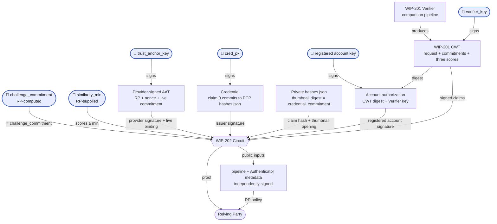

> [!NOTE]
> This spec outlines a draft functionality for beta testing. Changes are expected.

## 1. Abstract

This spec introduces a new ZK circuit ("Proof of Embedding Similarity") which proves that a trusted Verifier reported a match between an image committed in a user's [Credential](https://docs.rs/world-id-primitives/latest/world_id_primitives/credential/struct.Credential.html), a live capture and an RP-supplied challenge. All three embeddings must match. The proof does not hides raw images, similarity scores and other private information.

The circuit neither extracts embeddings nor computes similarity. A [WIP-201 Verifier][wip-201] does both and signs the item commitments, models pipeline, scores and request context. The circuit independently verifies the Verifier output, the Authenticator Provider's AAT ([WIP-106][wip-106]), the World ID account's authorization, and the Issuer's Credential, and it makes sure all our bound together.

## 2. Motivation

Being able to prove you are a particular person online is becoming increasingly important, such as combating deepfakes. One way to accomplish this is through Credentials that attest to a user's biometrics, such as user's face. This spec binds a comparison to a Credential image and a challenge image. This proof can be used in contexts where a challenger wants to ensure they are interacting to the right person (for example, in a virtual meeting, a social network conversation, etc.).

## 3. Specification

The key words "MUST", "MUST NOT", "REQUIRED", "SHALL", "SHALL NOT", "SHOULD", "SHOULD NOT", "RECOMMENDED", "MAY", and "OPTIONAL" in this document are to be interpreted as described in [RFC 2119](https://www.ietf.org/rfc/rfc2119.txt).

The terms [Authenticator](https://docs.rs/world-id-core/latest/world_id_core/struct.Authenticator.html), Issuer and [Credential][credential] are as defined in the World ID Protocol. **Verifier**, **WIP-201 Verifier** or **Flamingo Verifier** is as defined in [WIP-201][wip-201].

The proof concerns the **Credential** image, the **live** capture, and the RP's **challenge**. The circuit sees their commitments (as `FieldElement`s) and the Verifier's scores, not the images themselves. Input formats and extraction are defined by [WIP-201][wip-201].

### 3.1 Credential Structure Assumptions

This circuit relies on comparing a committed image from a [Credential][credential] issued to the user. For the circuit to verify this image's binding to the Credential, a specific format and encoding is required. Credentials compliant with this spec MUST:

1. Have an image that the Issuer attests depicts the Credential's subject and that will be used for comparison.
2. Have an **Associated Data Manifest** containing the SHA-256 digest of the original image bytes, before decoding or preprocessing. The full 32-byte digest MUST be encoded as 64 lowercase hexadecimal characters, preserving leading zeros, without a `0x` prefix. The Issuer MAY define the manifest's structure, but it MUST use a format supported by the circuit. The Credential schema MUST identify the comparison image's entry, and the circuit MUST enforce that selection rather than accepting an arbitrary digest or offset. The currently supported format is defined in [Manifest opening](#351-manifest-opening).
3. Commit to the exact original manifest bytes in `claims[0]` as `H_var(CLAIMS_HASH_V1; manifest_bytes)`, using the WIP-100 Poseidon2 sponge. This commitment is a `FieldElement`, encoded in the Credential's JSON as `0x` followed by 64 hexadecimal digits representing its 32-byte big-endian value. The manifest MUST NOT be reserialized, or its digest entries reduced into the field, before hashing. The Credential's associated-data field is not used for this binding.
4. Make the original image and manifest bytes available to the Authenticator for proof generation. The image is sent to the Verifier; the manifest remains with the Authenticator for use as a private circuit input.

### 3.2 Circuit Constants

The Field ($F$), the Curve (`BabyJubJub`), and the Hashing ($H_t$) definitions MUST follow the requirements of [WIP-100][wip-100]. `H_t` refers to the hash built from a Poseidon2 permutation of `t` elements.

This circuit introduces the following constants:

<!--FIXME: REQUEST_LIFETIME_SECS may not be in line with expected usage. -->

| Constant | Value | Description |
|----------|-------|-------------|
| `REQUEST_LIFETIME_SECS` | `900` | Request lifetime, in seconds (15 minutes). Hard upper bound on the maximum lifetime of a proof. |
| `CLAIM_INDEX` | `0` | Credential claim holding the Associated Data Manifest commitment. |
| `MAX_HASHES_JSON_BYTES` | TODO | Fixed circuit bound on the original PCP `hashes.json` bytes; MUST be chosen before implementation. |
| `DS_WIP_202_AUTH` | `127603488023523044162070750169730750023380107613256` (`b"WORLD-ID/WIP-202/AUTH"`) | Domain separator for account authorization over the Verifier claims digest and signing key. MUST NOT be reused outside it. |

The following are defined elsewhere, included for reference:

| Name | Label | Source |
|------|-------|--------|
| `NUM_KEYS` = `7`, `MAX_CLAIMS` = `15` | — | the Query Proof and the Credential |
| `MERKLE_LEAF_DS` | `b"World ID PK"` | the Query Proof (`ds::AUTHENTICATOR_KEY_SET`) |
| `DS_CREDENTIAL_V1` | `b"POSEIDON2+EDDSA-BJJ"` | the Credential (`ds::CREDENTIAL_V1`) |
| `DS_CREDENTIAL_SUB` | `b"H_CS(id, r)"` | the Uniqueness Proof (`ds::CREDENTIAL_SUB`; `DS_C_CS` in [WIP-103](wip-103.md)) |
| `DS_SESSION_COMMITMENT` | `b"H(id, r)"` | the Uniqueness Proof (`ds::SESSION_COMMITMENT`) |
| `CLAIMS_HASH_V1` | `b"CLAIMS_HASH_V1"` | the Credential (`ds::CLAIMS_HASH_V1`) |
| `DS_AAT`, `DS_REQ`, `MAX_AAT_LIFETIME` = `1800` | `b"WIP106 AAT"`, `b"WIP106 Request"` | [WIP-106][wip-106] |
| `DS_EDDSA` | `b"EdDSA Signature"` | [WIP-100][wip-100] |

### 3.3 Circuit Inputs

**`Pub`** defines a public input to the circuit. Any inputs not defined as **Pub** MUST remain private. The purpose listed below is for reference, but is non-normative. See [Circuit Constraints](#36-circuit-constraints) for what is enforced.

Authenticator metadata comes from the provider-signed AAT, verified independently of the Verifier's CWT. The AAT contributes field values and one native EdDSA signature; the circuit does not parse its CBOR encoding. This AAT has no build-version or user-presence claim.

| **Group** | Input | Type | Purpose (Non-normative) |
| --- | --- | --- | --- |
| Authenticator Assertion | **Pub.** `trust_anchor_key` | `PublicKey` | Authenticator Provider key that signed the AAT. |
| Authenticator Assertion | **Pub.** `platform`, `sec_level`, `sec_meta` | Field element | Sub-fields of the AAT's signed `sec_flags`. |
| Authenticator Assertion | `aat_exp`, `sec_flags`, `aat_sig`, `aat_blind` | Field elements + EdDSA signature | Private AAT expiry, security flags, provider signature and request blinding factor. |
| RP Inputs | **Pub.** `nonce` | Field element | Binds the Verifier token, AAT and account authorization to the RP request. |
| RP Inputs | **Pub.** `rp_id` | Field element | RP identifier, as a `u64`. Used as the AAT's `aud` and bound to the Verifier token. |
| RP Inputs | **Pub.** `request_issued_at` | Field element | Time the RP created the request, in Unix seconds, taken from its own clock. Must fit the AAT's 32-bit time range. |
| RP Inputs | **Pub.** `session_id` (may be _nil_) | Field element | Lets the RP verify the same World ID is performing this proof. |
| RP Inputs | **Pub.** `genesis_issued_at_min` | Field element | Minimum timestamp for when the credential type was first issued. |
| RP Inputs | `session_id_r` | Field element | Blinding factor for the session commitment. |
| [WIP-201][wip-201] Verifier | `cwt` | claims + EdDSA signature | To prove the output from the Verifier. See [Token Claims](#34-token-claims). |
| [WIP-201][wip-201] Verifier | **Pub.** `verifier_key` | `PublicKey` | Key that signed the `cwt`, checked against the RP's trusted Verifiers. |
| [WIP-201][wip-201] Verifier | **Pub.** `pipeline_commitment` | Field element | Signed commitment to the models and full pipeline configuration for this request. Lets the RP apply its pipeline policy. |
| [WIP-201][wip-201] Verifier | **Pub.** `challenge_commitment` (**may be _nil_**) | Field element | Lets the RP verify its own challenge item was the one compared. Nil (`0`) in the 2-way flow. |
| [WIP-201][wip-201] Verifier | **Pub.** `similarity_min` | Field element | Lets the RP verify every score cleared its threshold. |
| Credential Validity | **Pub.** `merkle_root` | Field element | Lets the RP verify the correct `WorldIDRegistry` was used. |
| Credential Validity | **Pub.** `issuer_schema_id` | Field element | Lets the RP verify which credential type was used. |
| Credential Validity | **Pub.** `cred_pk` | `PublicKey` | Lets the RP verify the Issuer of the Credential. |
| Credential Validity | `user_pk` | [`PublicKey`; `NUM_KEYS`] | Authenticator public keys registered in the `WorldIDRegistry`. |
| Credential Validity | `pk_index` | Field element | Index in `user_pk` of the key used to sign. |
| Account Authorization | `sig_s`, `sig_r` | Field element, [Field element; 2] | EdDSA authorization of the complete Verifier claims digest by the selected registered account key. |
| Credential Validity | `leaf_index` | Field element | Index of the user's World ID in the `WorldIDRegistry`. |
| Credential Validity | `siblings` | [Field element; 30] | Sibling nodes from `leaf_index` upwards. |
| Credential Validity | **Pub.** `issuer_version` | Field element | Credential schema version, `< 2^8`. Decides the meaning of each claim, so the RP pins it with `issuer_schema_id`. |
| Credential Validity | `claims` | [Field element; `MAX_CLAIMS`] | Credential claims. `claims[CLAIM_INDEX]` holds the Associated Data Manifest commitment. |
| Credential Validity | `hashes_json`, `hashes_json_len`, `thumbnail_offset` | Byte array, integers | Original manifest bytes in a fixed-size buffer, their length, and a hint locating the thumbnail entry. |
| Credential Validity | `cred_s`, `cred_r` | Field element, [Field element; 2] | EdDSA signature by the Issuer over the Credential. |
| Credential Validity | `cred_associated_data_hash`, `cred_genesis_issued_at`, `cred_expires_at`, `cred_sub_blinding_factor`, `cred_id` | Field element | Remaining Credential fields covered by the Issuer signature. |

A `PublicKey` is as defined in [WIP-100][wip-100]: an EdDSA public key as its coordinates $(x,y)$, each a Field element.

#### 3.3.1 Request lifecycle

1. The RP MUST generate a fresh `nonce` uniformly from the nonzero elements of $F$ using a CSPRNG and set `request_issued_at` from its own clock in Unix seconds. It MUST NOT reuse a nonce, and MUST store the nonce, issue time and expected request inputs until `request_expires_at = request_issued_at + REQUEST_LIFETIME_SECS`. Both times MUST fit unsigned 32-bit integers. It MUST also store the request's pipeline policy: for each permitted `verifier_key`, either allowed pipeline commitments or explicit delegation of pipeline selection to that Verifier.
2. The Authenticator MUST capture the live item in response to this request and apply its capture integrity checks. It MUST NOT use a stored capture or sign caller-supplied bytes as a fresh camera capture. It computes `live_commitment` over those exact bytes, chooses a fresh uniform `aat_blind` with a CSPRNG, and obtains a WIP-106 AAT for `req = H_8(DS_REQ; rp_id, nonce, live_commitment, aat_blind)`. It sends only `req` to the Provider as the request commitment, with the platform evidence required by WIP-106, never the commitment's openings. The Provider checks environment evidence; it does not independently establish camera provenance.
3. The Authenticator MUST check `request_expires_at <= aat_exp <= request_issued_at + MAX_AAT_LIFETIME`. Providers supporting this flow SHOULD issue AATs with a 300-second lifetime, so an AAT issued during the request can fit both bounds. A full 1,800-second lifetime measured from issuance can exceed the upper bound. The Authenticator sends the media and RP request context to the attested Verifier, which returns its signed CWT. The AAT, its blinding factor and PCP `hashes.json` stay with the Authenticator.
4. Before authorizing the result, the Authenticator MUST verify the CWT signature under the attested Verifier key and check its nonce, RP, deadline and item commitments against this request and the supplied media. It then authorizes the complete claims digest and Verifier key with a registered account key, as specified in constraint 5, and constructs the proof locally. The account private key, authorization signature, full Credential and registry witnesses MUST NOT be sent to the Verifier. The Provider's AAT does not authorize the World ID account.
5. Before accepting the proof, the RP MUST check that its current time is within the stored request window and perform all checks in [Proof Verification](#37-proof-verification). It MUST atomically consume the nonce on successful acceptance, so concurrent submissions cannot both succeed. An expired request requires a new nonce and issue time.

The deadline is derived from the RP's stored issue time and matched to the Verifier's signed deadline; it is not another public input. The circuit proves that the AAT and Credential remain valid throughout that window. This flow uses `request_issued_at` in place of WIP-106's `now`, adds the deadline check, and requires the RP to check its clock at acceptance. It introduces no separate prover-selected time or clock tolerance.

### 3.4 Token Claims

Defined in [WIP-201 Token claims](wip-201.md#351-token-claims). The circuit reads all ten signed claims: `nonce`, `credential_commitment`, `live_commitment`, `challenge_commitment`, `similarity_live`, `similarity_challenge`, `pipeline_commitment`, `rp_id`, `request_expires_at` and `similarity_live_challenge`.

The public request and pipeline are bound to these signed claims. Authenticator metadata is verified separately through the AAT. Its expiry and request blinding factor remain private.

### 3.5 Commitments

The equality between these three item commitments is what anchors the proof to each input. The separate `pipeline_commitment` is defined in [WIP-201 Pipeline commitment](wip-201.md#331-pipeline-commitment).

| Commitment | Binding | Checked by |
| --- | --- | --- |
| `credential_commitment` | Equals the reduced SHA-256 thumbnail digest extracted from the PCP `hashes.json` committed by `claims[CLAIM_INDEX]`. | the circuit |
| `live_commitment` | Is the `cdh` in the AAT's signed request commitment. The Verifier hashes the received live bytes. | the circuit and Verifier |
| `challenge_commitment` | Equals the commitment the RP supplied as a public input. | the circuit and RP |

The account authorization covers the complete CWT digest, including all three commitments. The circuit checks that authorization under a key registered to the same account as the Credential.

The Verifier sees the media, but not the AAT, PCP `hashes.json`, full Credential or account witnesses. It hashes the media bytes before decoding or preprocessing them. Each item commitment MUST be computed in the following manner:

- `credential_commitment` MUST be `R(SHA-256(credential_image))`, where `R` reads the 256-bit digest as a big-endian unsigned integer and reduces it modulo the field modulus. The input is the original PCP `thumbnail.png` bytes.
- `live_commitment` MUST be the Poseidon2 sponge defined in [WIP-100][wip-100] with the variable domain separator `WORLD-ID/WIP-202/LIVE`.
- `challenge_commitment` MUST be the Poseidon2 sponge defined in [WIP-100][wip-100] with the variable domain separator `WORLD-ID/WIP-202/CHALLENGE`.

Commitments MUST be over the bytes the Verifier received, not embeddings it derived from them. The Issuer MUST commit to the original Associated Data Manifest bytes in claim `0` using the WIP-100 Poseidon2 sponge with variable domain separator `CLAIMS_HASH_V1`. The circuit hashes those bytes and extracts the image digest; it does not compute SHA-256 over an image.

These functions are not the Verifier's alone to choose. The Authenticator MUST compute the AAT's `cdh = live_commitment` and the RP MUST compute its `challenge_commitment` public input with the functions above. The AAT binds only the live item and RP request context; it does not commit to the complete Verifier request.

#### 3.5.1 Manifest opening

`hashes_json` is a private byte buffer of `MAX_HASHES_JSON_BYTES` bytes. Only its first `hashes_json_len` bytes are the original Issuer-committed file; the remaining bytes MUST be zero. The circuit MUST hash and parse that same prefix without reserializing it.

The prefix MUST be valid UTF-8 JSON with one top-level object and no trailing content except JSON whitespace. The object MUST have unique decoded keys and exactly one top-level `thumbnail.png` key, whose value is a string of exactly 64 lowercase hexadecimal digits. `thumbnail_offset` is only a lookup hint: the circuit MUST prove that it locates that top-level key and its complete value within the committed prefix. Finding matching text inside another string, a nested object or the padded suffix is insufficient.

The circuit MUST decode each hex digit and interpret the resulting 32 bytes as a big-endian digest before reducing it with `R`. Bounds, parsing, hex decoding and reduction are circuit constraints, not checks delegated to the client.

### 3.6 Circuit Constraints

The Proof of Embedding Similarity circuit MUST implement the following constraints. The circuit MUST NOT introduce public inputs beyond those in [Circuit Inputs](#33-circuit-inputs).

Every ordering comparison below (`<`, `<=`, `>=`) is over canonical integers constrained to the stated bit width. Range checks MUST constrain the original field element, not a truncated cast. Timestamps, `rp_id`, scores and thresholds are 64-bit unless stated otherwise.

Hashing ($H_t$), EdDSA and Merkle inclusion are as defined in [WIP-100][wip-100]. The Uniqueness Proof and the Query Proof follow the introductory [World ID 4.0 Specs](https://github.com/worldcoin/world-id-protocol/tree/main/docs/world-id-4-specs).

**Credential Validity**

1. **Key selection.** Range-check `pk_index` as 3-bit, constrain `pk_index < NUM_KEYS`, and select `pk = user_pk[pk_index]` using that same witness.
2. **Empty key slots.** `user_pk` MUST hold `NUM_KEYS` entries in `WorldIDRegistry` slot order, with inactive slots encoded as the identity $(0,1)$. WIP-100 signature verification rejects an inactive selected key by requiring `pk` to be on the curve, in the prime-order subgroup and not the identity.
3. **Registry leaf.** Compute `key_set_commitment = H_16(MERKLE_LEAF_DS; user_pk[0].x, user_pk[0].y, …, user_pk[6].x, user_pk[6].y)`, with the keys at state indices `1..14` and index `15` zero. All slots MUST be included in order, including inactive ones.
4. **Merkle inclusion proof.** Recompute the root from `key_set_commitment` at position `leaf_index` using `siblings`, per WIP-100, and constrain it equals `merkle_root`. The depth is 30 and `0 < leaf_index < 2^30`; the circuit takes no depth input.
5. **Account authorization.** Compute `message = H_4(DS_WIP_202_AUTH; verifier_digest, verifier_key.x, verifier_key.y)` and verify `(sig_r, sig_s)` as a `BabyJubJub-EdDSA-Poseidon2` signature by the selected registered `pk`, following all WIP-100 verification requirements. `verifier_digest` and `verifier_key` MUST be the same digest and key used in constraint 11. The authorization covers every signed CWT claim, including all three scores, the pipeline, item commitments, RP, nonce and deadline, and the Verifier that signed them.
6. **Credential subject commitment.** Compute `sub = H_3(DS_CREDENTIAL_SUB; leaf_index, cred_sub_blinding_factor)`.
7. **Claims hash.** Compute `claims_hash` as the Poseidon2 $t=16$ permutation over `[claims[0], …, claims[14], 0]`, with output state element `1` as the digest. This is the Credential V1 construction: capacity at index `15`, no domain separator. It MUST NOT be replaced with $H_t$ or $H_\text{var}$. Use the same `claims` witness in constraint 16.
8. **Credential signature.** Range-check `cred_id` as 64-bit and `issuer_version` as 8-bit, then compute `cred_id_packed = cred_id + issuer_version * 2^64`. Compute `message = H_8(DS_CREDENTIAL_V1; issuer_schema_id, sub, cred_genesis_issued_at, cred_expires_at, claims_hash, cred_associated_data_hash, cred_id_packed)` and verify `(cred_r, cred_s)` as a `BabyJubJub-EdDSA-Poseidon2` signature by `cred_pk`, following all WIP-100 verification requirements.
9. **Credential validity window.** Range-check `cred_genesis_issued_at`, `cred_expires_at` and `genesis_issued_at_min` as 64-bit, and `request_issued_at` as 32-bit. Compute `request_expires_at = request_issued_at + REQUEST_LIFETIME_SECS` and range-check the result as 32-bit. Constrain `request_expires_at <= cred_expires_at` and `genesis_issued_at_min <= cred_genesis_issued_at`.
10. **Leaf-index binding.** The `leaf_index` used in the subject commitment, Merkle inclusion proof and session commitment MUST be the same witness. This binds the Issuer's Credential to the registered account whose key authorized the Verifier result.

**Verifier result**

11. **Token verification.** Compute `verifier_digest` over all ten private `cwt` claims as defined in [WIP-201 Signed digest](wip-201.md#352-signed-digest) and verify its `BabyJubJub-EdDSA-Poseidon2` signature by `verifier_key`, following all WIP-100 verification requirements. The circuit MUST NOT parse or reconstruct CBOR or recompute the pipeline commitment from a manifest.
12. **Request binding.** Range-check `rp_id` as 64-bit. Constrain the signed CWT `nonce` and `rp_id` to equal the corresponding public inputs, and its `request_expires_at` to equal the deadline derived in constraint 9.

**Authenticator Assertion**

13. **AAT verification and validity.** Compute `req = H_8(DS_REQ; rp_id, nonce, cwt.live_commitment, aat_blind)` and `message = H_4(DS_AAT; aat_exp, req, sec_flags)`. Verify `aat_sig` over that message under public `trust_anchor_key`, following all WIP-100 signature and key checks. Range-check `aat_exp` as 32-bit and constrain `request_expires_at <= aat_exp` and `aat_exp - request_issued_at <= MAX_AAT_LIFETIME`. These inequalities imply `request_issued_at < aat_exp` and prevent subtraction underflow. This applies WIP-106 with `aud = rp_id`, `cdh = cwt.live_commitment` and the request-window adaptation in §3.3.1. AAT verification is mandatory.
14. **Authenticator metadata.** Range-check private `sec_flags` as 20-bit, public `platform` and `sec_level` as 8-bit, and public `sec_meta` as 4-bit. Constrain `sec_flags == platform + 2^8 * sec_level + 2^16 * sec_meta`, using the same `sec_flags` as constraint 13. This leaves all reserved bits zero and exposes only the provider-signed metadata.

**Item and comparison bindings**

15. **Manifest opening.** Range-check `hashes_json_len` and `thumbnail_offset` as 32-bit integers. Constrain `0 < hashes_json_len <= MAX_HASHES_JSON_BYTES` and `thumbnail_offset < hashes_json_len`. Range-check every buffer element as a byte and require zero padding beyond the declared length. Enforce the parsing and complete-entry bounds in [Manifest opening](#351-manifest-opening) over exactly `hashes_json[0:hashes_json_len]`. Extract and decode the thumbnail digest `d`, and constrain the signed CWT `credential_commitment == R(d)`.
16. **Credential claim binding.** Hash exactly the same prefix from constraint 15 as `H_var(CLAIMS_HASH_V1; hashes_json[0:hashes_json_len])` and constrain it to equal `claims[CLAIM_INDEX]`, using the `claims` witness from constraint 7. The length is part of the WIP-100 variable-length hash encoding. Neither parsing nor hashing may use a separate buffer or length.
17. **Challenge and pipeline binding.** Constrain public `challenge_commitment` and `pipeline_commitment` to equal their signed CWT claims, including when the challenge is nil (`0`) in the 2-way flow.
18. **Similarity floor.** Range-check the signed CWT `similarity_live`, `similarity_challenge`, `similarity_live_challenge` and public `similarity_min` as 64-bit. Constrain `similarity_live >= similarity_min`. If `challenge_commitment != 0`, constrain both `similarity_challenge >= similarity_min` and `similarity_live_challenge >= similarity_min`; otherwise require both challenge scores to be zero. The branch MUST be constrained from the public challenge commitment, not chosen by a free witness.

**RP Inputs**

19. **Session commitment.** Compute `computed = H_3(DS_SESSION_COMMITMENT; leaf_index, session_id_r)` and constrain `session_id * (session_id - computed) === 0`, so `session_id` is either nil or the correct commitment.
20. **Nonzero inputs.** Constrain `nonce`, `request_issued_at`, `similarity_min` and `pipeline_commitment` to be nonzero. `rp_id` is a 64-bit value; `0` is valid.

### 3.7 Proof Verification

The RP MUST perform the following checks before accepting a proof. The circuit cannot choose trusted parties, recognize an expired request or prevent reuse of a nonce on its own.

1. **ZKP verification.** The proof MUST verify under the verification key the RP has pinned for this circuit.
2. **Request and freshness.** `rp_id` MUST be the RP's own id. The `nonce` MUST identify an outstanding request, and `request_issued_at` MUST equal its stored issue time. Using its own clock at acceptance, the RP MUST require `request_issued_at <= current_time < request_expires_at`. It MUST NOT add clock tolerance or extend the deadline. After all checks pass, it MUST atomically consume the nonce before granting the requested action.
3. **Registry and Issuer.** `merkle_root` MUST be a root the canonical `WorldIDRegistry` currently accepts as valid, including its rules for historical roots. `cred_pk` MUST be a currently trusted Issuer key for the expected `issuer_schema_id` and `issuer_version`.
4. **Credential policy.** `issuer_schema_id`, `issuer_version` and `genesis_issued_at_min` MUST match the request's expected Credential schema and policy. That schema MUST put the Associated Data Manifest commitment in claim `0`, using the format and function in [Credential Structure Assumptions](#31-credential-structure-assumptions) and [Commitments](#35-commitments).
5. **Verifier and pipeline trust.** `verifier_key` MUST be currently allowed by the RP, with valid key attestation to approved code on hardware the RP trusts, verified out of band per WIP-201. A key absent from the stored policy MUST be rejected. The signed `pipeline_commitment` MUST satisfy the request's stored pipeline policy and the RP's current pipeline policy for that Verifier. An RP can allow specific reviewed pipelines, or explicitly delegate model and pipeline selection to a trusted Verifier. The commitment does not establish model accuracy or replace key attestation.
6. **Authenticator trust.** `trust_anchor_key` MUST belong to a currently allowed Authenticator Provider, be active and be within its validity window, per WIP-106. The independently verified `platform`, `sec_level` and `sec_meta` MUST satisfy the RP's policy. Security-level values are categories, not an ordering of strength. These values describe environment evidence; the AAT carries no user-presence claim.
7. **Comparison policy.** `similarity_min` MUST equal the request's threshold for the accepted Verifier key's metric, normalization and score scale. The definitions MUST be shared by all compared pairs and all pipelines allowed for that request, including when the RP delegates pipeline selection. `challenge_commitment` MUST equal the commitment the RP computed over its exact challenge bytes, or `0` if the request has no challenge.
8. **Session binding.** If the RP requires this proof to concern the same World ID as another proof, including a Uniqueness Proof, it MUST reject `session_id == 0` and require equality with that proof's session commitment. It MUST verify both proofs against the request. Accepting the nil branch does not bind two proofs to the same World ID.

## 4. Trust Assumptions

RPs need to understand what they are trusting. This section is **non-normative**.

The RP trusts the Issuer's enrollment and PCP, the Authenticator Provider's environment checks, the Authenticator's capture behavior, and the Verifier's comparison pipeline. The circuit independently verifies the Issuer's Credential, the provider-signed AAT and the registered account's authorization over the Verifier result. A Verifier signing key alone cannot satisfy those checks.

TEE protection depends on the hardware provider, attestation and approved code. The public `pipeline_commitment` identifies the configured comparison pipeline. Authenticator metadata comes from the independently verified Provider signature. The RP can decide which providers and pipelines it trusts. Identifying a model does not establish its accuracy, and neither the TEE nor the proof establishes camera provenance.

## 5. Use Cases

1. **RP-supplied challenge (3-way).** The RP captures a frame of the party it is interacting with and requests a proof against it. A valid proof establishes that the Verifier reported all three pairs above the threshold: live against credential, challenge against credential, and live against challenge. This links the frame and live capture to the credential subject, subject to the capture guarantees and comparison accuracy. It does not establish that the call's video stream is unmodified or prevent a relayed interaction.
2. **Presence challenge (2-way).** `challenge_commitment` is nil. A valid proof shows that the Verifier reported a match between the submitted live item and the holder's credential for this request. It evidences presence subject to the Authenticator's capture controls and the Verifier's comparison pipeline, without revealing the credential image or live capture to the RP.

## 6. Rationale

- **Why an Authenticator Assertion when the Verifier receives the live image directly.** The Verifier can process an image without knowing whether it came from a camera or a stored file. The AAT binds the Provider's environment checks to the live-image commitment and request. The Authenticator must still enforce capture integrity and freshness.
- **Why verify the AAT in the circuit.** The Provider checks platform evidence outside the circuit and signs one ZK-friendly token. Verifying it in-circuit keeps the Provider's assertion independent of the biometric Verifier without adding P-256 verification or token parsing.
- **Why keep account authorization in the circuit.** The account key authorizes the full CWT digest and its Verifier key, and the circuit binds that account to the Issuer's Credential. A compromised Verifier can invent its own statements, but cannot create that authorization for an uncooperative account.
- **Why open the PCP commitment.** The Orb Credential commits to `hashes.json`, which contains the thumbnail's SHA-256 digest. Opening that chain binds the compared image to the actual Issuer claim without hashing the image in the circuit.
- **Why compare every pair.** Two images can each match the credential above a threshold without matching each other. The third score checks that additional relationship; it does not replace either credential comparison.
- **Why one request window.** The Verifier signs the request nonce, RP and deadline. The circuit binds that deadline to the RP request and checks that both the AAT and Credential remain valid through it; account authorization covers the same signed result. The RP keeps one pending-request deadline and consumes its nonce on acceptance.
- **Why expose one pipeline commitment.** A model name does not identify its weights, preprocessing or checks. One signed commitment covers the whole pipeline and its configuration, letting the RP approve it once and check the same value on each proof.
- **Why there is no nullifier.** Similarity is not uniqueness, they serve different purposes. If a use case requires uniqueness, a second Uniqueness Proof can be requested.

## 7. Alternatives Considered

**Comparing the embeddings in the circuit.** This would verify the comparison arithmetic, but the image-based flow would still trust extraction and the required input checks. The Verifier would have to attest which embeddings came from which images. Comparing independently authenticated vectors could remove trust in the comparator for those inputs; it would still leave camera provenance to the Authenticator. For this design, we keep comparison with extraction to avoid fixed-point arithmetic, fixing the embedding dimension in the circuit, and hashing each derived vector inside the proof.

**Having the TEE verify the AAT.** This would save one native signature check but make Authenticator metadata depend on the biometric Verifier. The provider-signed AAT avoids the earlier platform-signature cost, so this design verifies it independently in the circuit and keeps it private from the Verifier.

## 8. Security

The proof relies on the cryptographic assumptions of WIP-100, collision resistance of the SHA-256 commitment after field reduction, and the soundness and zero-knowledge properties of the proof system and its setup. The Issuer's Credential signature, provider-signed AAT and account authorization are checked independently of the Verifier. The truth of those parties' statements, capture guarantees and biometric accuracy remain trust assumptions.

1. **A Verifier key does not authorize a World ID account.** The circuit checks an account signature over the complete CWT digest and Verifier key, proves that the signing key is registered, and binds the Issuer's Credential to the same account. Even a compromised Verifier cannot produce a proof for an account without its authorization for that result and request. Possession of a valid authorization can permit presentation of that already-authorized result; the proof does not prevent relay, and the RP must still consume the nonce.
2. **Environment evidence does not prove a fresh camera capture.** The circuit verifies the Provider's AAT bound to `live_commitment`, the RP and nonce. The Provider checks platform evidence for that commitment; it does not see the live image or independently verify user presence. A compromised client can still submit a stored or substituted image if the Authenticator's capture controls fail. Adding ZK or a TEE does not change this capture trust assumption.
3. **Trust in the Verifier covers the comparison pipeline.** A compromised Verifier can sign an accepted pipeline commitment and arbitrary scores. The circuit checks its signature and bindings, not whether those computations happened. Such a Verifier can help a malicious account holder make a false match claim, but cannot forge the Provider's AAT or supply an unrelated account's authorization. Attestation and key protection must cover code that binds the pipeline commitment to the artifacts and configuration actually used.
4. **Trust in the Issuer makes the proof about the credential subject.** The comparison inherits the guarantees of the Issuer's enrollment process. A similarity threshold is not a guarantee against false matches.
5. **Request binding does not establish capture freshness.** The circuit binds the AAT and Verifier token to the same nonce, RP and live commitment, and account authorization covers the entire Verifier result. An old image can still be submitted under a new nonce, so the Authenticator MUST enforce the capture requirement in [Request lifecycle](#331-request-lifecycle).
6. **Freshness includes proof acceptance.** The RP MUST check its own clock and atomically consume the nonce at acceptance. The circuit checks both AAT and Credential expiry against the signed request deadline. A valid proof does not make an expired request valid. Revocation and current trust in registry roots, Issuers, Verifiers, pipelines and Authenticator Providers remain RP checks.
7. **Privacy has a scope.** The proof hides media, scores, PCP `hashes.json`, the AAT and its expiry from the RP. The Verifier's attested environment sees the media, nonce and RP identifier, but not the AAT, its blinding factor or Credential witnesses. The Authenticator Provider sees issuance time and platform evidence but only the blinded request commitment, not the RP or live-image commitment; timing may still correlate issuance with proof use. The attested encrypted channel protects media from the Verifier's operator. If the environment leaks its inputs, the shared nonce lets the RP link media to its request. Public provider metadata and pipeline commitments remain visible; an uncommon pipeline can narrow the set of possible users across proofs.
8. **This is not a uniqueness proof.** An RP that requires uniqueness MUST also request a Uniqueness Proof and verify that both proofs have the same nonzero session commitment.

Even a compromised Verifier cannot produce a proof for a registered account without that account's authorization for the request, or forge the Authenticator Provider's assertion. It can lie about comparisons. The live image's source and freshness still depend on the Authenticator.

## 9. Backwards Compatibility

This World Improvement Proposal (WIP) introduces a new interface; no existing contracts or other previously existing functionality is affected.

[credential]: https://docs.rs/world-id-primitives/latest/world_id_primitives/credential/struct.Credential.html
[wip-100]: https://github.com/worldcoin/world-id-protocol/pull/888
[wip-106]: https://github.com/worldcoin/world-id-protocol/pull/1027
[wip-201]: wip-201.md
