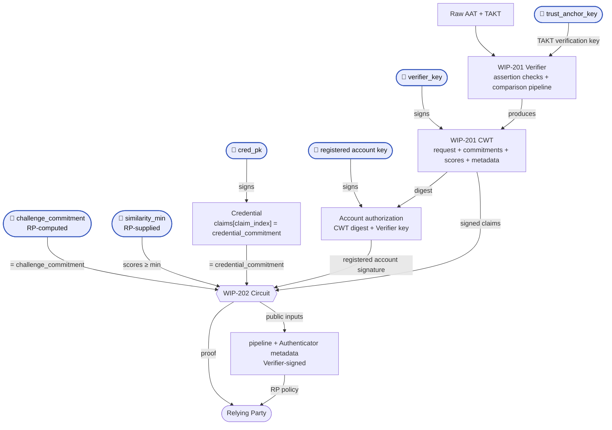

> [!NOTE]
> This spec outlines a draft functionality for beta testing. Changes are expected.

## 1. Abstract

This spec introduces a new ZK circuit ("Proof of Embedding Similarity") which proves that a trusted Verifier reported a match between an image committed in a user's [Credential](https://docs.rs/world-id-primitives/latest/world_id_primitives/credential/struct.Credential.html), a live capture and an RP-supplied challenge. All three embeddings must match. The proof does not hides raw images, similarity scores and other private information.

The circuit neither extracts embeddings nor computes similarity. A [WIP-201 Verifier][wip-201] does both and signs the item commitments, models pipeline, scores and request context. The circuit independently verifies the Verifier output, the Authenticator Provider's AAT ([WIP-106][wip-106]), the World ID account's authorization, and the Issuer's Credential, and it makes sure all our bound together.

## 2. Motivation

Being able to prove you are a particular person online is becoming increasingly important, such as combating deepfakes. One way to accomplish this is through Credentials that attest to a user's biometrics, such as user's face. This spec binds a comparison to a Credential image and a challenge image. This proof can be used in contexts where a challenger wants to ensure they are interacting to the right person (for example, in a virtual meeting, a social network conversation, etc.).

## 3. Specification

The key words "MUST", "MUST NOT", "REQUIRED", "SHALL", "SHALL NOT", "SHOULD", "SHOULD NOT", "RECOMMENDED", "MAY", and "OPTIONAL" in this document are to be interpreted as described in [RFC 2119](https://www.ietf.org/rfc/rfc2119.txt).

The terms [Authenticator](https://docs.rs/world-id-core/latest/world_id_core/struct.Authenticator.html), Issuer and [Credential](https://docs.rs/world-id-primitives/latest/world_id_primitives/credential/struct.Credential.html) are as defined in the World ID Protocol. **Verifier**, **WIP-201 Verifier** or **Flamingo Verifier** is as defined in [WIP-201][wip-201].

The proof concerns the **Credential** image, the **live** capture, and the RP's **challenge**. The circuit sees their commitments (as `FieldElement`s) and the Verifier's scores, not the images themselves. Input formats and extraction are defined by [WIP-201][wip-201].

### 3.1 Credential Structure Assumptions

### 3.2 Circuit Constants

The Field ($F$), the Curve (`BabyJubJub`), and the Hashing ($H_t$) definitions MUST follow the requirements of [WIP-100][wip-100]. `H_t` refers to the hash built from a Poseidon2 permutation of `t` elements.

This circuit introduces the following constants:

<!--FIXME: REQUEST_LIFETIME_SECS may not be in line with expected usage. -->

| Constant | Value | Description |
|----------|-------|-------------|
| `REQUEST_LIFETIME_SECS` | `300` | Request lifetime, in seconds (5 minutes). Limits proof acceptance to five minutes after the RP creates the request. |
| `DS_WIP_202_AUTH` | `127603488023523044162070750169730750023380107613256` (`b"WORLD-ID/WIP-202/AUTH"`) | Domain separator for account authorization over the Verifier claims digest and signing key. MUST NOT be reused outside it. |

The following are defined elsewhere, included for reference:

| Name | Label | Source |
|------|-------|--------|
| `NUM_KEYS` = `7`, `MAX_CLAIMS` = `15` | — | the Query Proof and the Credential |
| `MERKLE_LEAF_DS` | `b"World ID PK"` | the Query Proof (`ds::AUTHENTICATOR_KEY_SET`) |
| `DS_CREDENTIAL_V1` | `b"POSEIDON2+EDDSA-BJJ"` | the Credential (`ds::CREDENTIAL_V1`) |
| `DS_CREDENTIAL_SUB` | `b"H_CS(id, r)"` | the Uniqueness Proof (`ds::CREDENTIAL_SUB`; `DS_C_CS` in [WIP-103](wip-103.md)) |
| `DS_SESSION_COMMITMENT` | `b"H(id, r)"` | the Uniqueness Proof (`ds::SESSION_COMMITMENT`) |
| `CLAIMS_HASH_V1` | `b"CLAIMS_HASH_V1"` | the Credential (`ds::CLAIMS_HASH_V1`) |
| `DS_EDDSA` | `b"EdDSA Signature"` | [WIP-100][wip-100] |

### 3.2 Circuit Inputs

**`Pub`** defines a public input to the circuit. Any inputs not defined as **Pub** MUST remain private. The purpose listed below is for reference, but is non-normative. See [Circuit Constraints](#35-circuit-constraints) for what is enforced.

Authenticator metadata comes from the Verifier's signed CWT. The raw AAT, TAKT and device `assertion_key` are not circuit inputs.

| **Group** | Input | Type | Purpose (Non-normative) |
| --- | --- | --- | --- |
| Authenticator metadata | **Pub.** `trust_anchor_key` | `PublicKey` | Trust anchor reported by the Verifier as having verified the TAKT. Lets the RP choose Authenticator Providers. |
| Authenticator metadata | **Pub.** `platform`, `sec_level`, `sec_meta` | Field element | Sub-fields of the Verifier's signed `sec_flags`, copied from the verified TAKT. |
| Authenticator metadata | **Pub.** `build_version_min` | Field element | RP-required minimum Authenticator build version; `0` imposes no minimum. The actual build version in the private CWT remains hidden from the RP. |
| Authenticator metadata | **Pub.** `authenticator_meta` | Field element | Metadata the Verifier reports from the verified AAT, e.g. user presence. |
| RP Inputs | **Pub.** `nonce` | Field element | Binds the Verifier token, AAT and account authorization to the RP request. |
| RP Inputs | **Pub.** `rp_id` | Field element | RP identifier, reported by the Verifier after checking the AAT audience. Normalized as a `u64`; this flow requires the narrower audience range supported by WIP-106. |
| RP Inputs | **Pub.** `request_issued_at` | Field element | Time the RP created the request, in Unix seconds, taken from its own clock. |
| RP Inputs | **Pub.** `session_id` (may be _nil_) | Field element | Lets the RP verify the same World ID is performing this proof. |
| RP Inputs | **Pub.** `genesis_issued_at_min` | Field element | Minimum timestamp for when the credential type was first issued. |
| RP Inputs | `session_id_r` | Field element | Blinding factor for the session commitment. |
| [WIP-201][wip-201] Verifier | `cwt` | claims + EdDSA signature | To prove the output from the Verifier. See [Token Claims](#33-token-claims). |
| [WIP-201][wip-201] Verifier | **Pub.** `verifier_key` | `PublicKey` | Key that signed the `cwt`, checked against the RP's trusted Verifiers. |
| [WIP-201][wip-201] Verifier | **Pub.** `pipeline_commitment` | Field element | Signed commitment to the models and full pipeline configuration for this request. Lets the RP apply its pipeline policy. |
| [WIP-201][wip-201] Verifier | **Pub.** `challenge_commitment` (**may be _nil_**) | Field element | Lets the RP verify its own challenge item was the one compared. Nil (`0`) in the 2-way flow. |
| [WIP-201][wip-201] Verifier | **Pub.** `similarity_min` | Field element | Lets the RP verify every score cleared its threshold. |
| Credential Validity | **Pub.** `merkle_root` | Field element | Lets the RP verify the correct `WorldIDRegistry` was used. |
| Credential Validity | **Pub.** `issuer_schema_id` | Field element | Lets the RP verify which credential type was used. |
| Credential Validity | **Pub.** `cred_pk` | `PublicKey` | Lets the RP verify the Issuer of the Credential. |
| Credential Validity | `user_pk` | [`PublicKey`; `NUM_KEYS`] | Authenticator public keys registered in the `WorldIDRegistry`. |
| Credential Validity | `pk_index` | Field element | Index in `user_pk` of the key used to sign. |
| Account Authorization | `sig_s`, `sig_r` | Field element, [Field element; 2] | EdDSA authorization of the complete Verifier claims digest by the selected registered account key. |
| Credential Validity | `leaf_index` | Field element | Index of the user's World ID in the `WorldIDRegistry`. |
| Credential Validity | `siblings` | [Field element; 30] | Sibling nodes from `leaf_index` upwards. |
| Credential Validity | **Pub.** `issuer_version` | Field element | Credential schema version, `< 2^8`. Decides the meaning of each claim, so the RP pins it with `issuer_schema_id`. |
| Credential Validity | **Pub.** `claim_index` | Field element | Index in `claims` holding the credential commitment. Fixed by the Issuer's claim schema, so the RP pins it per schema. |
| Credential Validity | `claims` | [Field element; `MAX_CLAIMS`] | Credential claims. `claims[claim_index]` holds the credential commitment. |
| Credential Validity | `cred_s`, `cred_r` | Field element, [Field element; 2] | EdDSA signature by the Issuer over the Credential. |
| Credential Validity | `cred_associated_data_hash`, `cred_genesis_issued_at`, `cred_expires_at`, `cred_sub_blinding_factor`, `cred_id` | Field element | Remaining Credential fields covered by the Issuer signature. |

A `PublicKey` is as defined in [WIP-100][wip-100]: an EdDSA public key as its coordinates $(x,y)$, each a Field element.

#### 3.2.1 Request lifecycle

1. The RP MUST use an identifier supported by WIP-106's AAT profile, currently `2^16 <= rp_id < 2^32`. It MUST generate a fresh `nonce` uniformly from the nonzero elements of $F$ using a CSPRNG and set `request_issued_at` from its own clock in Unix seconds. It MUST NOT reuse a nonce, and MUST store the nonce, issue time and expected request inputs until `request_expires_at = request_issued_at + REQUEST_LIFETIME_SECS`. It MUST also store the request's pipeline policy: for each permitted `verifier_key`, either allowed pipeline commitments or explicit delegation of pipeline selection to that Verifier.
2. The Authenticator MUST capture the live item in response to this request, apply its capture integrity checks, and commit to those exact bytes in the AAT's `signal` claim. It MUST NOT use a stored capture or sign caller-supplied bytes as a fresh camera capture. This is an Authenticator requirement; neither the circuit nor the Verifier independently establishes camera provenance.
3. The Authenticator sends the raw AAT containing its TAKT, the media and the RP request context to the attested Verifier. The Verifier performs [WIP-201's assertion checks](wip-201.md#311-authenticator-assertion-verification), including validity of both tokens through `request_expires_at`, and returns its signed CWT. The circuit independently checks the Credential's validity through the same deadline.
4. Before authorizing the result, the Authenticator MUST verify the CWT signature under the attested Verifier key and check its nonce, RP, deadline and item commitments against this request and the supplied media. It MUST also check that the returned Authenticator metadata and trust anchor match the submitted assertions. It then authorizes the complete claims digest and Verifier key with a registered account key, as specified in constraint 5, and constructs the proof locally. The account private key, authorization signature, full Credential and registry witnesses MUST NOT be sent to the Verifier. The AAT's device `assertion_key` is a separate key and does not authorize the World ID account.
5. Before accepting the proof, the RP MUST check that its current time is within the stored request window and perform all checks in [Proof Verification](#36-proof-verification). It MUST atomically consume the nonce on successful acceptance, so concurrent submissions cannot both succeed. An expired request requires a new nonce and issue time.

The deadline is derived from the RP's stored issue time and matched to the Verifier's signed deadline; it is not another public input. The circuit proves the Credential remains valid for the request window. It relies on the Verifier's signed statement that the AAT and TAKT do too.

### 3.3 Token Claims

Defined in [WIP-201 Token claims](wip-201.md#351-token-claims). The circuit reads all thirteen signed claims: `nonce`, `credential_commitment`, `live_commitment`, `challenge_commitment`, `similarity_live`, `similarity_challenge`, `pipeline_commitment`, `rp_id`, `request_expires_at`, `trust_anchor_key_x`, `trust_anchor_key_y`, `sec_flags` and `authenticator_meta`.

The public request, pipeline and Authenticator metadata are bound to these signed claims. The actual build version remains private inside `sec_flags`; the circuit only exposes and enforces `build_version_min`. The device assertion key and individual AAT/TAKT expiries do not enter the circuit.

### 3.4 Commitments

The equality between these three item commitments is what anchors the proof to each input. The separate `pipeline_commitment` is defined in [WIP-201 Pipeline commitment](wip-201.md#331-pipeline-commitment).

| Commitment | Binding | Checked by |
| --- | --- | --- |
| `credential_commitment` | Equals `claims[claim_index]` of the Issuer-signed Credential. | the circuit |
| `live_commitment` | Equals the AAT's signed `signal` claim and hashes the received live bytes. | the Verifier |
| `challenge_commitment` | Equals the commitment the RP supplied as a public input. | the circuit and RP |

The account authorization covers the complete CWT digest, including all three commitments. The circuit checks that authorization under a key registered to the same account as the Credential.

The Verifier sees the raw AAT/TAKT and media, but not the full Credential or account witnesses. It hashes the media bytes before decoding or preprocessing them. Each item commitment MUST be computed in the following manner:

- `credential_commitment` MUST be the Poseidon2 sponge defined in [WIP-100][wip-100] with the variable domain separator `CLAIMS_HASH_V1`.
- `live_commitment` MUST be the Poseidon2 sponge defined in [WIP-100][wip-100] with the variable domain separator `WORLD-ID/WIP-202/LIVE`.
- `challenge_commitment` MUST be the Poseidon2 sponge defined in [WIP-100][wip-100] with the variable domain separator `WORLD-ID/WIP-202/CHALLENGE`.

Commitments MUST be over the bytes the Verifier received, not embeddings it derived from them. The Issuer MUST use the specified credential commitment function for the selected claim. The circuit does not hash media or verify the AAT; it checks the signed CWT, the account's authorization of it, and the credential and challenge bindings.

These functions are not the Verifier's alone to choose. The Authenticator MUST compute the AAT's `signal` and the RP MUST compute its `challenge_commitment` public input with the same functions and domain separators. This spec fixes the meaning of WIP-106's `signal` for the live capture in this flow.

### 3.5 Circuit Constraints

The Embedding Similarity Proof circuit MUST implement the following constraints. The circuit MUST NOT introduce public inputs beyond those in [Circuit Inputs](#32-circuit-inputs).

Every ordering comparison below (`<`, `<=`, `>=`) is over canonical integers constrained to the stated bit width. Range checks MUST constrain the original field element, not a truncated cast. Timestamps, `rp_id`, scores and thresholds are 64-bit unless stated otherwise.

Hashing ($H_t$), EdDSA and Merkle inclusion are as defined in [WIP-100][wip-100]. The Uniqueness Proof and the Query Proof follow the introductory [World ID 4.0 Specs](https://github.com/worldcoin/world-id-protocol/tree/main/docs/world-id-4-specs).

**Credential Validity**

1. **Key selection.** Range-check `pk_index` as 3-bit, constrain `pk_index < NUM_KEYS`, and select `pk = user_pk[pk_index]` using that same witness.
2. **Empty key slots.** `user_pk` MUST hold `NUM_KEYS` entries in `WorldIDRegistry` slot order, with inactive slots encoded as the identity $(0,1)$. WIP-100 signature verification rejects an inactive selected key by requiring `pk` to be on the curve, in the prime-order subgroup and not the identity.
3. **Registry leaf.** Compute `key_set_commitment = H_16(MERKLE_LEAF_DS; user_pk[0].x, user_pk[0].y, …, user_pk[6].x, user_pk[6].y)`, with the keys at state indices `1..14` and index `15` zero. All slots MUST be included in order, including inactive ones.
4. **Merkle inclusion proof.** Recompute the root from `key_set_commitment` at position `leaf_index` using `siblings`, per WIP-100, and constrain it equals `merkle_root`. The depth is 30 and `0 < leaf_index < 2^30`; the circuit takes no depth input.
5. **Account authorization.** Compute `message = H_4(DS_WIP_202_AUTH; verifier_digest, verifier_key.x, verifier_key.y)` and verify `(sig_r, sig_s)` as a `BabyJubJub-EdDSA-Poseidon2` signature by the selected registered `pk`, following all WIP-100 verification requirements. `verifier_digest` and `verifier_key` MUST be the same digest and key used in constraint 11. The authorization covers every signed CWT claim, including the live commitment, RP, nonce, deadline and metadata, and the Verifier that signed them.
6. **Credential subject commitment.** Compute `sub = H_3(DS_CREDENTIAL_SUB; leaf_index, cred_sub_blinding_factor)`.
7. **Claims hash.** Compute `claims_hash` as the Poseidon2 $t=16$ permutation over `[claims[0], …, claims[14], 0]`, with output state element `1` as the digest. This is the Credential V1 construction: capacity at index `15`, no domain separator. It MUST NOT be replaced with $H_t$ or $H_\text{var}$. Use the same `claims` witness in constraint 14.
8. **Credential signature.** Range-check `cred_id` as 64-bit and `issuer_version` as 8-bit, then compute `cred_id_packed = cred_id + issuer_version * 2^64`. Compute `message = H_8(DS_CREDENTIAL_V1; issuer_schema_id, sub, cred_genesis_issued_at, cred_expires_at, claims_hash, cred_associated_data_hash, cred_id_packed)` and verify `(cred_r, cred_s)` as a `BabyJubJub-EdDSA-Poseidon2` signature by `cred_pk`, following all WIP-100 verification requirements.
9. **Credential validity window.** Range-check `cred_genesis_issued_at`, `cred_expires_at`, `request_issued_at` and `genesis_issued_at_min` as 64-bit. Compute `request_expires_at = request_issued_at + REQUEST_LIFETIME_SECS` and range-check the result as 64-bit. Constrain `request_expires_at <= cred_expires_at` and `genesis_issued_at_min <= cred_genesis_issued_at`.
10. **Leaf-index binding.** The `leaf_index` used in the subject commitment, Merkle inclusion proof and session commitment MUST be the same witness. This binds the Issuer's Credential to the registered account whose key authorized the Verifier result.

**Verifier result**

11. **Token verification.** Compute `verifier_digest` over all thirteen private `cwt` claims as defined in [WIP-201 Signed digest](wip-201.md#352-signed-digest) and verify its `BabyJubJub-EdDSA-Poseidon2` signature by `verifier_key`, following all WIP-100 verification requirements. The circuit MUST NOT parse or reconstruct CBOR, verify AAT/TAKT signatures, or recompute the pipeline commitment from a manifest.
12. **Request binding.** Range-check `rp_id` as 64-bit. Constrain the signed CWT `nonce` and `rp_id` to equal the corresponding public inputs, and its `request_expires_at` to equal the deadline derived in constraint 9. This binds the Verifier's assertion-validity statement and the account's authorization to the same RP request.
13. **Authenticator metadata.** Constrain the public `trust_anchor_key.x` and `.y` to equal the signed CWT `trust_anchor_key_x` and `trust_anchor_key_y`. Unpack the signed CWT `sec_flags`, range-checking `platform` and `sec_level` as 8-bit, `build_version` as 32-bit and `sec_meta` as 4-bit, and require all reserved bits to be zero, per WIP-106. Constrain the public `platform`, `sec_level` and `sec_meta` to equal those sub-fields. Range-check `build_version_min` as 32-bit and constrain `build_version_min <= build_version`. Constrain public `authenticator_meta` to equal the signed CWT claim and validate its defined and reserved bits per WIP-106. These checks bind and expose the Verifier's statement; they do not independently verify the assertions.
14. **Credential commitment binding.** Range-check `claim_index` as 4-bit and constrain `claim_index < MAX_CLAIMS`. Select `claims[claim_index]` using that same index and the `claims` witness of constraint 7. Constrain the signed CWT `credential_commitment` to equal the selected claim.
15. **Challenge and pipeline binding.** Constrain public `challenge_commitment` and `pipeline_commitment` to equal their signed CWT claims, including when the challenge is nil (`0`) in the 2-way flow.
16. **Similarity floor.** Range-check the signed CWT `similarity_live`, `similarity_challenge` and public `similarity_min` as 64-bit, and constrain `similarity_live >= similarity_min`. For the challenge comparison, constrain a witness `is_absent` with `is_absent * (1 - is_absent) === 0` and `is_absent * challenge_commitment === 0`. Then constrain `similarity_challenge >= similarity_min * (1 - is_absent)`. A nonzero challenge thus requires both scores to meet the threshold. When the challenge is nil, choosing `is_absent = 0` only tightens the bound.

**RP Inputs**

17. **Session commitment.** Compute `computed = H_3(DS_SESSION_COMMITMENT; leaf_index, session_id_r)` and constrain `session_id * (session_id - computed) === 0`, so `session_id` is either nil or the correct commitment.
18. **Nonzero inputs.** Constrain `nonce`, `request_issued_at`, `similarity_min` and `pipeline_commitment` to be nonzero. AAT audience-format validation is performed by the Verifier; the circuit uses the normalized 64-bit `rp_id`.

### 3.6 Proof Verification

The RP MUST perform the following checks before accepting a proof. The circuit cannot choose trusted parties, recognize an expired request or prevent reuse of a nonce on its own.

1. **ZKP verification.** The proof MUST verify under the verification key the RP has pinned for this circuit.
2. **Request and freshness.** `rp_id` MUST be the RP's own id. The `nonce` MUST identify an outstanding request, and `request_issued_at` MUST equal its stored issue time. Using its own clock at acceptance, the RP MUST require `request_issued_at <= current_time < request_expires_at`. It MUST NOT add clock tolerance or extend the deadline. After all checks pass, it MUST atomically consume the nonce before granting the requested action.
3. **Registry and Issuer.** `merkle_root` MUST be a root the canonical `WorldIDRegistry` currently accepts as valid, including its rules for historical roots. `cred_pk` MUST be a currently trusted Issuer key for the expected `issuer_schema_id` and `issuer_version`.
4. **Credential policy.** `issuer_schema_id`, `issuer_version`, `claim_index` and `genesis_issued_at_min` MUST match the request's expected credential schema and policy. That schema MUST place the image or embedding commitment at `claim_index` and use the function in [Commitments](#34-commitments).
5. **Verifier and pipeline trust.** `verifier_key` MUST be currently allowed by the RP, with valid key attestation to approved code on hardware the RP trusts, verified out of band per WIP-201. A key absent from the stored policy MUST be rejected. The signed `pipeline_commitment` MUST satisfy the request's stored pipeline policy and the RP's current pipeline policy for that Verifier. An RP can allow specific reviewed pipelines, or explicitly delegate model and pipeline selection to a trusted Verifier. The commitment does not establish model accuracy or replace key attestation.
6. **Authenticator trust.** The Verifier-reported `trust_anchor_key` MUST be currently allowed by the RP. `platform`, `sec_level`, `sec_meta` and `authenticator_meta` MUST satisfy its capture and presence policy. `build_version_min` MUST equal the minimum the request requires for that provider. Security-level values are categories, not an ordering of strength. The RP relies on the accepted Verifier to have verified the AAT/TAKT chain behind these values.
7. **Comparison policy.** `similarity_min` MUST equal the request's threshold for the accepted Verifier key's metric, normalization and score scale. All pipelines allowed for that request MUST share those score definitions, including when the RP delegates pipeline selection. `challenge_commitment` MUST equal the commitment the RP computed over its exact challenge bytes, or `0` if the request has no challenge.
8. **Session binding.** If the RP requires this proof to concern the same World ID as another proof, including a Uniqueness Proof, it MUST reject `session_id == 0` and require equality with that proof's session commitment. It MUST verify both proofs against the request. Accepting the nil branch does not bind two proofs to the same World ID.

## 4. Trust Assumptions

RPs need to understand what they are trusting. This section is **non-normative**.

The RP trusts the Issuer to have committed an item that describes the subject, the Authenticator Provider to have captured the live item for this request, and the Verifier to have checked the assertions and run the comparison pipeline honestly. The circuit independently verifies the Issuer's Credential and the registered account's authorization over the Verifier result. A Verifier signing key alone cannot satisfy those checks.

TEE protection depends on the hardware provider, attestation and approved code. The public `pipeline_commitment` identifies the configured pipeline, including assertion verification. The public Authenticator metadata is a Verifier-signed report of what it checked, not an independently verified AAT/TAKT chain. The RP can decide which providers and pipelines it trusts. Identifying a model does not establish its accuracy, and neither the TEE nor the proof establishes camera provenance.

## 5. Use Cases

1. **RP-supplied challenge (3-way).** The RP captures a frame of the party it is interacting with and requests a proof against it. A valid proof establishes that the live capture and the RP's own frame are each similar to the credential item; the two are never compared to each other. This links the frame and live capture to the credential subject, subject to the capture guarantees and comparison accuracy. It does not establish that the call's video stream is unmodified or prevent a relayed interaction.
2. **Presence challenge (2-way).** `challenge_commitment` is nil. A valid proof shows that the Verifier reported a match between the submitted live item and the holder's credential for this request. It evidences presence under the Authenticator Provider's capture guarantees, without revealing the credential image or live capture to the RP.

## 6. Rationale

- **Why an Authenticator Assertion when the Verifier receives the live image directly.** The Verifier can process an image without knowing whether it came from a camera or a stored file. The AAT is the Authenticator Provider's statement about that capture. The Verifier must check its signature chain and bind its `signal` to the bytes being compared.
- **Why verify AAT/TAKT in the TEE.** The design already trusts the Verifier for extraction and comparison. Verifying the assertions there removes ES256 verification and token parsing from the circuit while keeping the same metadata visible to the RP. The RP now also trusts the Verifier to validate that metadata and the assertion lifetimes.
- **Why keep account authorization in the circuit.** The account key authorizes the full CWT digest and its Verifier key, and the circuit binds that account to the Issuer's Credential. A compromised Verifier can invent its own statements, but cannot create that authorization for an uncooperative account.
- **Why the Credential is the reference for every comparison.** Matching the live capture to the RP's challenge alone would not bind either to the Credential. Using the Credential as the reference binds both comparisons to the Issuer's statement about the subject.
- **Why one request window.** The Verifier checks the AAT nonce and assertion expiries, then signs the request nonce, RP and deadline. The circuit binds that deadline to the RP request and checks Credential expiry; account authorization covers the same signed result. The RP keeps one pending-request deadline and consumes its nonce on acceptance.
- **Why expose one pipeline commitment.** A model name does not identify its weights, preprocessing or checks. One signed commitment covers the whole pipeline and its configuration, letting the RP approve it once and check the same value on each proof.
- **Why there is no nullifier.** Similarity is not uniqueness, they serve different purposes. If a use case requires uniqueness, a second Uniqueness Proof can be requested.

## 7. Alternatives Considered

**Comparing the embeddings in the circuit.** This would verify the comparison arithmetic, but the image-based flow would still trust extraction and the required input checks. The Verifier would have to attest which embeddings came from which images. Comparing independently authenticated vectors could remove trust in the comparator for those inputs; it would still leave camera provenance to the Authenticator. For this design, we keep comparison with extraction to avoid fixed-point arithmetic, fixing the embedding dimension in the circuit, and hashing each derived vector inside the proof.

**Verifying AAT/TAKT in the circuit.** This would retain independent verification of the assertion chain under a compromised Verifier, but would not make its biometric comparison trustworthy. We move those checks to the TEE to reduce circuit cost. The raw assertions remain hidden from the RP, but are now visible inside the Verifier's attested environment.

## 8. Security

The proof relies on the cryptographic assumptions of WIP-100 and the soundness and zero-knowledge properties of the proof system and its setup. The Issuer's Credential signature and the account authorization are checked independently of the Verifier. Assertion validity, capture guarantees and biometric accuracy remain trust assumptions.

1. **A Verifier key does not authorize a World ID account.** The circuit checks an account signature over the complete CWT digest and Verifier key, proves that the signing key is registered, and binds the Issuer's Credential to the same account. Even a compromised Verifier cannot produce a proof for an account without its authorization for that result and request. Possession of a valid authorization can permit presentation of that already-authorized result; the proof does not prevent relay, and the RP must still consume the nonce.
2. **Trust in the Authenticator Provider is required for the live capture.** The Verifier verifies the AAT/TAKT chain and checks `aat.signal == live_commitment`. That does not establish that the bytes came from a camera at the correct time. The Authenticator Provider asserts this. A compromised client can submit a stored or substituted image; adding ZK or a TEE does not change this capture trust assumption.
3. **Trust in the Verifier includes assertion verification and the pipeline.** A compromised Verifier can fabricate successful AAT/TAKT checks, provider metadata, assertion validity, an accepted pipeline commitment and arbitrary scores. The circuit checks the Verifier's signature and bindings, not whether those checks or computations happened. Such a Verifier can help a malicious account holder make a false presence claim, but cannot supply an unrelated account's authorization. Attestation and key protection must cover code that verifies the assertions and binds the pipeline commitment to the artifacts and configuration actually used.
4. **Trust in the Issuer makes the proof about the credential subject.** The comparison inherits the guarantees of the Issuer's enrollment process. A similarity threshold is not a guarantee against false matches.
5. **Request binding does not establish capture freshness.** The Verifier checks that the AAT concerns the request nonce, RP and live commitment. The circuit checks the Verifier's signed request context, and account authorization covers that entire result. An old image can still be submitted under a new nonce, so the Authenticator MUST enforce the capture requirement in [Request lifecycle](#321-request-lifecycle).
6. **Freshness includes proof acceptance.** The RP MUST check its own clock and atomically consume the nonce at acceptance. The circuit checks Credential expiry and the signed request deadline; assertion expiry checks are a Verifier responsibility. A valid proof does not make an expired request valid. Revocation and current trust in registry roots, Issuers, Verifiers, pipelines and Authenticator Providers remain RP checks.
7. **Privacy has a scope.** The proof hides media, scores, raw assertions, the device assertion key and the actual build version from the RP. The Verifier's attested environment sees the media and now also the raw AAT/TAKT, including the assertion key, RP audience and token metadata; these may link requests inside that environment. The account authorization and Credential witnesses stay with the Authenticator. The attested encrypted channel protects inputs from the Verifier's operator. If the environment leaks its inputs, the shared nonce lets the RP link media and assertions to its request. Public provider metadata and pipeline commitments remain visible; an uncommon pipeline can narrow the set of possible users across proofs.
8. **This is not a uniqueness proof.** An RP that requires uniqueness MUST also request a Uniqueness Proof and verify that both proofs have the same nonzero session commitment.

## 9. Backwards Compatibility

This World Improvement Proposal (WIP) introduces a new interface; no existing contracts or other previously existing functionality is affected.

[wip-100]: https://github.com/worldcoin/world-id-protocol/pull/888
[wip-106]: https://app.notion.com/p/worldcoin/WIP-106-Authenticator-Assertions-38f8614bdf8c81989948ea413e4e443c
[wip-201]: wip-201.md
