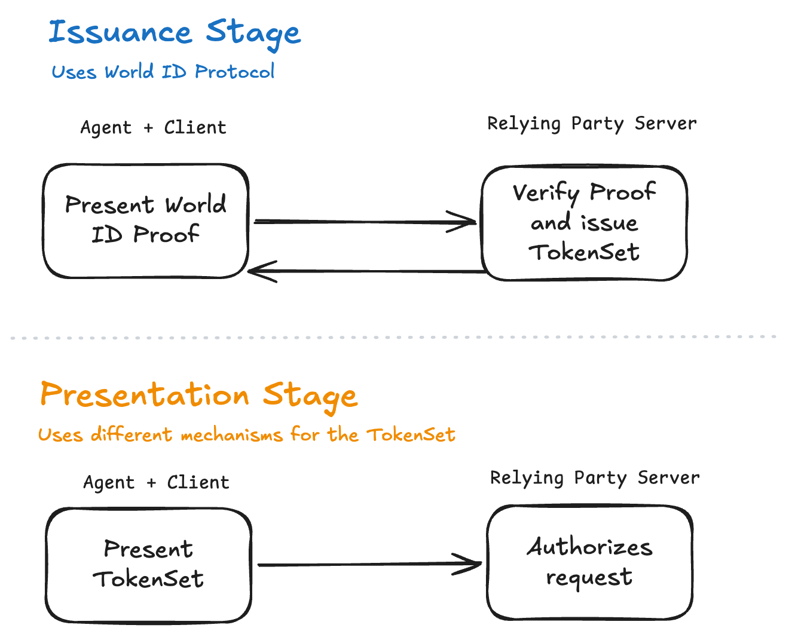
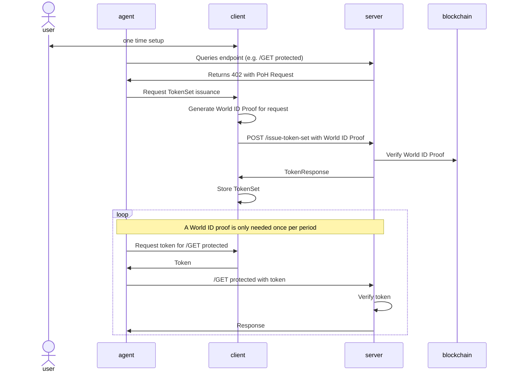

# Abstract

This specification describes the behavior of the AgentKit SDK (v1.0), which enables AI agents to authenticate requests to Relying Parties using proof of human verification or other World ID Credentials. The protocol operates in two stages: an Issuance Stage, where a World ID Uniqueness Proof is exchanged for a TokenSet via an extension to the x402 protocol, and a Presentation Stage, where individual unlinkable tokens derived from the TokenSet are used to authorize subsequent requests. This mechanism allows Relying Parties to enforce rate limits per unique human (e.g., $n$ requests per period) while preserving user privacy across requests. The TokenSet abstraction is designed to be instantiated by privacy-preserving credential schemes such as Anonymous Rate-Limited Credentials (ARC) or Anonymous Credit Tokens (ACT). This document is informational and describes SDK-level behavior; it is **non-normative for the World ID Protocol**.

# Motivation

Agents are becoming a new interface to interact online, and being able to distinguish legitimate traffic from fraud or abuse will become an increasingly important problem to solve. RPs can protect their systems by requesting payments (e.g. [x402](https://www.x402.org/)), authenticating users or requiring proof of human. For example, an API may require proof of human to be queryable by automated traffic.

# Specification

## Terminology

- **`TokenSet`**: Defined as an abstraction over a generic mechanism to authorize a request with a server.
- **[Authenticator](https://docs.rs/world-id-authenticator/0.8.2/world_id_authenticator/struct.Authenticator.html)** is as defined in the World ID Protocol.
- **Proving Authenticator**: Follows the definition of [WIP-104][wip-104]. This is the authenticator instantiated by the AgentKit client during enrollment. This authenticator is registered on the user's World ID and is used to generate World ID Proofs on behalf of the user.
- **Delegating Authenticator**: A [WIP-104][wip-104] Admin Authenticator belonging to the World ID holder that (a) originally registered the Proving Authenticator , and (b) provides ongoing Authenticator Attestations (via [WIP-105][wip-105] mechanisms) to certify that the Proving Authenticator remains authorized to act on behalf of the holder. The Delegating Authenticator enforces additional verification checks (e.g. FaceAuth) before issuing attestations.
- **Client**: The AgentKit CLI tool with which the agent interacts. The client implements logic to be an Authenticator provider, specifically a Proving Authenticator and handles World ID Proof generation and TokenSet logic.
- The key words "MUST", "MUST NOT", "REQUIRED", "SHALL", "SHALL NOT", "SHOULD", "SHOULD NOT", "RECOMMENDED", "MAY", and "OPTIONAL" in this document are to be interpreted as described in [RFC 2119](https://www.ietf.org/rfc/rfc2119.txt). These keywords are normative for AgentKit SDK implementations.

## High Level Overview

Please note this Overview section is **non-normative** and is meant only to provide high level context.

At a high level, the AgentKit SDK is comprised of two components: a **client** and a **server**. The client is the main tool with which users and agents interact. The server component is used by RPs to validate incoming traffic.

**Client Instantiation.** The user installs the client component in their system and performs a one-time setup where they register the key on their World ID (see [WIP-104][wip-104]). Registering this key enables the client to become a **Proving Authenticator** . The registration is authorized by an existing authenticator, which becomes the **Delegating Authenticator** for this client.

**Server Instantiation.** The RP installs the server component in their system and sets it up with the required components (details below). The server determines a period for their business rules (e.g. 1,000 requests per human every 24 hours). 

**Usage.** After both sides are set up, the high level flow is as follows. There are two separate stages in the flow.



> Highlighting the difference in the stages. Of particular note is that the `TokenSet` generation and presentation is not part of the World ID Protocol. World ID is used as the “gate” to obtain a TokenSet which can subsequently be used for arbitrary requests.

Highlighting the difference in the stages. Of particular note is that the `TokenSet` generation and presentation is not part of the World ID Protocol. World ID is used as the “gate” to obtain a TokenSet which can subsequently be used for arbitrary requests.

| **Issuance Stage** | **Presentation Stage** |
| --- | --- |
| The server expresses intent to use PoH for requests. The client generates and provides a **World ID Uniqueness Proof** to get a TokenSet issued. | The client uses the TokenSet to present a different *token* on each request. The server authenticates each *token* and fulfills the request. |

The client generates a World ID Proof once to receive a TokenSet which can be used to derive multiple tokens for different requests. For example, a TokenSet can represent receiving 1,000 requests in a 24 hour period. The client (or any other authenticator for the user) would be unable to obtain another TokenSet in that 24 hour period.



## Client Enrollment

The user enables AgentKit support by installing the skill to their agent. The skill includes a simple executable capable of performing all operations via CLI.

Upon first use, the user will get prompted to connect their agent with their World ID. This is done by displaying a QR code that contains a request to register a new authenticator in a user’s World ID. The process is as follows:

1. The client generates a new EdDSA keypair and stores the private key secure on the client’s device. Where available a secure storage layer is used (e.g. Keychain on Apple platforms).
2. The client constructs a [WIP-105][wip-105] request to register a new authenticator on the user’s World ID. The request includes the newly generated public key.
3. The user scans the QR code with their existing authenticator (which becomes the **Delegating Authenticator** for this client).
4. The Delegating Authenticator will parse the request and request authorization from the user.
5. If approved, the Delegating Authenticator will call `insertAuthenticator` in the `WorldIDRegistry` and register the new authenticator keypair.

At this point, the client now has the capability of generating World ID Proofs on behalf of the user.

## Issuance Stage

1. The server expresses its intent for a Proof of Human intent through an [x402](https://www.x402.org/) extension. The server returns a `402` HTTP Status Code, with the following 402 extension,
    
    ```json
    {
      "agentkit": {
        "v": 1,
        "proof_request": { ... },
        "issue_endpoint": "https://example.com/issue",
        "period": {
          "max_requests": 1000,
          "period_starts_at": 1776367145,
          "duration_seconds": 86400,
          "period_index": 20559,
        }
      }
    }
    ```
    
    - The `proof_request` object follows the [ProofRequest](https://docs.rs/world-id-primitives/latest/world_id_primitives/request/struct.ProofRequest.html) format as defined in the World ID Protocol.
    - The `period` object defines the rate limit enforced by the server:
        - `max_requests`: The maximum number of requests a unique World ID holder can make within the period.
        - `period_starts_at`: The Unix epoch timestamp in seconds when the current period starts.
        - `duration_seconds`: The length of the period in seconds.
        - `period_index`: The unique identifier for the current period. The server computes this as `ceil(current_ts / duration_seconds)`
2. The server computes the `action` for which the World ID Proof is requested (per World ID specs, the RP MUST sign this as part of the `ProofRequest`). The client MUST verify the action is properly constructed with the expected form.
    
    ```rust
    action = 
      0x00 // protocol action prefix
    	|| b"agentkit" // domain separator for this spec
    	|| 0x01 // version identifier for this spec
    	|| 0x01 // AgentKit specific context. 0x01 = TokenSet Issuance
    	|| duration_seconds // [u32] 4 bytes
    	|| period_index // [u32] 4 bytes representing the current period
    	|| [0x00; 14] // remainder of the action is filled with 0x00 bytes
    ```
    
    - Important to note that if the RP changes the duration, the action space will change, i.e. this is equivalent to resetting the state. This is deliberate to avoid accidental collisions when the period needs to change. It is RECOMMENDED that RPs also invalidate existing TokenSets when rotating the `duration_seconds`.
3. Upon receiving these requests, the agent will call the client with the extension object to get a valid TokenSet. The client will:
    1. Generate a World ID proof for the received proof request.
    2. Present a valid `AuthenticatorAttestation` from the Delegating Authenticator. The client obtains the attestation via a [WIP-105][wip-105] inter-authenticator communication mechanism (QR code, deeplink, or push notification). Importantly, the `challenge` of the `AuthenticatorAttestation` MUST equal to the `nonce` of the `proof_request`.
    3. Call the issuer endpoint with the generated proof response and the `AuthenticatorAttestation`.
    4. Store the TokenSet securely. The client MUST store the TokenSet using the same secure storage mechanism used for the authenticator's private key (e.g. Keychain on Apple platforms). TokenSets are sensitive credentials: possession of a TokenSet grants the ability to make authenticated requests on behalf of the user.
    5. Provide the first token use to the agent.
4. The server MUST store used World ID nullifiers to maintain guarantee of single use per World ID holder.

### Authenticator Attestation

Once a Proving Authenticator has been registered, its key is valid for generating World ID Proofs until it is revoked by the user through the Delegating Authenticator. However, key validity alone is insufficient for this use case. Relying Parties need assurance that the Proving Authenticator continues to be authorized by the person behind the World ID. To provide this assurance, the client must present an Authenticator Attestation issued by the Delegating Authenticator.

An Authenticator Attestation is a verifiable, time-bounded statement from the Delegating Authenticator certifying that the Proving Authenticator is authorized to act on behalf of the World ID holder at the time of issuance. The Delegating Authenticator MUST enforce all necessary verification checks as established by [WIP-106][wip-106] (e.g. FaceAuth or other biometric confirmation) before issuing an attestation. This ensures that attestations are anchored in a recent, deliberate authorization by the person behind the World ID.

**Attestation Lifecycle**

1. The client requests an attestation from the Delegating Authenticator via a [WIP-105][wip-105] inter-authenticator communication mechanism (QR code, deeplink, or push notification).
2. The Delegating Authenticator performs the required verification checks and, if successful, issues a signed attestation to the client.
3. The client presents the Authenticator Statement to the RP.

**Why this matters:**

Presenting an Authenticator Attestation when requesting a TokenSet anchors the trust for proof generation in the Delegating Authenticator, rather than solely in the Proving Authenticator's key. This means a user must periodically re-confirm authorization, and a compromised or stolen agent key cannot be used indefinitely without the holder's ongoing consent.

### Error Handling

The following error codes are defined for the Issuance Stage. Errors are returned as JSON responses from the issue endpoint.

| **HTTP Status** | **Error Code** | **Description** |
| --- | --- | --- |
| `400`  | `invalid_request` | The request is malformed. |
| `400` | `invalid_proof` | The World ID Proof did not verify correctly. This may also indicate that the proof’s public inputs are incorrect. |
| `429` | `limit_reached` | The user has already been issued a TokenSet for the current period. *Generally Authenticators which follow World ID Protocol Specs will not allow the same nullifier to be shared.* |
| `400` | `unsupported_version` | The AgentKit version (`v`) in the request is not supported by this server. |

## Presentation Stage

Conceptually a TokenSet is a defined mechanism that a allows agents to prove authorization on their request after the initial gating mechanism with World ID (Issuance Stage). The simplest form of a TokenSet would be arbitrary data that a server recognizes (e.g. a session token stored in the server’s cached, or a signed session token like in a JWS). Such simple implementations, however, have limitations; privacy is chief amongst these. Different requests with the same TokenSet would be easily linkable.

A specific design goal of this spec is that **presentations from the same agent or client MUST be unlinkable** between each other or linkable at the time of issuance even by a malicious RP.

The following draft standards are currently being explored to provide the `TokenSet` functionality. A final standard (or otherwise defined mechanism) will be selected before this spec is finalized:

1. [Anonymous Rate-Limited Credential (ARC)](https://ietf-wg-privacypass.github.io/draft-arc/draft-ietf-privacypass-arc-crypto.html) Protocol from the [Privacy Pass](https://datatracker.ietf.org/wg/privacypass/about/) Working Group which would allow agents to obtain a credential that can be presented up to $n$ times (as established by the server), but each presentation is cryptographically unlinkable to other presentations or the original issuance request.
2. [Anonymous Credit Tokens (ACT)](https://datatracker.ietf.org/doc/draft-schlesinger-cfrg-act/) Protocol which would allow agents to receive a set of credits and RPs would be able to set their own spending rules such that each spend is unlinkable to another one. This mechanism allows RPs to specify more advanced rules such as some actions costing more than others and inherently allows revocation in case for example of abuse.
3. New Zero Knowledge Circuit which allows proving a request up to $N$ number of times with each presentation being cryptographically unlinkable to each other.

### TokenSet Presentation

1. Whenever the agent queries an endpoint which is protected, the agent requests a token from the client. The token is sent as an `AgentKit-Token` header. The specific encoding for the header will be determined based on the final TokenSet mechanism.
2. The agent MUST request a TokenSet output from the client for each request.
3. Multiple agents can use the same TokenSet but these agents MUST be using the same client instance. A future upgrade may allow sharing TokenSets between different clients. 

# Security and Privacy Considerations

| **Consideration** | **Category** | **Mitigation** |
| --- | --- | --- |
| **Client key compromise**: If the EdDSA private key is compromised, an attacker can generate World ID proofs and obtain TokenSets on behalf of the user. | Security | Keys MUST be stored in platform secure storage (e.g. Keychain, TEE). Users can revoke a compromised authenticator via `removeAuthenticator` on the `WorldIDRegistry`. <br />Furthermore, compromised agent keys are unable to change permissions for a user’s World ID (e.g. add another authenticator). |
| **TokenSet theft**: Possession of a TokenSet grants the ability to make authenticated requests without further World ID verification. | Security | TokenSets MUST be stored with the same protection as the authenticator private key. TokenSets are time-bounded by the period and are implicitly revoked at RP-defined period boundaries. |
| **Replay attacks**: A token derived from a TokenSet could be replayed against the server. | Security | The server MUST track presented tokens (e.g. via nullifiers in ARC/ACT) and reject duplicates. Each token MUST be single-use. |
| **Cross-request linkability**: If the same token or identifier is reused across requests, the RP can track user behavior. | Privacy | The TokenSet mechanism (e.g. ARC or ACT) MUST ensure each token presentation is cryptographically unlinkable to other presentations and to the original issuance. |
| **RP collusion**: Multiple RPs could attempt to correlate users across services. | Privacy | Each RP uses a distinct `rpId`, which scope the World ID proof. TokenSets are RP-specific and cannot be correlated across different RPs. <br />Even if RPs share their signing keys so two different parties can request a World ID Proof for the same `rpId`, the client will reject sharing duplicate nullifiers. |
| **Authenticator proliferation**: A user may register many authenticators. | Security | Registering many authenticators does not change the guarantee of a single World ID Uniqueness Proof. As long as an RP selects a Credential which offers uniqueness, the sybil resistance will come from the Credential’s guarantees. |
| **Unauthorized proof usage / runaway agents**: A Proving Authenticator could continue generating proofs indefinitely after initial setup — for example, a user authorizes an agent once, shares the key with a third party, and forgets about it. Without periodic re-authorization, the agent would continue making authenticated requests on behalf of the holder's World ID with no ongoing consent. | Security | RPs require a valid Authenticator Attestation from the Delegating Authenticator during the Issuance Stage. Attestations have a maximum validity period of 14 days, so even if an agent key is shared or forgotten, the agent will stop functioning once the current attestation expires unless the holder actively re-authorizes it through the Delegating Authenticator (which enforces verification checks like FaceAuth). This ensures that no agent can operate on behalf of a World ID holder without recent, deliberate consent. RPs can further tighten this by configuring shorter maximum validity periods or higher minimum risk statement thresholds. A revoked Proving Authenticator will be unable to obtain new attestations from the Delegating Authenticator. |

# Alternatives Considered

**Session tokens or signed bearer tokens (JWT/JWS).** The server issues a session identifier or signed token after proof verification. Rejected because a stable token reused across requests is trivially linkable by the RP (or colluding RPs), which conflicts with the core unlinkability requirement.

**Per-request World ID Proofs.** Require a fresh proof on every request, eliminating TokenSets entirely. Rejected because proof generation is computationally expensive and would introduce unacceptable latency for high-frequency API usage. The two-stage design improves performance of the system, especially for agents which may make many requests.

# Limitations and Future Improvements

1. Authenticator Attestations are bound to a specific Relying Party request for a TokenSet. This means that if an agent is interacting with $n$ sites using World ID, $n$ attestations are required. If this is over a short period of time, $n$ user explicit actions are undesirable (poor UX). There's a few ways to address this for consideration: a) enabling background-issued attestations; b) incorporating an additional circuit that allows proving the Authenticator Attestation binding without requiring a new attestation per RP.
2. A TokenSet may be usable by multiple clients from the same World ID holder. This requires a defined mechanism for securely sharing TokenSets between clients or alternative approaches such that multiple clients can obtain partial TokenSets, either of which may be a future improvement.
3. A limitation on the current definition is that it requires establishing a global rate limit period, because of how World ID Uniqueness Proofs are presented. These global periods are required to determine the context for uniqueness for a World ID Proof (the `action`). This could result in an agent obtaining a TokenSet at the end of $e_{t-1}$ and even one second after at $e_t$. The system remains safe because tokens from $e_{t-1}$ expire, but this is cumbersome user experience.
4. The x402 spec is primarily focused on payments. The extensions representation is useful to incorporate additional information, for example requiring proof of human. As x402 continues to evolve a different standard may be required for this spec.


[wip-104]: https://github.com/worldcoin/world-id-protocol/pull/643
[wip-105]: https://github.com/worldcoin/world-id-protocol
[wip-106]: https://github.com/worldcoin/world-id-protocol
