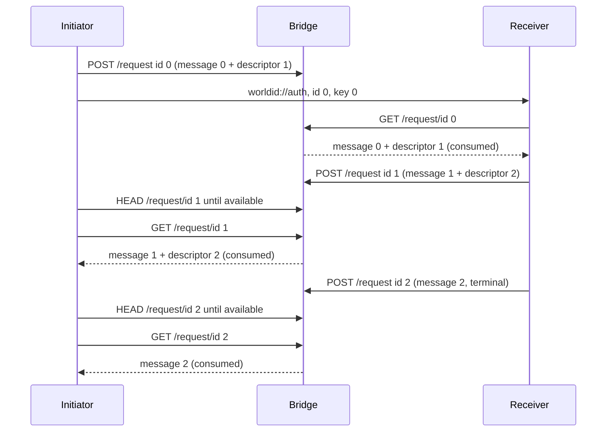

## Abstract

This World ID Standard Proposal defines how two authenticators establish a secure asynchronous exchange over [wallet-bridge](https://github.com/worldcoin/wallet-bridge). The first encrypted message is located and decrypted using a `worldid://` deeplink. Further messages are exchanged by chaining single-use wallet-bridge mailboxes.

wallet-bridge is not a bidirectional channel and does not perform key exchange. It is an untrusted mailbox that temporarily stores opaque ciphertext. This proposal defines the client-side encryption, bootstrap URI, transport envelope and message chaining required to carry [WIP-105](../WIPs/wip-105.md) messages over that mailbox.

## Motivation

Authenticators often need to communicate across devices that do not share a local network. wallet-bridge already provides a simple relay that works in browsers and native applications, but each stored request is single-use. One request identifier does not provide an arbitrary conversation.

A complete transport profile is needed to define:

1. How the first party gives the other party the mailbox identifier and encryption key.
2. How clients encrypt and authenticate messages without trusting the Bridge.
3. How each message identifies the mailbox for the next message.
4. How messages are bound to one session and ordered correctly.

## Specification

The key words "MUST", "MUST NOT", "REQUIRED", "SHALL", "SHALL NOT", "SHOULD", "SHOULD NOT", "RECOMMENDED", "MAY", and "OPTIONAL" in this document are to be interpreted as described in [RFC 2119](https://www.ietf.org/rfc/rfc2119.txt).

### Definitions

- **Bridge**: An untrusted deployment of wallet-bridge that stores opaque ciphertext.
- **Initiator**: The authenticator that creates the first message and deeplink.
- **Receiver**: The authenticator that opens the deeplink and retrieves the first message.
- **Mailbox**: One wallet-bridge request entry identified by `request_id` and consumed by one successful retrieval.
- **Mailbox Descriptor**: The request identifier, encryption key and expected sender for the next message.
- **Role**: Either `initiator` or `receiver`, fixed for the lifetime of the session.

### wallet-bridge Properties

The Bridge accepts encrypted requests with this JSON shape:

```json
{
  "request_id": "01c9360a1e0347ea85bd7e884d891c5c",
  "iv": "base64-encoded nonce",
  "payload": "base64-encoded ciphertext and authentication tag"
}
```

The relevant wallet-bridge operations are:

| Operation | Purpose |
|-----------|---------|
| `POST /request` | Store one request under a client-provided `request_id`. |
| `HEAD /request/{request_id}` | Check whether a request exists without consuming it. |
| `GET /request/{request_id}` | Retrieve and consume the request. |

This proposal intentionally uses a new request for every message. The paired wallet-bridge response slot is not used. A single transition rule makes the direction and number of messages independent of the request and response terminology in the Bridge API.

Requests can each be retrieved only once. A duplicate `request_id` is rejected. The reference wallet-bridge retains each entry for 900 seconds. This is a per-entry retention period, not an absolute session expiry.

The Bridge sees mailbox identifiers, message sizes, timing, network metadata and retrieval state. It MUST be treated as able to delay, delete, replay or deny access to ciphertext.

### Cryptographic Profile

Each Mailbox uses AES-256-GCM with:

1. A fresh 32-byte key generated by a CSPRNG.
2. A fresh 12-byte nonce generated by a CSPRNG.
3. A 16-byte authentication tag appended to the ciphertext.
4. Additional authenticated data defined below.

The `iv` and `payload` members sent to wallet-bridge MUST use standard base64 with padding. Keys placed in a deeplink or Mailbox Descriptor MUST use unpadded base64url.

The additional authenticated data is the UTF-8 encoding of:

```text
WISP-101|1|{bridge_origin}|{request_id}
```

`bridge_origin` is the normalized HTTPS origin with no trailing slash. This binds ciphertext to the transport version, Bridge origin and Mailbox identifier.

Clients MUST generate `request_id` as 16 random bytes encoded as 32 lowercase hexadecimal characters. The wallet-bridge deployment MUST support client-provided request identifiers with create-if-absent semantics. A client MUST NOT omit `request_id` from the additional authenticated data.

### Transport Envelope

The plaintext encrypted into each Mailbox is a JSON object:

```json
{
  "version": 1,
  "session_id": "8d13adf994dc448c97440e64b4b847a8",
  "sequence": 0,
  "sender": "initiator",
  "expires_at": 1788179400,
  "message": {
    "version": 1,
    "id": "7a1c2e77-46d8-4d14-b852-ca3f4bb28eb2",
    "type": "auth.v1.register",
    "payload": {}
  },
  "next": {
    "request_id": "bb22097aef394388bfb3448346e3f16c",
    "key": "mH3z0XvvlrVOPWqIGD0tMRGGlYc2sPD8D83YQzhdmpE",
    "sender": "receiver"
  }
}
```

| Member | Required | Description |
|--------|----------|-------------|
| `version` | REQUIRED | WISP-101 transport version. This spec defines version `1`. |
| `session_id` | REQUIRED | Identifier shared by every message, encoded as 32 lowercase hexadecimal characters containing 16 bytes generated by the Initiator's CSPRNG. |
| `sequence` | REQUIRED | Zero-based message sequence number. The first message is `0` and each following message increments it by one. |
| `sender` | REQUIRED | Role that created this message. |
| `expires_at` | REQUIRED | Absolute session expiry as Unix time in seconds. It MUST be identical in every Transport Envelope in the session. |
| `previous_hash` | CONDITIONAL | SHA-256 hash of the previous Transport Envelope, encoded as 64 lowercase hexadecimal characters. It MUST be omitted at sequence `0` and is REQUIRED otherwise. |
| `message` | REQUIRED | One complete WIP-105 message. |
| `next` | OPTIONAL | Mailbox Descriptor for the next message. It MUST be omitted when no further message is expected. |

The Transport Envelope and Mailbox Descriptor MUST reject unknown members. `request_id` in a Mailbox Descriptor MUST be 32 lowercase hexadecimal characters. `key` MUST decode to exactly 32 bytes. `sender` identifies which role is expected to create the next message. It may name the current sender when an asynchronous follow-up will be sent without an intervening reply.

When processing sequence `0`, the Receiver MUST reject an `expires_at` value more than one hour in the future. An implementation MUST reject an envelope after `expires_at`, even if the Bridge still holds the Mailbox.

To calculate `previous_hash`, serialize the complete previous Transport Envelope using the JSON Canonicalization Scheme from RFC 8785 and compute its SHA-256 hash. This binds each message to the ordered transport transcript, including the previous message's Mailbox Descriptor.

### Bootstrap Deeplink

The Initiator:

1. Generates a `session_id`, request identifier and encryption key using a CSPRNG.
2. Generates a Mailbox Descriptor for the expected next message if the exchange is not terminal.
3. Wraps the first WIP-105 message in a sequence `0` WISP-101 Transport Envelope.
4. Encrypts the envelope for the initial request identifier.
5. Stores it with `POST /request`.
6. Displays or opens this URI:

```text
worldid://auth?v=1&i={request_id}&k={key}&b={bridge_url}
```

| Parameter | Required | Description |
|-----------|----------|-------------|
| `v` | REQUIRED | WISP-101 version. This spec defines `1`. |
| `i` | REQUIRED | Request identifier supplied to wallet-bridge. |
| `k` | REQUIRED | The 32-byte Mailbox key encoded as unpadded base64url. |
| `b` | REQUIRED | Percent-encoded HTTPS wallet-bridge base URL. |

The URI MUST NOT contain a WIP-105 message or authenticator registration data. It contains only the information needed to locate and decrypt the first message.

The URI acts as a bearer capability. Applications MUST NOT log it, send it to analytics, include it in crash reports or retain it after the exchange. A QR code displaying the URI SHOULD hide or expire after it is scanned. Implementations MUST reject duplicate parameters, unknown versions, URL credentials and non-HTTPS Bridge URLs. Implementations SHOULD restrict Bridge origins according to local policy and MUST require explicit user confirmation before using an unknown origin.

An authenticator that handles `worldid://auth` MUST parse this route. This proposal does not require every authenticator provider to register the `worldid` URI scheme. Dispatch and ownership of the scheme are platform integration concerns outside this proposal.

### Message Chaining



The example shows the Receiver sending both message `1` and an asynchronous terminal message `2`. The `next.sender` in message `1` is therefore `receiver`.

When sending a message after sequence `0`, the sender MUST:

1. Use the `request_id` and key from the previous Transport Envelope's `next` member.
2. Verify that its Role equals `next.sender`.
3. Set `sequence` to the previous sequence plus one.
4. Set `previous_hash` to the hash of the complete previous Transport Envelope.
5. Preserve `session_id` and the absolute `expires_at`.
6. Generate a fresh Mailbox Descriptor if another message is expected.
7. Encrypt the new Transport Envelope with the Mailbox key and a fresh nonce.
8. Store the ciphertext with `POST /request` using the specified `request_id`.

When receiving a message after sequence `0`, the receiver MUST:

1. Poll `HEAD /request/{request_id}` for the expected Mailbox using backoff and jitter.
2. Retrieve it once with `GET /request/{request_id}`.
3. Decrypt it using the expected Mailbox key and additional authenticated data.
4. Verify `version`, `session_id`, `sequence`, `sender`, `expires_at` and `previous_hash` before processing the WIP-105 message.
5. Verify that the WIP-105 `in_reply_to` value is valid for the application protocol.

An authenticator MUST terminate the exchange if any value is unexpected. The `next` member defines whether another message is expected and which role sends it. A role that is not the expected sender MUST wait for the described Mailbox rather than write to it.

### Retries and Expiry

1. `GET /request` consumes data. Clients MUST NOT issue concurrent retrieval requests for the same identifier.
2. A failed `POST /request` MAY be retried with the same identifier, nonce and ciphertext. A conflict means that the identifier is already occupied and MUST NOT cause a second Mailbox to be added to the chain.
3. A recipient SHOULD use `HEAD /request/{request_id}` while waiting and issue `GET` only after the Mailbox exists.
4. Polling MAY use exponential backoff with jitter. Clients SHOULD honor server rate limits.
5. Session expiry, a missing consumed message or an authentication failure MUST terminate the transport. The application outcome remains unknown unless the application protocol establishes otherwise.
6. Each Mailbox MUST use a new key. Closing an exchange MUST delete all Mailbox keys and the bootstrap URI from local storage as soon as practical.

## Rationale

**Mailbox chaining.** wallet-bridge stores one message under a client-selected identifier. Each authenticated message carries the random identifier and key for the next message. This turns a sequence of single-use mailboxes into an ordered asynchronous exchange.

**Request mailboxes only.** Using the same `POST`, `HEAD` and `GET` transition for every message avoids alternating between Bridge request and response semantics. It also permits one authenticator to send an asynchronous status message after its previous response.

**Transport wrapper outside WIP-105.** Mailbox routing and encryption keys are properties of wallet-bridge, not authenticator application messages. Keeping them in a WISP-101 wrapper lets the same WIP-105 message use another transport unchanged.

**A new key per Mailbox.** Limiting a key to one ciphertext reduces the impact of key disclosure and prevents nonce reuse across messages.

**A deeplink only for bootstrap.** The first Mailbox identifier and key need an out-of-band path. After the first message, encrypted Mailbox Descriptors provide that path without placing application data in URIs.

## Security

wallet-bridge is untrusted. AES-GCM protects message confidentiality and integrity, but the Bridge can observe metadata and can deny service by consuming, withholding or deleting a Mailbox.

Anyone who obtains a Mailbox Descriptor can retrieve or replace its message. The bootstrap URI and each decrypted `next` descriptor MUST be treated as secrets. High-entropy request identifiers reduce blind consumption and preemption attacks but do not replace encryption keys.

Both authenticators learn every Mailbox key in the session. This transport provides confidentiality and integrity against the Bridge and third parties, but it does not provide cryptographic sender identity between the two authenticators. Application protocols MUST NOT use `sender` as proof of authorization.

AES-GCM nonce reuse under the same key can reveal plaintext and invalidate authentication. Implementations MUST generate nonces with a CSPRNG and MUST NOT reuse a Mailbox key.

The deeplink can be replaced before it reaches the Receiver. Application protocols that authorize sensitive actions MUST provide an independent user confirmation bound to the data being authorized. WIP-109 uses a Short Authentication String for this purpose.

Allowing arbitrary Bridge URLs can expose network metadata or target internal services. Implementations MUST accept only HTTPS origins, reject local and link-local addresses unless explicitly operating in a development environment, and apply an allowlist or an explicit unknown-origin confirmation.

## Backwards Compatibility

This proposal defines the new `worldid://auth` route and does not change existing `worldid://verify` links or wallet-bridge proof request payloads. A wallet-bridge deployment must support client-provided request identifiers to implement WISP-101.
