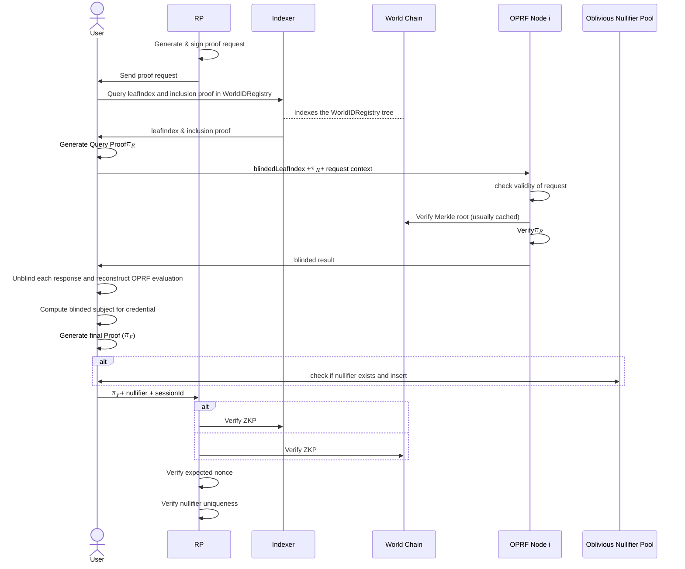
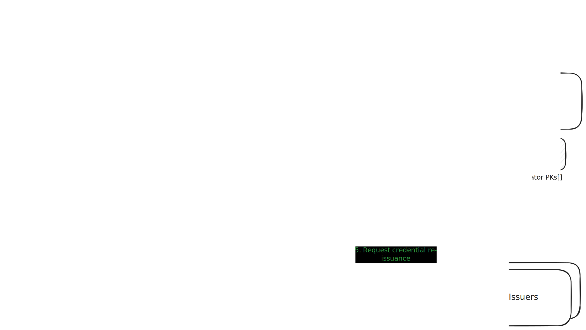
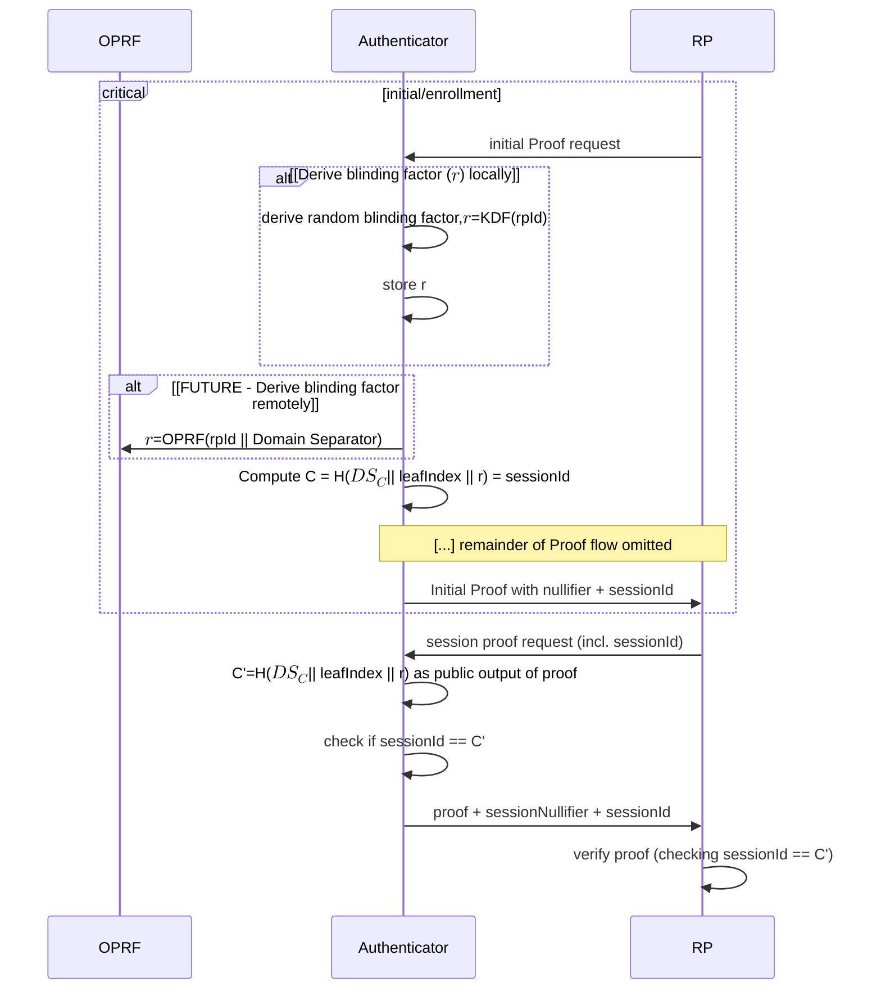

# Abstract

The World ID v4.0 release introduces *account abstraction* at its core, transforming a World ID from a single secret into an abstract record in a public registry (called `WorldIDRegistry`) with multiple authorized keys. This fundamental change enables several key improvements:

1. **Multi-key support**: Users can generate proofs using multiple valid authenticators (such as across multiple devices, multiple platforms or multiple applications) while maintaining the same identity.
2. **Improved Protocol Resilience**: Multi-key support reduces likelihood of loss of all keys, key rotation and revocation are natively supported, and the user can (optionally) define a World ID Recovery Agent (e.g. such as biometric authentication).
3. **Web-based authenticator provider**: A reference web authenticator provider simplifies World ID usage directly in browsers, improving user experience and adoption potential.
4. **Improved privacy**: The protocol enforces one-time use of nullifiers for longer-term actions, preventing tracking while maintaining proof integrity.

These changes collectively increase security, privacy, and usability while enabling more sophisticated applications of human verification in the Age of AI. For more details on what is changing from a technical standpoint, please see *Summary: What is Changing?*.

# Product Specs

At a high level, this release of the Protocol is about *Account Abstraction*. A World ID is no longer tied to a single secret, and instead is an abstract record created in the public `WorldIDRegistry` with a defined set of authorized keys which allow the user to interact with their World ID (a similar mental model is how passkeys authorize accounts for specific websites or how smart contract wallets work in the Ethereum ecosystem).

Stemming from the enablement of other Authenticators to exist, a reference open-source, web-based Authenticator will be published which will reduce some of the overhead for using a World ID and simplifies the user experience. The enhanced user experience will enable simpler and more widespread adoption of the Protocol.

## Definitions

- **Authenticator**: A software or hardware agent (e.g., app, device, web client, or service) that controls a set of authorized keypairs for a World ID Account and is functionally capable of interacting with the Protocol, and is therefore permitted to act on that account’s behalf. An Authenticator is the agent of users/holders. Each Authenticator is registered in the `WorldIDRegistry` through their authorized keypairs.
- **OPRF Nodes**: The OPRF Nodes are a multi-party set (MPC) of nodes responsible for enabling the nullifier generation which users present to RPs to prove uniqueness.
- **Recovery Agent**: A party designated by the user which has a special permission to recover their World ID Account in case of loss of all Authenticators. The party may be a set of entities represented with abstract rules (e.g. through a smart contract). This designation is optional and done on-chain.
- **Action**: *Maintains definition from previous Protocol version.*
- **Nullifier**: *Maintains definition from previous Protocol version.* A nullifier is a one-time use identifier that guarantees an action can only be taken once. It’s analogous to a one-time use ticket, a user generates a nullifier through a Proof, and presents it to an RP. A nullifier will always be the same for the same user and the same RP+Action.
- **Uniqueness Proof**: A statement where a user proves they are performing an action once and they own a particular credential (e.g. *I’m a unique person with a PoH credential voting on this proposal once*). These proofs cannot be cryptographically associated with any other proof (e.g. not across RP, or even to the same RP).
- **Session Proofs**: Used after an initial Uniqueness Proof—where a `sessionId` is generated— and subsequently provided by an RP to receive a statement that cryptographically guarantees the same World ID is being used (e.g. *I have an account with an RP and I want to prove I now have a new Credential*). These proofs cannot be associated across RPs, across sessions with the same RP, or with any other proof.

## Key Product Functionality

This notes the key **new** features or functionality for this **release** of World ID (v4.0):

- Multi-key support: A World ID is not bound to a single key. A user can generate proofs on multiple valid authenticators (e.g. devices, platforms). With the important exception of security properties of the Authenticator, a proof proves the same thing to an RP regardless of which authenticator was used.
    - A user can add or remove different valid authenticators to manage their World ID (Portability).
    - **Motivation:** Allowing multiple authenticators serves to the Decentralization of the Protocol, with no reliance on a single actor (such as a single Authenticator provider, e.g. World App). Furthermore, abstracting a World ID into a conceptual record vs. a single secret enables the secure and practical existence of multiple Authenticators as well as enabling Recovery in case of loss and rotation in case of compromise.
- Recovery: Regain access to the same World ID through Recovery Agents.
    - **Motivation:** Recovery is a fundamental building block of a Proof-of-Human Protocol (see [Whitepaper](https://whitepaper.world.org/#recovery) on why). While we expect authenticator providers to offer robust backup mechanisms, the user must be able to recover their World ID and related state in a contingency scenario.
- Web-based Authenticator Provider: A limited authenticator that allows usage of World ID in the web browser. This serves both as a reference of an authenticator and also for improved UX for certain RP flows. Functionality is limited as enrollment of credentials is out of the scope for this initial release.
    - **Motivation**: A lightweight web-based authenticator enables simpler usage of World ID which provides a better user experience and will enable more growth as interacting with RPs will be significantly simpler.
- Trusted RPs. An authenticator can identify a request comes from a valid RP.
    - **Motivation:** Authenticators need to be able to identify that they’re generating proofs for the right recipient to reduce potential for proof phishing (e.g. a malicious actor asking you for a proof meant for a different RP to know if you’ve performed that action). In addition, this enables future introduction of Protocol fees.

## Non-Functional Requirements

- Privacy.
    - Assuming **non-collusion** of nodes of each multi-party system, the user’s privacy cannot be compromised by any single party, neither correlation of multiple actions nor direct identification of a user. For example, it’s impossible to know that a specific user performed a specific action (identification) or that two different Actions were performed by the same user (correlation).
    - Addressing the attack vector of collusion of a threshold (or all) nodes, which in the case of the OPRF Nodes it could potentially allow de-anonymization of past activity, the following holds true:
        - Scaling to a very large number of nodes (e.g. n = 50-100) is technically and pragmatically feasible.
        - Rigorous key management (e.g. HSMs preventing key extraction and destruction of rotated out-of-use keys) should be established in an auditable way.
    - Strict requirements for the identifiers handed off by the Protocol are introduced. See details in Tech Specs.
    - No human super-cookies. Permanent state or linkable state is as privacy-preserving as possible and is protocol-enforced. Privacy preserving in this context means that it’s not possible to identify a single person, even pseudonymously, across a long period of time without ongoing consent. Any exposed long-living / constant IDs should be protected as secrets.
- Security.
    - A World ID is not a single secret that needs to be shared or can’t be rotated.
    - A World ID cannot be recovered or an authenticator added without verifiable user intent (through knowledge of a secret key of an authorized authenticator).
    - Collusion of **all** nodes with an multi-party system (MPC) does not allow performing actions on the user’s behalf.
    - User Auditability — each user needs to be able to see account management events that have been authorized with their World ID, for example things like adding / removing of authenticators.
- Migration Path.
    - There needs to be a clear migration path for all currently active and relevant use cases to the new version of the Protocol.

## User Flows (Authenticator)

## Other Considerations

- The privacy and security implications of Authenticators is improved (key revocation, etc.) but the user must trust their Authenticator(s). The Authenticator must handle the user’s Credentials (or previously Personal Custody Packages) and keys correctly.

---

# Technical Specs

> [!TIP]
> Please note these are the high level technical specifications at the time of introduction of World ID 4.0. The most up-to-date technical documentation reflecting the current state of the Protocol can always be found in the [developer documentation](https://docs.world.org/world-id) and the [Protocol repository](https://github.com/worldcoin/world-id-protocol).

## Summary: What is Changing?

- A World ID is now a record on an on-chain registry and more importantly a single World ID can have multiple public keys.
    - This also means identity commitments (`identityCommitment`) no longer exist. Instead, the identification mechanism is the knowledge of a secret key corresponding to a public key registered in a specific leaf index in the `WorldIDRegistry`.
    - Also implies that the on-chain trees of identity commitments is gone in favor of a single `WorldIDRegistry`.
- Creating a World ID now occurs through on-chain registration (vs. as an offline keypair generation previously), and issuing Credentials is now done without on-chain interaction. Credentials are now issued by the Issuer signing them. Previously, the Issuer would add the user’s identity commitment to the relevant on-chain tree.
- Nullifiers are enforced one-time use. Previously there was no enforcement of nullifiers being one-time use and they could become pseudonymous identifiers for an RP, now Authenticators will not issue a nullifier more than once.
- [**For RPs only**]. When RPs require users to prove they are still the same World ID that originally performed an action, they will be able to store an identifier from the original action (a `sessionId`) and provide it to the user for subsequent proves. With Proof of Human, this allows RPs to establish they are interacting with the same World ID, potentially with different credentials too. See *Session Proofs* for further details.
- [**For Issuers only**]. Authentication based on using nullifiers from ZKPs as identifiers is no longer supported. A new authentication mechanism is introduced for issuers.
- Access to a World ID can be recovered. A user can designate a *Recovery Agent* for their account which will allow for recovery in case of access to all Authenticators is lost.
    - [**Recovery Agent Scope**]. Users may designate the *PoH AMPC* system as their Recovery Agent to recover their World ID. In the future, other Recovery Agents are expected to be available.

## High level overview

Diagram of components for the World ID 4.0 Protocol.

1. The **World ID Registry** is introduced. This public contract is the source of truth for World IDs, a World ID conceptually becomes an account, represented in a leaf of the Merkle tree in this contract. Each account is identified with its index in the tree. The registry also contains a list of authenticator public keys authorized to act on behalf of the holder. The OPRF Nodes, as well as RPs use this to verify proofs (through an Merkle inclusion proof within the ZKPs).
2. Similarly, a **Relying Party Registry** is introduced. This registry contains a list of authorized Relying Parties with their accompanying authorized public keys. The registry permits RPs to authenticate requests for proofs to Authenticators.
3. The multi-party set of **OPRF Nodes** is introduced. This set of nodes are now responsible for generating the nullifiers that users present to RPs to prove uniqueness. The nullifiers are generated through a *Verified Threshold* *Oblivious Pseudorandom Function* (vOPRF) with participation of the OPRF nodes. Nodes verify requests for nullifiers are properly validated by both RPs and users (see *Uniqueness Proofs*), and only then will generate the required output to compute the user’s nullifier. The users then construct the final nullifier and prove its computation in the proof they present to RPs.
    1. A multi-party OPRF is necessary because it prevents nullifiers from being guessable, i.e. nullifiers are deterministic but appear random (recall that PRF outputs under a uniformly random key are computationally indistinguishable from a uniformly random function). This could theoretically be accomplished with a regular hash function, but then nullifiers could be brute forced by computing the hash for all possible `leafIndex`es (which are public on-chain). To prevent this, secret entropy is required (in World ID ≤ 3.0, the user provided this entropy). Since this is not available anymore, the entropy now comes from the OPRF nodes.
    2. Additionally, to prevent brute forcing even with involvement of OPRF nodes, OPRF nodes require authentication before computing each hash. They authenticate the user through a ZKP that proves knowledge of an Authenticator secret key authorized in the `WorldIDRegistry` for the particular `leafIndex` for which they are generating a nullifier. 
    3. Importantly, the OPRF nodes compute the keyed-hash function $H_k(x')$ on a blinded input, hence they cannot learn which user is actually performing a request. Furthermore, the OPRF nodes output a proof that attests to the proper computation of $H_k$ given a committed $k_{pk}$, so neither users nor RPs need to blindly trust the OPRF nodes.
    4. Similar to how OPRF Nodes are used to generate the nullifiers presented to RPs, these nodes also generate a blinding factor for each credential so there cannot be correlation of World IDs from malicious issuers.
    5. More information on the OPRF Nodes can be found in the paper: *“[A Nullifier Protocol based on a Verifiable, Threshold OPRF](https://github.com/TaceoLabs/oprf-service/blob/main/docs/oprf.pdf)”*.
    6. Details about the nature, number, and diversity requirements of OPRF nodes must be established before the production network is live. 
4. Protocol differences at a glance:
    
    
    |  | **World ID ≤3.0** | **World ID 4.0 (2025)** |
    | --- | --- | --- |
    | What is a World ID? | A secret. | An entry in public registry. |
    | Proof Generation | [Semaphore](https://semaphore.pse.dev/) proofs generated on the client. | *Conceptually the same but with new ZK-circuits.* Users generate a query proof for OPRF nodes, which provide computations that enable the nullifier generation. A final Uniqueness Proof is generated and presented to RPs. |
    | How does the Relying Party enforce uniqueness? | Storing a nullifier hash. | *Conceptually the same.* |
    | Post-compromise privacy | If the user’s World ID secret leaks, all past activity could be identified.   Furthermore, the secret cannot be rotated. | If a user’s authenticator secret leaks, no past activity can be identified on its own. Collusion with an RP would be required to compromise *some* past activity.   Secrets can be easily rotated. |
    | Recoverability | Cannot be recovered if the secret is lost. | Can be optionally recovered through a Recovery Agent. |
    | Credential Issuance | On-chain Merkle Tree containing `idComm`s.    Credential-equivalent held self-custodially. | Signed message from the Issuer.    Credential held self-custodially. |
    | Signal (proof messages) | An RP can include an arbitrary signal to which the user commits. | *Conceptually the same.* |
    | Secret Security | Secret must be stored with software protections and loaded into memory. | Conceptually possible to store keys in hardware-based key stores. *Initial keys will have the same characteristics as the previous protocol version due to ZK proving limitations.* |

## Technical Details

### Uniqueness Proofs

A Uniqueness Proof is how a user primarily proves they are performing an action **once** and they own a Credential that meets the RP’s requirements (e.g. the user has a unique government-issued document). While fundamentally the user is **proving uniqueness per World ID Account** when performing an action, if the request is not bound to a Credential that offers a measure of uniqueness (e.g. PoH or unique government-issued document), the proof will lack value.

- The nullifier is computed by the OPRF Nodes. Computing it requires output from a threshold number of nodes to be valid.
    - Importantly, the input to the OPRF Nodes is blinded so that no OPRF node can see the raw `leafIndex` (i.e. OPRF nodes only know that the request is from an authorized authenticator).
    - Importantly, the nullifier is credential *independent*, so the action can only be performed once regardless of which credentials are available at the time.
    - Further information on how the nullifier is computed can be found in the [TACEO OPRF Whitepaper](https://github.com/TaceoLabs/nullifier-oracle-service/blob/main/docs/oprf.pdf).
- Nullifiers have the following properties, which in combination make them amenable for use by an RP to enforce anonymous per-action uniqueness:
    
    
    | **Property** | **Description** |
    | --- | --- |
    | Deterministic | Given the same context (`leafIndex` [blinded], `rpId`, `action`), the nullifier is always the same. Assuming honest behavior of OPRF nodes never rotating their base key. *Note that the credential is intentionally not included in this context. This means that the action can be performed only once, regardless of which credentials are available at the time.* |
    | Unguessable | For a fixed context, the nullifier output is uniformly distributed over the output space. Even with the full set of possible users, computing candidate nullifiers is infeasible without collusion of a threshold of OPRF nodes such that the OPRF key is known. |
    | Authenticated | It’s probabilistically impossible to claim ownership over a nullifier if you don’t know a secret value (a secret key whose public counterpart is registered in the `WorldIDRegistry`). |
    | Anonymous | A nullifier hides which user generated it. To preserve anonymity, each nullifier must only be used once (otherwise repeated use makes it pseudonymous). This is the responsibility of Authenticators. |
    | Unlinkable | For any two nullifiers with different contexts, the probability that an adversary can correctly distinguish whether they were derived from the same user is at most negligibly better than random guessing. |
    | Pre-image resistance | For any given nullifier, and knowing the public context (`rpId`, `action`), it is computationally infeasible to find the pre-image or the `leafIndex`. |
- The authenticator generates two types of different zero-knowledge proofs to be able to deliver a Uniqueness Proof to an RP,
    - The query proof $\pi_1$ which proves to the OPRF Nodes that the request is properly authorized by the user. This ZKP proves the request is signed by a public key which is registered for the particularly provided blinded `leafIndex` in the `WorldIDRegistry`.
    - A final Uniqueness Proof $\pi_2$ which ensures at least the following constraints:
        - *The same constraints of the query proof are evaluated.*
        - Correct OPRF evaluation on `leafIndex`, i.e. the generated nullifier is correct for the committed public keys from each OPRF node.
        - Request is signed by a public key that is registered for the `leafIndex` in the `WorldIDRegistry` (user authentication).
        - The Credential was issued for this World ID, i.e. the Credential’s `sub` matches the blinded `leafIndex` of the user.
        - The Credential used in the proof is signed by the Issuer (through the committed key in the `CredentialSchemaIssuerRegistry`).
        - Credential is not expired.
        - Credential meets the minimum genesis_issued_at constraint provided by the RP.
        - Signal and nonce provided by the RP as public inputs are committed.
        - *Potential future constraints may include: integrity attestation of device, enforcing the expiration of actions, credential specific checks, etc.*
- **Oblivious Nullifier Pool**. The Oblivious Nullifier Pool is a separate service which offers *Private Intersection Retrieval* and keeps track of used nullifiers. Its function is simply to keep a flat list of used nullifiers such that an authenticator can query if a nullifier has been used before sharing it (and the related $\pi_2$) with an RP if it has been used before. The list is flat (as the nullifier is already unique per-RP-per-action-per-user) relying on the collision-resistance property of the hash function used in the Protocol.
    - This system ensures that nullifiers can’t be misused to create long running identifiers. As their name suggests, a nullifier is one-time use.
    - The term *oblivious* is used to refer to the fact that this map is queried in a way where the servers serving such requests cannot learn which records where accessed and hence be able to compromise the user’s privacy.
    - The main limitation of the nullifier pool is performance at scale. One option is to shard the pool, making trade-offs of anonymity set size vs. performance. This is still in research.
    - Initially, this pool will only be used for actions that have a running period longer than a predefined threshold. This is to solve for scaling issues as this system grows.
- **Blinded subjects**. To prevent correlation of users even among issuers, or in case of leaked credentials, the subjects of the credentials are blinded.
    - When requesting a new credential from an issuer, the user generates a blinding factor using the OPRF nodes, $\texttt{subjectBlindingFactor}=H_k(\texttt{issuerSchemaId} \mid\mid \texttt{leafIndex})$.
    - The user then hashes the blinding factor with their `leafIndex` to compute the `sub` claim of the credential. This value is what issuers include in the credential.
    - When a proof is presented, the `subjectBlindingFactor` is used within the Uniqueness Proof circuit to ensure the credential is issued to the right user. The blinding factor acts as entropy to prevent correlation, but the right `leafIndex` as provided in the circuit input must match correctly.

### Registries

- **World ID Registry**
    - Each user can grant access to multiple different keys to interact with their World ID. The Authenticator proves control inside a ZKP to prevent long-lived identifiers.
    - In order to not leak the user, this needs to be in some structure that allows inclusion proofs. This is accomplished with [Incremental Merkle Trees](https://github.com/zk-kit/zk-kit.solidity/blob/main/packages/imt/contracts/BinaryIMT.sol).
    - Each Authenticator registers two keys in the registry. This is done to enable performant operations both on-chain and on zero-knowledge circuits.
        - An on-chain key which is an elliptic curve key on the `secp256k1` curve is used to authorize on-chain operations on the contract (e.g. adding an authenticator, removing an authenticator, etc.). The public key is simply represented as an Ethereum address.
        - An off-chain key which is an elliptic curve key on the `BabyJubJub` curve is used to sign requests for zero-knowledge proofs. The public key (represented as a curve point) is emitted on-chain and committed to in the contract.
- **Relying Party Registry**
    - Each RP needs to commit to their authorized public key on the public registry, such that this can be verified in the request proof $\pi_1$ by each queried OPRF node.
    - Registering an RP is a public action that anyone can take, but this requires paying a one-time registration fee (see *Registration Fees* below).
    - In order to allow for decentralized application creation and registration, the RP Registry will be extended and restrictions further lifted in the future, but for this initial version the following applies:
        - At launch, only one authorized key is allowed per RP. This will be extended in the future.
- **Credential Schema Issuer Registry**
    - It's a simple registry where Issuers register for each of their credential types a schema and an authorized signatory and get issued an `issuerSchemaId`. This ID represents the combination of an (issuer, schema). For example: (Tools For Humanity, Orb credential).
    - The `issuerSchemaId` is included in the credential and is verified as part of all Proofs. When generating and verifying proofs, the signature of a credential is verified against the public key registered in the contract.
    - Registering an Issuer Schema also requires paying a one-time registration fee (see *Registration Fees* below).

### Registration Fees

Both the Relying Party Registry and the Credential Schema Issuer Registry charge a one-time registration fee. The fee infrastructure serves as a **permissionless rate-limiting mechanism** — an alternative to restricting registration to authorized callers — ensuring that registration remains open to anyone while preventing abuse.

**Why the fee exists.** Registering an RP or an Issuer Schema triggers the initialization of an OPRF key via a multi-round distributed key generation ceremony across the OPRF Nodes. This is a computationally expensive operation with real infrastructure cost. The registration fee is sized to cover the cost of OPRF key generation and storage for at least approximately one year.

**How it works.**
- The fee is paid in a configurable ERC-20 token via `safeTransferFrom` at the time of registration, before OPRF key generation begins.

**Future: per-request fees.** The registration fee described here covers only the one-time cost of onboarding. A separate per-request fee — enforced by OPRF Nodes as a proof-of-payment requirement during nullifier generation — may be introduced in a future Protocol release (4.1 or 4.2). See *Future Proofing Notes* for details.

### Recovery

*Recovery* is introduced for the case where access to all authenticators (or their keys) is lost. Recovery enables users to gain back control of their World ID by registering a new Authenticator and revoking lost ones. A Recovery Agent may be designated by each user, with a special role to perform the `recoverAccount` operation. This special role can recover a user’s World ID and nothing else, and conversely only these agents can perform a `recoverAccount` operation.

> [!IMPORTANT]  
> This section defines Recovery as a Protocol primitive. Each Recovery Agent will provide its own set of specifications for how they provide World ID recovery.

1. A `recoverAccount` operation is a function defined in the `WorldIDRegistry` contract which receives a signed message from the Recovery Agent with a new authenticator public key. The operation results in the new authenticator being registered and all the old authenticators being revoked. The historical state of authenticators is naturally available on-chain.
2. The signed message supports [ERC-1271](https://eips.ethereum.org/EIPS/eip-1271), which means it can come from a smart contract that sets its own rulesets for how recovery can be performed. For example, a Recovery Agent may require signatures from multiple parties to allow a recovery. Furthermore, this enables that a Recovery Agent can be defined as an abstract entity governed by its own smart contract.
3. Importantly, recovery will only be possible for users in the new Protocol. Fundamentally, there’s no way to recover previously lost World IDs because it’s a secret that has been lost. Some fallbacks are being introduced to mitigate this, see *Migration Considerations* for details.
4. Designating a Recovery Agent is entirely optional and can be updated at any time.
5. Once a World ID account has been recovered, new Credentials can be requested to each relevant Issuer. Each Issuer can define their own set of rules for what is needed to recover their Credential.
6. **Future Consideration.**  In the future, a new feature could be introduced where a World ID is used as a signer on something else. For example, a World ID signature could be used as a factor for recovering a cryptocurrency wallet. While this functionality builds on top of the Recovery primitive, it is independent of this primitive and not in its scope.

### Session Proofs

RPs can create sessions for their app to ensure that it's still the same World ID interacting with them across multiple interactions. Session proofs intentionally allow the RP to link multiple interactions in their app to the same World ID. Potential use cases include:

- Credential upgrade: A user verified previously with one credential and now wants to prove using another one (e.g. unlocking additional rewards). RP needs to be ensure that the new credential actually belongs to the same holder.
- Credential expiration check: A user previously enrolled with one credential; on each consecutive log in the RP wants to make sure the user's credential is still valid (for example not expired).
- (Future). RP-level Face Auth: Currently, Face Auth only ensures that the whoever produces the proof is the same person that received the credential. However, for some applications you also want to ensure that over the course of multiple interactions an RP can make sure that it was always the same person.

Session proofs use the same zero-knowledge circuits as uniqueness proofs, but authenticators must clearly distinguish them to users since they involve a reusable identifier that can link interactions. Session proofs are scoped at the RP level and do not require an action from the RP. Instead of a nullifier, session proofs return a `sessionNullifier` which is required for verification but does not provide the same uniqueness guarantee.

Session Proofs work in the following manner:

- An RP initiates a request for a proof.
- The proof outputs a `sessionId`. A unique identifier bound to the user's World ID for that RP.
- The RP stores this `sessionId` alongside their account information for the user.
- For subsequent interactions, the RP includes the `sessionId` in proof requests. The user can then generate a session proof to demonstrate they're the same World ID.
- The `sessionId` is generated as outlined below, where `r` is a uniformly distributed number derived from the `rpId`.

### Web-based Authenticator Provider

To allow for an improved user experience, a reference browser-based Authenticator provider is being introduced. This app provides (currently limited) World ID functionality but without leaving the browser. 

1. At a high-level, it allows **usage** of a World ID. The user can generate proofs in their browser, and this is particularly useful for when working on other devices (such as desktop) or on non-native apps.
2. Whenever an RP requires a user’s World ID proof, they can simply redirect the user to the web app (handled automatically by common SDKs like [ID Kit](https://github.com/worldcoin/idkit)). The user authenticates with their passkey, generates the proof in their browser and passes it back to the RP.
3. Further documentation on the architecture of the reference web-based Authenticator provider will be published in the https://github.com/worldcoin/web-authenticator repository.
4. **Credential Enrollment** will not be supported in the initial release, but this may be introduced in the future.

## Migration Considerations

At a high level, every user and RP will need to migrate to the new Protocol. Detailed migration paths will be published in the Developer docs.

## Privacy Considerations

- The Protocol, via the Oblivious Nullifier Pool enforces that nullifiers cannot be generated more than once (as long as authenticators are properly implemented), which prevents long running user tracking, increasing the privacy from the previous protocol version.
- In adversarial scenarios, these are the most relevant privacy considerations,
    
    
    | Attack scenario | **World ID ≤3.0** | **World ID 4.0 (2025)** |
    | --- | --- | --- |
    | Compromised user’s secret | ⚠️ Potentially reveals all past activity if the attacker knows the public app IDs and actions. | ✅ Cannot reveal past activity on its own |
    | Malicious RP | ✅ A malicious RP on its own doesn’t reveal past activity | ✅ A malicious RP on its own doesn’t reveal past activity |
    | Malicious OPRF node | N/A | ✅ Cannot compromise user’s past activity |
    | Collusion of threshold+ OPRF nodes | N/A | ⚠️ Could reveal user’s past activity (but requires having nullifiers to match against, e.g. through RP collusion) |
    | Compromised user’s secret + RP collusion | ⚠️ Potentially reveals all past activity. Offline attack. | ⚠️ Can reveal user’s past activity for that RP. Online attack (requires calls to OPRF nodes). |
    | Malicious Authenticator | ⚠️ Potentially reveals all past activity if the attacker knows the public app IDs and actions. | ⚠️ A malicious or compromised authenticator could reveal user’s activity. *This could likely translate in users putting their trust in OSS authenticators.* |
    | User coercion | ⚠️ Potentially reveals all past activity. Offline attack. | ⚠️ Can force reveal of non-expired nullifiers which in combination with RPs or other information may reveal past activity. |

## Other Risk Considerations

- The OPRF nodes work with an `m-of-n` threshold. If $n-m+1$ nodes loses their keys, the state of the Protocol will be lost, there won’t be a way to generate the correct nullifiers and the state of “consumed” or performed actions will be lost.
- Censoring by OPRF nodes. OPRF nodes could reject generating nullifiers for users. It’s difficult for this to be a targeted attack because the `leafIndex` is blinded, but they could censor specific RPs or actions.
- Authenticator Risk. Aside from having access to the user’s credentials, an Authenticator must learn of a user’s raw `leafIndex` to be able to generate Proofs. A malicious Authenticator can misuse this to track the user, even though that tracking cannot be correlated to nullifiers provided to RPs on its own. Different strategies to mitigate Authenticator risk are being explored.
- Recovery Agent Risk. Should a user designate a Recovery Agent, this entity has a special permission that allows it to gain access to the user’s World ID, which introduces its own set of risks. Users need to consider the different risks associated with different Recovery Agents, and not all risks will be the same.
- [Issuer Scope]. For the specific case of the Orb & PoH AMPC credential, users who opt-out of biometric recovery and lose all their authenticator keys will not be able to get a new PoH credential for the time being. This may change in the future at the Issuers’ discretion.

## Future Proofing Notes (World ID 4.x future releases and beyond)

This is not a comprehensive list, but it outlines general topics that may be the target of upcoming Protocol releases which are not currently covered on this release.

- Face Auth. The signature on the credential by the issuer will allow for the introduction of a provable (still with camera sensor trust) FaceAuth check during proof generation.
- Authenticator policies and permission set. In this release, the `WorldIDRegistry` contains only a flat list of public keys, but this could be upgraded to be a more complex data structure that codifies explicit permissions for each key such that each authenticator can have a different policy for each action (e.g. add an authenticator vs. generating a proof), and this can be publicly verified.
- Client-side proving. With the introduction of client-side proving and later potentially other types of proofs (e.g. age attestation), it will be possible to combine Uniqueness Proofs with additional attestations.
- Issuers having the ability to revoke Credentials.
- Establishing trust between protocol parties (e.g. identifying a trustworthy Authenticator).
- Ability to merge multiple World IDs, which translates into an ability to rotate identifiers with each Issuer.
- On the RP registry. In the future, the RP trust could also be anchored in other existing mechanisms, such as their domain name (DNS). Furthermore, actions could also be publicly registered for auditability and enforcement.
- World ID as signer (or biometric recovery). Similar to how recovering a World ID is possible because PoH AMPC allows for the addition of a new authenticator, it’ll be conceptually possible that a World ID could be a recovery signer for other accounts.
- Man-in-the-middle (MITM) proof phishing protection. While the attack vector of proof phishing is reduced with the introduction of the RP registry, it may still be possible to MITM proofs. Further protection mechanisms are required to mitigate this.
- In the future, credentials could be authenticator-specific, where issuers sign them for use with a specific authenticator only.
- Per-request fee gates may be introduced in the future (targeting 4.1 or 4.2) such that the OPRF Nodes receive a proof of payment as part of the request to generate a nullifier. This is distinct from the one-time registration fee already in place (see *Registration Fees*).
- Supporting cryptographic operations that enables secrets that can live in secure hardware and never be exported.
