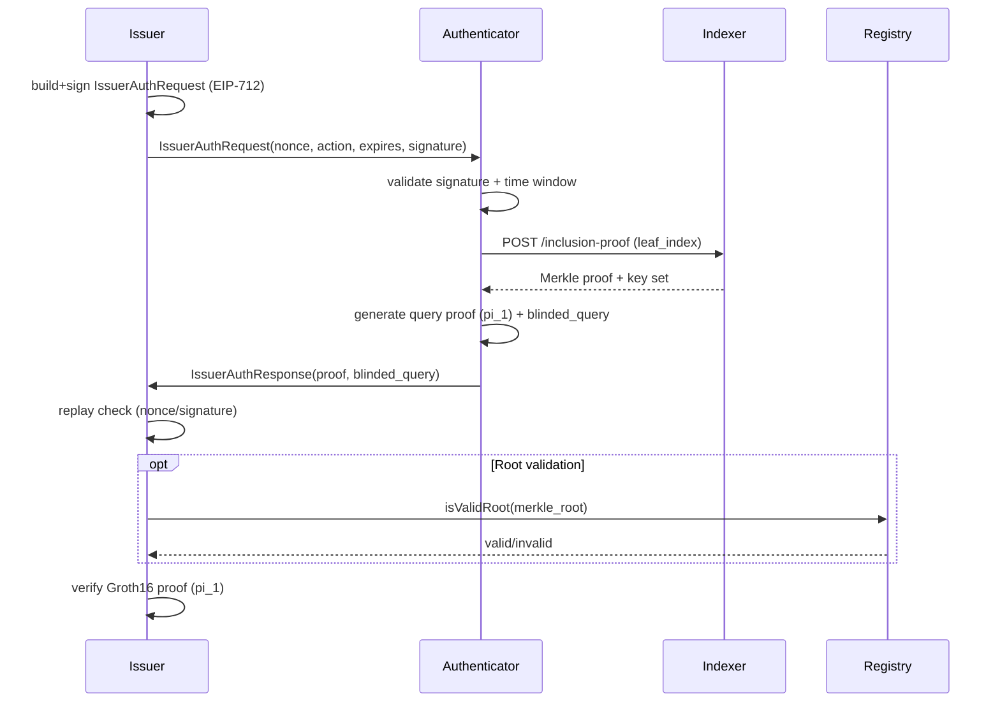

# Issuer Authentication Proof (Query Proof Based)

## Summary
This document defines the issuer authentication flow added on top of the query proof (pi_1). It lets a
credential holder authenticate to an issuer for management operations (refresh, status checks, etc.)
without generating a nullifier proof (pi_2). The flow reuses the existing query proof circuit and adds
issuer-signed requests plus issuer-side verification logic.

## Context and Goals
### Problem statement
- Issuers need a way to authenticate existing holders for management operations.
- Query proof and uniqueness proof have been split; the query proof can be used as an authentication ZK.
- The authentication should avoid nullifier-based identifiers and remain privacy-preserving.

### Goals
- Provide an issuer-auth flow that proves holder authorization for a credential.
- Reuse existing query proof circuit and verification key material.
- Require issuer-signed challenges to prevent phishing and replay.
- Allow issuer verification with optional on-chain merkle root validation.

### Non-goals
- Enforcing uniqueness per action (that is the role of pi_2).
- Revealing the raw subject (leaf index) to the issuer or RP.
- Backward compatibility with older circuits if query inputs change.

## Actors and Components
- **Authenticator**: user client that holds keys and generates pi_1.
- **Issuer**: entity that issued the credential and runs verification.
- **Indexer**: supplies merkle inclusion proofs and key sets.
- **WorldIDRegistry**: on-chain registry of merkle roots.
- **CredentialSchemaIssuerRegistry**: on-chain registry of issuer schema ids and signer addresses.

## Cryptographic Foundations
The flow is built on:
- Groth16 for query proof (pi_1).
- EdDSA (BabyJubJub) for credential signatures and query signatures.
- ECDSA (secp256k1) with EIP-712 for issuer-signed requests.
- Poseidon2 for hashing credential content and query hashes.

## Data Types (Implemented)
### IssuerAuthRequest
Fields:
- `id`: request identifier.
- `version`: request version.
- `created_at` / `expires_at`: time window for validity.
- `issuer_schema_id`: issuer schema id for the credential.
- `issuer_registry_address`: contract used for EIP-712 domain.
- `issuer_signer`: expected issuer signing address.
- `action`: field element representing the issuer action.
- `nonce`: unique field element.
- `signature`: EIP-712 signature over the request payload.

### IssuerAuthResponse
Fields:
- `id`, `version`: echo request identifiers.
- `proof`: `WorldIdProof` (Groth16 proof + merkle root).
- `blinded_query`: (x, y) curve point used as public input.

### Deterministic RP identifier
Issuer auth derives a deterministic `rp_id` from `issuer_schema_id` to bind the query hash to the issuer
domain without introducing a nullifier.

## Query Proof Binding (pi_1)
The query proof provides the authentication guarantees. Public inputs for issuer auth are:
- `blinded_query.x`, `blinded_query.y`
- `issuer_schema_id` (as `cred_type_id`)
- `issuer_pubkey` (as `cred_pk`)
- `created_at` timestamp
- `merkle_root`
- `TREE_DEPTH`
- `rp_id` (derived from `issuer_schema_id`)
- `action`
- `nonce`

Private inputs include:
- Authenticator key set and key index.
- Query signature over `query_hash`.
- Merkle inclusion proof (leaf index and siblings).
- Credential signature and hashes (claims hash, associated data hash).
- Credential lifetime (genesis issued at, expires at).
- Query blinding factor (`beta`).

**Important:** The credential subject (`sub`, the leaf index) is inside the credential hash and is not
exposed as a public input in the current circuit. This means the proof authenticates "a valid holder"
but does not reveal or publicly bind a specific subject unless a blinded subject hash is added to the
public inputs (see "Subject binding gap" below).

## Authentication Flow
### Sequence diagram

### Authenticator steps
1. Validate issuer EIP-712 signature and time window.
2. Fetch merkle inclusion proof + authenticator public key set from the Indexer.
3. Construct `SingleProofInput` with request action/nonce and derived `rp_id`.
4. Generate query proof (pi_1) and blinded query.
5. Return `IssuerAuthResponse` to the issuer.

### Issuer verification steps
1. Verify EIP-712 signature against expected issuer signer.
2. Enforce replay protection (nonce/signature cache).
3. Validate `merkle_root` (optional on-chain check via `WorldIDRegistry.isValidRoot`).
4. Verify Groth16 query proof using the public inputs above.

## Network Calls
### Required
- **Authenticator -> Indexer:** `POST /inclusion-proof` to fetch merkle proof and key set.

### Optional
- **Issuer -> Chain:** `WorldIDRegistry.isValidRoot` to validate the merkle root.

No OPRF network calls or nullifier oracle interactions are needed for issuer auth.

## Computational Cost (Relative)
### Authenticator
- Dominant cost is Groth16 query proof generation (pi_1).
- Other costs: Poseidon2 hashing, EdDSA signing, ECDSA verification of issuer request.

### Issuer
- Dominant cost is Groth16 proof verification (fast compared to proving).
- Other costs: ECDSA recovery/verify, replay cache lookup, optional RPC call.

## Security Properties
- **Authorization**: only registered authenticators for a valid credential can produce pi_1.
- **Issuer binding**: EIP-712 signature ties request to issuer signer and contract domain.
- **Replay protection**: nonce + signature history blocks repeated use.
- **Root validity**: optional on-chain validation ensures merkle root is current.
- **Privacy**: no nullifier is emitted; subject is not publicly revealed.

## Subject Binding Gap (Specific Subject Requirement)
The initial requirement states authentication for a *specific subject*. The current query proof does
not expose `sub` (leaf index) or a blinded subject commitment as public input. Therefore:
- The issuer can verify "valid holder for this issuer schema," but not "this exact subject."
- If the issuer needs explicit subject binding, a circuit update is required.

### Proposed subject binding extension
Add a public input such as:
- `subject_blind = H_k(issuer_schema_id || leaf_index)` or
- `blinded_subject = Poseidon2(domain, issuer_schema_id, leaf_index)`

Then:
- Issuer provides the blinded subject target in the request.
- Authenticator proves the credential subject matches it inside the circuit.
- Verifier checks the public input against expected value.

This requires updating:
- Query circuit, zkey, and verification key.
- `QueryProofCircuitInput` and public input ordering.
- OPRF verification (if still shared) or a dedicated issuer-auth circuit.

## Implementation Mapping
### Authenticator
- `Authenticator::generate_authentication_proof` in `crates/core/src/authenticator.rs`

### Request/response types
- `crates/core/src/requests/issuer_auth.rs`

### Issuer verification
- `crates/core/src/issuer_auth.rs`

### Query proof generation helpers
- `crates/core/src/proof.rs`

## Open Questions
- Do issuers need a public subject binding (blinded subject) or is "valid holder" sufficient?
- Should issuer auth use a dedicated circuit to avoid coupling with OPRF inputs?
- Should the EIP-712 domain or payload include an issuer-specified subject binding?
